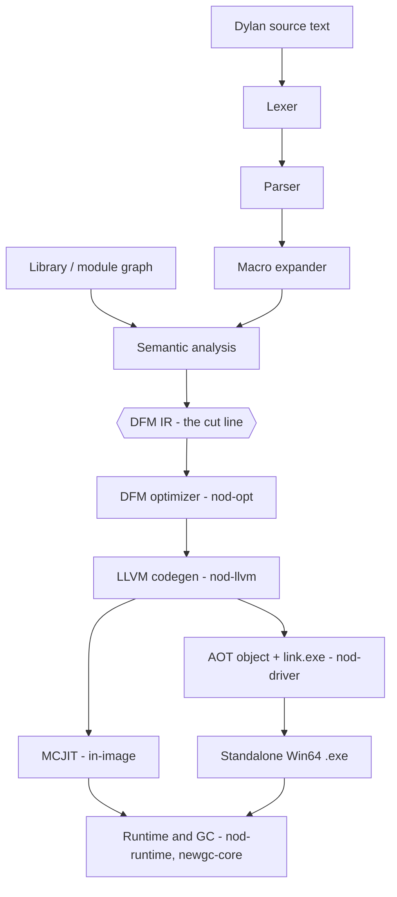

# NewOpenDylan documentation

A guided tour of the **Dylan language** as NewOpenDylan implements it,
and of the **compiler** that runs it — from source text to a JIT-executed
or AOT-linked Win64 binary.

NewOpenDylan is a self-hosting Dylan compiler: the **front-end is written
in Dylan** (lexer, parser, macro expander, semantic analysis, AST → DFM
lowering) and the **back-end is Rust + LLVM** (DFM optimizer, LLVM
codegen, JIT/AOT, GC runtime). The two halves meet at the **DFM IR**, the
permanent contract between them. (The repository is `OpenDylanFE`.)

**New here?** Start with **[Getting started](getting-started.md)** — build
the compiler, evaluate an expression, watch the pipeline, and compile your
first `.exe`. Then read the **[Architecture](architecture.md)** to see how
the front-end and back-end divide at DFM.

## The whole pipeline at a glance

Everything **above** the DFM hexagon is the **front-end** — written in
Dylan, self-hosting. Everything **below** is the **back-end** — permanent
Rust + LLVM. DFM, the Dylan Flow Machine IR, is the contract between them,
and that single cut line shapes the whole project.

## Start here

| Page | What it covers |
|------|----------------|
| [Getting started](getting-started.md) | Build, evaluate, watch the pipeline, compile a `.exe` |
| [Architecture](architecture.md) | The Dylan front-end / Rust+LLVM back-end split at DFM |
| [Glossary](glossary.md) | The project vocabulary |

## The language

| Page | What it covers |
|------|----------------|
| [Language overview](language/overview.md) | What Dylan is, the feel of the code, a worked example |
| [Syntax & lexical structure](language/syntax.md) | Tokens, definitions, expressions, the infix grammar |
| [Types & classes](language/types-and-classes.md) | The object model: classes, slots, instances, `<angle>` names |
| [Generic functions & dispatch](language/generic-functions.md) | Methods, multiple dispatch, C3 method resolution |
| [Macros](language/macros.md) | Pattern/template macros and how the surface grows from the stdlib |
| [Modules & libraries](language/modules-and-libraries.md) | Namespaces, exports, the library/module graph |
| [Conditions](language/conditions.md) | Signals, handlers, restarts, non-local exit |
| [Sealing](language/sealing.md) | Controlled dynamism: sealing and compile-time dispatch |

## The compiler

| Page | Source | What it covers |
|------|--------|----------------|
| [Compiler overview](compiler/overview.md) | — | The pipeline, the crate map, DFM as the contract |
| [Reader: lexer & parser](compiler/reader.md) | `compiler/dylan-lexer.dylan` · `dylan-parser.dylan` | Source text → tokens → AST |
| [Macro expander](compiler/macro-expander.md) | `compiler/dylan-macro.dylan` | Pattern-rule expansion of macro forms |
| [Semantic analysis](compiler/sema.md) | `compiler/dylan-sema.dylan` · `dylan-c3.dylan` | Name resolution, classes, dispatch, AST → DFM lowering |
| [Dispatch & sealing](compiler/dispatch-and-sealing.md) | `compiler/dylan-sema.dylan` | Sealing analysis + compile-time dispatch resolution |
| [DFM: the IR](compiler/dfm.md) | `nod-dfm` | The typed-SSA intermediate representation |
| [LLVM codegen](compiler/codegen.md) | `nod-llvm` | DFM → LLVM IR → machine code |
| [JIT & AOT](compiler/jit-and-aot.md) | `nod-llvm` · `nod-driver` | The MCJIT, object emission, the AOT linker |
| [Runtime & object model](compiler/runtime.md) | `nod-runtime` | Tagged Words, dispatch caches, conditions, collections |
| [Garbage collector](compiler/gc.md) | `newgc-core` · `nod-runtime` | The precise generational collector |
| [FFI: calling Windows](compiler/ffi.md) | `nod-winapi` · `nod-runtime` | The Win64 c-ffi, callbacks, COM |
| [Driver](compiler/driver.md) | `nod-driver` | The CLI, the REPL, build modes, dump commands |
| [Namespaces](compiler/namespaces.md) | `nod-namespace` | LID files, the library/module dependency graph |
| [Self-hosting](compiler/self-hosting.md) | `compiler/` · `nod-driver` | How the Dylan front-end is built, linked, and bridged; the wire formats |

## Reference

| Page | What it covers |
|------|----------------|
| [Platforms](reference/platforms.md) | Supported platforms, Windows-first scope, the path to macOS/Linux |
| [Performance & hardening](reference/performance.md) | Safepoint maps, polymorphic inline caches, the dispatch performance story |
| [Known limitations](reference/known-limitations.md) | Language-feature and compiler gaps, with workarounds and planned fixes |
| [Upstream Open Dylan](reference/upstream-opendylan.md) | Adoption notes, license obligations, the lifting workflow |
| [Tracing & diagnostics](reference/tracing.md) | GC tracing and AOT crash symbolication |

## Development

| Page | What it covers |
|------|----------------|
| [Sprints](sprints/README.md) | Active and recent sprint plans |
| [Sprint 60](sprints/sprint-60.md) | Current sprint — bootstrap proof, stdlib reorg + precedence, macros, corpus |

## Conventions used throughout

- **DFM** — *Dylan Flow Machine*, the typed-SSA IR that splits front-end
  from back-end.
- **Word** — the tagged 64-bit runtime value representation.
- **GF** — *generic function*; **FIP** — *forward-iteration protocol*.
- **Sealing** — a promise that a class/GF won't be extended, enabling
  static dispatch.
- A `crate/src/file.rs:NN` reference points into the source tree; it is
  clickable in your editor.

See the [glossary](glossary.md) for the full vocabulary.
