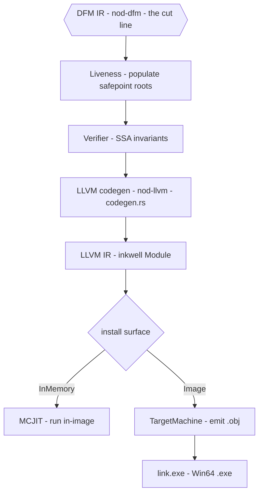
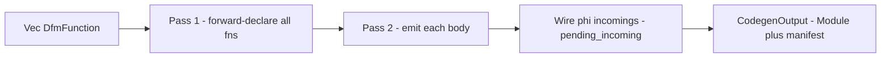
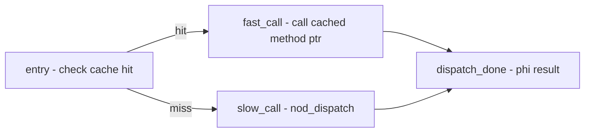
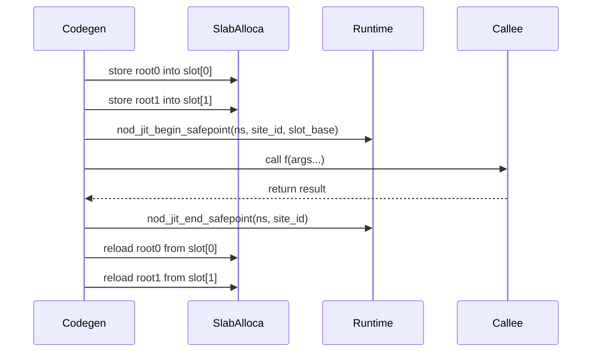

# LLVM Codegen

`nod-llvm` translates DFM IR — the typed-SSA intermediate representation — into
LLVM IR and hands it to either the MCJIT engine or the AOT object emitter. Every
Dylan value travels as a tagged 64-bit `Word`; every call site that can trigger a GC
is bracketed with precise root-spill machinery.

> Crate: `src/nod-llvm`  ·  Part of the permanent Rust + LLVM back-end

## Role in the pipeline



The DFM hexagon is the cut line: everything above is the Dylan front-end;
everything below is the Rust + LLVM back-end. `codegen.rs` sits immediately
below the cut.

## Key types

| Type | Where | Purpose |
|------|-------|---------|
| `CodegenOutput` | `codegen.rs:1008` | One compiled LLVM module: `Module`, `FunctionMap`, `SafepointPlan`s, `SafepointInstallRecord`s, manifest |
| `Emit` | `codegen.rs:2144` | Per-function emission state: `temps` map (`TempId` → `BasicValueEnum`), phi wiring, safepoint slot slab, param home allocas |
| `ModuleCodegenCtx` | `codegen.rs:633` | Per-module shared state: cache key, manifest builder, safepoint-site counter, literal/stub/cache-slot dedup tables |
| `SafepointPlan` | `codegen.rs:1035` | Location-based description of one safepoint site (site id, kind, function, block, root locations) |
| `SafepointKind` | `codegen.rs:1209` | `DirectCall`, `Dispatch`, or `SealedDirectCall` — the three call shapes that bracket with safepoints |
| `CodeInstallSurface` | `codegen.rs:1057` | `InMemory` (JIT) or `Image` (AOT) — controls which safepoint runtime hooks are emitted |
| `ModuleManifest` | `symbols.rs:*` | Ordered list of `(symbol-name, RelocKind)` rows — one per named external global emitted by this module |
| `RelocKind` | `symbols.rs:*` | `ImmTrue`, `ImmFalse`, `ImmNil`, `ClassMetadata`, `StringLiteral`, `CacheSlot`, `Generic`, `StubEntry`, … |

## How it works

### Module → LLVM: two passes

`codegen_module_with_key_for_surface` (`codegen.rs:1293`) is the canonical entry
point. It creates one `inkwell::Module` and runs two passes over the `Vec<DfmFunction>`:

1. **Forward declarations.** Every Dylan function is declared as an LLVM function
   (`module.add_function`) before any body is emitted. This resolves mutual recursion
   and cross-function `DirectCall` references without ordering constraints.
2. **Body emission.** `emit_function` is called for each function, producing
   all basic blocks, computations, and terminators.



### TempId SSA values → LLVM values

`Emit::temps` (`codegen.rs:2159`) is a `HashMap<TempId, BasicValueEnum>` that maps
every DFM SSA value to its LLVM counterpart. On entry to each DFM block the map is
seeded from `block_entry_temps`; after each `Computation` the `dst` temp is inserted.
When the builder moves to a new block, GC-typed function parameters are reloaded from
their home allocas rather than from the original `get_nth_param` SSA value — this
keeps roots valid across blocks after a GC reload (`codegen.rs:2356`).

### Block parameters → LLVM phi nodes

DFM uses phi-free, block-parameter SSA. Each non-entry block with parameters gets one
`build_phi` per parameter at its head (`codegen.rs:2319`). Jump terminators record
`(target, source-BB, resolved-arg-SSA-values)` in `pending_incoming`; after all
blocks are emitted, `add_incoming` is called for each phi. Args are resolved to SSA
values at jump-emit time (not end-of-function): otherwise a safepoint reload
after the jump would rebind `temps[t]` to a different SSA value and corrupt the phi
incoming (`codegen.rs:2388`).

### The tagged Word representation

All Dylan values travel as a uniform tagged 64-bit integer (`i64`) in LLVM IR
(`codegen.rs:2102`):

```
  bit 0 == 0  →  fixnum;  bits [63:1] = signed integer value shifted left by 1
  bit 0 == 1  →  pointer; bits [63:1] = 8-byte-aligned heap address
```

- **Integers:** `ConstValue::Integer(n)` emits `(n as i64 as u64).wrapping_shl(1)`
  as an `i64` constant (`codegen.rs:3088`).
- **Booleans:** `#t` and `#f` are pinned heap singletons, not fixnum-shaped.
  Codegen loads their tagged Words via named external globals (`nod_imm_true__{key}`,
  `nod_imm_false__{key}`) so cached bitcode round-trips across processes
  (`codegen.rs:2547`). Truthiness is pointer-identity against `#f` (`codegen.rs:2768`).
- **Strings and symbols:** interned literals are also loaded via named external
  globals (`nod_strlit__{key}__{idx}`, `nod_symlit__{key}__{idx}`) (`codegen.rs:2638`).
- **Floats:** not tagged — `<single-float>` is raw `f32`, `<double-float>` is raw `f64`
  (`codegen.rs:2111`).
- **Heap objects:** `TypeEstimate::Class(_)` and `Top`/`String` are the same `i64`
  pointer-tagged Word shape (`codegen.rs:2126`).

### Computation lowering

The dispatch table in `emit_computation` (`codegen.rs:2779`) matches every
`Computation` variant:

**`Const`** — emits an LLVM constant. Integers shift left by 1; booleans and nil
load from per-module external globals; strings load from literal pool globals
(`codegen.rs:3077`).

**`PrimOp`** — emits inline LLVM arithmetic. Add/sub/neg are tag-stable (no
untag/retag). Mul shifts one operand right by 1 before multiplying
(`(a<<1) * (b>>1) = (a*b)<<1`). Div/mod untag both, operate, retag.
Comparisons run directly on tagged values (ordering is preserved by the uniform
left-shift) and the `i1` result is converted back to a Dylan boolean via
`retag_bool` (`codegen.rs:3193`).

**`DirectCall`** — resolves the callee in three tiers: this module's function table
first, then the already-declared extern table, then the runtime's
`find_method_body_ptr` registry (stdlib-resident method bodies in other JIT modules).
The call is bracketed by `begin_emitted_safepoint` / `end_emitted_safepoint`
(`codegen.rs:3681`). Special-case lowering handles `%pair-*` list builtins,
condition builtins, collection/FIP primitives, and Win64 FFI trampolines
(`codegen.rs:3607`).

**`Dispatch`** — emits a three-block inline cache (`codegen.rs:3978`). The fast path
atomically loads the `CacheSlot`'s cached class, method, and generation, compares them
against the receiver's class and the generic's generation, and on a hit
calls the cached method pointer directly. On a miss the slow path calls `nod_dispatch`
which updates the cache. Both paths share the same safepoint bracketing; the two
results are joined by a phi at `dispatch_done`.



**`SealedDirectCall`** — pushes a chain frame via `nod_push_sealed_chain_frame`
(args + fallback method pointers spilled into entry-block allocas), calls the
resolved method directly inside a safepoint bracket, then pops the frame via
`nod_pop_sealed_chain_frame` (`codegen.rs:2900`). `next-method()` inside the body
walks this frame.

**`TypeCheck`** — emits inline class-id tests. For `<integer>`: `(v & 1) == 0`.
For wrapper-tagged classes (`<boolean>`, `<byte-string>`, `<symbol>`, etc.):
a branchless pointer-tag check, an untagged load of the wrapper's class id, and a
compare. For user classes: calls `nod_is_instance_of` which walks the CPL
(`codegen.rs:3383`).

**`LoadSlot`** — untags the instance pointer (`v & ~1`), GEPs to the slot byte
offset, loads 8 bytes (`codegen.rs:3886`).

**`StoreSlot`** — untags, GEPs, stores, then calls `nod_card_mark` with the slot
address to inform the GC's card table (`codegen.rs:3922`).

### GC safepoint emission

Every call site that may trigger a GC must bracket the call with root-spill and
root-reload so the collector can update pointer-shaped temps if it evacuates objects.
This is the project's signature codegen concern.

**Pre-call (`begin_safepoint`, `codegen.rs:4482`):**

1. A per-function `gc.root.slots` alloca slab (an `i64` array sized to the maximum
   simultaneous roots across all call sites) is placed in the entry block once
   (`codegen.rs:4692`). Individual call sites index into this slab via
   `rent_safepoint_slot`.
2. For each root temp listed in `safepoint_roots`: store its current SSA value into
   its slab slot.
3. Emit the surface-specific hook:
   - **JIT (`InMemory`):** call `nod_jit_begin_safepoint(namespace, site_id,
     slot_base_ptr)`.
   - **AOT (`Image`):** call `nod_aot_begin_safepoint(site_id, root_count,
     slot_base_ptr)`, then `nod_aot_verify_safepoint(site_id)`.

**The actual call** is emitted next.

**Post-call (`end_safepoint`, `codegen.rs:4579`):**

1. Emit the surface-specific close hook:
   - **JIT:** call `nod_jit_end_safepoint(namespace, site_id)`.
   - **AOT:** call `nod_aot_end_safepoint(site_id)`.
2. Reload each root temp from its slab slot and rebind `temps[t]` to the fresh SSA
   value. The GC may have moved the object; the slot holds the updated address.
3. If the root is a function parameter, also write the reloaded value back to the
   parameter's home alloca so that subsequent block-entry loads see the post-GC
   address (`codegen.rs:4619`).

If `safepoint_roots` is empty — either because the liveness pass found no live
pointer-shaped temps, or because `is_no_alloc` caused the liveness pass to produce
an empty list — the slab stores, runtime hooks, and reloads are all skipped. A
safepoint-poll hook (`nod_safepoint_poll`) is additionally emitted at the function
entry block and every loop back-edge target so the GC can stop a thread even in
non-allocating tight loops (`codegen.rs:2374`).



### Named external globals and the module manifest

Constants that depend on the runtime process address (class metadata pointers,
interned literal Words, inline-cache slot addresses, generic-function pointers) are
emitted as named external `i64` globals rather than baked `i64` constants. This makes
bitcode portable across process restarts (`codegen.rs:766`). The
`ModuleManifest` records one `(symbol, RelocKind)` row per global; the JIT-link step
binds each symbol to the current process's address before MCJIT finalises.

Symbol names are namespaced by the module's cache-key prefix
(`nod_cache_slot__{key8}__{site_id}`, `nod_generic__{key8}__{name}`, etc.) so
independently cached modules co-loaded into one engine never collide (`symbols.rs:1`).

### Optimisation philosophy

Codegen emits straightforward, non-optimised LLVM IR and relies on LLVM at
`-O2`/`-O3` to do the heavy lifting. Field-offset address computations (e.g. the five
`add i64` instructions for `CacheSlot` fields) are natural targets for LLVM's CSE and
GVN passes. The guiding principle is "emit good IR for LLVM."

## Invariants & gotchas

- **All allocas must be in the entry block.** An alloca inside a loop body leaks
  stack at `-O0`. `build_entry_alloca` (`codegen.rs:4652`) positions the
  builder before the entry block's first instruction, then restores it.
- **`safepoint_roots` must be populated before codegen is called.** Lowering leaves
  the field empty; the liveness pass fills it. Codegen trusts the list without
  re-analysing liveness (`codegen.rs:2779`).
- **`is_no_alloc` is handled by the liveness pass, not codegen.** When set, the
  liveness pass produces an empty `safepoint_roots`; the `!rented.is_empty()` guard
  in `begin_safepoint` then silently skips the hooks. Codegen does not inspect
  `is_no_alloc` directly (`codegen.rs:2796`).
- **GC-typed function parameters need home allocas.** Raw `get_nth_param` SSA values
  must not be used across block boundaries after a GC reload. `param_homes`
  (`codegen.rs:2193`) maps each GC-typed param to an entry-block alloca; `rebind_param`
  emits a `load` from the home at every block entry (`codegen.rs:2448`).
- **Jump args are resolved at jump-emit time.** Deferring TempId-to-SSA resolution
  to end-of-function would cause safepoint reloads to corrupt phi incomings
  (`codegen.rs:2160`).
- **The `Dispatch` safepoint brackets the entire cache diamond.** Roots are spilled
  before the branch and reloaded after the `dispatch_done` phi, so the same root
  protection applies to both the fast path and the slow path (`codegen.rs:4049`).
- **JIT and AOT emit different safepoint hooks.** `InMemory` surface emits
  `nod_jit_begin_safepoint` / `nod_jit_end_safepoint` and JIT safepoint metadata
  globals. `Image` surface emits `nod_aot_begin_safepoint` / `nod_aot_verify_safepoint`
  / `nod_aot_end_safepoint`. The legacy `nod_register_root` / `nod_unregister_root`
  hooks are no longer emitted by either surface (`codegen.rs:1892`).
- **`WriteBarrier` has no lowering path yet.** The `Computation::WriteBarrier` variant
  returns `CodegenError::WriteBarrierNotEmitted`; `StoreSlot` handles the barrier
  inline via `nod_card_mark` (`codegen.rs:2832`).

## Where in the code

| File | Lines | Responsibility |
|------|-------|----------------|
| `src/nod-llvm/src/codegen.rs` | ~4970 | All DFM-to-LLVM lowering: module/function/block/computation/terminator emission, tagged Word arithmetic, dispatch diamond, safepoint bracketing, phi wiring |
| `src/nod-llvm/src/symbols.rs` | ~595 | Named external global symbol naming convention; `ModuleManifest` and `RelocKind`; dedup helpers |
| `src/nod-llvm/src/lib.rs` | ~57 | Crate re-exports: `codegen_module*`, `plan_safepoints`, `SafepointPlan`, `Jit`, AOT registrations, `LlvmContext` |
| `src/nod-llvm/src/jit.rs` | — | MCJIT engine, symbol binding, bitcode replay — see [JIT & AOT](jit-and-aot.md) |
| `src/nod-llvm/src/aot.rs` | — | AOT object emission, entry stub injection — see [JIT & AOT](jit-and-aot.md) |
| `src/nod-llvm/src/cache.rs` | — | JIT bitcode cache (disk + in-process) — see [JIT & AOT](jit-and-aot.md) |

## See also

- [DFM: the IR](dfm.md) — the IR this crate consumes; types, block-parameter SSA, safepoint roots
- [JIT & AOT](jit-and-aot.md) — what happens after `codegen_module` returns: MCJIT, object emission, the linker
- [Runtime & object model](runtime.md) — the `nod_*` extern functions codegen calls into
- [Garbage collector](gc.md) — the collector that drives the safepoint/root-reload contract

---
[Compiler overview](overview.md) · [DFM](dfm.md) · [JIT & AOT](jit-and-aot.md) · [Runtime](runtime.md)
