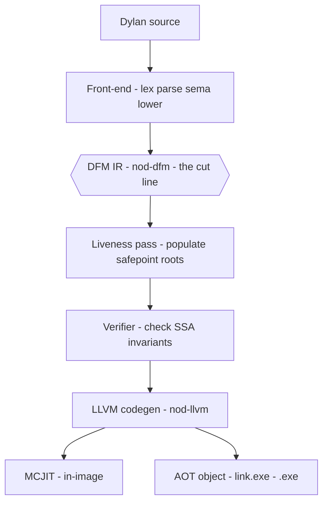
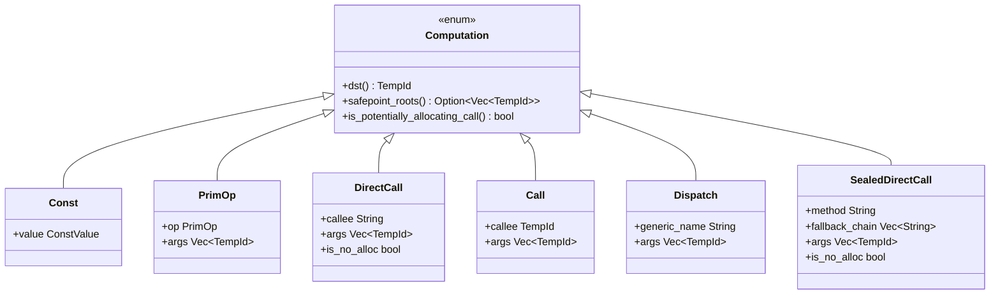
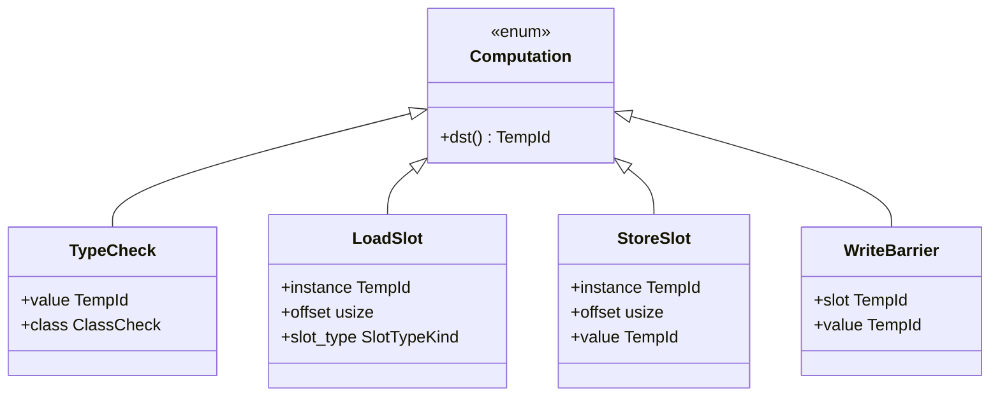
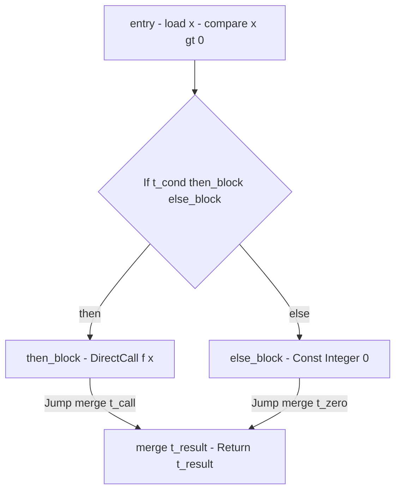
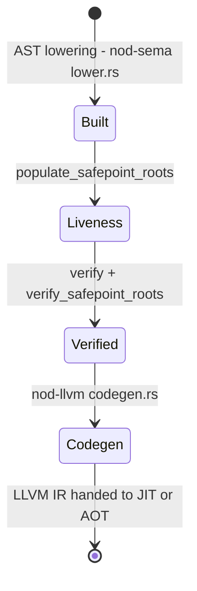

# DFM — The Dylan Flow Machine IR

DFM (Dylan Flow Machine) is the typed-SSA intermediate representation that
splits the compiler in two: every front-end phase lowers to it; every back-end
phase consumes it. It is the permanent contract between them.

> Crate: `src/nod-dfm`

DFM is a typed-SSA control-flow-graph IR. It sits between the
namespace-resolved AST and LLVM IR, and its design is informed by upstream Open
Dylan's DFMC pass tree, adapted for a Rust + LLVM JIT.

## Role in the pipeline

DFM sits at the exact centre of the compiler. The front-end (lexer, parser,
macro expander, sema, AST lowering) produces DFM. The back-end (LLVM codegen,
JIT, AOT linker, runtime) consumes DFM. Nothing else crosses that seam.



The hexagon marks the architectural boundary. DFM is a fixed contract: a DFM
module is **the same data structure with the same semantics** no matter what
produced it, so the back-end consumes it without knowing or caring about the
front-end's internals. That property is what lets the Dylan front-end and the
Rust/LLVM back-end evolve independently, each held to the DFM contract at the
seam. See [self-hosting](self-hosting.md) and [architecture](../architecture.md).

## Key types

The crate's public API is a flat set of data types — no traits, no trait
objects. Everything is a plain Rust struct or enum, public and printable.
Source of truth: `src/nod-dfm/src/ir.rs`.

| Type | Where | Purpose |
|------|-------|---------|
| `Function` | `ir.rs:15` | One Dylan function: owns all blocks, temps, params, return type, and span |
| `Block` | `ir.rs:27` | One basic block: a label, optional block params (phi-style), a list of `Computation`s, and exactly one `Terminator` |
| `Computation` | `ir.rs:68` | One SSA instruction: always produces a single `dst: TempId` result |
| `Temporary` | `ir.rs:39` | An SSA value: `TempId` plus a `TypeEstimate` |
| `Terminator` | `ir.rs:288` | Control-flow exit of a block: `Return`, `If`, or `Jump` |
| `TypeEstimate` | `ir.rs:456` | Lightweight type lattice: `Top`, `Bottom`, `Integer`, `Boolean`, `String`, `Class(u32)`, … |
| `ConstValue` | `ir.rs:304` | Payload for `Computation::Const`: integers, booleans, strings, raw word-bits, stub-entry refs |
| `PrimOp` | `ir.rs:360` | Arithmetic / comparison opcodes: `AddInt`, `LtInt`, `BoolAnd`, `MulFloat`, … |
| `ClassCheck` | `ir.rs:242` | Tag-bit or wrapper-class test used by `Computation::TypeCheck` |
| `FunctionId` | `ir.rs:6` | Newtype `u32` — module-scoped function identity |
| `BlockId` | `ir.rs:8` | Newtype `u32` — function-scoped block identity |
| `TempId` | `ir.rs:10` | Newtype `u32` — function-scoped SSA value identity |
| `SafepointLocation` | `ir.rs:53` | Planned GC root location at a safepoint: `FrameSlot(u32)` or `SavedRegister(u8)` |

## How it works

### IR shape: module → function → block → computation

A DFM **module** is a `Vec<Function>` (`lib.rs:23`). Each `Function`
(`ir.rs:15`) owns:

- `params: Vec<TempId>` — function parameters (the entry block's live-in values)
- `entry: BlockId` — the entry block
- `blocks: Vec<Block>` — all basic blocks, in declaration order
- `temps: Vec<Temporary>` — the SSA value table; every `TempId` resolves here
- `return_type: TypeEstimate` — the declared return type

Each `Block` (`ir.rs:27`) owns:

- `params: Vec<TempId>` — block parameters (phi-style join values supplied by
  predecessor `Terminator::Jump { args }`)
- `computations: Vec<Computation>` — ordered list of SSA instructions
- `terminator: Terminator` — the block's control-flow exit; there is no
  fall-through (`lib.rs:8`)

This is a **phi-free, block-parameter SSA** form. Instead of phi nodes, join
values flow as explicit arguments on `Terminator::Jump`. The entry block's
parameters are the function's parameters; non-entry blocks use `Block::params`
for joined values (e.g., both branches of an `if` expression jump to a merge
block, passing the branch result as an argument).

### Computations — the ten variants

Every `Computation` (`ir.rs:68`) defines exactly one SSA value: `dst()` is
always present (`ir.rs:654`). The ten variants are:

Every variant carries `dst: TempId` (its SSA result) — documented once on the base
below and omitted from each variant for brevity. First, the value-producing and call
computations:



Then the type-test and memory computations:



- **`Const`** — materialises a constant: integer, float, boolean, string,
  character, unit, raw `WordBits`, `ClassMetadataPtr`, `StringLiteralRef`,
  `SymbolLiteralRef`, or `StubEntryRef`. (`ir.rs:69`)
- **`PrimOp`** — an intrinsic arithmetic or comparison operation (`AddInt`,
  `SubInt`, `MulInt`, `DivInt`, `ModInt`, `RemInt`, `NegInt`, `AddFloat`,
  `SubFloat`, `MulFloat`, `DivFloat`, `NegFloat`, `EqInt`, `NeInt`, `LtInt`,
  `GtInt`, `LeInt`, `GeInt`, `EqFloat`, `LtFloat`, `GtFloat`, `LeFloat`,
  `GeFloat`, `BoolAnd`, `BoolOr`, `BoolNot`). (`ir.rs:361`)
- **`DirectCall`** — a statically-resolved call to a named top-level function.
  `is_no_alloc: bool` suppresses GC root bracketing for known-non-allocating
  callees. (`ir.rs:88`)
- **`Call`** — a higher-order call where the callee is itself a `TempId`
  (evaluated at runtime). (`ir.rs:109`)
- **`Dispatch`** — a runtime generic-function dispatch call; codegen lowers to
  `nod_dispatch_unary`. Always treated as potentially allocating. (`ir.rs:173`)
- **`SealedDirectCall`** — a sealed compile-time-resolved multimethod call.
  Carries `fallback_chain: Vec<String>` (less-specific methods in order) so
  `next-method()` can walk the chain at runtime. Emitted only when two or more
  applicable methods exist; if exactly one applies, `DirectCall` is used
  instead. (`ir.rs:198`)
- **`TypeCheck`** — an `instance?` test against a `ClassCheck`
  (`Integer`, `Boolean`, `String`, `Symbol`, `Vector`, `Character`,
  `EmptyList`, `UserClass { id, name }`, or `Unsupported`). (`ir.rs:121`)
- **`LoadSlot`** — reads an object slot at a fixed byte `offset` from the
  start of the heap object (past the `Wrapper`). (`ir.rs:147`)
- **`StoreSlot`** — writes an object slot and emits a card-marking write
  barrier. (`ir.rs:159`)
- **`WriteBarrier`** — writes a tagged-Word slot pointer and marks the GC
  card. `dst` is unused (kept for SSA uniformity). (`ir.rs:136`)

Generic-function dispatch is first-class in the IR: `Dispatch`,
`SealedDirectCall`, and the statically-resolved `DirectCall` are distinct node
kinds. This makes the dispatch strategy chosen for each call site visible
directly in the IR.

### Types: the TypeEstimate lattice

Every `Temporary` carries a `TypeEstimate` (`ir.rs:456`). This is a
**conservative estimate**, not a proven type — the word "estimate" is
intentional. Sealing analysis refines these estimates toward concrete classes
to enable direct-call lowering. The lattice has:

- `Top` — unknown / any value (the conservative default)
- `Bottom` — unreachable / no value
- Concrete immediate types: `Integer`, `SingleFloat`, `DoubleFloat`,
  `Character`, `Boolean`, `String`, `Unit`
- `Class(u32)` — value is an instance of a specific runtime `ClassId` or a
  subclass of it
- `Singleton(u64)` — value is exactly this 64-bit Word (reserved; currently
  widened to `Top` by the dispatch resolver)

The lattice provides `join` (widening, for block-arg merges) and `meet`
(narrowing, threaded with an `is_subclass` predicate). `needs_gc_protection`
(`ir.rs:545`) classifies a type as pointer-shaped (`String`, `Top`, `Bottom`,
`Class`, `Singleton`) vs immediate — controlling whether liveness puts it in a
call's `safepoint_roots`.

### Terminators

Three terminators close every block (`ir.rs:288`):

- `Return { value: Option<TempId> }` — exit the function; `None` for
  `Unit`-returning functions.
- `If { cond: TempId, then_block: BlockId, else_block: BlockId }` — branch on
  a boolean temporary.
- `Jump { target: BlockId, args: Vec<TempId> }` — unconditional jump passing
  values to the target block's `params`.

### Lowering example: `if x > 0 then f(x) else 0 end`

To make the block-parameter style concrete, here is how a simple `if`
expression lowers to DFM blocks.



In textual DFM (`dump-dfm`) this would look like:

```
fn example (t0: <integer>) -> <top>:
  entry:
    t1: <boolean> = PrimOp GtInt t0 t_zero_const
    If t1 then_block else_block
  then_block:
    t2: <top> = DirectCall f(t0)
    Jump merge(t2)
  else_block:
    t3: <integer> = Const Integer(0)
    Jump merge(t3)
  merge(t4: <top>):
    Return t4
```

The `merge` block takes one block parameter `t4`. Each predecessor supplies
its result via `Jump merge(t2)` and `Jump merge(t3)`. There are no phi nodes.

### Safepoint roots: GC across call sites

At every potentially-allocating call (`DirectCall`, `Call`, `Dispatch`,
`SealedDirectCall` unless `is_no_alloc`), the `safepoint_roots: Vec<TempId>`
field lists the pointer-shaped temps live across that call. Codegen brackets
the call with safepoint hooks for each root, reloading after the call returns
so GC-driven evacuations are observed. See [Codegen](codegen.md) for the
emitted bracketing and [GC](gc.md) for the collector that drives it.

This field is **populated by the liveness pass** after lowering; it is empty
at construction time.

## Passes over DFM



Two passes run over DFM before codegen:

**Liveness** (`liveness.rs`) — `populate_safepoint_roots` (`liveness.rs:57`)
runs a global backward dataflow fixpoint:

1. Compute `gen[B]` (upward-exposed uses) and `kill[B]` (defs) for each block.
2. Iterate `live_out[B] = union of live_in[S]` for successors `S`;
   `live_in[B] = gen[B] union (live_out[B] \ kill[B])` until stable.
3. For each block, sweep backward from `live_out` to get `live_after(c)` for
   each computation `c`.
4. For each potentially-allocating call, write `safepoint_roots = { t in
   live_after(c) : t != dst(c) and t.type.needs_gc_protection() }`.

A per-block approximation is unsound for temps live *through* a block without
being mentioned there; the global fixpoint closes that gap (`liveness.rs:1`).

`verify_safepoint_roots` (`liveness.rs:265`) is a separate validation pass
that checks every registered root is actually live across its call and is
GC-typed — catching programming errors in the liveness pass itself.

**Verifier** (`verify.rs`) — `verify(f)` (`verify.rs:45`) checks the SSA
invariants. `VerifyError` variants (`verify.rs:8`):

- `UseBeforeDef` — a `TempId` operand has no prior defining computation
- `DoubleDefine` — a `TempId` is defined by two computations
- `DanglingBlockRef` — a terminator names a `BlockId` not in `Function::blocks`
- `MissingEntry` — `Function::entry` is not in `blocks`
- `DuplicateBlockId` — two blocks share a `BlockId`
- `ReturnValueInUnitFn` — `Return { value: Some }` in a `Unit`-returning function
- `MissingReturnValue` — `Return { value: None }` in a non-`Unit`-returning function
- `JumpArityMismatch` — `Jump` arg count differs from target block's param count

Note: the verifier checks textual-order single-definition, not full SSA
dominance. Full dominance enforcement is not yet implemented (`verify.rs:70`).

### The textual dump

`format_dfm` / `format_dfm_module` (`format.rs:16`) produce the stable text
exposed by `nod-driver dump-dfm`. The format is also used as the JIT cache
key fingerprint (`format_for_cache_key`, `format.rs:48`) — changing the
format bumps the cache version. The dump is phase-stable and is also rendered
live in the IDE DFM panel.

The layout:

```
fn <name> (t<n>: <type>, …) -> <return-type>:
  <label>(<params>):
    t<n>: <type> = <Computation> …
    …
    <Terminator>
```

- Each computation prints as `t<id>: <type> = <Variant> <operands>`.
- Safepoints render as `safepoint=[t<a>, t<b>, …]` appended to call lines.
- `SealedDirectCall` appends `; sealed-direct on \`<gf>\` (chain=<n>)`.
- `is_no_alloc` calls append `[no_alloc]`.

## Invariants & gotchas

- **One definition per temp.** Every `TempId` is defined by exactly one
  computation or is a function/block parameter. The verifier enforces this.
- **No fall-through.** Every block ends in exactly one `Terminator`; there is
  no implicit edge to the next block (`lib.rs:8`).
- **Block params, not phis.** Join values flow as `Jump` arguments to block
  parameters. There are no phi nodes.
- **`safepoint_roots` is populated by the liveness pass.** Lowering leaves
  it empty; codegen must not be called before liveness runs.
- **`is_no_alloc` is conservative.** User-defined functions default to
  `false`; only `%`-prefixed primitives in `LOWER_PRIMITIVE_TABLE` set it
  (`ir.rs:94`). The liveness pass still runs for `is_no_alloc` calls — the
  flag only removes the register/unregister bracket, not the analysis.
- **`WriteBarrier::dst` is unused.** It is kept solely for SSA uniformity so
  `Computation::dst()` has a valid result for every variant (`ir.rs:136`).
- **`TypeEstimate` is an estimate, not a proof.** `Top` is always safe; the
  lattice is over-conservative for `Top`/`Bottom` typed temps (they get GC
  protection even if they hold a fixnum). The `gc.statepoint`-based root
  scheme tightens this.
- **`Singleton(u64)` is carried but not populated.** The narrowing pass
  reserves this variant; the dispatch resolver currently widens any
  `Singleton` back to `Top` (`ir.rs:481`).
- **`nod-dfm` does not depend on `nod-runtime`.** `ClassId` is kept as a raw
  `u32` in `TypeEstimate::Class` and `ClassCheck::UserClass` to avoid a
  dependency inversion. Conversion happens at the `nod-sema`/`nod-runtime`
  boundary (`ir.rs:468`).
- **Multi-file builds lower once, not per file.** The driver concatenates all
  file ASTs into one module before calling the lowering pass. DFM indices
  (block IDs, temp IDs, function IDs) are module-scoped and stable across that
  single lowering. See [Driver](driver.md).

## Where in the code

| File | Lines | Responsibility |
|------|-------|----------------|
| `src/nod-dfm/src/ir.rs` | 733 | All DFM data types: `Function`, `Block`, `Computation`, `Terminator`, `TypeEstimate`, `ConstValue`, `PrimOp`, `ClassCheck` |
| `src/nod-dfm/src/format.rs` | 356 | Textual dump (`dump-dfm`), cache-key serialiser |
| `src/nod-dfm/src/liveness.rs` | 515 | Global backward liveness dataflow; `populate_safepoint_roots`; `verify_safepoint_roots`; `diagnose_arg_root_coverage` |
| `src/nod-dfm/src/verify.rs` | 187 | SSA invariant verifier (`verify`, `VerifyError`) |
| `src/nod-dfm/src/lib.rs` | 29 | Crate re-exports |
| `src/nod-sema/src/lower.rs` | ~7800 | The AST → DFM lowering (front-end; produces the IR this crate defines) |
| `src/nod-llvm/src/codegen.rs` | ~5000 | The DFM → LLVM IR consumer (back-end) |

## See also

- [Compiler overview](overview.md) — the full pipeline and where DFM sits in it
- [Semantic analysis](sema.md) — the front-end that lowers to DFM
- [LLVM codegen](codegen.md) — the back-end that consumes DFM
- [Self-hosting](self-hosting.md) — how the Dylan front-end is compiled and linked in, with DFM as the constant seam
- [Architecture](../architecture.md) — the canonical front-end/back-end split

---
[Compiler overview](overview.md) · [Sema](sema.md) · [Codegen](codegen.md) · [Glossary](../glossary.md)
