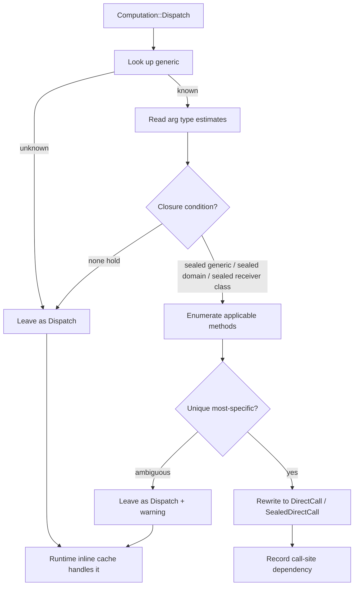

# Dispatch and Sealing

Sealing is the language feature that lets Dylan's "feels dynamic" surface
compile down to "performs static". A sealed class cannot be subclassed across
library boundaries; a sealed generic cannot gain methods across library
boundaries; a sealed domain declaration locks down a specific dispatch shape.
**The compiler exploits these guarantees at the call site:** when a
`Computation::Dispatch` has type estimates that — under the active sealing facts
— admit exactly one applicable method, the optimiser rewrites it to a direct
call with no inline cache, no dispatcher, no indirection.

This is the front-end's performance keystone. This page covers the
implementation: how sealing facts are recorded, how the analyser proves a call
site, and how a proven call devirtualises. For the programmer-facing view of
what sealing means and how to use it, see [Sealing](../language/sealing.md). The
sealing/dispatch pass runs inside `nod-sema`; see [Sema](sema.md) for where it
sits among the lowering phases.

> The sealing analyser lives in `nod-sema::optimise`; its outputs flow into the
> DFM that the back-end consumes, choosing direct-call, inline-cached, or
> full-dispatch lowering per call site.

## The four kinds of sealing

Dylan has four sealing primitives. Each generates a different fact for the
dispatch resolver to consult.

### Sealed class

```dylan
define sealed class <circle> (<shape>)
  slot radius :: <integer>, init-keyword: radius:;
end class;
```

**Guarantee:** no class outside this library may have `<circle>` in its CPL. The
compiler can therefore treat "is instance of `<circle>` or subclass" as
equivalent to "is instance of `<circle>` directly" for method applicability,
inside this library.

**Fact recorded:** `ClassMetadata::sealed: bool`, set when the `sealed` modifier
is present on `define class`. The default (no modifier, or `open`) is `false`.
The class also tracks `direct_subclasses`, populated as later `define class`es
land, so the resolver can enumerate "every possible subclass of `<C>`" when `<C>`
is sealed.

### Sealed generic

```dylan
define sealed generic area (s :: <shape>) => (<integer>);
```

**Guarantee:** the set of methods on `area` is closed to additions from outside
this library. The compiler can resolve `area(x)` at compile time once it knows
enough about `x`'s class to pick a method, without worrying that another library
will install a more-specific method.

**Fact recorded:** `GenericFunction::sealed: AtomicBool`, set by
`define sealed generic` and not unsettable.

### Sealed domain

```dylan
define sealed domain area (<shape>);
```

**Guarantee:** no method on `area` whose specialiser tuple satisfies
`S0 <: <shape>` may exist outside this library. This is the finest-grained
sealing — you can leave the generic itself unsealed (so other libraries can
extend it with methods on unrelated types) while pinning down the dispatch shape
inside a specific region of the type lattice.

**Fact recorded:** a per-library list of `SealedDomain` entries, each a
`{ generic, specialiser_tuple: Vec<ClassId> }`.

### Default openness

Without any modifier, classes and generics are **open**. A new library may
subclass `<shape>` with `<triangle>` and add `area(<triangle>) => …`. The
dispatch resolver cannot prove single-method applicability and leaves the call as
`Dispatch` backed by the runtime inline cache.

## Where sealing facts live

### On `ClassMetadata` (`nod-runtime/src/classes.rs`)

```rust
pub struct ClassMetadata {
    pub name: String,
    pub id: ClassId,
    pub parents: Vec<ClassId>,
    pub cpl: Vec<ClassId>,
    pub slots: Vec<SlotInfo>,
    pub slot_origin: Vec<ClassId>,
    pub own_slot_count: usize,
    pub inherited_slot_count: usize,
    pub instance_size: usize,
    pub scan: ScanFn,
    pub size_of: SizeFn,
    pub sealed: bool,
    /// In-library subclasses known at this class's registration time.
    /// Populated as later `define class`es land. The dispatch resolver
    /// reads this to enumerate "every possible subclass of <C>" when
    /// `<C>` is sealed.
    pub direct_subclasses: RwLock<Vec<ClassId>>,
}
```

`direct_subclasses` is appended to whenever a child registers — each
`define class <Child> (<Parent>) …` adds `ChildId` to
`<Parent>::direct_subclasses`. The resolver uses this for bounded enumeration.

### On `GenericFunction` (`nod-runtime/src/dispatch.rs`)

```rust
pub struct GenericFunction {
    pub name: String,
    pub methods: RwLock<Vec<Method>>,
    pub generation: AtomicU64,
    pub sealed: AtomicBool,
    /// Sealed-domain declarations covering this generic. Each entry is
    /// a specialiser tuple; a Dispatch falling under any entry can be
    /// resolved using only the methods this library has installed.
    pub sealed_domains: RwLock<Vec<Vec<ClassId>>>,
}
```

### Per-compilation-unit `SealingFacts`

```rust
pub struct SealingFacts {
    /// `define sealed domain g (<A>, <B>);` — keyed by generic name.
    pub domains: HashMap<String, Vec<Vec<ClassId>>>,
    /// Generic names declared `sealed`.
    pub sealed_generics: HashSet<String>,
    /// Class names declared `sealed`.
    pub sealed_classes: HashSet<String>,
}
```

`nod-sema` populates this during lowering from the parsed modifiers
(`Item::DefineGeneric` / `Item::DefineClass` with the `Sealed` modifier, and
`Item::DefineOther { keyword: "domain", … }`). The optimiser reads from it.
Sealing decisions are library-local by default; cross-library sealing is opt-in
via explicit `define sealed domain` declarations.

## The type-estimate lattice

The resolver reasons over a per-temp `TypeEstimate`:

```rust
pub enum TypeEstimate {
    Top,
    Bottom,
    Integer,
    SingleFloat,
    DoubleFloat,
    Character,
    Boolean,
    String,
    Unit,
    /// Receiver is known to be an instance of this class or a subclass.
    Class(ClassId),
    /// Receiver is known to be EXACTLY this value (e.g. `#f` after an
    /// if-test branch). Carried but not yet populated.
    Singleton(Word),
}
```

Lattice operations:

- `join` (used at if-joins and phi nodes) widens: `Class(<circle>) ⊔
  Class(<square>)` is `Class(<shape>)` if they share `<shape>` in their CPLs,
  else `Class(<object>)`.
- `meet` (used at narrowing) intersects: `Class(<shape>) ⊓ Class(<circle>)` is
  `Class(<circle>)` — the more specific wins.
- `is_subtype_of(target: ClassId) -> bool` returns `true` iff every concrete
  instance compatible with the estimate is `<: target`. This is the resolver's
  load-bearing predicate.

### Where estimates come from (narrowing rules)

1. **Method specialiser narrowing.** Inside `define method foo (p :: <circle>,
   …)`, the parameter `p` has `Class(<circle>)` for its whole scope.
2. **`instance?` guard narrowing.** After
   `if (instance?(p, <circle>)) … else … end`, the then-branch sees
   `p :: Class(<circle>)`. The else-branch case (`not <circle>`) is a negation in
   the lattice and is not narrowed — over-conservative but sound.
3. **Slot-type narrowing.** A slot `slot x :: <integer>` reads as `Integer`; a
   slot `slot p :: <point>` reads as `Class(<point>)`.
4. **Class-allocation narrowing.** `make(<circle>, …)` returns `Class(<circle>)`
   exactly — the class is the literal passed to `make`.
5. **Direct-call return-type narrowing.** A function declared `=> (<circle>)`
   returns `Class(<circle>)`.

Narrowing is a forward dataflow analysis on the DFM, conservative at joins. It is
function-local; there is no inter-procedural type inference yet.

## The dispatch resolution algorithm

Implemented in the `nod-sema::optimise::dispatch` module. Input: a function's DFM
after type-estimate narrowing. Output: the same DFM with `Computation::Dispatch`
nodes rewritten to direct calls where justified.

For each `Computation::Dispatch { generic_name, args, .. }`:

1. **Look up the generic.** If unknown, leave as `Dispatch`.

2. **Read arg type estimates.**
   `let est: Vec<TypeEstimate> = args.iter().map(temp_type).collect();`

3. **Check the closure condition.** The method set is closed at this call site
   iff:
   - `g.sealed == true`, OR
   - every `est[i]` is `<: Si` for some sealed domain `(S0, …, Sn)` on `g`, OR
   - every `est[i]` is `Class(C)` where `C.sealed == true` (the receiver class
     itself is sealed, so no late subclass can appear).

   If none hold, closure cannot be guaranteed. Leave as `Dispatch`.

4. **Enumerate applicable methods under the closure.** For each method `M`, check
   that for every position `i`, `est[i] <: M.specialisers[i]`. The "guaranteed"
   qualifier matters: `est[i] = Class(<shape>)` does NOT guarantee `<: <circle>`
   (a `<shape>` instance might be a `<triangle>`). Use `is_subtype_of`.

5. **Pick the most-specific.** Sort applicable methods by CPL-driven specificity.
   If one is strictly more specific than every other at every position, it is the
   unique winner. If multiple are equally specific the call is genuinely
   ambiguous: leave as `Dispatch` and emit a warning (the runtime dispatcher
   would panic at call time anyway).

6. **Rewrite.** Replace `Computation::Dispatch { generic_name, args,
   safepoint_roots }` with a direct call to the winning method body
   (`Computation::DirectCall`, or `Computation::SealedDirectCall` when the body
   needs a `next-method` chain), preserving `safepoint_roots` — the GC-precision
   contract applies to all calls, sealed or not.

7. **Record the dependency.** Add `(call_site, generic, current_generation)` to a
   per-call-site index, so that if the generic's generation later changes the
   index identifies the call sites needing invalidation. The invalidation cascade
   itself is cross-library work and is not yet wired; the index is a
   forward-compatibility hook populated now.



### Worked example

```dylan
define sealed class <shape> (<object>) end class;
define sealed class <circle> (<shape>) slot radius :: <integer>, init-keyword: radius:; end class;
define sealed class <square> (<shape>) slot side :: <integer>, init-keyword: side:; end class;

define sealed generic area (s :: <shape>) => (<integer>);
define method area (c :: <circle>) => (<integer>) c.radius * c.radius * 3 end;
define method area (s :: <square>) => (<integer>) s.side * s.side end;

define function total (c :: <circle>, s :: <square>) => (<integer>)
  area(c) + area(s)
end function;
```

In `total`:

- `c :: Class(<circle>)` (method specialiser narrowing).
- `s :: Class(<square>)`.
- `area(c)`: `area` is sealed; `est = [Class(<circle>)]`; closure holds;
  enumerate both methods; only `area(<circle>)` is applicable
  (`Class(<circle>) <: <circle>`); unique — **rewrite to DirectCall**
  `area_circle_method`.
- `area(s)`: same logic — **rewrite to DirectCall** `area_square_method`.

`total` lowers to two direct calls. No inline cache. No runtime dispatcher. The
DFM dump annotates each rewritten call:

```
t0: <integer> = DirectCall area_circle_method(c)        ; sealed-direct
t1: <integer> = DirectCall area_square_method(s)        ; sealed-direct
t2: <integer> = PrimOp AddInt t0 t1
```

### Counter-example

If `<shape>` were `open`:

```dylan
define open class <shape> (<object>) end class;
```

then no sealing fact covers `area`, closure fails, the optimiser leaves `area(c)`
as `Dispatch`, and the runtime inline cache takes over at runtime. **Soundness
rule: when in doubt, don't resolve.**

## Redefinition refusal

Sealing-related mutations that would break a recorded fact are refused:

| Operation | Within defining library | Across library boundary |
|---|---|---|
| `add-method` to a sealed generic | Allowed at compile time; the REPL gives a diagnostic | Refused |
| `add-method` whose specialisers fall inside a sealed domain | Allowed | Refused |
| `define class` extending a sealed class | Allowed (the new subclass is within-library) | Refused |
| Removing a class declared `sealed` | Refused | n/a |

Class redefinition is refused outright. A REPL-side `add-method` against a sealed
generic returns `MethodTableError::SealedGenericClosed`, surfaced as a structured
diagnostic. Cross-library refusal of subclassing surfaces as
`LoweringError::SealedClassExtendedAcrossBoundary`.

## CLI surface

### `nod-driver dump-sealed`

```
$ nod-driver dump-sealed <input.dylan>
Sealing facts in `mylib`:

  Sealed classes (3):
    <shape>     direct_subclasses=[<circle>, <square>]
    <circle>    direct_subclasses=[]
    <square>    direct_subclasses=[]

  Sealed generics (1):
    area  (1 specialiser, 2 methods)

  Sealed domains (0):
```

### `dump-dispatch`

```
Generic area (generation=2, 2 methods, sealed):
  method (<circle>) → 0x...
  method (<square>) → 0x...

Call sites:
  site#0 in total: sealed-direct → area_circle_method  ✓ (sealing resolved at compile time)
  site#1 in total: sealed-direct → area_square_method  ✓
  site#2 in maybe_area: cached  class=<circle> method=… hits=42 misses=1
                       (caller's receiver type is <shape>, not sealed-narrowable)
```

### `dump-dfm`

Rewritten direct calls carry a trailing `; sealed-direct` comment so the IR dump
is self-explanatory.

## Edge cases and traps

- **Sealing a class doesn't seal its parent.** Given an open `<shape>` and a
  sealed `<circle> (<shape>)`, a future library may add `<triangle> (<shape>)`.
  The closure rule on `area(c :: <circle>)` still holds, because `c`'s estimate is
  `Class(<circle>)` and `<circle>` is sealed; the openness of `<shape>` is
  irrelevant.
- **`instance?` else-branch narrowing is not done.** Representing "any type
  except `<circle>` and its subclasses" needs a richer lattice (intersection
  types or co-typed sets). The then-branch narrowing is the one that pays off and
  is the one implemented.
- **A sealed class can be specialised on from another library.** If library A
  declares `define sealed class <foo>` and library B declares `define generic g`,
  B may add `define method g (x :: <foo>) …`. Sealing is about the subclass tree,
  not about who may specialise on the class.
- **The closure condition is necessary, not sufficient.** Closure on the method
  table doesn't by itself give a unique winner. Two methods on `<circle>` and
  `<shape>` are both applicable to a `<circle>` receiver; `<circle>` wins via
  specificity. The specificity comparison runs after enumeration; closure alone
  doesn't short-circuit it.
- **`Top` estimate.** "We know nothing" — any class might be involved, so no
  closure is possible. Leave as `Dispatch`.
- **`Bottom` estimate.** "Unreachable" — the Dispatch is dead code. Left alone;
  `Bottom` shouldn't appear in well-formed code.
- **Sealing and `next-method`.** A sealed-direct call may target a method body
  that uses `next-method()`. The `next-method` chain is the same as it would be
  under runtime dispatch. The direct-call preamble pushes the chain frame just as
  the runtime dispatcher would, so the method body is identical whether it is
  reached by `Dispatch` or by a resolved direct call.
- **`inline` methods.** A sealed-direct call to a method marked `inline` does not
  itself inline the body yet; sealing devirtualises the call but body inlining is
  a separate optimisation. The call still goes through a function pointer.
- **"Almost-resolved" polymorphic sites.** A call where two methods are
  guaranteed applicable but neither is more specific (true in-closure ambiguity)
  cannot become a single direct call. A polymorphic-inline-cache style bichotomy
  (`if class == A: call M1 else: call M2`) is a possible future optimisation; for
  now the site stays `Dispatch`.

## Where in the code

| File | Lines | Responsibility |
|------|-------|---------------|
| `src/nod-sema/src/optimise/facts.rs` | 271 | `SealingFacts` struct and `dump_sealed` |
| `src/nod-sema/src/optimise/narrowing.rs` | 188 | Forward type-estimate dataflow (`narrow_function`) |
| `src/nod-sema/src/optimise/dispatch.rs` | 430 | Dispatch-resolution pass (`resolve_dispatches`, `resolve_one`) |
| `src/nod-sema/src/c3.rs` | 317 | C3 linearisation feeding CPL-driven specificity |
| `nod-runtime/src/classes.rs` | — | `ClassMetadata` with `sealed` / `direct_subclasses` |
| `nod-runtime/src/dispatch.rs` | — | `GenericFunction`, runtime inline cache, `add-method` refusal |

## See also

- [Sema](sema.md) — where the sealing/dispatch pass sits among the lowering phases
- [Macro expander](macro-expander.md) — surface forms that expand into the calls this pass resolves
- [Reader](reader.md) — how `define sealed domain` is parsed into `Item::DefineOther`
- [Sealing (language)](../language/sealing.md) — the programmer-facing contract
- [Generic functions](../language/generic-functions.md) — methods, applicability, and specificity
- [DFM: the IR](dfm.md) — `Dispatch`, `DirectCall`, and `SealedDirectCall` computations

---
[Reader](reader.md) · [Macro expander](macro-expander.md) · [Sema](sema.md) · [Dispatch and sealing](dispatch-and-sealing.md) · [Architecture](../architecture.md) · [Glossary](../glossary.md)
