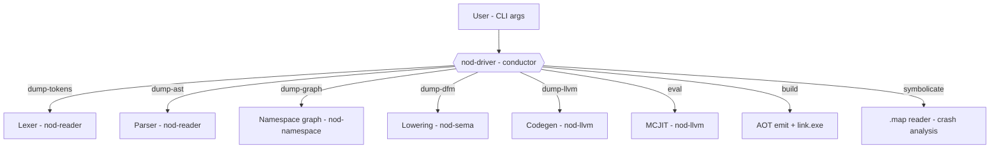
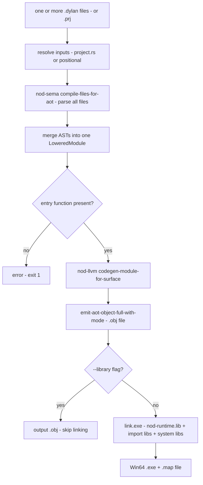

# Driver: CLI, REPL, Build Orchestration

The `nod-driver` binary is the entry point for everything: it parses
command-line arguments, selects a pipeline depth, runs the chosen stages, and
either prints intermediate output (the dump commands) or produces a final
artifact (object file, linked EXE, or JIT-evaluated result).

> Crate: `src/nod-driver` — the CLI / build conductor.

## Role in the pipeline

The driver sits above every crate. It never implements a compiler stage itself;
instead it sequences calls into `nod-reader`, `nod-sema`, `nod-llvm`, and
`nod-namespace` to produce whichever output the subcommand requests.



The driver runs the Dylan front-end, which is compiled and linked into
`nod-driver` as a static-library shim. The mechanics of that build and link —
the wire formats and the shim modules — live on [self-hosting](self-hosting.md).

## Subcommands

Every subcommand and where it stops in the pipeline
(`src/nod-driver/src/main.rs:101`):

| Subcommand | Stops after | What it shows / produces | Notes |
|------------|-------------|--------------------------|-------|
| `dump-tokens <file>` | lexer | line-oriented token stream (spec format) | stable, diffable |
| `dump-ast <file>` | parser + macros | AST as indented S-expression | post-macro-expansion tree |
| `dump-graph <lid>` | namespace | library/module graph as Graphviz | takes a `.lid` file |
| `dump-dfm <file>` | AST-to-DFM lowering | textual DFM IR | the cut-line dump |
| `dump-llvm <file>` | LLVM codegen | textual LLVM IR | |
| `eval <expr>` | MCJIT | evaluated result, printed | expression string, not a file |
| `build <files...>` | link.exe | standalone Win64 `.exe` (or `.obj` in `--library` mode) | the full AOT pipeline |
| `compile <file>` | — | — | not yet implemented (exit 2) |
| `repl` | — | — | not yet implemented (exit 2) |
| `symbolicate` | .map reader | raw hex IPs rewritten to `name+0xNN` | stdin/stdout or `--in`/`--out` |

## The dump pipeline as a depth dial

Each dump command is the previous one plus one more stage. Running them in order
on the same file shows one expression flowing all the way through the compiler:


`dump-graph` takes a `.lid` file rather than a `.dylan` file; it runs in a
separate branch that loads the `nod-namespace` library/module graph rather than
the per-file front-end. All other dump commands take a single `.dylan` source
file.

## The `build` pipeline in detail

`build` orchestrates the full AOT pipeline end-to-end. The driver is the only
place that touches the linker; every other phase stays in its own crate.



Key implementation points verified in the source:

- **Multi-file merge** (`main.rs:547`): `nod_sema::compile_files_for_aot`
  receives all input paths as a slice and returns one merged `LoweredModule`.
  The AST merge happens before any lowering, not after — consistent with the
  architecture rule that DFM modules must not be stitched post-lowering.
- **Entry check** (`main.rs:565`): before codegen, the driver asserts that
  `lm.functions` contains a function whose name matches `entry_function` (default
  `"main"`, overridable via `.prj`). This surfaces a clear error before the
  linker would fail obscurely.
- **Object path** (`main.rs:604`): the `.obj` is co-located next to the output
  EXE, with the `.exe` extension replaced by `.obj`. It is always emitted even
  in library mode.
- **Map file** (`main.rs:722`): the linker is always called with
  `/MAP:<output>.map`. The `.map` feeds the `symbolicate` subcommand for crash
  analysis.
- **Runtime lib location** (`main.rs:477`): the driver walks up from
  `current_exe()` looking for `nod_runtime.lib`, or reads the `NOD_RUNTIME_LIB`
  env var override. Compile `nod-runtime` first with
  `cargo build -p nod-runtime`.
- **Library mode** (`main.rs:533`, `main.rs:159`): `--library` emits
  `AotShape::StaticLibrary` instead of `AotShape::Executable` — skips the
  synthetic `i32 @main()` injection and the `nod_user_main` rename, then stops
  before invoking the linker.
- **Optimization level** (`main.rs:638`): AOT always uses
  `OptimizationLevel::Default`. There is no `--release` flag, and LLVM -O2/-O3
  is not yet offered as a CLI option.
- **Import libraries** (`main.rs:614`, `main.rs:729`): `collect_user_dlls` scans
  the `ModuleManifest` for `RelocKind::StubEntry` rows and passes the matching
  `.lib` files to the linker. A hard-coded set of system libs covers everything
  the Rust runtime and COM types need.

### Project files

The `.prj` project format lets a multi-file build be described once. A project
file is TOML (`src/nod-driver/src/project.rs`):

```toml
name    = "nod-ide"
sources = ["nod-ide.dylan", "ide-render.dylan"]
output  = "nod-ide.exe"
```

The optional `start_function` field overrides the entry-point name (default
`"main"`) — useful when bundling files that each define `main` under different
names.

`ResolvedProject` fields (`project.rs:83`): `name`, `sources` (absolute paths in
declaration order), `output` (absolute path, defaults to
`<project-dir>/<name>.exe`), `project_path` (the `.prj` itself),
`start_function` (defaults to `"main"`).

**Path anchor rule** (`project.rs:39`): every relative path in a `.prj` is
resolved against the project file's own directory, not the caller's working
directory. `build --project src/foo.prj` from the repo root finds `foo.dylan` in
`src/`, not in `.`.

Pass `--project foo.prj` to `build`. Positional file arguments and `--project`
are mutually exclusive (`clap` enforces this at parse time via `conflicts_with`).

## `symbolicate` — crash dump post-mortem

`symbolicate` reads a linker `.map` file and rewrites every `0x<16hexdigits>`
token in a crash log to `name+0xNN (0x...)`. It is designed for the push-caller
backtrace style output the runtime emits during a crash, but works on any text
containing 18-character hex addresses.

```
nod-driver symbolicate --map foo.map --in crash.log --out resolved.txt
```

Without `--in`/`--out`, reads stdin and writes stdout. `--runtime-base <hex>`
overrides the preferred load address from the `.map` for EXEs that ASLR-slid to
a different base (rare on Windows where `.exe` files commonly load at their
preferred address).

The `.map` is always emitted alongside every `build` run (`main.rs:722`).
`symbolicate` lives in `nod-driver` rather than `nod-runtime` deliberately:
adding code to `nod-runtime` shifts its CGU layout and breaks the archive
extraction rule that `aot_user_main_stub.rs` depends on (`main.rs:1254`).

## REPL and live bindings (planned)

The `repl` subcommand is not yet implemented — it prints an error and exits with
code 2. This section describes the design it targets: a persistent, stateful
session that survives across input turns, in contrast to every batch-mode pass
above (which is per-file and stateless).

A `repl` session accepts `define …` forms and expressions one at a time, builds
them up in a live image, and lets later turns reach the bindings introduced by
earlier turns. The same machinery accepts **redefinitions** atomically.

### The `Binding` primitive

Every top-level name (`define function`, `define constant`, `define variable`,
eventually `define generic` and `define method`) is materialised as a
heap-resident `Binding` cell. The binding is the unit of redefinition — the only
thing that can be atomically swapped.

```rust
// nod-runtime::binding
pub struct Binding {
    pub name: Symbol,            // interned via nod-namespace's interner
    pub library: LibraryId,
    pub module: ModuleId,
    pub kind: BindingKind,       // Function | Constant | Variable | Generic | Class | Macro
    pub signature: Signature,    // canonical shape — see "Signature compatibility"
    pub code: AtomicPtr<u8>,     // machine-code entry; updated atomically
    pub generation: AtomicU64,   // bumped on every successful redefinition
    pub source_span: Span,       // most-recent definition site
}
```

Invariants the cell upholds:

1. `code` is either null (newly allocated, not yet installed) or a valid pointer
   into JIT-mapped executable memory whose lifetime is at least the binding's.
2. `generation` is monotonically non-decreasing; every successful redefinition
   bumps it by exactly 1.
3. `signature` is fixed at first install. A redefinition that would change it is
   **refused**, not allowed-with-cascade.
4. The binding itself never moves once installed. Its address is stable for the
   life of the session — this is what keeps compiled callers' indirect-call cells
   valid forever.

Bindings live in a dedicated arena (`nod-runtime::binding_arena`). The
`(library, module, name)` map and a per-binding generation counter live in
[`nod-loader`](overview.md).

### Codegen change: calls through binding cells

Direct calls lower to an indirect call through the binding cell rather than a
direct `call @name`:

```llvm
@sq.binding = external constant ptr        ; address of the Binding for `sq`
...
%cell = load ptr, ptr @sq.binding          ; load the Binding's `code` field
%call = call i64 %cell(i64 %x)
```

The `@sq.binding` global is bound at JIT-install time to the Rust-side address of
the `Binding` struct (via inkwell's `add_global_mapping`); the `code` field sits
at a known offset. The indirect load is one memory access against a stable
address, regardless of how many times `sq` is redefined. Generic-function
dispatch needs to read the binding *and* its method-table generation in one go,
so the binding is the addressable thing and the one indirection is reused for
generics. A function that calls itself goes through its own binding: redefining
`factorial` mid-recursion means the *next* recursive call sees the new code while
in-flight frames finish the old code.

### REPL turn lifecycle

```
turn input (one or more top-level forms, or one expression)
        │
        ▼  nod-reader::lex + parse_module
        ▼  nod-sema::lower_module                → Vec<nod_dfm::Function>
        │
For each function in the lowering:
    ├── nod-loader::lookup_binding(name)  → Option<&Binding>
    ├── If absent: allocate a new Binding (signature from lowering), install it.
    ├── If present: signature-compare. If incompatible, refuse the WHOLE turn.
    └── Codegen against the (possibly fresh) Binding address.
        ▼  nod-llvm::codegen_module
        ▼  nod-llvm::Jit::add_module (one fresh inkwell module per turn)
        │
For each newly-codegen'd function f:
    └── Atomically store the JIT'd code pointer into f.binding.code;
        bump f.binding.generation by 1.
        │
If the turn was an expression rather than a definition:
    └── Wrap in synthetic <repl-N> function, JIT, call once, format the result.
```

**Turn-level atomicity.** A turn fully installs or fully rejects. If it would
install three new functions plus one redefinition and the redefinition fails
signature compatibility, none of the three install. The implementation stages all
bindings in a side buffer, validates all, then commits with a sequence of atomic
stores that the prior validation guarantees cannot fail.

**Concurrent calls.** A redefinition store can race with a JIT'd function reading
the cell. `AtomicPtr::store` with `Release` paired with `Acquire` loads on the
call side guarantees the new code is fully initialised before the cell points at
it.

### Signature compatibility and refusal

Two definitions of the same name are signature-compatible iff they agree on
`BindingKind`, parameter count, layout-compatible parameter types, return type,
and the `inline`/`not-inline` modifier. On an incompatible redefinition the
loader refuses the turn and leaves the old binding's `code` and `generation`
untouched:

```
error: redefinition of `foo` changes its signature
  original: (Integer, Integer) -> Integer       (generation 1)
  new:      (Integer, String)  -> Integer       (this turn)
  hint: rename the new function or restart the REPL
```

Refusal rather than cascade-invalidate-and-recompile is the conservative move:
finding callers compiled against the old signature requires a back-reference
index tied to sealing, which is not yet implemented.

### Status and out-of-scope

The `repl` subcommand and the `nod-loader` live-binding map are **planned, not
yet implemented**. Within the design above, the following are explicitly out of
scope for the first version:

- **Method redefinition** (`add-method` / `remove-method` on generics) — the
  `Binding` shape leaves room (an `AtomicPtr<MethodTable>` slot), but it is not
  yet wired.
- **Sealed-direct call invalidation** — needs the back-reference index that
  sealing introduces; the binding reserves a `sealed_dependents` field, left
  empty.
- **Old-code reclamation** — until the GC scans `Binding.code` fields and thread
  stacks, every redefinition leaks the previous machine code into the arena.
- **Class redefinition** — explicitly refused; a previously-defined class name
  cannot be re-`define class`-d in the same session. Lazily updating existing
  instances to a new class layout is not yet designed.
- **Macro redefinition** — refused within a session.

The cell shape is deliberately forward-compatible: it is `#[repr(C)]` with `code`
and `generation` in adjacent slots so JIT'd dispatch lowerings can compute load
offsets cheaply, and the symbolic identity (`name + library + module`) is
populated from the start so a future persistent/checkpointed session has a stable
key distinct from the runtime address.

## Invariants and gotchas

- **`compile` and `repl` are not implemented** (`main.rs:342`, `main.rs:397`).
  Both print an error and exit with code 2. `compile` is a placeholder for a
  future LID-rooted full-library compilation mode.
- **AOT optimization is always `Default`** (`main.rs:638`). There is no
  `--release` flag; the optimization level is hardcoded.
- **Library mode skips the linker entirely.** When `--library` is passed, the
  driver stops after `emit_aot_object_full_with_mode` and copies the `.obj` to
  the output path. The caller links it. The `nod_aot_resolve_relocs` function is
  still emitted in the object; the host binary must call it once before invoking
  any Dylan-side functions.
- **Multi-file builds require all files to declare the same `Module:` header.**
  This is checked inside `nod_sema::compile_files_for_aot`; the driver does not
  re-check it.
- **Positional inputs and `--project` are mutually exclusive.** `clap` rejects
  both being set. `--project` alone sets both the file list and the default
  output path.
- **`NOD_RUNTIME_LIB` env var.** Set this in CI to point directly at the
  staticlib rather than relying on the walk-up heuristic.
- **link.exe must be on `PATH` or found via MSVC registry.** The driver calls
  `cc::windows_registry::find("x86_64-pc-windows-msvc", "link.exe")`. Build from
  a Developer Command Prompt or install VS Build Tools.

## Where in the code

| File | Lines | Responsibility |
|------|-------|----------------|
| `src/nod-driver/src/main.rs` | ~1501 | `Cli` struct, `Command` enum, `main`, all `run_*` functions, `run_build_full`, `run_symbolicate`, shim init |
| `src/nod-driver/src/project.rs` | ~373 | `RawProject`, `ResolvedProject`, `LoadError`, TOML parsing, path resolution |

## See also

- [Compiler overview](overview.md) — the full pipeline and the crate map
- [JIT and AOT](jit-and-aot.md) — what happens inside `nod-llvm` after the driver
  hands off: MCJIT engine, `emit_aot_object_full_with_mode`, the AOT entry-stub
  injection
- [Self-hosting](self-hosting.md) — the wire formats and the shim build process
  that compile the Dylan front-end into the driver
- [Namespaces](namespaces.md) — what `dump-graph` loads: the LID format and the
  library/module dependency graph

---
Next: [Self-hosting](self-hosting.md) · See also [Compiler overview](overview.md) · [JIT and AOT](jit-and-aot.md)
