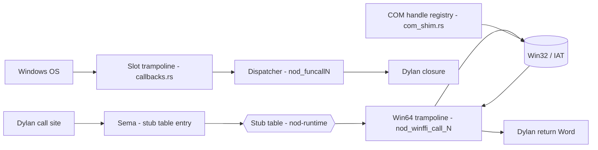
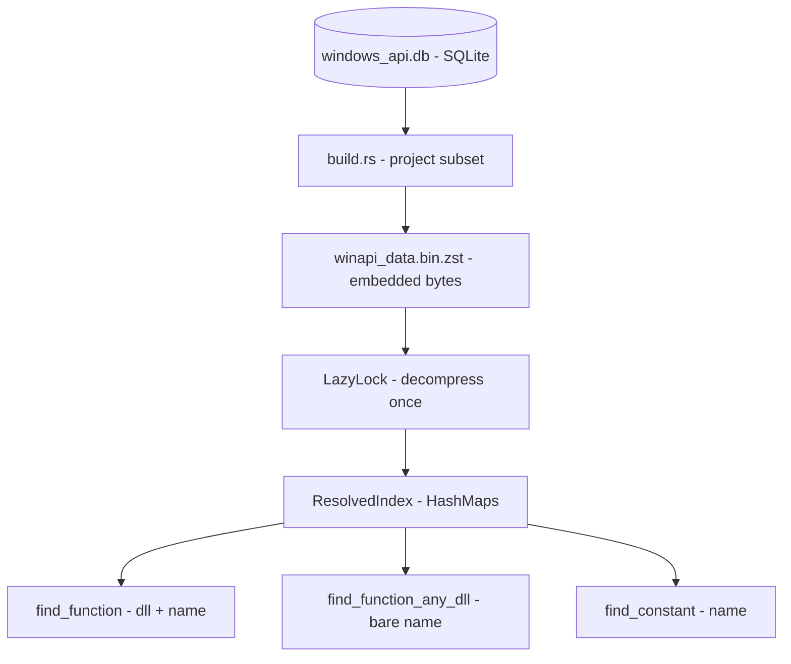
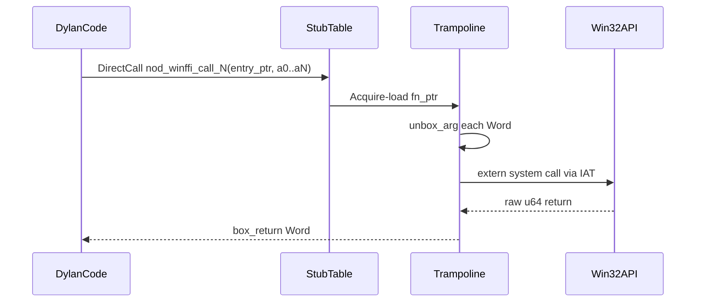
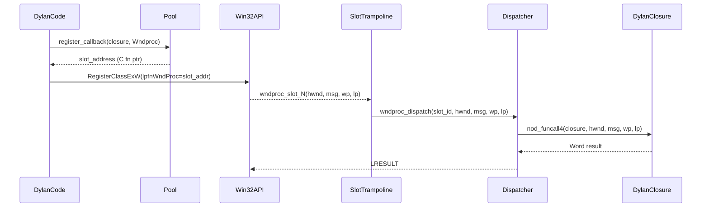

# FFI: Calling Windows

NewOpenDylan's c-ffi layer lets Dylan code call any of ~15,000 Win32 functions
across ~350 DLLs, pass and receive C structs, marshal strings, and register
Dylan closures as C-callable callbacks — the machinery that makes a
Dylan-authored Win32 GUI possible.

> Crates: `src/nod-winapi`, `src/nod-runtime`  ·  Windows-first

## Role in the pipeline

The FFI sits at the back-end boundary. Dylan code crosses into Win32 via an
arity-selected trampoline; Windows calls back through a slot trampoline whose
address was registered at setup time. COM objects live in a handle registry
behind the `windows` crate.

## Key types

| Type | File | Purpose |
|------|------|---------|
| `FunctionInfo` | `src/nod-winapi/src/data_schema.rs:24` | One Win32 function projected from the SQLite DB |
| `WinApiIndex` | `src/nod-winapi/src/data_schema.rs:125` | Deserialized index: functions, constants, DLL names |
| `TypeRef` | `src/nod-winapi/src/data_schema.rs:64` | Compact C-type tag (Void/I32/U32/Handle/NarrowString/WideString/…) |
| `ApiStubEntry` | `src/nod-runtime/src/winffi.rs:277` | One row in a module's stub table — DLL name, symbol, resolved `fn_ptr`, signature |
| `ApiStubTable` | `src/nod-runtime/src/winffi.rs:303` | Slice of `ApiStubEntry` for a whole module; pinned in the static area |
| `ApiCallSignature` | `src/nod-runtime/src/winffi.rs:253` | Packed `arg_count`, `arg_kinds[12]`, `return_kind` — read by the trampoline |
| `CArgKind` | `src/nod-runtime/src/winffi.rs:70` | Marshaling kind per argument (Int32, Handle, NarrowString, WideString, …) |
| `CallbackSignature` | `src/nod-runtime/src/callbacks.rs:102` | `Wndproc` or `Wndenumproc` — the two supported callback shapes |
| `ComObject` | `src/nod-runtime/src/com_shim.rs:156` | Typed COM interface enum (DxgiFactory, D3D11Device, D2DDeviceContext, …) |
| `StructFieldInfo` | `src/nod-runtime/src/structs.rs:66` | Per-field record: name, byte offset, kind — drives `%struct-get-*` primitives |

## How it works

### 1. The metadata pipeline

A vendored SQLite database at `data/windows_api.db` holds the full Windows API
metadata. At build time, `build.rs` runs a projection query against the database
and writes a postcard-serialized, zstd-compressed blob to
`$OUT_DIR/winapi_data.bin.zst`. The blob is embedded directly in `nod-winapi`
via `include_bytes!` and is decompressed exactly once, on first access, by a
`LazyLock` (`src/nod-winapi/src/lib.rs:72`).

The projection restricts to **primitive-typed signatures** only — every
parameter and return type must resolve into a `TypeRef` variant. Signatures
containing struct-by-value or union arguments are dropped
(`src/nod-winapi/build.rs:1`). The result covers 15,067 functions across ~350
DLLs (`src/nod-winapi/src/lib.rs:6`). After decompression the index is
partitioned into three in-memory `HashMap`s:

- `by_dll_and_name` — (lower-cased DLL, name) → index — the primary lookup for
  `define c-function`
- `by_name` — name → all matching indices, for bare-name resolution across DLLs
- `by_dll` — DLL → indices, for `iter_dll` enumeration

Lookups are case-insensitive on the DLL name so Dylan source can write
`"KERNEL32.DLL"` and match the canonical lower-cased form
(`src/nod-winapi/src/lib.rs:109`).

### 2. The call path

When sema lowers a `define c-function` (or a bare-name call — see below), it
builds a `StubEntrySpec` per unique `(dll, symbol)` pair in the module. All
specs are passed to `allocate_stub_table` (`src/nod-runtime/src/winffi.rs:676`),
which pins each entry in the static area via `Box::leak` and returns per-entry
pointers that the codegen bakes in as IR constants. Multiple call sites sharing
the same `(dll, symbol)` get the same entry — PLT-style deduplication.

At JIT-finalize the runtime walks the table and calls `LoadLibraryA` /
`GetProcAddress` (via `windows-sys`) to populate each entry's `fn_ptr`
atomically (`src/nod-runtime/src/winffi.rs:593`).

Codegen emits each Win32 call as a `DirectCall` to `nod_winffi_call_N` (N = arg
count). There is one trampoline per arity: `nod_winffi_call_0` through
`nod_winffi_call_12` (`src/nod-runtime/src/winffi.rs:1234`–`1647`). The arity
cap is 12, which covers `CreateWindowExW` and `CreateProcessW`.

Each trampoline:

1. Loads the resolved `fn_ptr` from the stub entry with `Acquire` ordering.
2. Calls `unbox_arg` for each Dylan `Word` argument
   (`src/nod-runtime/src/winffi.rs:837`).
3. Invokes the function through an `extern "system"` signature (Win64 ABI:
   RCX/RDX/R8/R9 plus stack slots).
4. Calls `box_return` to wrap the raw `u64` return as a Dylan `Word`
   (`src/nod-runtime/src/winffi.rs:933`).

### 3. Marshaling

**Integers.** `CArgKind::Int32` / `UInt32` / `Bool32` / `Handle` etc. unbox a
Dylan fixnum to the C-typed `u64` register value. `<c-bool>` accepts Dylan
`#t`/`#f` or a fixnum (`src/nod-runtime/src/winffi.rs:860`).

**Null pointer.** `$NULL` is the Dylan fixnum `0`. In a pointer, handle, or
string position, a fixnum `0` marshals to a null C pointer
(`src/nod-runtime/src/winffi.rs:768`). Callers write `MessageBoxW($NULL, ...)`
without a special type.

**Narrow strings (`<c-string>`).** `marshal_narrow_string` copies the Dylan
`<byte-string>` bytes, appends a null terminator, and holds the buffer alive in
a `Vec<TempBuf>` that lives on the trampoline's stack frame for the duration of
the C call (`src/nod-runtime/src/winffi.rs:765`). The buffer is freed on return.

**Wide strings (`<c-wide-string>`).** `marshal_wide_string` re-encodes the Dylan
`<byte-string>` from UTF-8 to UTF-16LE, appends a null `u16`, and holds it in a
`TempBuf::Wide` (`src/nod-runtime/src/winffi.rs:783`).

**String returns.** A returned `LPCSTR` / `LPCWSTR` (e.g. from
`GetCommandLineW`) is scanned to its null terminator, converted, and copied into
a fresh Dylan `<byte-string>` (`src/nod-runtime/src/winffi.rs:972`–`1012`).

**C structs (`<c-struct>`).** When a pointer/handle argument is actually a
`<c-struct>` subclass instance, `unbox_arg` auto-coerces by passing the address
of the struct's byte payload — the bytes immediately after the 8-byte `Wrapper`
header — rather than the wrapper address itself
(`src/nod-runtime/src/winffi.rs:903`). The registered struct classes cover
POINT, RECT, SIZE, FILETIME, SYSTEMTIME, MSG (48 bytes), WNDCLASSEXW (80 bytes),
and PAINTSTRUCT (`src/nod-runtime/src/structs.rs:80`). Field layout tables and
the `%struct-get-*` accessor primitives are driven by `StructFieldInfo` records.

### 4. Bare-name materialization

A Dylan call to `Beep(440, 1000)` with no explicit `define c-function`
declaration triggers **bare-name materialization** in sema. Sema calls
`find_function_any_dll` on the `nod-winapi` index, synthesizes a binding from the
returned `FunctionInfo` — DLL name, calling convention, parameter and return
`TypeRef`s — and proceeds as if a `define c-function` had been written by hand.
Each synthesis bumps the `materialized_lifetime` stat counter via
`winffi_record_materialized` (`src/nod-runtime/src/winffi.rs:444`). The Dylan
programmer never needs to declare Win32 primitives; the embedded DB provides the
contract.

### 5. Callbacks: Dylan closures as C function pointers

Windows callback protocols like `WNDPROC` and `WNDENUMPROC` need a plain C
function pointer. Dylan closures cannot be called directly through C ABI because
they expect tagged `Word` arguments. The trampoline pool in `callbacks.rs`
bridges the two.

**Pool structure.** There are 32 pre-compiled slot trampolines per callback
signature, generated by a macro (`src/nod-runtime/src/callbacks.rs:231`). Each
slot has a unique function address the OS stores and calls through standard Win64
ABI. The two supported signatures are:

- `Wndproc`: `extern "system" fn(HWND, UINT, WPARAM, LPARAM) -> LRESULT`
- `Wndenumproc`: `extern "system" fn(HWND, LPARAM) -> BOOL`

**Registration.** `register_callback(closure, sig)` finds a free slot, stores the
closure `Word` in a stable `Box<[UnsafeCell<Word>; 32]>`, marks it occupied, and
installs GC roots for every slot on the current thread
(`src/nod-runtime/src/callbacks.rs:537`). The caller then reads the slot's
address via `slot_address` and passes it to Win32 (e.g. as `lpfnWndProc` in
`WNDCLASSEXW`).

**Dispatch.** When the OS fires the callback, the slot's `extern "system"`
function calls the shared `wndproc_dispatch` or `wndenumproc_dispatch`. The
dispatcher reads the registered closure `Word`, converts the C-typed args to
Dylan fixnum `Word`s, and calls the closure through `nod_funcall4` /
`nod_funcall2` (`src/nod-runtime/src/callbacks.rs:378`).

GC safety is maintained by registering every slot cell as a GC root on each
thread that touches the registry, so the closure is never reclaimed while the
callback is live (`src/nod-runtime/src/callbacks.rs:180`). See the callback and
closure-tenuring contract in [gc.md](gc.md).

### 6. COM: the handle registry

COM objects (DXGI, D3D11, Direct2D, DirectWrite) are accessed through the
`windows` crate (`src/nod-runtime/src/com_shim.rs:77`). Dylan sees opaque `u64`
handle tokens treated as `<c-handle>`. The process-global registry is a
`Mutex<HashMap<u64, ComObject>>` with a monotonically increasing handle counter
(`src/nod-runtime/src/com_shim.rs:175`).

The `ComObject` enum owns exactly one reference to the typed COM interface;
cloning the enum variant bumps the underlying refcount via the `windows` crate's
`Clone + Drop` contract. Calling `nod_com_release(handle)` removes the entry,
which drops the typed wrapper and calls `Release`
(`src/nod-runtime/src/com_shim.rs:195`).

Shim functions (e.g. `nod_d2d_draw_text_layout`) are plain `extern "C-unwind"`
Rust functions that look up each handle, clone the interface, and call `windows`
crate methods directly. Errors surface as `<c-ffi-error>` Dylan conditions with
the HRESULT in the `os-error-code` slot. The COM shim surface covers DXGI,
D3D11, Direct2D, and DirectWrite offscreen rendering, plus `IDXGISwapChain1` for
HWND-bound presentation.

**Float marshaling caveat.** The COM shim currently accepts integer-encoded
scalars (color channels as 0..=255 integers, pixel coordinates as integers)
rather than native `<c-float>` arguments. The `<c-float>` / `<c-double>` Dylan
types are registered and accepted by sema, but the trampoline path for them is
not yet implemented (`src/nod-runtime/src/com_shim.rs:50`).

## Error handling

FFI failures surface as `<c-ffi-error>` Dylan conditions, a subclass of
`<error>`:

- **Missing DLL or symbol.** `initialize_stub_table` calls `LoadLibraryA` +
  `GetProcAddress` at JIT-finalize, before the first call to any function in the
  module. A missing DLL or symbol raises `<c-ffi-error>` immediately
  (`src/nod-runtime/src/winffi.rs:593`).
- **COM HRESULT failures.** A failing `windows` crate call surfaces as
  `<c-ffi-error>` with the HRESULT in the `os-error-code` slot.

## Invariants and gotchas

- **Stub entries are process-lifetime.** `allocate_stub_table` leaks its entries
  and DLL/symbol name bytes via `Box::leak`. This is intentional: JIT-emitted IR
  constants bake the raw pointer address, so the entry must never move or be
  freed.
- **Eager resolution at JIT-finalize.** `initialize_stub_table` resolves all
  symbols before the first call to any function in the module.
- **`$NULL` is fixnum 0.** Any pointer/handle/string argument that receives a
  Dylan fixnum `0` becomes a null C pointer. No special type is needed.
- **`TempBuf` lifetime.** String temporaries live only for the duration of the
  Win32 call. Passing a `<c-string>` pointer back to Dylan after the call
  returns is undefined behavior.
- **Callback pool is 32 slots per signature.** Registering a 33rd `Wndproc`
  returns `RegisterError::PoolFull`. There is no unregistration path —
  callbacks registered at startup persist for the process lifetime.
- **Callbacks install GC roots per thread.** A thread that invokes a registered
  callback without having previously called into the registry installs roots on
  its first dispatch. The GC thus sees all 32 cells on every mutator thread.
- **COM tests require `#[serial]`.** The handle registry is process-global;
  handles leak across tests unless explicitly released with `nod_com_release`.
- **AOT differs from JIT on stub resolution.** In an AOT binary the Windows
  loader resolves Win32 imports through the IAT built by `link.exe`; stub entries
  for AOT-emitted calls leave `dll_name_ptr` / `symbol_name_ptr` null
  (`src/nod-runtime/src/winffi.rs:1162`).
- **Arity cap is 12.** `ApiCallSignature::arg_kinds` is a fixed `[u8; 12]`
  (`src/nod-runtime/src/winffi.rs:262`). Calls with more than 12 arguments are
  rejected at sema time.

## Where in the code

| File | Lines | Responsibility |
|------|-------|----------------|
| `src/nod-winapi/src/data_schema.rs` | 133 | Postcard wire format: `FunctionInfo`, `TypeRef`, `WinApiIndex` |
| `src/nod-winapi/src/lib.rs` | 251 | Blob decompression, `LazyLock` index, `find_function` / `find_function_any_dll` |
| `src/nod-winapi/build.rs` | 505 | Build-time DB projection: SQLite → postcard → zstd blob |
| `src/nod-runtime/src/winffi.rs` | 1691 | Stub table, trampolines `nod_winffi_call_0`..`12`, marshaling, `<c-ffi-error>` |
| `src/nod-runtime/src/callbacks.rs` | 901 | Pool of 32 slot trampolines per signature, `register_callback`, dispatchers |
| `src/nod-runtime/src/com_shim.rs` | 2568 | COM handle registry, DXGI/D3D11/D2D/DWrite shim functions |
| `src/nod-runtime/src/structs.rs` | 909 | `<c-struct>` class registration, field layout tables, accessor primitives |

## See also

- [Runtime and object model](runtime.md) — tagged Words, dispatch, conditions;
  `<c-ffi-error>` is a subclass of `<error>` documented there
- [JIT and AOT](jit-and-aot.md) — how the MCJIT finalizes a module and when
  `initialize_stub_table` is called; how AOT links Win32 imports via the IAT
- [GC](gc.md) — explicit pinning and the callback closure-tenuring contract
- [Platform strategy](../reference/platforms.md) — why the FFI is
  Windows-specific today

---
[Runtime](runtime.md) · [JIT and AOT](jit-and-aot.md) · [GC](gc.md) · [Architecture](../architecture.md) · [Glossary](../glossary.md)
