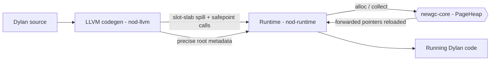
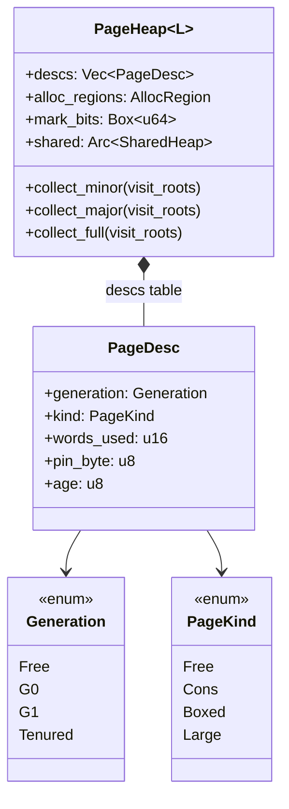
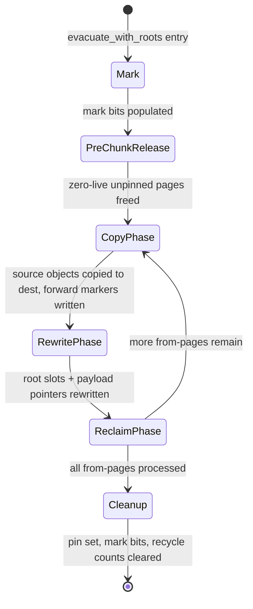
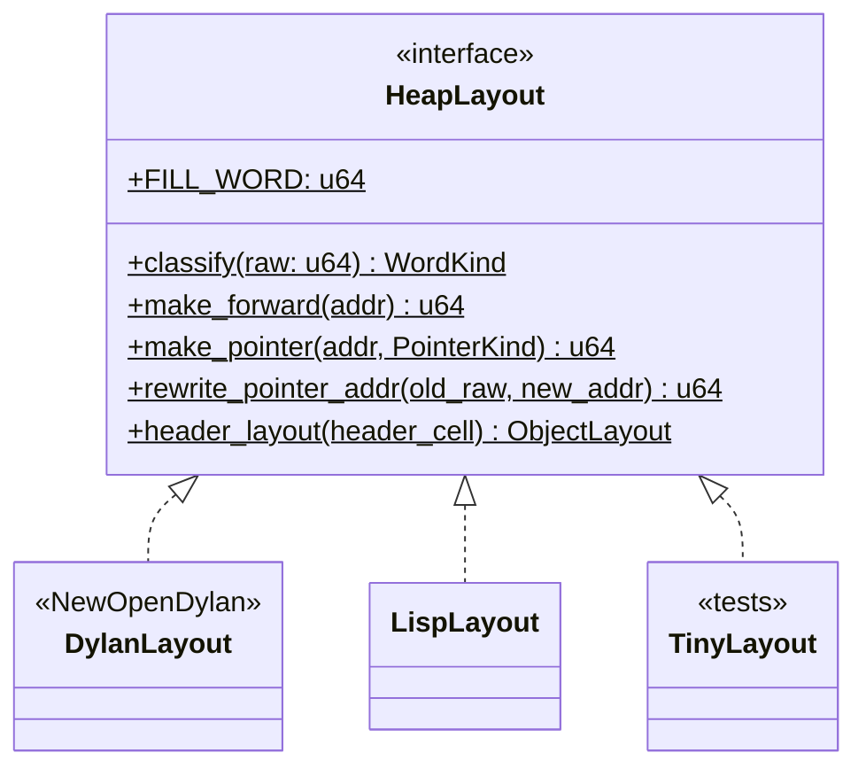

# Garbage Collector

NewOpenDylan's runtime uses a **precise, page-based, mark-evacuate generational
collector** implemented in the `newgc-core` crate. The collector is
language-agnostic — it is parameterised by a `HeapLayout` trait — and is the
shared GC for the wider portfolio; NewOpenDylan plugs in its own `DylanLayout`
implementation to teach the collector the tagged-`Word` and wrapper-header
conventions.

> Crate: `src/newgc-core`  ·  Windows-first, single-thread stop-the-world

The collector is **precise by construction**: it never scans the raw call
stack. The codegen layer ([codegen.md](codegen.md)) feeds the collector precise
roots at each allocating call site through a slot-slab and safepoint protocol.
Every object allocation made by JIT or AOT code flows through the runtime into
`newgc-core`; the collector sees forwarded pointers reloaded after each cycle,
never the raw Dylan stack.



## The Word and object model the GC sees

The collector understands the heap only through `DylanLayout`
(`nod-runtime/src/dylan_layout.rs:34`), which encodes the runtime's value
representation:

- **Tagged Words.** Every runtime value is a 64-bit `Word` with a 1-bit pointer
  tag. The collector's `classify` function reads a raw cell and returns one of
  `Immediate`, `PointerCons(addr)`, `PointerHeader(addr)`, or
  `Forwarded(addr)`. Immediates (fixnums, characters, booleans, the nil
  immediate) carry a non-pointer tag and are skipped by the tracer.
- **Uniform object header.** Boxed heap objects carry a `HeapHeader` at cell 0;
  its class id identifies the object's field count and pointer-cell range.
  Headerless 16-byte pairs (`<pair>`) have no header — they live on dedicated
  `Cons` pages with a fixed stride.

`header_layout` (`traits.rs:70`) reads an object's header cell and returns its
`ObjectLayout`: the total cell count plus the `[pointer_cells_start,
pointer_cells_end)` range of pointer-typed payload cells. This lets the GC scan
exactly the right cells of each object without any Dylan-specific class
knowledge. `classify` is called on every cell during mark and evacuation and is
required to inline (5–20 instructions, `traits.rs:116`) into the hot scanners.

The full Word encoding and header bit layout are documented in
[runtime.md](runtime.md); this page describes them only as the collector
consumes them.

## Heap layout

`PageHeap<L>` (`space.rs:86`) reserves a contiguous virtual address range
(default 2 GB, `space.rs:79`), divided into 64 KB pages
(`PAGE_SIZE_BYTES = 64 * 1024`, `space.rs:70`). Each page is 8192 cells (64-bit
words). On Windows, pages are committed individually with
`VirtualAlloc(MEM_COMMIT)` and decommitted when freed (`space.rs:241-310`). A
parallel `Vec<PageDesc>` (`space.rs:125`) is the page table — 12 bytes per page,
indexed by page number.

Every page carries a `Generation` tag (`page_desc.rs:39`):

| Generation | Role |
|------------|------|
| `Free` | Unassigned |
| `G0` | Nursery (young) |
| `G1` | Intermediate |
| `Tenured` | Old generation |

The page lifecycle is always `Free → G0 → G1 → Tenured`, driven by promotion
thresholds in `cycle.rs`. A page also carries a `PageKind` (`page_desc.rs:102`)
that controls how the GC walks it:

| PageKind | Layout |
|----------|--------|
| `Free` | Unassigned |
| `Cons` | Headerless 16-byte pairs, stride = 2 cells |
| `Boxed` | Objects with a `HeapHeader` at cell 0; uses the start-bit bitmap to find boundaries |
| `Large` | One object spanning one or more contiguous whole pages |



### The start-bit bitmap

`Boxed` pages do not encode object boundaries inline, so the heap maintains a
global **start-bit bitmap** (`SharedHeap::start_bits`). One bit per cell marks
the first cell of each live object. Allocation sets the start bit atomically as
part of the bump (`fetch_or` into the bitmap); the mark and evacuation scanners
walk start bits to enumerate object boundaries. `Cons` pages need no bitmap
because their stride is fixed at two cells.

### Key types

| Type | Defined in | Purpose |
|------|-----------|---------|
| `PageHeap<L>` | `space.rs:86` | The heap: a virtual reservation split into 64 KB pages |
| `PageDesc` | `page_desc.rs` | 12-byte per-page metadata (generation, kind, words_used, pin_byte) |
| `Generation` | `page_desc.rs:39` | `Free / G0 / G1 / Tenured` — the four page states |
| `PageKind` | `page_desc.rs:102` | `Free / Cons / Boxed / Large` — what shape of objects a page holds |
| `AllocRegion` | `alloc.rs:64` | Currently-open page + bump offset for one `(Generation, PageKind)` pair |
| `PageEvacuator` | `evac.rs:268` | Drives one evacuation pass; presented to root-walking closures |
| `GcCoordinator<L>` | `mutator.rs:245` | Owns the heap, hands out `Mutator` handles; the runtime's entry point |
| `Mutator<L>` | `mutator.rs:421` | Per-thread handle: lock-free TLAB bump + safepoint/root protocol |
| `HeapLayout` | `traits.rs:117` | Language-binding trait: `classify`, `make_forward`, `header_layout`, ... |
| `CardTable` | `heap_common.rs:40` | Soft write-barrier card table — one byte per 512-byte card |
| `PinHandle` | `pin.rs:83` | Explicit (FFI) pin; released with `unpin()` |
| `CollectResult` | `cycle.rs:72` | What one minor/major cycle did (objects/pages moved, promoted flags) |
| `FullCollectResult` | `cycle.rs:93` | Three-pass result from `collect_full` |

## Allocation

Each `(Generation, PageKind)` pair has an open `AllocRegion` (`alloc.rs:64`) — a
current page and a bump offset. The six active regions are G0-Cons, G0-Boxed,
G1-Cons, G1-Boxed, Tenured-Cons, and Tenured-Boxed.

The `Mutator` handle goes faster still: it holds a per-`(gen, kind)` **TLAB**
(`mutator.rs:73-88`) — a slab carved from the heap under the heap lock once,
then bumped **lock-free** until exhausted. The fast path
(`mutator.rs:483-517`):

1. Check the current TLAB has room for `n_cells`.
2. Advance the cursor; set the start bit atomically (`fetch_or` into the global
   `SharedHeap::start_bits` bitmap).
3. Bump the `bytes_alloc_since_gc` counter (atomic, relaxed).
4. Return the pointer — **no heap lock taken**.

On TLAB exhaustion, `refill()` (`mutator.rs:519`) takes the heap lock once to
carve a new slab from the `AllocRegion` (which may in turn call
`acquire_free_page`, `alloc.rs:161`). The TLAB request doubles from 4 KB to
64 KB across successive refills (`mutator.rs:531`). Large objects bypass TLABs
entirely and go directly through the heap lock (`mutator.rs:469`).

When the G0 page count hits `young_page_cap` (`space.rs:216`), `reserve_tlab`
returns `None`, and the mutator triggers a minor collection before retrying.

> The Dylan-side allocator entry points (`nod_make`, `nod_make_closure`,
> `nod_pair_alloc`, ...) take the runtime call path on every allocation today;
> there is no inline TLAB bump emitted directly into JIT code, and the
> allocation slow-path collection is what makes each allocating call a potential
> GC point (see the safepoint protocol below).

## The collection cycle

`cycle.rs` orchestrates three entry points.

### `collect_minor` (`cycle.rs:127`) — collects G0

Increments `minors_since_g0_promote`; when that reaches
`G0_PROMOTION_THRESHOLD` (= 3, `cycle.rs:59`) the destination is G1 and the
counter resets, otherwise the destination is G0 (within-generation copy). If
the G0 promotion also fires the G1 threshold (`G1_PROMOTION_THRESHOLD` = 5 G0
promotions, `cycle.rs:66`), a cascade G1 → Tenured pass runs immediately.
Card-dirty cross-generation pointers are injected as extra roots via
`scan_dirty_cards_as_roots`.

### `collect_major` (`cycle.rs:233`) — promotes all of G1 to Tenured

Then collects G0 into G0. The card scan is applied to both passes. Resets both
promotion counters.

### `collect_full` (`cycle.rs:354`) — three passes in order

1. G0 → G1 (forced, ignoring the counter).
2. G1 → Tenured (forced).
3. Tenured → Tenured (compact using explicit roots only; no card scan because
   G0 and G1 are empty after passes 1 and 2).

After every cycle, `rebuild_cards_for_old_gens` refreshes the card table from
the new heap layout, since evacuation moves objects between pages and dirty bits
do not transfer automatically.

### The evacuator

Each cycle delegates to `evacuate_with_roots` (`evac.rs:684`), the
block-incremental Cheney-style BFS evacuator. Its phases (`evac.rs:635-683`):



Each chunk iterates three phases:

- **Phase 1 (Copy).** Walk marked starts on the chunk's source pages; copy each
  live, unpinned object to `dest_gen`; write `Word::forward` at the source cell.
- **Phase 2 (Rewrite).** Invoke the root-walking closure in `Rewrite` mode so
  mutator-root slots and card-dirty cells are updated; then walk all live pages
  to fix up in-heap pointer Words that now carry a forwarding marker.
- **Phase 3 (Reclaim).** Pages with no pins are returned to `Free` (growing the
  budget for the next chunk); pages with pins are generation-flipped in place —
  pinned objects "promote for free."

## Precise roots and the safepoint protocol

The collector is **precise by construction**: it never scans the raw call
stack. Instead, `nod-llvm` codegen emits a **slot slab** — a stack-allocated
`[Word; max_safepoint_slots]` alloca — at the entry of every compiled Dylan
function. The slab is sized to the maximum number of pointer-shaped temps live
at any single allocating call site in the function.

Before each allocating call the compiler spills every live GC-managed pointer
into the slab; after the call it reloads from the slab, because the GC may have
forwarded those objects during the collection triggered inside the allocator.

```
store t0, slot_base+0
store t1, slot_base+1
call nod_jit_begin_safepoint(namespace, site_id, slot_base)
call nod_make(...)               ; GC may run here
call nod_jit_end_safepoint(slot_base)
t0' = load slot_base+0           ; forwarded address
t1' = load slot_base+1
```

After `end_safepoint`, the old SSA values (`t0`, `t1`) are dead; codegen
rebuilds the `temps` map from the reloaded values, so any IR that textually
follows the call automatically picks up the post-relocation addresses.

```mermaid
sequenceDiagram
    Dylan->>Runtime: spill roots to slot_slab; begin_safepoint(ns, site_id, slot_base)
    Runtime->>GcCoordinator: alloc triggers collect_minor
    GcCoordinator->>PageHeap: evacuate_with_roots(G0, dest, visit_roots)
    PageHeap->>PageEvacuator: visit slot_slab[0], slot_slab[1]
    PageEvacuator-->>PageHeap: copy objects, write forwarding markers
    PageHeap-->>Runtime: slot_slab updated with forwarded addresses
    Runtime-->>Dylan: end_safepoint; reload t0 from slot_slab[0]
```

### Liveness analysis

The `populate_safepoint_roots` pass (`nod-dfm/src/liveness.rs`) runs after DFM
lowering and fills the `safepoint_roots: Vec<TempId>` field on every call-shaped
computation. Per block:

```
def_index[t]       = index of the computation that defines t
                     (-1 for function/block params)
last_use_index[t]  = last index in B at which t appears as an operand
                     len     if t appears in the terminator
                     len+1   if t is used in any other block (escapes)

for each call at index c:
    safepoint_roots[c] = {
        t  :  def_index[t] < c  <=  last_use_index[t]
           AND  t is pointer-shaped
    }
```

The "escapes block" approximation is conservative: a temp defined in block A and
used anywhere in block B is treated as live until the end of A. This
over-protects but never under-protects.

### JIT root reporting

The runtime needs to know *which slots* in the slab hold live roots for a given
call site. JIT modules register this mapping once at install time:

```
register_jit_safepoints([
    JitSafepointEntry { namespace, site_id, slots: [0, 1] },
    JitSafepointEntry { namespace, site_id, slots: [0]    },
    ...
])
```

`slots` is the list of slab indices live at that call, computed by the liveness
analysis and keyed on `(namespace, site_id)`. The runtime keeps a global
`BTreeMap<(u64,u64), JitSafepointEntry>` registry. The mapping is also baked
into the module IR as named globals
(`nod_jit_safepoint__<ns>__<site>__<slots>`) for the bitcode-replay path.

`nod_jit_begin_safepoint` pushes an `ActiveJitSafepoint { ns, site_id,
slot_base }` onto the thread-local `ACTIVE_JIT_SAFEPOINTS` stack;
`nod_jit_end_safepoint` pops it.

### AOT root reporting

AOT code calls `nod_aot_begin_safepoint(site_id, root_count, slot_base)`
directly. The `root_count` is a compile-time constant, so no registry lookup is
needed — `snapshot_active_aot_roots()` reads the first `root_count` slots from
`slot_base`. Frames push onto a separate thread-local `ACTIVE_AOT_SAFEPOINTS`
stack.

### Nested calls

Multiple levels of Dylan calls each push their own frame onto the active
safepoint stack, each with its own `slot_base` (a distinct stack-frame alloca),
so frames do not interfere. `snapshot_roots()` sees every active frame and
yields pointers into each frame's slab; the evacuator updates them all in place,
and each function reloads from its own slab on return.

```
call stack                  ACTIVE_JIT_SAFEPOINTS (thread-local stack)
------------------          --------------------------------------------
  foo (outer)               [ { ns, site=1, slot_base=&foo_slab } ]
    bar (inner)             [ { ns, site=1, slot_base=&foo_slab },
                               { ns, site=3, slot_base=&bar_slab } ]
      nod_make              snapshot_roots sees BOTH frames
        collect_minor       roots from foo_slab AND bar_slab
```

### Root sources

`snapshot_roots()` aggregates three root sources:

```
snapshot_roots()
|
+-- ROOT_STACK  (thread-local Vec<*const Word>)
|     Rust-side allocations protected by RootGuard.
|     Used by: nod-runtime internals, C-callback trampolines.
|
+-- snapshot_active_jit_roots()
|     Reads ACTIVE_JIT_SAFEPOINTS; for each active frame looks up slot
|     indices in the JIT safepoint registry, yields pointers into its slab.
|
+-- snapshot_active_aot_roots()
      Reads ACTIVE_AOT_SAFEPOINTS; for each active frame yields
      slot_base[0..root_count].
```

### Safepoint polls

Safepoint polls are emitted at function entry and loop-header blocks.
`nod_safepoint_poll()` checks a process-global `SAFEPOINT_PARK_REQUESTED` flag
(relaxed atomic load, branch-predicted not-taken). For single-threaded code
this is a no-op — the GC runs synchronously inside the allocator, not via an
external park request. The polls, together with the
`safepoint_request_stop()` / `safepoint_resume()` Rust API (and their
`nod_safepoint_request_stop` / `nod_safepoint_resume` C-ABI wrappers), are the
infrastructure for stop-the-world multi-threaded collection; the full
multi-mutator park/unpark protocol is not yet exercised.

A compile-time verifier (an "alloca tracker") that statically proves every live
GC pointer is spilled before every allocating call is **not yet built**. The
current guarantee is "liveness analysis is correct by construction and validated
by end-to-end Dylan workloads," not a static proof.

## Write barriers and card marking

The `CardTable` (`heap_common.rs:40`) covers the full reservation at 512-byte
granularity — one byte per card (`CARD_SIZE_BYTES = 512`). When Dylan code
writes a pointer from a long-lived object (G1 or Tenured) into a younger object,
the write barrier marks the card containing the storing object's address. During
`collect_minor`, `scan_dirty_cards_as_roots` adds the live pointers in dirty
cards to the evacuation root set, so cross-generation references keep their G0
targets alive. After each cycle, `rebuild_cards_for_old_gens` resets the table
to the current heap layout.

The `PageDesc.pin_byte` field is a secondary fast path: 8 bits per page (one per
8 KB sub-region) let the evacuator answer "might anything on this page be
pinned?" with a single byte-load and bit test, consulting
`PageHeap::pinned_cells` only on a hit.

Card scanning is **object-aware, not cell-by-cell**. Naive cell-by-cell scanning
is unsound for objects with opaque byte payloads (e.g. `<byte-string>`):
arbitrary bytes can alias a heap-pointer bit pattern and cause the GC to
resurrect dead objects or overwrite payload. `visit_card_pointer_cells`
(`evac.rs:533`) walks live objects via start bits and `header_layout`, scanning
only the pointer-typed cells of each object (`evac.rs:517`).

> Dylan codegen creates closures and cells in the young generation, where they
> tenure together at the next major collection. The `newgc-core` card
> infrastructure is fully present, but Dylan codegen does not yet emit card-mark
> stores for the case of an already-Tenured object mutated to point at a
> freshly-allocated young object; that case is not yet exercised.

## Pinning and the static literal pool

`pin.rs` implements two kinds of pinning:

- **Conservative pins** (`pin_pointers_in_ranges`): built each minor cycle from
  stack-range scans passed by the mutator. Two-level check: the per-page
  `pin_byte` as a fast filter, then the `pinned_cells` `HashSet` for precision.
  Conservative pins are cleared at the end of every cycle.
- **Explicit (FFI) pins** (`PageHeap::pin`, `space.rs:176`): an `explicit_pins`
  refcount map. An object stays at a fixed address from `pin()` until its
  matching `unpin()`, surviving any number of collections — the contract FFI
  code and Win32 callbacks need (see [ffi.md](ffi.md)). Explicit pins are
  re-applied into `pinned_cells` at the start of every evacuation via
  `apply_pins_and_extend_mark`.

Compiled code, sealed-class metadata, the literal pool, and the loaded image
live in a **pinned static area** outside the collected generations. Literals
(string constants, interned symbols, and other compile-time-constant Dylan
objects) are placed in this static area so their addresses can be baked into
JIT-emitted and AOT-emitted IR as constants; because the area is never
evacuated, those baked addresses remain valid for the process lifetime.

## Closures and the GC

A Dylan closure compiles to a three-object graph on the heap:

```
<closure> [ fn_ptr | env_ptr | arity ]
              |
              +-- <environment> [ cell[0] | cell[1] | ... | cell[N-1] ]
                                      |
                                      +-- <cell> [ current_value ]
```

All three object types are allocated in the young generation and are traced via
their headers (class ids identify field counts). The collector traces
transitively through the environment's cell slots, which hold tagged `Word`
values.

Root paths for closures:

- **Created in a function body.** The closure `Word` is stored into the calling
  function's slot slab before any subsequent safepoint, so it is a live root for
  any GC that fires after creation.
- **Captured by outer closures.** Traced transitively through the environment
  cells.
- **Stored in callback registry slots.** Registered by address via
  `register_root`; see the callbacks section.

## Callbacks and the GC

Windows-ABI callbacks from the OS (window procedures, enumeration callbacks,
timer callbacks) cannot block at safepoints. The runtime maintains a **32-slot
pool per Dylan callback signature**:

```
Registry {
    closures: Box<[UnsafeCell<Word>; 32]>,   // slab pinned on the heap
    occupied: [bool; 32],
}
```

Each `UnsafeCell<Word>` slot holds a tagged Dylan closure value. The slab is a
`Box`-allocated heap object whose base pointer never moves. Empty slots hold the
nil immediate (`0 | TAG_IMM`), which the GC ignores (non-pointer tag).

**Root registration.** At the first dispatch through a given signature on a
thread, the runtime calls `install_gc_roots_for_this_thread(sig, registry)`,
which iterates all 32 slot addresses and calls `heap::register_root(slot)` for
each. The slot addresses join the thread-local `ROOT_STACK`, so
`snapshot_roots()` yields them at every subsequent GC. Because slots are
registered *by address*, the GC traces and updates whichever closure currently
occupies a slot. The call is guarded by a thread-local `HashSet<Sig>` so it
fires at most once per `(signature, thread)` pair.

**Callback closure tenuring.** A closure dispatched via a callback lives in the
JIT body's register file during dispatch, not in a GC-rooted slot slab. To keep
the closure's address stable across collections, AOT mode (`CALLBACK_TENURE_ENABLED`,
set by `nod_aot_main_wrapper`) runs a `heap.collect_full()` immediately after
`register_callback` stores the closure. A full GC promotes the entire closure
graph (the `<closure>` header, its `<environment>`, and all captured `<cell>`
objects) into the Tenured generation; minor GC never moves Tenured objects, so
the closure stays at a stable address for the process lifetime.

```
register_callback(closure_val) {
    slot = find_free_slot();
    slot.write(closure_val);
    if CALLBACK_TENURE_ENABLED {
        heap.collect_full();   // tenure entire closure graph
    }
}
```

## Tracing and metrics

Every GC cycle updates counters in `HeapStats` (in `heap.rs`):

| Field | Description |
|-------|-------------|
| `minor_collections` | Total minor GC cycles fired |
| `major_collections` | Total major/full GC cycles fired |
| `young_bytes_allocated` | Cumulative bytes bump-allocated in young gen |
| `last_minor_pause_ns` | Wall-clock duration of the most recent minor GC (ns) |
| `last_major_pause_ns` | Wall-clock duration of the most recent major GC (ns) |
| `total_minor_pause_ns` | Cumulative minor GC wall-clock time (ns) |
| `total_major_pause_ns` | Cumulative major GC wall-clock time (ns) |
| `roots_at_last_minor` | Root-slot count snapshotted at the last minor GC |
| `roots_at_last_major` | Root-slot count snapshotted at the last major GC |
| `bytes_promoted` | Cumulative bytes promoted from young to old |
| `last_pinned_objects` | Conservative-pin count |

These flow through `HeapStatsSnapshot` → `GcStats` → `gc_stats_report()`.

When GC tracing is enabled (driver `--gc-trace` flag calls `set_gc_trace(true)`,
which sets the `GC_TRACE_ENABLED` atomic), each collection emits a line to
stderr:

```
[GC minor #3] roots=12 promoted=8192B pause=47us (total 134us)
[GC major #1] roots=9 pause=210us (total 210us)
```

`gc_stats_report()` returns a stable multi-line report:

```
GC stats (backend = page-mark-evacuate)
  minor collections : 3
  major collections : 1
  young allocated   : 32768 bytes
  young live        : 0 bytes
  old live          : 16384 bytes
  last minor pause  : 47000 ns
  last major pause  : 210000 ns
  total minor pause : 134000 ns
  total major pause : 210000 ns
  roots last minor  : 12
  roots last major  : 9
  bytes promoted    : 24576 bytes
  last pinned objs  : 0
```

## The `HeapLayout` trait

`HeapLayout` (`traits.rs:117`) is the language boundary. It is a zero-sized
marker type implemented as a trait with all-fn methods (no `&self`), never
`dyn`, always monomorphised. NewOpenDylan's implementation is **`DylanLayout`**
(`nod-runtime/src/dylan_layout.rs:34`), which teaches the collector the
tagged-`Word` and wrapper-header conventions. Because the trait is the only
thing `newgc-core` knows about a language, the same collector serves sibling
languages whose layouts (`LispLayout`, the GC's own test `TinyLayout`) implement
the identical interface.



## Concurrency model

The collector is **single-thread stop-the-world**: a collection stops the world
and runs to completion before the mutator resumes. The `GcCoordinator`
(`mutator.rs:245`) owns the heap behind `Arc<Mutex<PageHeap>>` and serialises
collection with allocation via a heap mutex. The `Mutator` safepoint protocol
(`epoch` / `world_running` / `is_acting_coordinator`, `mutator.rs:1-26`)
provides infrastructure for multi-threaded stop-the-world collection — peers
would park at their next `safepoint_poll` — but the full multi-mutator
park/unpark protocol is not yet exercised in production. Threads blocked in
foreign code publish `IN_NATIVE` (`mutator.rs:129`) so the driver can skip them
rather than waiting on a timeout.

## Invariants and gotchas

- **Precise roots are the caller's responsibility.** The collector never scans
  the raw stack. If a live GC pointer is not in a slot slab when the allocator
  runs, the object is invisible to the GC and will be collected. The
  compile-time verifier that checks this statically is not yet built; today's
  guarantee is "liveness analysis is correct by construction and validated by
  Dylan workloads."
- **Safepoint reload must happen after every allocating call.** Any SSA temp
  holding a heap pointer live across an allocating call must be reloaded from
  the slot slab after `end_safepoint`. Using the pre-call temp after relocation
  is a use-after-move bug. `nod-llvm` rebuilds the `temps` map automatically;
  hand-written IR must reload manually.
- **Card bits do not transfer on evacuation.** After a cycle,
  `rebuild_cards_for_old_gens` must run to reset the card table, because old
  dirty bits refer to addresses that may no longer hold the same object.
- **Pinned pages are generation-flipped, not reclaimed.** A page containing even
  one pinned object is kept alive and its generation tag is advanced to
  `dest_gen`. Its non-pinned start bits are cleared so subsequent scanners do
  not see abandoned forwarding markers or dead-but-allocated cells.
- **Mid-evacuation OOM poisons the heap.** `try_collect_*` (`evac.rs:181`)
  catches a mid-evacuation out-of-memory as `GcError::MidEvacOom`. Once
  poisoned, the heap refuses all allocations and subsequent `try_collect_*`
  calls return `GcError::HeapPoisoned`. The correct response is to drop the
  heap.
- **`collect_full` clears all conservative pins.** Each pass ends with
  `clear_all_pins`, so pins installed before `collect_full` do not survive into
  pass 3. Callers relying on conservative pinning must supply all live Tenured
  objects through the explicit root closure (`cycle.rs:335-347`).

## Where in the code

| File | Lines | Responsibility |
|------|-------|----------------|
| `src/newgc-core/src/traits.rs` | 164 | `HeapLayout`, `ObjectLayout`, `WordKind`, `PointerKind` |
| `src/newgc-core/src/page_heap/space.rs` | 1645 | `PageHeap`: reservation, page table, commit/decommit, stats |
| `src/newgc-core/src/page_heap/page_desc.rs` | ~200 | `PageDesc`, `Generation`, `PageKind` |
| `src/newgc-core/src/page_heap/alloc.rs` | 834 | `AllocRegion`, bump alloc, TLAB slab carving, start-bit helpers |
| `src/newgc-core/src/page_heap/mark.rs` | 745 | `PageMarker` BFS mark pass |
| `src/newgc-core/src/page_heap/evac.rs` | 2508 | `PageEvacuator`, `evacuate_with_roots`, copy/rewrite/reclaim phases |
| `src/newgc-core/src/page_heap/cycle.rs` | 942 | `collect_minor`, `collect_major`, `collect_full`, promotion thresholds |
| `src/newgc-core/src/page_heap/mutator.rs` | 992 | `GcCoordinator`, `Mutator`, `Tlab`, safepoint protocol |
| `src/newgc-core/src/page_heap/coordinator_api.rs` | 927 | Runtime-facing adapter methods (`young_*`, `old_*`, card façade) |
| `src/newgc-core/src/page_heap/pin.rs` | 604 | Conservative and explicit pinning, two-level pin index |
| `src/newgc-core/src/heap_common.rs` | ~150 | `CardTable`, `HeapHeader`, `HeapType`, `StartBits`, card geometry |
| `src/nod-runtime/src/dylan_layout.rs` | — | `DylanLayout`: tagged-`Word` and header conventions |
| `src/nod-runtime/src/heap.rs` | — | `snapshot_roots`, `collect_minor`/`collect_full` wrappers, `HeapStats` |
| `src/nod-runtime/src/stack_map.rs` | — | `ACTIVE_JIT_SAFEPOINTS`, JIT safepoint registry, begin/end safepoint |
| `src/nod-runtime/src/aot.rs` | — | `ACTIVE_AOT_SAFEPOINTS`, AOT begin/end safepoint |
| `src/nod-runtime/src/callbacks.rs` | — | 32-slot pinned callback registry, per-thread root install |
| `src/nod-dfm/src/liveness.rs` | — | `populate_safepoint_roots` liveness analysis |

## See also

- [LLVM codegen](codegen.md) — how `nod-llvm` emits slot slabs, safepoint
  brackets, and liveness metadata the collector depends on
- [Runtime and object model](runtime.md) — the tagged `Word` encoding and
  object header in full; dispatch caches and the Dylan object model
- [FFI](ffi.md) — explicit pinning and the callback closure-tenuring contract
- [Glossary](../glossary.md) · [Architecture](../architecture.md)

---
[Codegen](codegen.md) · [Runtime](runtime.md) · [FFI](ffi.md) · [Architecture](../architecture.md) · [Glossary](../glossary.md)
