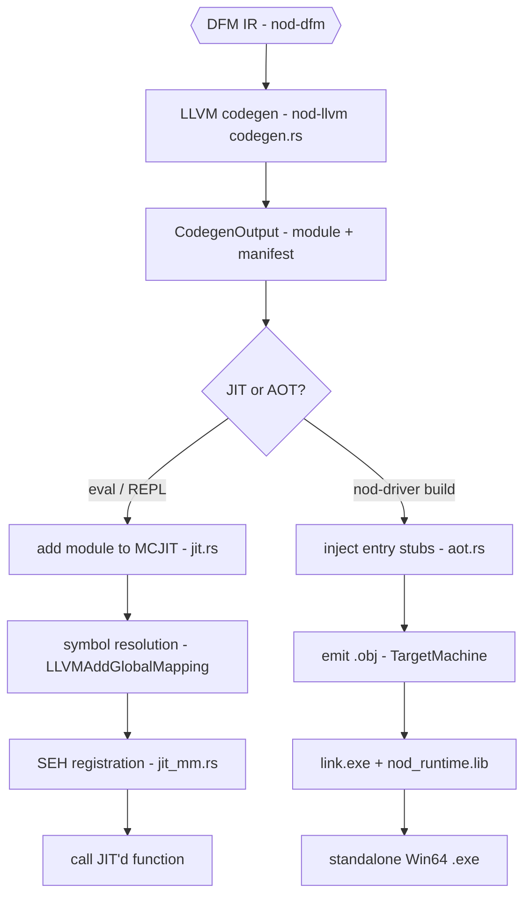
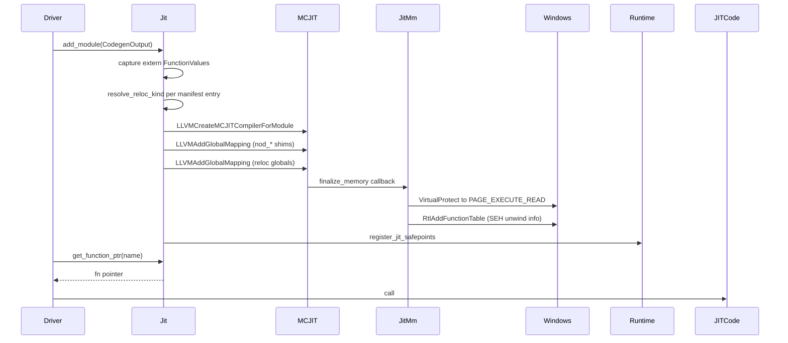
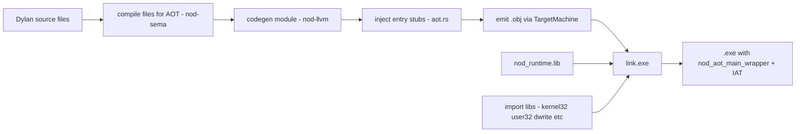
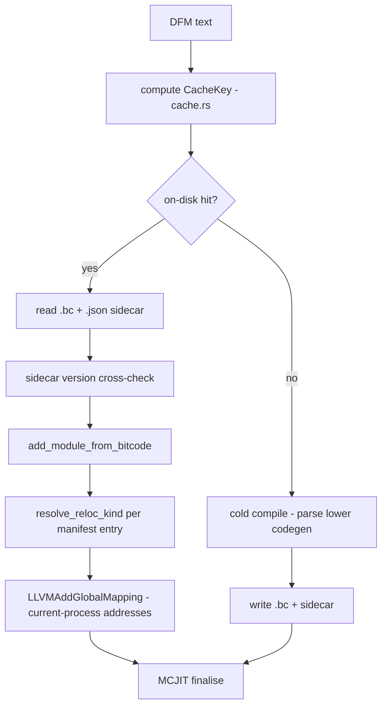

# JIT & AOT — Running and Shipping Code

LLVM IR produced by the codegen stage has two destinations: the in-image
**MCJIT** engine (for `eval` and the REPL) and the **AOT pipeline**
(object-file emission + `link.exe` → a standalone Win64 `.exe`). Both
paths share the same codegen output and diverge only after `CodegenOutput`
is handed off.

> Crates: `src/nod-llvm` · `src/nod-driver`  ·  JIT is the primary path; AOT runs in debug mode

> **Terminology note:** the in-image JIT is LLVM's legacy **MCJIT**
> (`LLVMCreateMCJITCompilerForModule`, `jit.rs:740`) — *not* ORC, a different LLVM
> JIT API. A future migration to ORC v2 LLJIT is possible (it would expose
> `LLVMOrcLLJITAddObjectFile` for on-disk object caching), but has not happened.

## Role in the pipeline

The object-cache layer (`cache.rs`) intercepts the JIT path on a warm hit:
it supplies LLVM bitcode from disk so the parse → lower → codegen chain is
skipped entirely; MCJIT finalises the loaded module identically to a cold
compile.

## Key types

| Type | Where | Purpose |
|------|-------|---------|
| `Jit<'ctx>` | `src/nod-llvm/src/jit.rs:143` | Holds a Vec of MCJIT `LLVMExecutionEngineRef`s alive for the process lifetime |
| `JitError` | `src/nod-llvm/src/jit.rs:114` | Verify, Create, NoFunction error variants |
| `JitMm` | `src/nod-llvm/src/jit_mm.rs:153` | Per-module custom memory manager; owns one contiguous 4 MiB `VirtualAlloc` reservation per JIT'd module |
| `AotError` | `src/nod-llvm/src/aot.rs:202` | MissingMain, Llvm, Conflict, Jit error variants |
| `AotShape` | `src/nod-llvm/src/aot.rs:362` | `Executable` (rename + inject `i32 @main`) vs `StaticLibrary` (keep names, no `main`) |
| `AotRegistrations` | `src/nod-llvm/src/aot.rs:57` | Methods, blocks, functions, user classes, variables to replay at startup |
| `ModuleManifest` | `src/nod-llvm/src/symbols.rs:176` | Sidecar table of `RelocEntry` rows; describes every named external global and how to resolve it |
| `RelocKind` | `src/nod-llvm/src/symbols.rs:124` | Enum: `StubEntry`, `CacheSlot`, `Generic`, `ClassMetadata`, `ImmTrue/False/Nil`, `StringLiteral`, `SymbolLiteral` |
| `CacheKey` | `src/nod-llvm/src/cache.rs:107` | 256-bit key: four SipHash 1-3 digests over DFM text + nod version + ABI version + LLVM major + triple + opt level |
| `SidecarMeta` | `src/nod-llvm/src/cache.rs:176` | JSON sidecar stored next to each `.bc` file: versions, timestamps, size |

## How it works

### JIT path

**Building the engine.** `Jit::new` (`src/nod-llvm/src/jit.rs:149`) calls
`init_native_target_once` which links MCJIT (`LLVMLinkInMCJIT`) and
initialises the native target exactly once per process. The `Jit` struct
holds a `Vec<LLVMExecutionEngineRef>` whose entries are kept alive for the
process lifetime, because JIT'd machine code must remain executable and
SEH-registered as long as any pointer into it could be on a call stack.

**Adding a module — cold path.** `Jit::add_module`
(`src/nod-llvm/src/jit.rs:156`) receives a `CodegenOutput` from the codegen
stage. Before calling `LLVMCreateMCJITCompilerForModule`, the method:

1. Captures `FunctionValue` handles for every known runtime extern declared
   in the module (`nod_format_out`, `nod_dispatch`, `nod_make`, `nod_signal`,
   all FIP/collection/closure/Win32-FFI shims, etc.).
2. Builds a `reloc_bindings` vector from the `ModuleManifest`: for each
   `RelocEntry`, resolves the `RelocKind` to the current-process address via
   `resolve_reloc_kind` (`src/nod-llvm/src/jit.rs:1229`), and pairs it
   with the module's `GlobalValue` for that symbol.

After `LLVMCreateMCJITCompilerForModule` takes ownership of the module,
LLVM's inkwell wrapper is dropped via `std::mem::forget` so LLVM owns the
pointer exclusively (`src/nod-llvm/src/jit.rs:763`). The engine is created
at optimisation level 2 (`opts.OptLevel = 2`, `src/nod-llvm/src/jit.rs:733`).

**Symbol resolution.** Every runtime shim is bound via
`LLVMAddGlobalMapping(engine, f.as_value_ref(), addr)`. Named reloc globals
are bound the same way from `reloc_bindings`. Cross-module method-body
externs (symbols whose names match a registered method in the dispatch table
but whose definitions live in a different JIT engine, such as stdlib
methods) are resolved via `nod_runtime::find_method_body_ptr` and also
bound through `LLVMAddGlobalMapping` (`src/nod-llvm/src/jit.rs:926`).

**Win64 SEH registration.** The custom memory manager `JitMm`
(`src/nod-llvm/src/jit_mm.rs:153`) is installed via `opts.MCJMM`
(`src/nod-llvm/src/jit.rs:734`) before engine creation. `JitMm` allocates
all sections from a single contiguous 4 MiB `VirtualAlloc` reservation
(`MODULE_RESERVE`, `src/nod-llvm/src/jit_mm.rs:139`) so `.pdata` entries —
which are 32-bit RVAs relative to a `BaseAddress` — can always reach `.text`
and `.xdata`. On `finalize_memory` (`src/nod-llvm/src/jit_mm.rs:285`) the
manager: (1) flips every code section from `PAGE_READWRITE` to
`PAGE_EXECUTE_READ` via `VirtualProtect`; (2) sorts `.pdata` entries by
`BeginAddress` (the Windows unwinder binary-searches, and an unsorted table
corrupts `RSP`); (3) strips trailing zero entries; (4) calls
`RtlAddFunctionTable` for each `.pdata` section so the OS SEH unwinder can
walk JIT'd frames. Without this registration, a Rust `panic!` raised from
inside a runtime shim called from JIT'd Dylan code would find no unwind info
and abort the process.

**Safepoints.** If the `CodegenOutput` carries `safepoint_installs`,
`add_module` registers them with the runtime via
`nod_runtime::register_jit_safepoints` (`src/nod-llvm/src/jit.rs:958`) so
the GC's precise-root scanner knows which frame slots hold live GC roots at
each safepoint site.

**Calling JIT'd code.** `Jit::get_function_ptr`
(`src/nod-llvm/src/jit.rs:1145`) walks the engine list and calls
`LLVMGetFunctionAddress`; the caller transmutes the result to the correct
function type.

**Warm path — bitcode replay.** `Jit::add_module_from_bitcode`
(`src/nod-llvm/src/jit.rs:1004`) parses a `.bc` file from disk (produced by
a prior cold compile via the cache), re-runs `resolve_reloc_kind` against
the current process's runtime state for every manifest entry, then installs
the module in a fresh MCJIT engine with identical `LLVMAddGlobalMapping`
calls. From the caller's perspective the result is the same as `add_module`.

**The stdlib JIT engine.** The stdlib is pre-compiled into a long-lived JIT
engine on first eval (`eval_expr_to_string` in `nod-sema`). Subsequent
evals add user modules to a separate engine; cross-module method-body externs
in the user module are resolved against the stdlib engine via
`find_method_body_ptr`.

### AOT path

**Entry-stub injection.** The `emit_aot_entry_stubs_full_with_mode`
function (`src/nod-llvm/src/aot.rs:376`) post-processes the codegen'd LLVM
module in place:

- **Executable shape**: looks up the user's entry function by name (default
  `"main"`), renames it to `nod_user_main` (the symbol declared as
  `extern "C-unwind"` in `nod-runtime`), and injects a fresh `i32 @main()`
  that calls `@nod_aot_main_wrapper` from `nod_runtime.lib`.
- **StaticLibrary shape** (`--library` flag, `src/nod-llvm/src/aot.rs:362`):
  leaves all source-language symbol names intact and omits `i32 @main()`,
  producing an object that can be statically linked into a host binary (e.g.
  the Dylan front-end shim linked into `nod-driver`) without colliding on
  `main`. The resolver `nod_aot_resolve_relocs` is emitted with external
  linkage so the host can call it once at startup.

The injected `nod_aot_resolve_relocs` function (`src/nod-llvm/src/aot.rs:776`)
is the AOT counterpart of the JIT's `LLVMAddGlobalMapping` loop. It emits
LLVM IR calls to `nod_aot_set_*` helpers for each manifest entry (immediates,
class metadata, string/symbol literals, cache slots, generic functions) and
stores Win32 dllimport function addresses into the static `ApiStubEntry`
globals. It also calls `nod_runtime_init` first so the runtime's lazy
singletons are populated before any slot is resolved.

**Registration replay.** The `AotRegistrations` payload
(`src/nod-llvm/src/aot.rs:57`) carries the full list of methods, blocks,
functions, user classes, and variables from the merged `LoweredModule`. The
resolver emits one `nod_aot_register_method` / `nod_aot_register_user_class`
/ `nod_aot_register_variable` call per entry so the dispatch tables are
populated before `nod_user_main` runs.

**Object-file emission.** `emit_object_file` (`src/nod-llvm/src/aot.rs:1924`)
creates a `TargetMachine` for the host triple using
`TargetMachine::get_default_triple` and `get_host_cpu_name/features`, sets
`RelocMode::PIC` and `CodeModel::Default`, retags the module's data layout
and triple to match, then calls `machine.write_to_file(module, FileType::Object, path)`.
The caller (`nod-driver build`) passes `OptimizationLevel::Default` (LLVM
`-O2`).

**Linking.** `run_build_full` in `src/nod-driver/src/main.rs:524` orchestrates
the full build:

1. `compile_files_for_aot` — parse, expand, lower, and merge all input files
   into one `LoweredModule`.
2. `codegen_module_for_surface` — produce `CodegenOutput` (LLVM module +
   manifest + safepoint installs).
3. `emit_aot_object_full_with_mode` — inject entry stubs and emit `.obj`.
4. Locate `nod_runtime.lib` (searched from `current_exe()`'s directory,
   overridable via `NOD_RUNTIME_LIB`).
5. Find `link.exe` via `cc::windows_registry::find` and invoke it with:
   - The user `.obj` (defines `nod_user_main` + `i32 @main`)
   - `nod_runtime.lib` (defines `nod_aot_main_wrapper` + the full runtime)
   - Import libraries for every DLL referenced by `RelocKind::StubEntry`
     entries in the manifest
   - System libs (`kernel32.lib`, `msvcrt.lib`, `d3d11.lib`, `dwrite.lib`,
     `ole32.lib`, etc.)
   - `/SUBSYSTEM:CONSOLE /ENTRY:mainCRTStartup /MACHINE:X64`
   - `/MAP` to emit a symbol map for crash symbolication

Win32 symbols reach the EXE through the IAT: each `RelocKind::StubEntry`
becomes a `dllimport` extern declaration in the module and a static
`ApiStubEntry` global whose `fn_ptr` field the resolver populates at startup
after the Windows loader has already filled the IAT (`src/nod-llvm/src/aot.rs:551`).

## The object cache and bitcode replay

The cache (`src/nod-llvm/src/cache.rs`) operates at two levels:

**In-process cache.** A process-global `Mutex<HashMap<CacheKey, JitEntry>>`
skips the entire parse → lower → codegen → MCJIT chain on a hit. This delivers
the headline IDE-shell re-eval speedup (an order-of-magnitude faster than a
cold compile, `src/nod-llvm/src/cache.rs:44`).

**On-disk bitcode.** Every cold compile writes `<hex_key>.bc` and a sidecar
`<hex_key>.json` to the cache directory. The cache key is a 256-bit value
(`CacheKey`, `src/nod-llvm/src/cache.rs:107`) keyed on DFM text plus `nod`
crate version, `NOD_RUNTIME_ABI_VERSION` (currently `2`,
`src/nod-llvm/src/cache.rs:78`), LLVM major version (22,
`src/nod-llvm/src/cache.rs:83`), target triple, and opt level. The hash is
over DFM IR, not LLVM IR, because LLVM IR has known non-determinism (process-local
pointer values); DFM IR is deterministic for identical source.

The cache directory defaults to `$NOD_JIT_CACHE_DIR`, then
`$CARGO_TARGET_DIR/nod-jit-cache/`, then a `target/nod-jit-cache/` found by
walking up from `cwd`, then `%LOCALAPPDATA%/NewOpenDylan/jit-cache/`
(`src/nod-llvm/src/cache.rs:262`). LRU cap defaults to 500 MB
(`src/nod-llvm/src/cache.rs:298`).

**Cross-process replay.** Runtime addresses (class metadata pointers, literal
pool singletons, stub-table entry pointers, inline-cache slot addresses,
generic-function addresses) are not baked as `i64` constants into LLVM IR —
that would be usable in-process but stale across processes. Instead every such
site is a named external global (`nod_imm_true__<key>`,
`nod_cache_slot__<key>__<id>`, `nod_generic__<key>__<name>`, etc.) described
by a `RelocKind` in the manifest (`src/nod-llvm/src/symbols.rs:124`).
`add_module_from_bitcode` calls `resolve_reloc_kind` to recompute each
address from the **current** process's runtime state and binds it via
`LLVMAddGlobalMapping` before MCJIT finalises — so replayed modules are
semantically identical to cold-compiled ones.

## Invariants & gotchas

- **LLVM module ownership transfer.** After
  `LLVMCreateMCJITCompilerForModule`, LLVM owns the module pointer; the
  inkwell wrapper is dropped via `std::mem::forget`
  (`src/nod-llvm/src/jit.rs:763`). All `FunctionValue` / `GlobalValue`
  handles must be captured BEFORE this call.
- **`.pdata` must be sorted.** The Windows SEH unwinder binary-searches the
  `RUNTIME_FUNCTION` table. Unsorted entries cause the unwinder to apply the
  wrong `UNWIND_INFO`, corrupt `RSP`, and trip the `/GS` stack canary
  (`STATUS_STACK_BUFFER_OVERRUN`, 0xC0000409). `JitMm` sorts and strips
  zero entries before calling `RtlAddFunctionTable`
  (`src/nod-llvm/src/jit_mm.rs:329`).
- **4 MiB reservation per module.** All sections for one JIT'd module share
  a single 4 MiB `VirtualAlloc` reservation so `.pdata` RVAs (32-bit, base-
  relative) can always reach `.text` (`src/nod-llvm/src/jit_mm.rs:139`).
- **Engines are leaked.** JIT engines are never freed — machine code pointed
  to by live call stacks must remain valid. Module retirement (paired
  `RtlDeleteFunctionTable` + `VirtualFree`) is not yet implemented.
- **RelocKind resolves to slot addresses, not values.** `ImmTrue`,
  `ClassMetadata`, `CacheSlot`, `Generic`, and `StubEntry` reloc kinds
  resolve to the address of a stable runtime slot, not the bits in that slot.
  The IR loads through the named global; `LLVMAddGlobalMapping` binds the
  symbol to the slot's address (`src/nod-llvm/src/jit.rs:1245`).
- **Multi-file AOT merges ASTs, not lowered modules.** `compile_files_for_aot`
  parses each file then merges ASTs into one module before lowering once.
  Stitching `LoweredModule`s post-lowering would silently drop fields on any
  future struct addition and invalidate per-module indices.
- **`--library` mode keeps source names.** `AotShape::StaticLibrary` skips
  the `main` → `nod_user_main` rename and the synthetic `i32 @main()`
  injection. It demotes any orphan `main` to internal linkage to avoid
  colliding with the host's CRT entry (`src/nod-llvm/src/aot.rs:436`).
- **Release-mode AOT hits LNK2005 `nod_user_main`.** In a release build
  Cargo's default CGU merging can colocate `aot_user_main_stub.rs` and
  `aot.rs` into one object file. When the user's `.obj` also defines
  `nod_user_main`, the linker sees two strong definitions and errors.
  `nod-runtime` pins `codegen-units = 1` in the workspace profile to keep
  each `.rs` file in its own `.obj`, making the archive-member extraction
  rule work as designed — but the pin does not always survive a release
  profile override. **Debug-mode AOT works correctly; release-mode AOT is
  a known open issue.**

## Where in the code

| File | Lines | Responsibility |
|------|-------|----------------|
| `src/nod-llvm/src/jit.rs` | ~1502 | `Jit` struct, `add_module`, `add_module_from_bitcode`, symbol resolution, `get_function_ptr` |
| `src/nod-llvm/src/jit_mm.rs` | ~469 | `JitMm` custom memory manager, `VirtualAlloc`/`VirtualProtect`, `RtlAddFunctionTable` |
| `src/nod-llvm/src/aot.rs` | ~2231 | Entry-stub injection, `AotShape`, `AotRegistrations`, `emit_object_file`, `emit_resolve_relocs_function`, stub-entry globals |
| `src/nod-llvm/src/cache.rs` | ~718 | `CacheKey`, `SidecarMeta`, `write_cache_entry`, `read_cache_entry`, LRU, cache-dir resolution |
| `src/nod-llvm/src/symbols.rs` | ~180 | `RelocKind`, `RelocEntry`, `ModuleManifest`, per-module symbol naming convention |
| `src/nod-driver/src/main.rs` | ~1500 | `run_build_full`, `locate_runtime_staticlib`, `collect_user_dlls`, `link.exe` invocation |
| `src/nod-runtime/src/aot_user_main_stub.rs` | ~68 | Default `nod_user_main` stub; archive-extraction trick |

## See also

- [LLVM codegen](codegen.md) — produces the `CodegenOutput` this page consumes
- [Runtime & object model](runtime.md) — `nod_runtime.lib`, dispatch shims, `nod_aot_main_wrapper`
- [Driver](driver.md) — the CLI, all dump subcommands, the REPL
- [Self-hosting](self-hosting.md) — how `--library` mode is used to AOT-compile Dylan-hosted front-end phases into `nod-driver`

---
[Compiler overview](overview.md) · [Codegen](codegen.md) · [Runtime](runtime.md) · [GC](gc.md)
