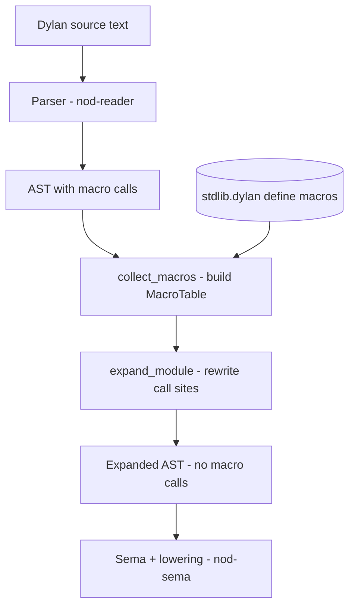
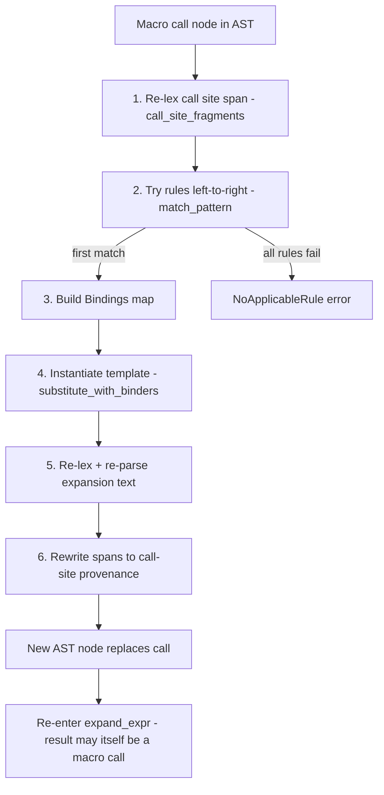
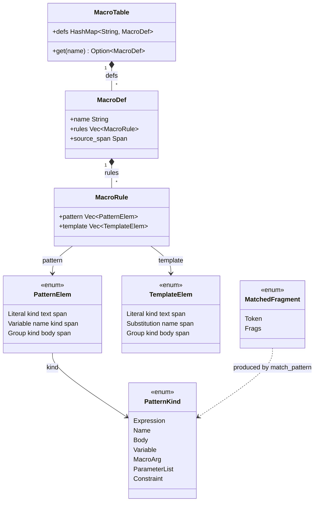

# Macro Expander

The macro expander turns `define macro` definitions into expanded AST. It is the
home for new control-flow surface in this project: forms like `unless`, `when`,
`cond`, `for-each`, and `with-cleanup` live in `stdlib.dylan` as `define macro`
rules and expand through this engine rather than as hardcoded variants in the
parser's AST. It is part of the Dylan front-end (`compiler/dylan-macro.dylan`).

> Part of the Dylan front-end. The `src/nod-macro` crate is the back-end-side
> reference implementation cited throughout this page.

## Role in the pipeline

The expander sits between the parser and sema, receiving a fully-parsed `Module`
and returning that same `Module` with every recognised macro call rewritten to
ordinary AST:

The expander runs entirely before sema: it never consults the namespace graph or
type information. Sema (and the lowering pass it drives) sees only the
post-expansion tree. See [Sema](sema.md) for what happens next and
[Reader](reader.md) for the parser output the expander receives.

Dylan macros are **hygienic pattern-rule macros**. Bindings introduced by the
macro are renamed so they cannot capture names at the use site; references in the
macro's defining scope are preserved. Every expanded form carries a span that
links back to the macro use site, so diagnostics point at user-written source.

## Key types

| Type | Where | Purpose |
|------|-------|---------|
| `MacroDef` | `lib.rs:90` | One parsed `define macro`: a name, a source span, and an ordered list of rules |
| `MacroRule` | `lib.rs:97` | A single rule: a `Vec<PatternElem>` pattern and a `Vec<TemplateElem>` template |
| `PatternElem` | `lib.rs:103` | A literal token, a pattern variable (`?x:kind`), or a grouped sub-pattern |
| `PatternKind` | `lib.rs:113` | The constraint on a pattern variable: `Expression`, `Name`, `Body`, `Variable`, `MacroArg`, `ParameterList`, `Constraint` |
| `TemplateElem` | `lib.rs:146` | A literal token, a substitution site (`?x`), or a grouped sub-template |
| `MatchedFragment` | `lib.rs:157` | What a pattern variable binds to: a single `Token` (for `?x:name`) or a `Vec<Fragment>` (for all other kinds) |
| `Bindings` | `lib.rs:167` | `HashMap<String, MatchedFragment>` — the binding environment built by `match_pattern` |
| `MacroTable` | `lib.rs:171` | Registry of all collected `MacroDef` entries, keyed by name |
| `SubstitutionOutput` | `lib.rs:961` | The text produced by template instantiation, plus a `Vec<TokenOrigin>` for span rewriting |
| `MacroError` | `lib.rs:182` | Variants: `MalformedDefinition`, `PatternMismatch`, `NoApplicableRule`, `ExpansionDepthExceeded`, `ReparseFailed` |

## How it works

### Phase A: parse `define macro` into a `MacroDef`

`parse_macro_def` (`lib.rs:253`) reads a definition's raw fragment list. The
grammar is one or more rules separated by `;`, each of the form
`{ pattern } => { template }`. Pattern variables are written `?name` or
`?name:kind` (e.g. `?cond:expression`, `?body:body`). The lexer collapses
`name:` into a single `KeywordColon` token; `parse_pattern_var_head`
(`lib.rs:382`) handles both the split `? name : kind` and the glued
`? name: kind` forms.

The full set of pattern-kind keywords is resolved in `parse_kind_word`
(`lib.rs:440`): `expression`, `name`, `body`, `variable`, `macro-arg`,
`parameter-list`, `constraint`. Names outside this set that are recognised as
future taxonomy entries (`case-body`, `type`, `case-expression`, `definition`)
are aliased to `Expression` for now; anything else is a hard error.

### Phase B: collect into a `MacroTable`

`collect_macros` (`lib.rs:517`) walks `module.items`, calls `parse_macro_def`
on every `Item::DefineMacro`, and inserts the result into a `MacroTable`. Errors
are collected and returned as a batch.

### Phase C through F: expansion

`expand_module` (`lib.rs:1292`) is the main entry point. It first drops all
`Item::DefineMacro` entries from the module (they are inert after collection),
then walks every surviving item, calling `expand_item` → `expand_stmt` →
`expand_expr` bottom-up. The bottom-up order ensures inner macro calls are
expanded before the outer call is attempted; recursive macros are bounded by a
depth limit (`DEFAULT_DEPTH_LIMIT = 64`, `lib.rs:241`).

Each expansion step runs through `expand_one` (`lib.rs:1487`), which performs six
sub-steps:

**Step 1 — materialise fragments.** The expander does not pattern-match AST
structure directly. Instead, `call_site_fragments` (`lib.rs:1615`) re-lexes the
source file and filters to tokens within the call node's span, then calls
`build_fragments` to nest them into a `Vec<Fragment>`. This lets the pattern
language operate on a uniform token-group representation regardless of whether
the call site was parsed as `Expr::MacroCall` (body-shaped form) or `Expr::Call`
(call-shaped form).

**Step 2–3 — pattern matching.** `match_pattern` (`lib.rs:542`) walks the
pattern and the call's fragment list in parallel, left to right, without
backtracking within a rule. Each `PatternElem::Variable` consumes fragments
according to its kind:

- `Expression`, `MacroArg`, `Constraint` — consume one fragment, bind as `Frags`
- `Name` — require an `Ident` token, bind as `Token`
- `Body` — greedy: consume everything up to the next pattern literal (depth-aware
  for `end`-terminated forms, `lib.rs:667`)
- `Variable` — consume a let-binder shaped sequence (`Ident` or `Ident :: <type>`)
- `ParameterList` — require a parenthesised group

Multi-rule definitions try rules left to right; first match wins (`lib.rs:1502`).

**Step 4 — template instantiation.** `substitute_with_binders` (`lib.rs:932`)
walks the template, emitting literal tokens verbatim and replacing
`TemplateElem::Substitution` nodes with their bound fragment text.
Template-introduced identifiers in *binding position* (`let X`, method parameter
names) are hygiene-renamed to `name__nod_hyg_{nonce}` (`lib.rs:1004`);
identifiers in reference position are emitted unchanged so they resolve against
the call site's scope. The nonce is per-expansion and monotonically incremented
by `ExpansionCtx::fresh_nonce` (`lib.rs:1279`).

**Step 5–6 — re-parse and span rewriting.** The substituted text is re-lexed and
re-parsed as an expression (`lib.rs:1555`). Because this produces spans pointing
into a scratch `SourceMap`, `rewrite_spans_expr` (`lib.rs:1653`) walks the parsed
tree and replaces those scratch spans with the original call-site or template
spans recorded in `SubstitutionOutput::origins`. The top-level node's span is
then anchored to the call site (`set_top_span`, `lib.rs:1574`) so a further
recursive expansion re-lexes a coherent span.

### Recognising macro call sites

`macro_call_name` (`lib.rs:1473`) identifies two AST shapes as potential call
sites:

- `Expr::MacroCall { name, … }` — the parser emits this when a name in its
  known-macro set appears in body position (`name(…) … end`).
- `Expr::Call { callee: Ident(name), … }` — the expander checks the callee name
  against the `MacroTable`; this covers call-shaped sites and statement-level
  macro calls.

### The data structures at a glance

## Invariants and gotchas

- **Re-lex / re-parse design.** The expander materialises call-site fragments by
  re-lexing the source span, not by walking AST children. The pattern language is
  therefore fragment-level, not AST-level: an expression that spans multiple AST
  nodes is still one flat token sequence to the matcher.
- **No within-rule backtracking.** `match_pattern` is greedy and linear
  (`lib.rs:541`). Rules must be non-overlapping in practice; write the
  most-specific rule first in a multi-rule definition.
- **Depth limit.** Recursive and mutually recursive macros are bounded by
  `DEFAULT_DEPTH_LIMIT = 64` (`lib.rs:241`). A macro without a base case produces
  `MacroError::ExpansionDepthExceeded`.
- **Module-scoped expansion.** `ExpansionCtx` (`lib.rs:1267`) shares a single
  `SourceMap` across the call site and the macro definition — expansion runs over
  one merged module. Multi-file compilation parses every file and concatenates
  their ASTs into ONE module *before* expansion, and the stdlib merges into every
  program, so `stdlib.dylan`'s macros (`unless`, `when`, `cond`, …) expand in
  user code as a matter of course. Expansion is module-scoped rather than
  whole-program across separate `SourceMap`s.
- **`*` repetition is not yet implemented.** The pattern language has no
  repetition operator. As a direct consequence, `cond` in `stdlib.dylan` ships
  with a fixed arity cap: the definition contains four explicit rules covering
  1–4 test/body pairs plus an `otherwise` default. A `cond` with five or more
  arms requires nesting a second `cond` inside the `otherwise` clause. The same
  cap applies to any multi-arm form until repetition lands. Adding repetition is
  an engine extension, not an AST change.
- **Hygiene scope.** Only identifiers in *binding position* (after `let`, in
  method parameter lists) are renamed (`lib.rs:1000`). Reference-position
  identifiers are emitted verbatim. Dylan keywords and core type names in
  `is_template_no_rename` (`lib.rs:848`) are never renamed even in binding
  position.
- **`DefineMacro` items are dropped post-expansion.** After `collect_macros`
  runs, `expand_module` removes all `Item::DefineMacro` entries from the module
  (`lib.rs:1307`). Sema never sees them.
- **Re-parse can fail.** If a rule's template produces text that is not valid
  Dylan (e.g., an unbound `?x` in the template, or a malformed splice),
  `expand_one` returns `MacroError::ReparseFailed`. The driver reports these with
  the original call-site span.

## The macro/sema boundary: kernel forms vs Dylan macros

The project direction is to push language surface out of the hardcoded AST and
into Dylan-side `define macro` definitions in `stdlib.dylan`. The frozen kernel
of hardcoded forms is the floor; everything above it is a macro.

### Default: new surface forms are macros

Any new control-flow keyword, iteration form, binding-shape, or sugar lands as a
`define macro` in `stdlib/*.dylan` (or a sibling
`.dylan` file). New `Expr::*` or `Statement::*` variants in `nod-reader::ast` are
the exception, not the default.

### The frozen kernel

These forms stay hardcoded in the AST, each because it cannot be expressed as a
macro over the others:

| Variant | Why it's hardcoded |
|---|---|
| `Expr::If` | Branching primitive; every other branching form lowers to it |
| `Expr::Begin` | Sequencing; the basic compound expression, needed before any macro can expand |
| `Expr::Let` | Binding; introduces names into lexical scope, which the hygiene machinery itself depends on |
| `Expr::Method` / `LocalMethod` | Function-literal primitive; closure conversion operates on this shape directly |
| `Expr::Call` / `BinOp` / `UnOp` / `Paren` | Call shape and infix operators |
| `Expr::Ident` / `Integer` / `String` / `Char` / `Bool` / `Symbol` / `Float` | Atoms |
| `Expr::Assign` (via `BinOp::Assign`) | Mutation primitive |
| Item-level definitional forms (`DefineFunction` / `DefineMethod` / `DefineGeneric` / `DefineClass` / `DefineConstant` / `DefineVariable` / `DefineMacro`) | They create the top-level bindings the loader registers; they *are* the thing other forms would expand to |
| `Statement::Block` (with `cleanup` / `exception` arms) | Coupled to the `nod_run_block` runtime and the signal/handler mechanism; non-local-exit coordination crosses the macro boundary |

This list is the gate. A new hardcoded variant is justified only when the form
needs a control-flow primitive the lowering cannot synthesise from
`if`/`begin`/`let`/`block`, or its runtime requires Rust-side cooperation that
cannot be expressed as a stdlib function call (the signal/NLX boundary that
`block`/`cleanup` straddles). "It's easier to add to the parser" is not a
justification.

### When the engine can't express it, extend the engine

If a macro cannot be expressed in the current pattern language — because it needs
auxiliary `rule` clauses, a new pattern-variable kind, or cross-file definition
lookup — the answer is a macro-engine extension, not a new AST variant. The known
deferred extensions are:

- Auxiliary `rule` clauses for multi-clause forms (e.g., `for`'s many clause
  shapes)
- Cleanup-aware expansion, needed by the `with-*` family
- Cross-file macro use (the parser's known-macros set is currently per-file)
- Definition macros (`define table`, `define inline function` — parsed but not
  expanded)

Each unlocks a family of stdlib macros: pay the engine cost once, get many
surface forms.

### Things that look kernel-y but are (or should be) macros

- **`case` / `cond` / `select`** — branching sugar; all lower to nested `if`.
  `cond` is already a stdlib macro; `case` is currently a hardcoded `Expr::Case`
  and is a retirement candidate.
- **`for` / `while` / `until`** — iteration sugar; lower to recursive calls or
  loop/break primitives. Currently hardcoded `Statement::*` variants; retirement
  candidates.
- **`with-*`** — resource-management sugar; expand to `block(...) cleanup ...
  end`. Needs cleanup-aware expansion.
- **`unless` / `when`** — one-armed conditionals. Already stdlib macros.
- **`for-each`, `with-cleanup`** — already stdlib macros.
- **`iterate`, `repeat`, `loop`** — named-recursion and control-flow sugar.
  Macros.

The current stdlib macros are `for-each`, `unless`, `when`, `cond`, and
`with-cleanup`, in `stdlib/*.dylan`. `unless` is a
`define macro` rather than a hardcoded `Expr` variant. The trend to track
is that the `define macro` count grows while the hardcoded control-flow
`Expr`/`Statement` variant count stays flat or shrinks.

When a macro expands into a sealed call, tooling can show both the user-written
source span and the post-expansion form, because the span rewriting preserves
call-site provenance. See [Dispatch and sealing](dispatch-and-sealing.md) for how
sealed calls are resolved.

## Where in the code

| File | Lines | Responsibility |
|------|-------|---------------|
| `src/nod-macro/src/lib.rs` | 1–74 | Crate header: policy and the fragment-vs-AST design note |
| `src/nod-macro/src/lib.rs` | 84–243 | Public types and depth/budget constants |
| `src/nod-macro/src/lib.rs` | 248–534 | Phase A: `parse_macro_def`, `parse_pattern`, `parse_pattern_var_head`, `parse_kind_word`, `parse_template` |
| `src/nod-macro/src/lib.rs` | 536–838 | Phase C: `match_pattern`, `count_trailing_literals`, `token_matches_literal`, thread-local call-site source |
| `src/nod-macro/src/lib.rs` | 840–1261 | Phase D: `substitute`, `substitute_with_binders`, `emit_template`, `collect_template_binders`, hygiene logic |
| `src/nod-macro/src/lib.rs` | 1263–1571 | Phase F: `ExpansionCtx`, `expand_module`, `expand_item`, `expand_stmt`, `expand_expr`, `expand_one` |
| `src/nod-macro/src/lib.rs` | 1573–1846 | Span rewriting: `set_top_span`, `call_site_fragments`, `rewrite_spans_expr`, `walk_expr_spans`, `walk_stmt_spans` |
| `src/nod-macro/src/lib.rs` | 1848–1908 | Phase G: `collect_and_expand` convenience driver; smoke tests |
| `stdlib/*.dylan` | 464–586 | The stdlib macros: `for-each`, `unless`, `when`, `cond`, `with-cleanup` |

## See also

- [Compiler overview](overview.md) — the full pipeline; the expander's place in it
- [Reader: lexer & parser](reader.md) — produces the `Module` the expander receives; seeds the known-macro set
- [Semantic analysis](sema.md) — receives the expanded AST; lowers kernel forms to DFM
- [Dispatch and sealing](dispatch-and-sealing.md) — how the calls macros expand into are resolved
- [Macros (language)](../language/macros.md) — the user-facing `define macro` syntax

---
[Reader](reader.md) · [Macro expander](macro-expander.md) · [Sema](sema.md) · [Architecture](../architecture.md) · [Glossary](../glossary.md)
