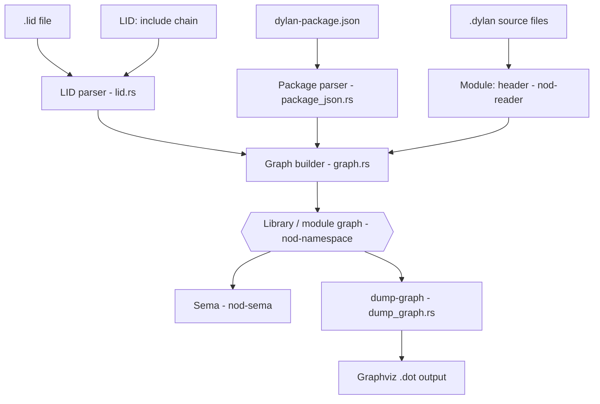
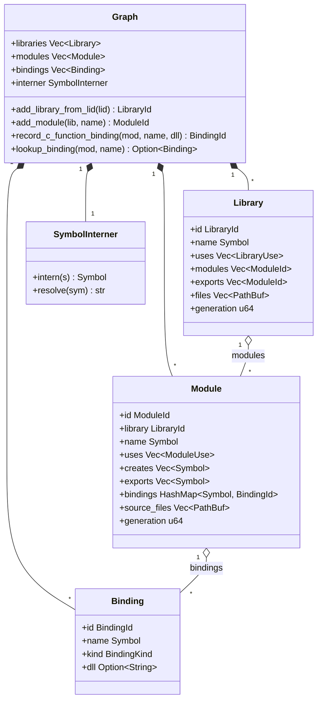
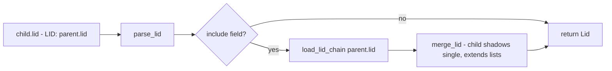

# Namespaces: the library/module graph

Dylan has a **two-level namespace**: every name lives inside a *module*, and
every module belongs to exactly one *library*. The `nod-namespace` crate models
that structure as an in-memory DAG, feeds it to sema so every identifier lookup
has a home, and exposes it to the driver's `dump-graph` command as Graphviz
output.

> Crate: `src/nod-namespace` (Rust).

## Role in the pipeline

The graph is a *side-input* to the front-end, not a sequential stage. It is built
from LID files and source headers before sema begins, then queried by sema for
every name resolution.



The graph is also the foundation for incremental recompilation: every `Library`
and `Module` node carries a `generation: u64` field that is bumped on any
structural change (`graph.rs:140`, `graph.rs:154`), so cache entries keyed on
generation can be invalidated precisely.

## The Dylan two-level model

Dylan's namespace design is more structured than a flat package system:

- A **library** is the *compilation unit* — the boundary of code generation,
  cache invalidation, and sealing. A module belongs to exactly one library; two
  libraries cannot share a module.
- A **module** is a *namespace* inside a library. It owns a set of bindings,
  explicitly controls what it imports from other modules via `use` clauses, and
  explicitly controls what it exports.
- A **binding** names a definition (`define class`, `define generic`,
  `define constant`, `define c-function`, …). Every identifier in a `.dylan`
  source file is resolved against exactly one module — the one named in that
  file's `Module:` header.

Visibility composes in two levels. For an identifier `foo` in a `.dylan` file
with header `Module: m` in library `L`:

| Where is `foo` defined? | What is required? |
|-------------------------|-------------------|
| In module `m` itself | Direct lookup in `m.bindings` |
| In module `m2`, same library `L` | `m` must `use m2`; `m2` must export `foo` (via `export` or `create`) |
| In module `m2` of library `L2` | `L` must `use L2` (and `L2` must export `m2`); then `m` must `use m2` |

`use` clauses support `import:`, `exclude:`, `rename:`, `prefix:`, and
`reexport:` modifiers — all recorded in `ModuleUse` (`graph.rs:121-129`).
Cross-module `use`/`export` resolution is **structurally present in the graph
types** but is not yet fully resolved (`graph.rs:3-4`).

### A worked example: the kernel `dylan` library

```
                  ┌───────────────────────────────────┐
                  │ library: dylan                    │
                  │ source: dylan.lid (91 files)      │
                  │ overlay: dylan-win32.lid          │
                  │ (NO define library form anywhere) │
                  └─────────────────┬─────────────────┘
                                    │
       ┌────────────────────────────┼────────────────────────────┐
       │                            │                            │
   ┌───▼────────┐          ┌────────▼───────┐            ┌───────▼──────┐
   │ module:    │          │ module:        │            │ module:      │
   │ internal   │          │ dylan          │            │ dylan-user   │
   │ (file hdr) │          │ (exports the   │            │ (boot ns)    │
   │ implements │          │  DRM bindings) │            │              │
   │ everything │          └────────────────┘            └──────────────┘
   └────────────┘
```

The kernel library's module graph is *only* visible if it is reconstructed from
per-file `Module:` headers and from `define module` forms scattered through
`*.dylan` files. There is no top-level manifest of it. The kernel `dylan` library
has **no `define library dylan` form anywhere** — it is the library every other
library implicitly `use`s, and is supplied by the implementation. The graph
builder therefore bootstraps the `dylan` library node from the LID alone (see
"Special case: the kernel" below).

## Key types

| Type | File | Purpose |
|------|------|---------|
| `Graph` | `graph.rs:158` | Root container: flat `Vec<Library>` + `Vec<Module>` + `Vec<Binding>` + `SymbolInterner` |
| `Library` | `graph.rs:131` | One compilation unit — name, modules, exports, source files, `generation` |
| `Module` | `graph.rs:145` | One namespace — bindings, `uses`, `creates`, `exports`, `source_files`, `generation` |
| `Binding` | `graph.rs:34` | One named definition — today populated only by `define c-function` |
| `BindingKind` | `graph.rs:51` | `CFunction` today; `Function`, `Class`, … not yet wired |
| `Symbol` | `graph.rs:21` | Interned `u32` handle for any identifier string |
| `SymbolInterner` | `graph.rs:61` | `Vec<String>` + reverse `HashMap` — `intern` / `resolve` pair |
| `LibraryId` / `ModuleId` / `BindingId` | `graph.rs:12-18` | Newtype `u32` handles — typed so library and module IDs never alias |
| `LibraryRef` / `ModuleRef` | `graph.rs:87-99` | `Resolved(Id)` or `Unresolved(Symbol)` — graph edges may remain unresolved before full resolution |
| `Lid` | `lid.rs:20` | Parsed LID file — all recognised fields plus `diagnostics: Vec<Diagnostic>` for unknown/invalid lines |
| `Package` | `package_json.rs:13` | Parsed `dylan-package.json` — name, version, `dependencies: Vec<PackageDep>` |



## LID file parsing

A LID (Library Interchange Description) file is a line-oriented `Key: value`
format. The parser (`lid.rs:41`) does a two-pass scan:

1. **Continuation collapse** — any line that starts with whitespace is appended
   to the previous record's value. This is how a `Files:` block spanning many
   continuation lines is parsed (`lid.rs:56-67`).
2. **Field dispatch** — each `(key, value)` pair is routed by `apply_field`
   (`lid.rs:89`). Keys are lowercased before matching, so `Library:` and
   `library:` are equivalent.

### Recognised fields

Every field observed in the upstream tree is accepted without erroring, even
where the value is ignored. What each populates in `Lid`:

| LID key | `Lid` field | Notes |
|---------|------------|-------|
| `Library:` | `library: Option<String>` | Required. Library names share a flat global namespace. |
| `Files:` | `files: Vec<String>` | Whitespace-separated, `.dylan` implied, order is load-bearing. Path segments allowed (forward slashes). |
| `Target-Type:` | `target_type: Option<TargetType>` | `Dll` or `Executable` |
| `Executable:` | `executable` | Output binary name when target is executable |
| `Start-Function:` | `start_function` | AOT entry point |
| `Major-Version:` / `Minor-Version:` | `major_version` / `minor_version` | Recorded; not used for resolution |
| `LID:` | `include: Option<String>` | **Include directive** — triggers `load_lid_chain` |
| `Platforms:` | `platforms: Vec<String>` | Whitespace-separated triples (e.g. `x86-win32`). Parsed and recorded; platform selection is not yet implemented |
| `Base-Address:` | `base_address` | Win32 preferred load address; recorded for AOT |
| `RC-Files:`, `C-Source-Files:`, `C-Libraries:`, `Linker-Options:` | `other` | Recorded; acted on only once AOT/FFI use them |
| `Synopsis:`, `Author:`, `Copyright:`, `License:`, … | `other` | Documentation metadata; recorded for `dump-graph` only |
| Any unknown key | `other: Vec<(String, String)>` | Not an error — a `Diagnostic` warning is emitted |

LID has no inline comment marker — every line is a header field, a continuation,
or blank. `.hdp` files use the same grammar with a different extension; the graph
builder treats `.lid` and `.hdp` interchangeably.

### LID inheritance (`LID:` include chains)

A platform-overlay LID (e.g. `dylan-win32.lid` → `LID: dylan.lid`) uses
`load_lid_chain` (`lid.rs:137`), which recursively loads the parent and merges via
`merge_lid` (`lid.rs:150`):

- Single-valued fields (`library`, `target_type`, `executable`, …): child wins
  (`child.field.or(parent.field)`).
- List-valued fields (`files`, `platforms`, `other`): parent list extended by
  child.

This matches the upstream behaviour of `dylan-win32.lid` adding `Executable:`
while reusing `dylan.lid`'s `Files:`.



## The `dylan-package.json` manifest

`dylan-package.json` is a JSON manifest about *a package* — a directory tree on
disk, a unit of distribution. LID is a manifest about *a Dylan library* — a unit
of compilation. One package contains one or more libraries; each library has its
own LID. The two layers do not overlap, and `dylan-package.json` does **not**
replace LID: `nod-namespace` requires both for a multi-package build.

The parser (`package_json.rs`) accepts extra fields without erroring. Documented
fields:

| Field | Type | Required | Meaning |
|-------|------|----------|---------|
| `name` | string | yes | Package name (a *bundle* of libraries, not a Dylan library) |
| `version` | string | yes | Free-form version; the `deft` package manager treats it as semver |
| `dependencies` | array of `"name@versionspec"` | yes | Other packages needed at compile time (`name@major.minor[.patch]`) |
| `dev-dependencies` | array of strings | no | Build/test-only packages |
| `category`, `contact`, `description` | string | no | Taxonomy / metadata |
| `url`, `license`, `license-url` | string | no | Documentation |

The dependency resolver acts only on packages physically present on disk;
fetching from a registry is not yet implemented.

## Graph construction

`Graph::add_library_from_lid` (`graph.rs:173`) builds a `Library` node from a
parsed `Lid`:

1. Interns the library name via `SymbolInterner`.
2. Allocates a `LibraryId` as the next index into `self.libraries`.
3. Resolves every bare filename in `lid.files` to an absolute path, appending
   `.dylan` if the entry has no extension (`graph.rs:183-191`).
4. Stores the `Library` with empty `uses`, `modules`, and `exports` — these are
   populated in later passes once `define module` / `define library` forms are
   parsed.

`Graph::add_module` (`graph.rs:208`) appends a `Module` to `self.modules` and
wires its `ModuleId` into `library.modules`.

`Graph::record_c_function_binding` (`graph.rs:254`) — the only fully-wired
binding path today — allocates a `BindingId`, normalises the DLL name to
lowercase, and inserts it into `module.bindings`. Later-definition-wins semantics
are noted inline (`graph.rs:269-272`).

### `define module` and `define library`

These are the in-Dylan syntactic forms that declare module and library
structure. They are parsed as ordinary top-level forms by `nod-reader` and
resolved by `nod-namespace`.

```
define module NAME
  use OTHER-MODULE
    [, import: { ID , … } | import: all ]
    [, exclude: { ID , … } ]
    [, rename: { OLD => NEW , … } ]
    [, prefix: "STRING" ]
    [, export: { ID , … } | export: all ] ;
  create ID , ID , … ;
  export ID , ID , … ;
end [module [NAME]] ;
```

- **`use M`** imports all of `M`'s exported bindings; with `import:` it imports
  only the listed names.
- **`exclude:`** removes listed names from what's otherwise imported.
- **`rename:`** introduces an imported binding under a new local name.
- **`prefix: "p_"`** prepends `"p_"` to every imported name.
- **`export:`** within a `use` clause re-exports the imported bindings to this
  module's own importers (`export: all` re-exports everything).
- **`create`** declares names this module *introduces* (so other modules can
  import them by name) without itself defining them — useful for protocol modules
  that only declare a vocabulary.
- **`export`** (top-level) declares which of this module's own definitions are
  visible to importers.

```
define library NAME
  use OTHER-LIBRARY
    [, import: { MODULE-ID , … } ]
    [, export: { MODULE-ID , … } ] ;
  export MODULE-ID , MODULE-ID , … ;
end [library [NAME]] ;
```

- **`use L`** declares this library depends on library `L`; modules in `L`'s
  export set become available for this library's modules to `use`.
- **`export`** at library level lists *modules* (not bindings) this library makes
  available to consumer libraries. A module not in this list is internal even if
  it is `export`-rich at the module level.
- **`export: { … }` inside a `use` clause** re-exports modules, so a consumer can
  `use` them transitively without its own library-level `use`.

### The per-file `Module:` header

Every `.dylan` source file begins with a header block of `Key: value` lines. The
only one with semantic weight is `Module:`:

```
Module:    internal
Author:    Jonathan Bachrach
```

`Module: foo` declares that every `define …` form in the rest of the file
contributes a binding to module `foo`, and every identifier reference in the file
is resolved against module `foo`'s import/export set. `nod-reader` scans the
header block and attaches it to the AST root; `nod-namespace` reads it for each
parsed file when building module → file edges.

### Special case: the kernel

The kernel `dylan` library has no `define library` form, so its construction runs
in two passes:

1. Parse the LID. Build a Library node named `dylan`. Register its 91 source
   files in declared order.
2. Walk those files. For each, read its `Module:` header and any `define module`
   / `define library` forms it contains, and construct the modules.

If after the second pass a file's `Module:` header names a module that no
`define module` form ever declared, that module materialises as an *implicit
module* node with no exports — matching upstream's behaviour of the compiler
synthesising it (e.g. `internal` in the kernel).

## Name resolution across the graph

Resolving a name `foo` in module `m` of library `L`:

1. If `foo` is defined in `m.bindings`, done.
2. Else for each `u: ModuleUse` in `m.uses`: if `foo` (after `rename` reversal
   and `prefix` strip) is in `u.module`'s effective export set, not in
   `u.exclude`, and (if `u.import` is `Listed`) in the imported list — match.
3. If `u.module` lives in a different library `L2`, the lookup additionally
   requires that `L2` exports the module and that `L` `use`s `L2`. This is a
   *check* at use-time, not at lookup-time: the graph builder validates `use`
   clauses against library `use` clauses and rejects illegal references with a
   diagnostic.

Intra-library cross-module lookup is the same algorithm with the library check
trivially satisfied; both paths go through the same `ModuleUse` traversal.

Sema (`nod-sema`) receives the `Graph` as a shared context before resolving any
expression. For each `.dylan` file the driver reads the `Module:` header and uses
`Graph::lookup_binding` (`graph.rs:288`) plus the module's `bindings` map to
answer "which module does this file belong to?" and "is this name exported by any
`use`d module?". Full cross-module `use`/`export` resolution — walking
`ModuleUse.import`, `exclude`, `rename`, `prefix` — is structurally represented
but remains partially stubbed (`graph.rs:3`).

## `dump-graph` — Graphviz output

`nod-driver dump-graph <lid>` calls `dump_graph::dump_graph` (`dump_graph.rs:7`),
which emits a `digraph G` with:

- One Graphviz `cluster_lib_N` per library (box node + per-module ellipse nodes).
- One directed edge per resolved `ModuleUse` (`mod_X -> mod_Y`) — unresolved refs
  are silently skipped.

The output is valid DOT, pipeable to `dot -Tpng` or any Graphviz renderer.

## Generation numbers and incremental recompilation

Every `Library` and every `Module` carries a `generation: u64`, bumped on any
structural change (use-clause edit, export-list edit, create-list edit, addition
or removal of a defined binding). A `LibraryRef::Resolved(id)` cache entry is
valid only as long as the target library's generation has not advanced past the
recorded generation. A cross-library `use` only invalidates a consumer when the
producer's *export shape* changes — adding a new internal module to a producing
library does not bump anything visible to consumers. Per-binding generations are
not part of this layer; the graph cares only about *shape* changes.

## Invariants and gotchas

- **File order is load-bearing.** `Files:` entries are stored and walked in LID
  declaration order. The kernel `dylan` library compiles only in the order its 91
  files are listed; `nod-sema` relies on this. Do not sort or deduplicate
  (`lid.rs:93-97`, `graph.rs:178-191`).
- **All Ids are indices into flat Vecs.** `LibraryId(n)` means
  `self.libraries[n]`. This is fast but means `Graph` must never remove or
  reorder entries; incremental invalidation uses `generation` numbers, not
  removal.
- **SymbolInterner is append-only.** `intern` returns a stable `Symbol` for the
  lifetime of the `Graph`; resolving the same string twice returns the same
  handle (`graph.rs:71-78`).
- **DLL names are lowercased at insertion.** `record_c_function_binding` calls
  `.to_ascii_lowercase()` on the DLL name (`graph.rs:265`). Lookups must not
  re-apply lowercasing.
- **`Binding` table is currently c-function only.** Dylan-to-Dylan bindings still
  live in sema's flat tables and are not yet represented here (`graph.rs:27-33`).
- **`ModuleRef::Unresolved` is a legal graph state.** Until a full resolution
  pass runs, `use` edges may be unresolved. Code that traverses the graph must
  handle both variants of `LibraryRef` and `ModuleRef`.
- **`dylan-package.json` is per-package, not per-library.** One package contains
  many libraries, each with its own LID.
- **The kernel `dylan` library has no `define library` form.** The Library node
  for `dylan` is built from the LID alone; the module structure comes from
  per-file `Module:` headers and scattered `define module` forms. `graph.rs:173`
  handles it via the LID-only construction path.
- **Module names may collide with library names.** Library `dylan` exports module
  `dylan`; library `common-dylan` exports module `common-dylan`. Disambiguation
  is contextual, reflected by the separate `LibraryId` / `ModuleId` newtypes;
  diagnostics qualify the kind when reporting.

## Where in the code

| File | Lines | Responsibility |
|------|-------|----------------|
| `src/nod-namespace/src/graph.rs` | 327 | `Graph`, `Library`, `Module`, `Binding`, `SymbolInterner`, all accessors and the two construction functions |
| `src/nod-namespace/src/lid.rs` | 212 | `Lid`, `TargetType`, `parse_lid_str`, `load_lid_chain`, `merge_lid` |
| `src/nod-namespace/src/package_json.rs` | 128 | `Package`, `PackageDep`, `parse_package_json_str` |
| `src/nod-namespace/src/dump_graph.rs` | 89 | `dump_graph` — Graphviz DOT emitter |
| `src/nod-namespace/src/lib.rs` | 16 | Public re-exports of all four modules |

## See also

- [Compiler overview](overview.md) — where the namespace graph fits in the full
  pipeline
- [Semantic analysis](sema.md) — the phase that consumes the graph for name
  resolution
- [Modules and libraries](../language/modules-and-libraries.md) — the Dylan
  language view of the two-tier namespace
- [Driver](driver.md) — the `dump-graph` subcommand and the build orchestration
  that constructs the graph

---
Next: [Semantic analysis](sema.md) · See also [Compiler overview](overview.md) · [Modules and libraries](../language/modules-and-libraries.md)
