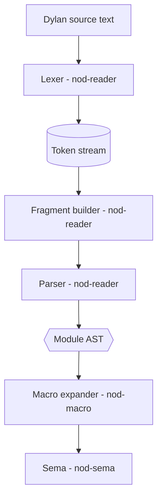
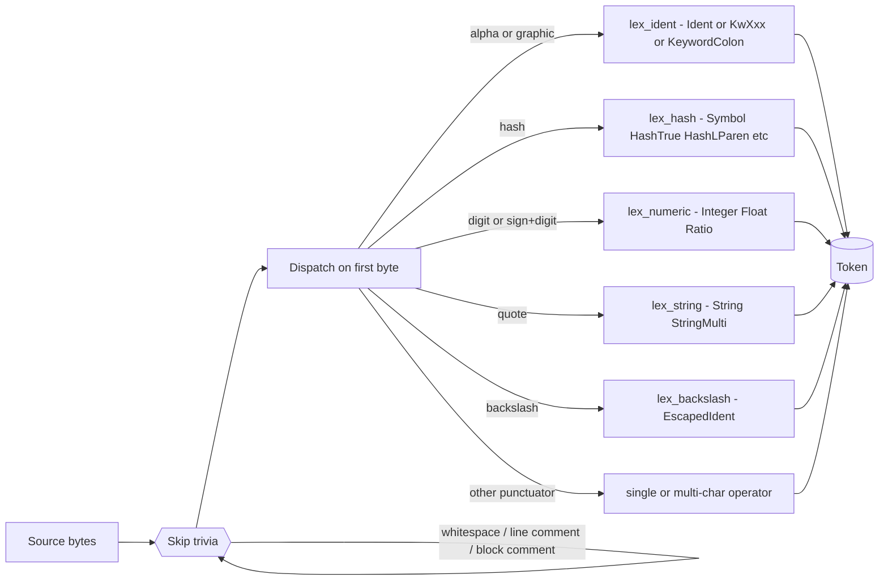
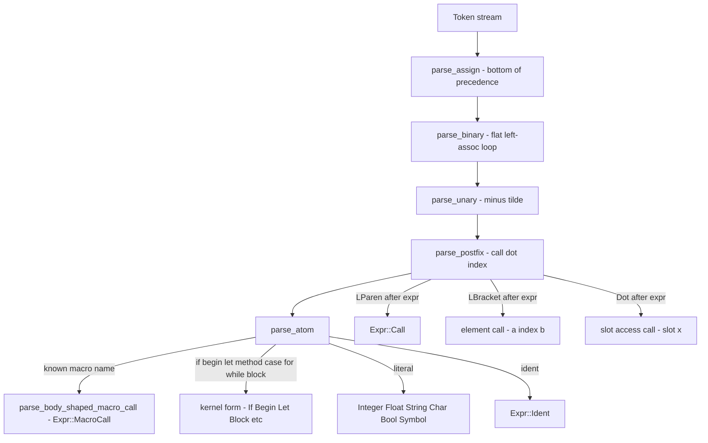
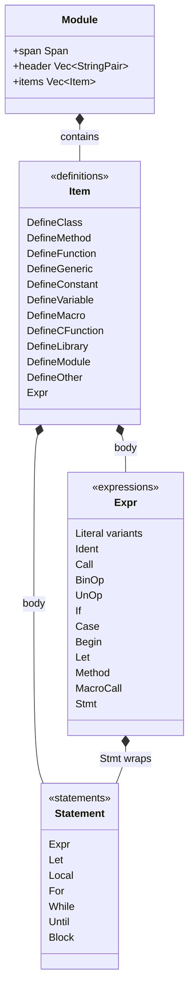

# Reader: Lexer and Parser

The reader turns Dylan source text into an AST. It owns the lexer, the fragment
layer, the expression and top-level parser, and a canonical Dylan pretty-printer
that round-trips through the parser. This is the first phase of the Dylan
front-end (`compiler/dylan-lexer.dylan`, `compiler/dylan-parser.dylan`).

> Part of the Dylan front-end. The `src/nod-reader` crate is the back-end-side
> reference implementation cited throughout this page.

## Role in the pipeline

The reader is the first stage. Its output — a `Module` carrying `Item`s and
`Expr`s — feeds the macro expander and then sema.



`nod-driver` can stop at any boundary: `dump-tokens` stops after the
lexer, `dump-ast` stops after the parser. See [Driver](driver.md).

## Key types

| Type | File | Purpose |
|------|------|---------|
| `Token` | `token.rs:11` | Kind + span; text is derivable from `SourceMap::slice` |
| `TokenKind` | `token.rs:23` | `#[repr(u8)]` enum; 59 variants covering all Dylan lexical classes |
| `Span` | `span.rs:20` | `(file_id, lo, hi)` byte range; 32-bit offsets; line/col computed lazily |
| `FileId` | `span.rs:13` | 32-bit interned source-file identifier |
| `SourceMap` | `span.rs:43` | Owns source text; caches line-start tables for fast `(line, col)` |
| `Fragment` | `fragments.rs:10` | `Token` or nested `Group`; produced by `build_fragments` |
| `GroupKind` | `fragments.rs:21` | `Paren` / `Bracket` / `Brace` / `HashParen` / `HashBracket` / `HashBrace` |
| `Module` | `ast.rs:412` | Top-level AST: header entries + `Vec~Item~` |
| `Item` | `ast.rs:542` | One top-level definition: `DefineClass`, `DefineMethod`, `DefineMacro`, etc. |
| `Expr` | `ast.rs:29` | Expression tree: `Call`, `BinOp`, `If`, `MacroCall`, `Let`, `Method`, … |
| `Statement` | `ast.rs:741` | Statement forms: `Let`, `Local`, `For`, `While`, `Until`, `Block` |
| `Diagnostic` | `parser.rs:34` | A span + message; parser recovers and continues collecting these |

## How it works

### Step 1 — Lexer

`lex(src, file_id)` (`lexer.rs:57`) turns source bytes into a token vector. The
lexer:

1. Calls `skip_preamble` to skip the optional `Module: foo` / `Author:` header
   block that `.dylan` files may carry (`lexer.rs:241`).
2. Loops: skip trivia (`skip_trivia` handles whitespace, `// line comments`,
   and `/* nested block comments */` — `lexer.rs:261`), then call `next_token`.
3. Terminates the vector with exactly one `Eof` token (`lexer.rs:38`).

The lexer is predictive (peek-driven) and maximal-munch: when several tokens
could match, the longest one wins, so `==` never lexes as two `=`, `:=` never
as `:` then `=`, and `...` never as three dots. The lexer never panics: on bad
input it emits `TokenKind::Invalid` spanning the offending bytes and
resynchronises (`token.rs:108`).

Source files are UTF-8. The DRM-permitted character set is `\t \n \f \r`,
ASCII printable `0x20`–`0x7E`, and bytes `0x80`–`0xFF` treated as
identifier-continuation. Non-ASCII bytes pass through verbatim into `Ident`
text; they are not validated as letters and are not normalised.

**The three hard-reserved words** are `define`, `end`, and `otherwise`
(`token.rs:27`). Every other keyword — `if`, `let`, `class`, `method`,
`for`, `while`, `sealed`, `library`, `module`, `case`, `select`, `when`,
`unless`, `begin`, `block`, and so on — is a plain `Ident`. The parser
classifies them by text match (`parser.rs:283`). This matches the upstream
OpenDylan reader, which reserves only those three words at the lexer level and
classifies the rest per-module further along.

**Token categories** (`token.rs:23`):

- *Identifiers*: `Ident`, `KwDefine`, `KwEnd`, `KwOtherwise`, `EscapedIdent`
  (backslash-quoted operator-as-name, e.g. `\+`).
- *Hash-prefixed literals*: `HashTrue` / `HashFalse`, `HashLParen` / `HashLBracket` /
  `HashLBrace` (literal openers), `HashHash` (macro concat `##`), `HashRest` /
  `HashKey` / `HashAllKeys` / `HashNext` (parameter keywords), `Symbol` (`#"foo"`),
  `HashKeyword` (`#:foo`). The hash dispatch is case-insensitive at the lexer level.
- *Trailing-colon keyword*: `KeywordColon` — any ident followed immediately by `:`
  that is not `::` or `:=` (`lexer.rs:1046`). Example: `size:`.
- *Numerics*: `Integer`, `IntegerBin` (`#b...`), `IntegerOct` (`#o...`),
  `IntegerHex` (`#x...`), `Float`, `Ratio` (`n/d` with no space).
- *Strings and characters*: `String` (double-quoted), `StringMulti` (triple-quoted
  `"""`), `StringRaw` (`#r"..."`), `Char` (single-quoted).
- *Operators and punctuators*: all standard Dylan operators plus `:=` (assign),
  `::` (type annotation), `=>` (arrow), `~=` / `~==` (not-equal), `?` / `??` /
  `?=` / `?@` (macro pattern variables).
- *Sentinel*: `Eof` (always last), `Invalid` (error recovery).



#### Token-kind reference

**Identifiers and the three hard reserveds.** Dylan's lexer reserves only
three words at lex time: `define`, `end`, `otherwise`. Everything else that
looks word-shaped — `if`, `let`, `class`, `method`, `library`, `module`,
`for`, `while`, `sealed`, `open`, `abstract`, `concrete`, `case`, `select`,
`when`, `unless`, `begin`, `block`, `exception`, `cleanup`, `local`,
`signal` — is an ordinary `Ident`. The parser distinguishes them by string
match.

| Variant | Example | Notes |
|---|---|---|
| `Ident` | `foo`, `name-with-dashes`, `<integer>`, `<my-class>`, `*global*`, `$constant`, `+`, `-`, `*`, `/`, `<=`, `==`, `mod`, `add!`, `set?` | See "`<foo>` is one token" below |
| `KwDefine` / `KwEnd` / `KwOtherwise` | as written | The three hard reserveds |
| `EscapedIdent` | `\+`, `\=`, `\if`, `\<=`, `\~==` | Backslash-quoted operator-as-name. The leading `\` is stripped from the name |

**Hash-prefixed tokens.** The `#` character introduces a deterministic family,
dispatched on the second character:

| Variant | Example | Notes |
|---|---|---|
| `HashTrue` | `#t`, `#T` | Boolean true |
| `HashFalse` | `#f`, `#F` | Boolean false |
| `HashLParen` | `#(` | Start of list literal |
| `HashLBracket` | `#[` | Start of vector literal |
| `HashLBrace` | `#{` | Used in macros |
| `HashHash` | `##` | Macro concatenation |
| `HashRest` | `#rest` | Case-insensitive |
| `HashKey` | `#key` | Case-insensitive |
| `HashAllKeys` | `#all-keys` | Case-insensitive, including the hyphen |
| `HashNext` | `#next` | Case-insensitive |
| `Symbol` | `#"foo"`, `#"with-dashes"` | Same body grammar as string literals |
| `HashKeyword` | `#:foo`, `#:!bang` | Keyword value; alphabetic or graphic body. Distinct from `KeywordColon` |
| `IntegerBin` | `#b1010`, `#B1111_0000` | Binary, underscores allowed between digits |
| `IntegerOct` | `#o755` | Octal |
| `IntegerHex` | `#xFF`, `#xDEAD_BEEF` | Hex, case-insensitive digits |

`#` followed by any character outside this set lexes as `TokenKind::Invalid`
(a recoverable error token), never a bare `Hash`.

**Trailing-colon keywords.** `foo:` is a distinct token, not an identifier
followed by a colon:

| Variant | Example | Notes |
|---|---|---|
| `KeywordColon` | `init-keyword:`, `slot:`, `foo:` | `text` includes the trailing colon for round-tripping; the semantic value is the prefix |

`#:foo` (`HashKeyword`) and `foo:` (`KeywordColon`) are different tokens with
different roles. `#:foo` is a keyword *value* — a symbol-like object used in
keyword-argument tables. `foo:` is a keyword-argument-*name* marker that tags
the following expression as the value for argument `foo` in a call. They are
never collapsed.

**Numeric literals.**

| Variant | Example | Notes |
|---|---|---|
| `Integer` | `0`, `123`, `+789`, `-456`, `1_000_000`, `1_2_3_4` | Decimal. Underscores must be *between* digits — `100_`, `_100`, `1__00` all fail. Signs `+`/`-` are part of the token only when emitted in token-start position with a digit following; otherwise they are operators |
| `IntegerBin` / `Oct` / `Hex` | see hash table | |
| `Float` | `3.0`, `3.`, `.5`, `3e0`, `3.0e0`, `3.e0`, `+6.`, `-3.0`, `3.0s0`, `30.0s-1`, `3.0d0`, `1.5e-10` | Exponent markers: `e`/`E`, `s`/`S` (single), `d`/`D` (double), `x`/`X` (extended). Optional `+`/`-` on the exponent. Underscores in fraction and exponent permitted |
| `Ratio` | `3/4`, `-7/8` | Recognised as `Ratio { num, den }`; the runtime decides what to do with it. The runtime does not currently ship a ratio type, so the variant is kept for completeness |

A bare `.` is `TokenKind::Dot`. A `.` followed by digits yields a `Float`
(`.5`). An identifier may start with a digit: `3foo` is a single `Ident`, not
a float-with-suffix and not an error — a real wart of Dylan's lexer.

**String and character literals.**

| Variant | Example | Notes |
|---|---|---|
| `String` | `"hello"`, `"line1\nline2"`, `"a\<41>b"` | One-line, escapes processed |
| `StringMulti` | `"""hello"""`, `"""\n  one\n  two\n  """` | Multi-line `"""..."""` with whitespace-prefix stripping. The count of `"`s at start and end must match (≥ 3) |
| `StringRaw` | `#r"C:\path\to\file"`, `#r"""..."""` | No escape processing |
| `Symbol` | `#"foo"`, `#"""dashed name"""` | Lexes through the same string states |
| `Char` | `'a'`, `'\n'`, `'\\'`, `'\<41>'` | Single character or one escape. Empty `''` and multi-char `'ab'` are invalid |

Escape sequences inside ordinary strings and char literals:

```
\a  \b  \e  \f  \n  \r  \t  \0  \\  \'  \"   \<HHHH>
```

`\<HHHH>` is a hex character escape; `HHHH` is a run of hex digits delimited by
`<` and `>`. The hex value must fit in 255; an over-large value produces a
diagnostic via the `Invalid`-attached mechanism rather than aborting.

A literal pair of double quotes is *always* the empty string `String("")`.
The lexer maintains a double-quote counter and peeks for a third `"` before
deciding whether to enter the multi-line string state; without the third quote
the second `"` closes an empty string.

**Operators and punctuators.** Maximal-munch always wins.

| Variant | Surface |
|---|---|
| `LParen` `RParen` | `(` `)` |
| `LBracket` `RBracket` | `[` `]` |
| `LBrace` `RBrace` | `{` `}` |
| `Comma` | `,` |
| `Semicolon` | `;` |
| `Dot` | `.` |
| `Ellipsis` | `...` |
| `Colon` | `:` (standalone) |
| `ColonColon` | `::` |
| `ColonEqual` | `:=` |
| `Equal` | `=` |
| `EqualEqual` | `==` |
| `Arrow` | `=>` |
| `Tilde` | `~` (unary) |
| `TildeEqual` | `~=` |
| `TildeEqualEqual` | `~==` |
| `Plus` | `+` (folds into a signed number when a digit follows in start position) |
| `Minus` | `-` |
| `Star` `Slash` `Caret` `Amp` `Bar` | `*` `/` `^` `&` `\|` |
| `Less` `Greater` | `<` `>` (operator role only — rarely reached, see below) |
| `LessEqual` `GreaterEqual` | `<=` `>=` |
| `Query` | `?` (macro pattern variable intro) |
| `QueryQuery` | `??` |
| `QueryEqual` | `?=` |
| `QueryAt` | `?@` |

Comments are not tokens. Line comments run from `//` to LF, CR, or CRLF. Block
comments `/* ... */` **nest** — `/* /* foo */ */` is one comment, tracked with
a depth counter — and are dropped at lex time.

`TokenKind::Eof` is emitted exactly once at end of buffer; after it the lexer
is sticky and further calls return `Eof`.

### Step 2 — Fragment builder

`build_fragments(tokens)` (`fragments.rs:85`) converts the flat token stream
into a tree of `Fragment` values. A `Fragment::Group` contains its opening
token, closing token, `GroupKind`, and a `body: Vec~Fragment~`. The six group
kinds are: `Paren` `()`, `Bracket` `[]`, `Brace` `{}`, `HashParen` `#()`,
`HashBracket` `#[]`, `HashBrace` `#{}` (`fragments.rs:21`).

The fragment tree is the boundary between the lexer and the parser: the parser
works over raw tokens, but the macro expander receives call-site fragments so it
can do pattern matching against nested structure without re-scanning.

### Step 3 — Parser

The parser struct (`parser.rs:181`) holds the token slice, a cursor `pos`, a
`known_macros: HashSet~String~` seeded by the caller, and a `precedence_c`
flag.

**Operator precedence.** The Dylan Reference Manual specifies one flat,
left-associative level for all binary operators except `:=`. The parser
implements this literally in `parse_binary` (`parser.rs:342`): a single loop
that accepts any binary operator token or the keywords `mod` / `rem`, always
grouping left. So `3 + 4 * 5` parses as `(3 + 4) * 5`, not `3 + (4 * 5)`.
Assignment `:=` is right-associative and handled one level above in
`parse_assign` (`parser.rs:306`). Unary `-` and `~` bind tighter in
`parse_unary` (`parser.rs:514`).

A legacy opt-in is available: a `Precedence: c` header pragma sets
`precedence_c = true` (`parser.rs:196`), which switches to a conventional
C-style precedence ladder (`parse_or` → `parse_and` → `parse_cmp` →
`parse_add` → `parse_mul` → `parse_pow`) rather than the DRM flat rule. This
is a migration bridge for old files, not a long-term feature.

**Macro recognition.** Dylan has user-definable body-shaped macros:
`for-each (x in c) ... end`. The parser cannot in general parse the head
`(x in c)` as an expression because `x in c` is not valid Dylan syntax — that
is macro-pattern grammar. The solution: when the parser encounters an `Ident`
whose name is in `known_macros`, and the token stream after it looks like
`(head…) body… end`, it calls `parse_body_shaped_macro_call` (`parser.rs:979`).
This captures just the source span and the macro name into `Expr::MacroCall`
(`ast.rs:84`). The macro engine re-lexes the span later to do fragment-level
pattern matching. The lookahead function `peek_after_ident_is_macro_call_shape`
(`parser.rs:864`) is the guard: it scans for a reachable `end` at depth 0 and
requires at least one non-trivial body token.

`known_macros` is seeded by the caller (typically `nod-sema` with the stdlib's
macros) and extended in-place as `define macro` items are parsed in the same
module (`parser.rs:186`).



**Postfix lowering.** The parser lowers three surface forms to `Expr::Call`
immediately:

- `f(a, b)` becomes `Call { callee: f, args: [a, b] }`.
- `a[i]` becomes `Call { callee: element, args: [a, i] }` (`parser.rs:570`).
- `x.slot` becomes `Call { callee: slot, args: [x] }` (`parser.rs:594`).

Keyword arguments `foo: val` inside a call list are represented as
`Call { callee: %kw-arg, args: [#"foo", val] }` (`parser.rs:622`).

**Top-level parsing.** `parse_module` / `parse_module_with_macros`
(`parser.rs:100`) loop calling `parse_top_item`. On error the parser calls
`recover_to_top_level` and continues, accumulating `Diagnostic` values. A
successful parse returns `Module { header, items }` with zero diagnostics;
any diagnostic count makes the result an `Err(Vec~Diagnostic~)`.

### AST node families



`Item::DefineMacro` carries `body_fragments: Vec~Fragment~` rather than a
parsed sub-AST — the macro body is pattern grammar that the macro expander
(`nod-macro`) processes (`ast.rs:627`).

`Item::DefineOther` is the catch-all for `define` forms whose body shape is
not yet modelled; it captures the raw fragments so later phases can lift them
when ready (`ast.rs:633`). For example, `define sealed domain` is captured as
`Item::DefineOther { keyword: "domain", body_fragments }`.

### Pretty-printer

`format_dylan(module)` (`format_dylan.rs:12`) produces canonical Dylan source
from a `Module`. The output is not byte-for-byte faithful to the input — it is
a normalised form. The acceptance criterion is: AST → pretty-print → re-parse
→ identical AST shape. It is used for human-readable regression snapshots.

## Invariants and gotchas

- **Tokens are text-free.** A `Token` carries only `kind` and `span`. The
  text is always retrieved on demand via `SourceMap::slice(span)` (`span.rs:90`).
  This keeps `Token` `Copy` and small. Line/column is not stored on the token; it
  is computed lazily from the source map's cached line-start table.
- **Only three hard reserveds.** Keywords like `if`, `for`, and `sealed` lex
  as `Ident`. Code that pattern-matches `TokenKind` directly and omits
  `Ident`-text checks will misclassify them.
- **Flat precedence is the DRM rule.** `3 + 4 * 5 = 35` in Dylan. Every
  consumer of the AST must assume this. The `Precedence: c` pragma exists
  only as a migration aid.
- **`<Foo>` is one token.** The lexer recognises `<` followed by an
  identifier-continue char as the start of an identifier, not as a less-than
  operator. `<integer>` and `<my-class>` are single `Ident` tokens. Angle
  brackets, `=`, `~`, `+`, and the other graphic characters are all
  identifier-continuation characters: once inside an identifier you stay there
  until whitespace or a hard separator. `a<b` with no spaces is a single
  `Ident("a<b")`; to get the comparison you must write `a < b`. Operator `<`,
  `>`, `<=`, `>=` are only reached when the character starts a token in
  operator position. Angle-bracket names are *conventionally* class names, but
  classification happens at the use site, not the lexer.
- **`~` is an operator, not an identifier.** `~` accepts as a unary operator;
  `~=` and `~==` extend it. To refer to it as a name use the `\~` escape.
- **Operator-as-name via backslash.** `\+`, `\<=`, `\~==`, `\if` lex as
  `EscapedIdent` so the parser can tell `\+` (a value-position reference to the
  binding named `+`) from a bare `+` (the binary-operator token). The leading
  `\` is stripped from the name.
- **Signed numeric literals.** `+3` and `-3` lex as signed `Integer` tokens
  when a digit follows the sign directly in token-start position. Inside an
  expression, `1+2` lexes as `Integer(1)` `Plus` `Integer(2)`. A space
  separating sign and digits also makes the sign an operator.
- **Block comments nest.** `/* outer /* inner */ still-outer */` is one
  comment.
- **`MacroCall` span is opaque.** The parser captures only `name` and `span`;
  the head's internal structure is not an AST. The macro engine re-lexes the
  span to pattern-match against fragments.
- **`a[i]` desugars immediately.** The parser emits `element(a, i)`, not a
  separate `Index` variant. Code searching for indexing must look for
  `Expr::Call` with callee `element`.

## Token-dump format

`dump-tokens` produces a stable, line-oriented debug dump, one token per line:

```
<line>:<col>-<line>:<col>  <KIND>  <text-display>
```

`<line>` and `<col>` are 1-based; `<KIND>` is the `TokenKind` discriminant in
screaming-snake-case; `<text-display>` is the source slice rendered as a
debug string. `Eof` has no text-display. For source:

```dylan
define function sq (x :: <integer>)
  x * x
end function;
```

the dump is:

```
1:1-1:7    KW_DEFINE         "define"
1:8-1:16   IDENT             "function"
1:17-1:19  IDENT             "sq"
1:20-1:21  LPAREN            "("
1:21-1:22  IDENT             "x"
1:23-1:25  COLON_COLON       "::"
1:26-1:35  IDENT             "<integer>"
1:35-1:36  RPAREN            ")"
2:3-2:4    IDENT             "x"
2:5-2:6    STAR              "*"
2:7-2:8    IDENT             "x"
3:1-3:4    KW_END            "end"
3:5-3:13   IDENT             "function"
3:13-3:14  SEMICOLON         ";"
4:1-4:1    EOF
```

The dump is `\n`-terminated, deterministic, and stable across runs.

## Spans and source locations

```rust
pub struct Span {
    pub file_id: FileId,  // u32 newtype
    pub lo: u32,          // byte offset (UTF-8) into source
    pub hi: u32,          // exclusive
}
```

A `SourceMap` maps `FileId → (path, contents)`. Resolving a span to a screen
position looks up the file, computes `(line, col)` for `lo` by scanning
newlines (cached per file as a `Vec<u32>` of line-start offsets, built on first
use), and selects `lo..hi`. Spans are 32-bit; source files larger than 4 GiB
are rejected at load time with a structured diagnostic.

## Where in the code

| File | Lines | Responsibility |
|------|-------|----------------|
| `src/nod-reader/src/lexer.rs` | 1151 | The lexer, preamble scanner, `lex` entry point |
| `src/nod-reader/src/token.rs` | 185 | `Token`, `TokenKind` (59 variants), `name()` dump method |
| `src/nod-reader/src/fragments.rs` | 152 | `Fragment`, `GroupKind`, `build_fragments` |
| `src/nod-reader/src/parser.rs` | 3178 | Parser, `parse_expr`, `parse_module`, `Diagnostic`, recovery |
| `src/nod-reader/src/ast.rs` | 1201 | All AST node types, `format_ast` / `format_ast_module` |
| `src/nod-reader/src/span.rs` | 160 | `Span`, `FileId`, `SourceMap`, lazy line-start tables |
| `src/nod-reader/src/format_dylan.rs` | 792 | AST → Dylan source pretty-printer |
| `src/nod-reader/src/lib.rs` | 34 | Crate entry, public re-exports |

## See also

- [Compiler overview](overview.md) — the full pipeline and where the reader fits
- [Macro expander](macro-expander.md) — consumes `Module` AST and `Fragment` bodies
- [Sema](sema.md) — name resolution, type checking, and AST-to-DFM lowering
- [Self-hosting](self-hosting.md) — how the Dylan front-end is compiled and linked into the driver
- [Syntax](../language/syntax.md) — the programmer-facing surface grammar

---
[Reader](reader.md) · [Macro expander](macro-expander.md) · [Sema](sema.md) · [Architecture](../architecture.md) · [Glossary](../glossary.md)
