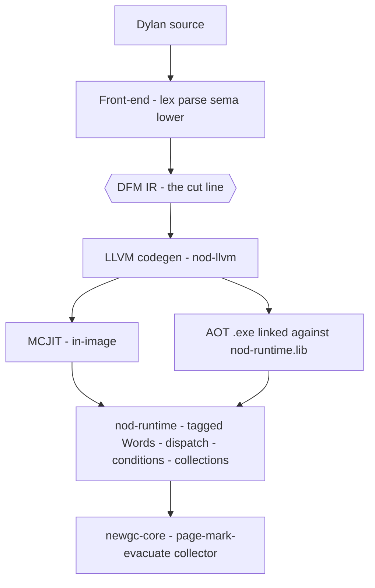
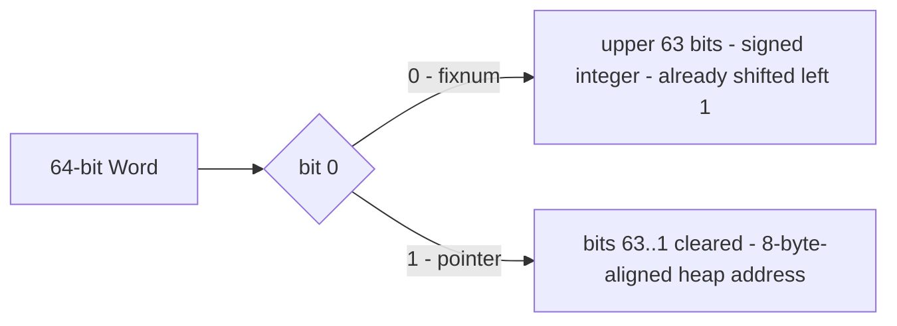
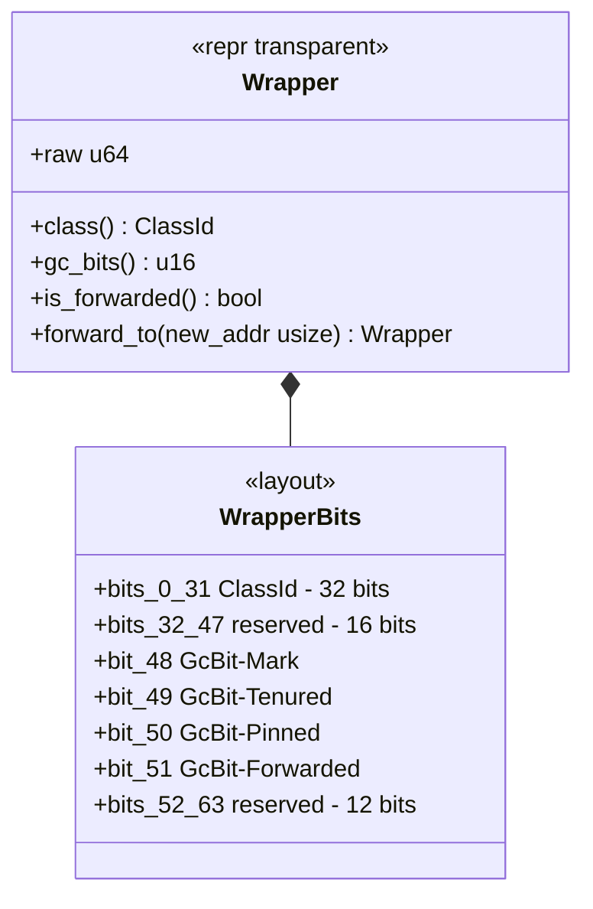
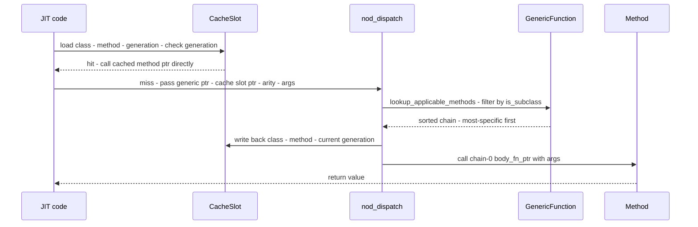
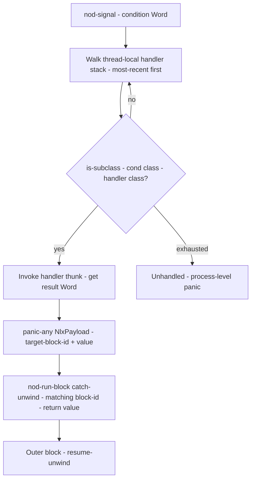

# Runtime & Object Model

`nod-runtime` is the native substrate that every compiled Dylan program runs on.
It defines the tagged-value ABI, heap object layout, generic-function dispatch,
the condition system, and the core collection classes — everything that links
into the program image whether it is JIT-compiled or AOT-linked.

> Crate: `src/nod-runtime`  ·  Part of the permanent Rust back-end

## Role in the pipeline

JIT'd and AOT-compiled code calls into `nod-runtime` through a stable
`extern "C"` ABI. The runtime in turn delegates all allocation and collection
to `newgc-core`. Nothing above the DFM line knows the runtime exists; nothing
below the DFM line cares which front-end produced the code.



## Key types

| Type | File | Purpose |
|------|------|---------|
| `Word` | `word.rs:59` | A 64-bit tagged value; either a 63-bit fixnum or a heap pointer |
| `Wrapper` | `wrapper.rs:94` | 8-byte header every heap object starts with; carries `ClassId` + GC bits |
| `ClassId` | `classes.rs:29` | Newtype `u32` stable identifier for a class |
| `ClassMetadata` | `classes.rs` | Per-class: name, CPL, slot list, scan/size/layout fn-pointers, sealed flag |
| `GenericFunction` | `dispatch.rs:172` | Process-global generic; owns a method `Vec` under `RwLock` + atomic `generation` |
| `Method` | `dispatch.rs:103` | One method: `specialisers: Vec<ClassId>`, `body_fn_ptr: *const u8` |
| `CacheSlot` | `dispatch.rs:139` | Per-call-site inline cache: `(class, method, generation, hits, misses)` all atomic |
| `HandlerFrame` | `conditions.rs:445` | One frame on the thread-local handler chain: condition class + block id |
| `NlxPayload` | `conditions.rs:571` | Panic payload for non-local exit: `target_block_id` + `value: Word` |
| `LiteralPool` | `lib.rs:300` | Process-global singleton: heap, symbol table, static area, class table |

## How it works

### The tagged Word

Every value that flows between JIT'd code and the runtime is a `Word`
(`word.rs:59`), a `#[repr(transparent)]` wrapper around `u64`. The tag scheme
is a single bit (`word.rs:1-28`):



- **Fixnum:** `n` encodes as `(n as u64) << 1` (`word.rs:69`). Decode:
  `(word.0 as i64) >> 1`. Range: `-(2^62) ..= 2^62 - 1` (`word.rs:33-34`).
- **Pointer:** tag an 8-byte-aligned address with `addr | 1` (`word.rs:87`).
  Decode: `word.0 & !1`. A misaligned decode returns `None` and logs a
  diagnostic under `NOD_GC_DIAG` (`word.rs:181`).
- **Fixnum arithmetic:** `add` and `sub` work directly on tagged words —
  `(a<<1) + (b<<1) == (a+b)<<1`. `mul` needs one operand right-shifted first;
  LLVM codegen handles this (`word.rs:26`).
- **Immediates** (`#t`, `#f`, `nil`, characters) are heap objects in the
  static area so they have stable pointer-tagged Words baked into LLVM
  constants (`lib.rs:363-419`).

### Heap object layout

Every heap-allocated Dylan object begins with an 8-byte `Wrapper`
(`wrapper.rs:94`). The wrapper carries three fields packed into one `u64`:



Immediately after the `Wrapper` come the object's slots, each 8 bytes wide and
laid out in CPL order (inherited slots first). The offsets are computed by sema
and recorded in `ClassMetadata::slots` (`classes.rs`); slot `i` lives at
`size_of::<Wrapper>() + i * 8` (`lib.rs:872`). See [Sema](sema.md) for how
the C3-linearised slot merge is computed at compile time.

When the GC evacuates an object, it overwrites the `Wrapper` with a forwarding
encoding: bit 51 (`GcBit::Forwarded`) is set and bits 0..48 hold the new
address verbatim (`wrapper.rs:149`). Any subsequent read of that from-space
cell must check `is_forwarded()` before interpreting the class field.

The `ClassMetadata` for every class lives pinned in the `StaticArea` so JIT
code can bake its address as an LLVM `i64` constant; it carries `scan`, `size_of`,
and `layout` function pointers the collector calls to trace and measure
instances (`classes.rs:64-89`).

### Runtime dispatch

The DFM `Dispatch` computation (`ir.rs:173`) lowers to a call to
`nod_dispatch` (`dispatch.rs:784`). The JIT also emits a per-call-site
`CacheSlot` (`dispatch.rs:139`) in the static area. The fast path is in
LLVM-emitted code; the slow path runs Rust. This is a monomorphic inline cache:
each call site caches a single `(class, method)` pair, with the generation
counter making a stale cache safe.



**Applicability:** a method `m` is applicable for argument classes `c0..cn` when
`is_subclass(ci, m.specialisers[i])` holds for every `i` (`dispatch.rs:486-494`).

**Specificity:** argument-major, CPL-driven. At the first position where two
methods differ, the more specific one has its specialiser **earlier** in that
argument's CPL — i.e. closer to the actual argument class (`dispatch.rs:496-514`).

**Generation counter:** `GenericFunction::generation` is an `AtomicU64` that
increments on every `add_method` or `remove_method` (`dispatch.rs:280`). The
cache slot stores the generation at fill time; a mismatch on the fast path is
the only stale-cache signal. Method lookups hold an `RwLock` shared read lock
(`dispatch.rs:463`).

**`next-method`:** when `lookup_applicable_methods` returns two or more methods,
`nod_dispatch` pushes a `MethodChainFrame` onto a thread-local stack before
calling the most-specific method (`dispatch.rs:848`). `nod_next_method` pops
the frame and invokes the next body, forwarding the original args verbatim
(`dispatch.rs:948`). An RAII `ChainFrameGuard` ensures the frame is popped
even on unwind (`dispatch.rs:908`).

**Sealed dispatch:** when sema knows at compile time that a sealed GF has
exactly one applicable method, it emits `SealedDirectCall` instead of
`Dispatch`. The `fallback_chain` field carries less-specific methods for
`next-method`. See [DFM](dfm.md) and [Generic functions](../language/generic-functions.md).

### Conditions, handlers, and non-local exit

Dylan's condition system maps to three runtime mechanisms:



**Handler chain:** each `exception` clause in a `block` form pushes a
`HandlerFrame` (`conditions.rs:445`) onto a thread-local `Vec`
(`conditions.rs:456`). `nod_push_handler` / `nod_pop_handler` are the JIT ABI
entry points. `nod_signal` (`conditions.rs:866`) snapshots the stack and walks
it most-recently-pushed first, matching by `is_subclass` on the condition's
class id.

**Non-local exit:** once a matching handler runs, the mechanism is
`std::panic::panic_any(NlxPayload { target_block_id, value })`
(`conditions.rs:571`). The enclosing `nod_run_block` (`conditions.rs:728`)
wraps the body in `catch_unwind`; if the caught payload is an `NlxPayload`
targeting this block's id, it returns the value — otherwise it re-panics
(`conditions.rs:797-816`).

**Cleanup and afterwards:** `nod_run_block` installs a `CleanupGuard` whose
`Drop` impl runs the `cleanup` thunk unconditionally (even on unwind) and
truncates the handler stack to the pre-entry baseline. The `afterwards` thunk
runs on normal exit only, after cleanup (`conditions.rs:667-710`).

**Condition class hierarchy** (seed classes registered at process boot):

| Class | Parent |
|-------|--------|
| `<condition>` | `<object>` |
| `<warning>` | `<condition>` |
| `<serious-condition>` | `<condition>` |
| `<error>` | `<serious-condition>` |
| `<simple-error>` | `<error>` |
| `<no-applicable-methods-error>` | `<error>` |
| `<simple-restart>` | `<condition>` |
| `<exit-procedure>` | `<object>` |

The full condition hierarchy, accessor generics, and printers live in Dylan
(`stdlib/*.dylan`); only the signal/handler/unwind
mechanism is frozen in Rust. See [Conditions](../language/conditions.md).

### Functions and closures

A first-class `<function>` value is a heap object with six slots
(`functions.rs:29-39`): `name`, `arity`, `code-ptr` (raw host pointer stored
as a fixnum-typed slot), `kind-tag`, `env-ptr`, and `return-type`. The
`kind-tag` distinguishes top-level (`0`), lifted-anon (`1`), closure (`2`),
and generic-dispatch trampoline (`3`) (`functions.rs:89-97`).

Closures (`kind-tag = 2`) allocate a companion `<environment>` heap object
whose slots are mutable `<cell>` objects — one per captured variable. `env-ptr`
points at the `<environment>`. The GC follows `env-ptr` during evacuation.

`nod_funcall0` .. `nod_funcall5` are JIT-callable trampolines that read
`code-ptr` from the `<function>` Word and tail-call the body. Calls with more
than five arguments route through `nod_apply`, which unpacks a
`<simple-object-vector>` of up to `MAX_APPLY_ARITY` (8) arguments.

### Collections and the FIP

The runtime registers the abstract collection hierarchy and the forward
iteration protocol (FIP) as user classes at boot time via `ensure_registered`
(`collections.rs:94`).

**Abstract hierarchy:**

- `<collection>` → `<mutable-collection>`, `<sequence>`, `<explicit-key-collection>`, `<stretchy-collection>`
- `<sequence>` → `<mutable-sequence>`

**Concrete classes:**

- `<range>` — three fixnum slots: `range-from`, `range-to`, `range-by`
  (defaults to 1) (`collections.rs:161-168`).
- `<stretchy-vector>` — `%length`, `%capacity`, `%storage` (a backing
  `<simple-object-vector>` that grows 2x on overflow) (`collections.rs:181-189`).
- `<simple-object-vector>`, `<pair>`, `<empty-list>` — registered as seed
  classes in `classes.rs`.

**FIP:** `forward_iteration_protocol` returns a heap-allocated
`<iteration-state>` Word bundling the seven DRM-defined iteration values
(state object, limit, next-state, finished?, current-key, current-element,
current-element-setter) plus a `%fip-kind` discriminant
(`collections.rs:135-153`). `nod_fip_init`, `nod_fip_advance`,
`nod_fip_finished_p`, and `nod_fip_current_element` are the JIT-callable
shims; each dispatches internally on `%fip-kind` to avoid a Dylan-side
generic call in the iteration hot loop.

### `<table>` hashing

`<table>` is an open-addressing hash table with linear probing and tombstones
(`tables.rs`). Heap layout: a `Wrapper`, then four slots — `%capacity` (fixnum),
`%size` (fixnum), `%tombstones` (fixnum), and `%buckets` (a
`<simple-object-vector>` of length `3 * capacity`) (`tables.rs:18-30`).

Each bucket occupies three consecutive Words in the backing SOV:

```
slot 3*i + 0  — state fixnum: Empty=0, Occupied=1, Tombstone=2
slot 3*i + 1  — key Word (any tagged Dylan value)
slot 3*i + 2  — value Word (any tagged Dylan value)
```

Growth fires at 70% combined load (size + tombstones) by doubling capacity
(`tables.rs:64-67`). Hash methods: `<integer>` — multiplicative mix hash;
`<byte-string>` and `<symbol>` — FNV-1a 64-bit over the byte payload.
Non-hashable keys signal `<not-hashable-error>`.

## Invariants & gotchas

- **Heap pointers must be 8-byte-aligned.** `Word::from_ptr` debug-asserts
  this (`word.rs:87`). Misaligned pointer-shaped Words return `None` from
  `as_ptr` and trigger a `NOD_GC_DIAG` log (`word.rs:142-152`).
- **`Wrapper::class()` is garbage when `is_forwarded()`.** Always check the
  forwarded bit before reading the class field during a GC cycle
  (`wrapper.rs:107-113`).
- **Cache slots are process-global statics.** Each is minted in the `StaticArea`
  via `allocate_cache_slot` and memoised by `(key_prefix, site_id)` pair so
  two modules cannot share a slot (`lib.rs:617-716`).
- **Generation counter drives cache invalidation, not a compare-and-swap.**
  The fast path's generation load and the `CacheSlot` stores are all `Relaxed`
  atomics — the generation check makes a stale cache safe without a heavier
  ordering (`dispatch.rs:833-838`).
- **The handler stack is thread-local.** `HANDLER_STACK` is a `thread_local!`
  `RefCell<Vec<HandlerFrame>>` (`conditions.rs:455-457`). Sending a handler
  frame across threads is not supported.
- **NLX uses `panic_any`, not C++ exceptions or SEH.** The `CleanupGuard`
  RAII pattern runs the `cleanup` thunk even across unwinds. All JIT'd
  functions use `extern "C-unwind"` so Rust panics can transit them.
- **`is_no_alloc` bypasses GC root bracketing, not the liveness pass.** A
  `DirectCall` marked `is_no_alloc` still appears in the liveness analysis;
  only the codegen-emitted safepoint brackets are skipped. See [DFM](dfm.md).
- **Win32/COM FFI is in `winffi.rs` and `com_shim.rs`.** This page does not
  cover those; see [FFI](ffi.md).
- **The collector internals are in `newgc-core`.** This page covers only the
  runtime's view of allocation and GC integration; see [GC](gc.md).

## Where in the code

| File | Lines | Responsibility |
|------|-------|----------------|
| `src/nod-runtime/src/lib.rs` | 1195 | `Word` ABI surface, `LiteralPool`, literal/cache slot allocators, `write_barrier`, GC stats |
| `src/nod-runtime/src/word.rs` | 295 | `Word` struct, tag scheme, encode/decode, fixnum bounds |
| `src/nod-runtime/src/wrapper.rs` | 255 | `Wrapper` header, `GcBit` flags, forwarding encoding |
| `src/nod-runtime/src/classes.rs` | ~500 | `ClassId`, `ClassMetadata`, `SlotInfo`, `ClassTable`, `is_subclass` |
| `src/nod-runtime/src/dispatch.rs` | 1423 | `GenericFunction`, `Method`, `CacheSlot`, `nod_dispatch`, `next-method` chain |
| `src/nod-runtime/src/conditions.rs` | 1402 | Seed condition classes, handler stack, `nod_signal`, `nod_run_block`, `NlxPayload` |
| `src/nod-runtime/src/functions.rs` | 1326 | `<function>`, `<environment>`, `<cell>`, `nod_funcall_N`, `nod_apply` |
| `src/nod-runtime/src/collections.rs` | 1982 | Collection hierarchy, `<range>`, `<stretchy-vector>`, FIP, `nod_fip_*` |
| `src/nod-runtime/src/tables.rs` | 1209 | `<table>`, open-addressing hash, FNV-1a / mix-hash |
| `src/nod-runtime/src/heap.rs` | 2255 | `Heap` facade, root registry, `collect_minor`/`collect_full`, `Semispace`, `CardTable` |
| `src/nod-runtime/src/structs.rs` | 909 | `<c-struct>` family (deep FFI detail — see `ffi.md`) |

## See also

- [DFM: the IR](dfm.md) — `Dispatch`, `SealedDirectCall`, and safepoint roots
- [LLVM codegen](codegen.md) — how DFM `Dispatch` nodes lower to `nod_dispatch` calls and inline-cache fast paths
- [Garbage collector](gc.md) — `newgc-core` page-mark-evacuate internals
- [FFI: calling Windows](ffi.md) — `winffi.rs`, `com_shim.rs`, `callbacks.rs`
- [Generic functions & dispatch](../language/generic-functions.md) — Dylan surface: `define generic`, methods, sealing
- [Conditions](../language/conditions.md) — Dylan surface: `signal`, `block`/`exception`/`cleanup`

---
[Compiler overview](overview.md) · [DFM](dfm.md) · [Codegen](codegen.md) · [GC](gc.md)
