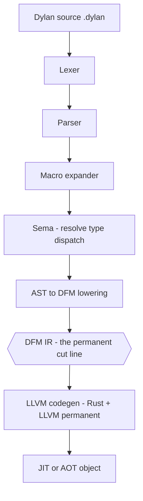
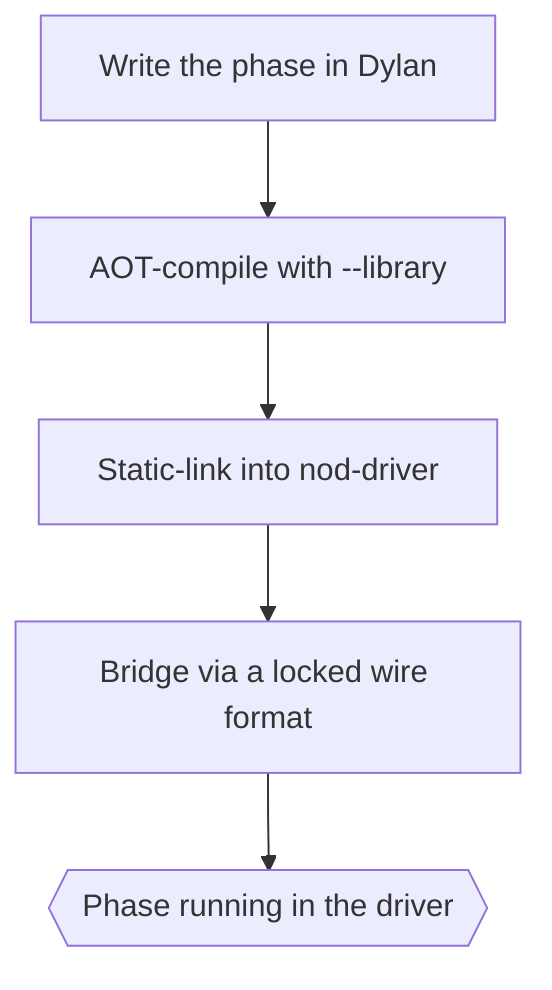
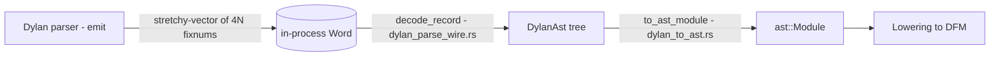
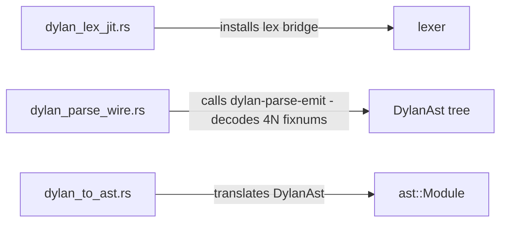

# Self-hosting — the Dylan front-end, built and linked

The front-end (lexer, parser, macro expander, sema, AST → DFM lowering) is
written in Dylan and compiled by NewOpenDylan's own back-end. The back-end
(codegen, GC, JIT, linker, runtime) is Rust + LLVM, permanently. DFM IR is the
cut line between them.

This is genuine self-hosting: the compiler's own front-end is one of the Dylan
programs it compiles. The Dylan front-end is AOT-compiled into a static-library
"shim", linked into `nod-driver`, and hands its output to the back-end across
fixed-shape wire formats.

> Front-end sources live under `compiler/` (`compiler/dylan-lexer.dylan`,
> `dylan-parser.dylan`, `dylan-macro.dylan`, `dylan-sema.dylan`,
> `dylan-c3.dylan`, `dylan-lower.dylan`). The bridging code lives in
> `src/nod-driver/src/dylan_*.rs`.

## Role in the pipeline



Everything above the hexagon is the **front-end** — written in Dylan.
Everything below is the **back-end** — Rust + LLVM. The hexagon is the only thing
that crosses the seam. See [DFM](dfm.md) for the IR contract and
[Compiler overview](overview.md) for the full pipeline and crate map.

## Why the split is at DFM

There is no reason to write the back-end in Dylan. DFM is the floor. A DFM module
is the same data structure with the same semantics no matter what produced it; the
back-end consumes DFM and never looks above it. The guiding insight:

> *"Code gen is code gen — if the front-end emits well-formed DFM, LLVM emits the
> machine code."*

So the architecture is: front-end in Dylan, back-end in Rust + LLVM, split at DFM
— the same division `rustc` draws (Rust front-end, LLVM back-end) and that GHC
draws (Haskell front-end, native/LLVM back-end).

The back-end is not a scaffold to be retired. It is the permanent native
substrate, shared across the portfolio (NewM2, NewCP, NewCormanLisp, NewBCPL,
NewFB) where the GC core, JIT memory manager, and Windows FFI stack are common.

## How the front-end is built and linked

The front-end is Dylan source, so it is compiled the same way any Dylan program
is, then linked into the driver:



**AOT-compile with `--library`.** `nod-driver build --library` produces a `.obj`
in `AotShape::StaticLibrary` mode (`src/nod-driver/src/main.rs:159`,
`main.rs:533`): source-language symbol names are preserved verbatim (dashes and
all), no synthetic `main` is injected, and the resolver `nod_aot_resolve_relocs`
is promoted to an external symbol. The output for the combined lexer + parser shim
is `compiler/dylan-lex-shim.lib.obj`.

**Static-link into `nod-driver`.** `build.rs` finds the `.obj`, passes it to the
linker, and sets the `dylan_lex_shim_linked` cfg flag. The phase's entry points —
`dylan-lex-collect`, `dylan-parse-emit`, `dylan-parse-collect` — become
`extern "C"` symbols in the driver process. No JIT engine to spin up and no
`register_methods` replay: the shim is code already linked into the process.

**Bridge via a locked wire format.** Front-end output crosses the Dylan/Rust
boundary as a flat, fixed-shape record stream — never a shared data structure. The
contracts are written down before either side's code. See the next section.

> The `.obj` shim is a build artifact and is not in source control. A fresh
> checkout without it still compiles; build it with
> `nod-driver build --library --project compiler/dylan-lex-shim.prj`.

## Wire-format discipline

Across a compiled-language seam you do not pass a data structure — you pass bytes
both sides agree on. Inside one language, handing someone a `Vec<Token>` is free;
the type is the interface. The instant the boundary is a different allocator and a
different type system, the data structure on one side does not exist on the other.
The only shared thing is a byte layout — and that layout is the interface.

Three patterns govern every wire format in this project:

- **Lock the contract first.** The wire-format specs are committed contracts that
  both sides obey. Specifying the wire up front is why the emitters match the
  readers.
- **Cheapest shape that carries the data.** Rich Dylan `<ast-*>` classes flatten
  to fixed-size integer records; the back-end reconstructs whatever local shape it
  needs. Each side's type system is a private implementation detail.
- **Spans, not values, when both sides hold the source.** The emitter ships
  `(VariableRef 527..537)`; the back-end reader does `&src[527..537]`. The source
  string is the blob both already have; the wire carries indices into it.

The front-end uses three wire formats — token, AST, and sema — all built from the
same philosophy.

### Token wire format

One token is one fixed-size 16-byte little-endian record:

| Offset | Type | Field | Meaning |
|--------|------|-------|---------|
| 0 | `u32` | `kind` | `TokenKind` discriminant — append-only ordinal table |
| 4 | `u32` | `span_lo` | Start byte offset into the source buffer |
| 8 | `u32` | `span_hi` | End byte offset (exclusive) |
| 12 | `u32` | `_pad` | Reserved, must be zero (free expansion slot) |

The 16-byte size matches `nod_reader::Token` in memory (`kind: u8` + pad +
`span`), so the back-end unmarshalling loop is a straight bytewise interpretation
with zero pointer arithmetic per field. The Dylan emitter
(`compiler/dylan-lex-shim.dylan`) classifies each `<token>` subclass to an ordinal
via the generic `token-rust-kind`, filters trivia and the module preamble, and
packs records into a `<stretchy-vector>` of `3N` fixnums `(kind, lo, hi)`. The
back-end reader (`src/nod-driver/src/dylan_lex_jit.rs`) walks the vector in strides
of 3 and calls `token_kind_from_ordinal` — an explicit match, not a transmute, so
a future enum reshuffle fails loudly rather than silently corrupting tokens.

The kind discriminants are the `#[repr(u8)]` ordinals of
`nod_reader::token::TokenKind` (65 ordinals, `Ident`=0 … `Eof`=63,
`Invalid`=64). Ordinals are append-only: a new kind goes at the bottom, never in
the middle, and the Dylan classifier stays in lockstep. Wire-format version
**1.0**.

**Filtering.** The lexer keeps everything (it also feeds the IDE colourer), so
before packing, the shim (1) drops the `Module:` preamble and (2) drops
whitespace/comment trivia. The trailing `Eof` token survives both filters and ends
every stream.

### AST wire format

One AST node is one fixed-size 4-fixnum record inside a single
`<stretchy-vector>`:

| Slot | Field | Meaning |
|------|-------|---------|
| 0 | `kind` | Node kind ordinal (see kind table) |
| 1 | `span_lo` | Source byte offset (start) |
| 2 | `span_hi` | Source byte offset (end, exclusive) |
| 3 | `subtree_size` | Record count of this node's subtree (self + all descendants, pre-order). Leaf = 1 |

Records are packed pre-order: parent first, then children recursively. Sibling
boundaries are computed from `subtree_size` with no indirection:

```
let parent_at    = i;
let first_child  = i + 4;                              // 4 ints per record
let second_child = first_child  + 4 * records[first_child  + 3];
let third_child  = second_child + 4 * records[second_child + 3];
```

The back-end walks by recursive descent
(`src/nod-driver/src/dylan_parse_wire.rs`, `decode_record`): read a record,
dispatch on `kind` to a per-kind builder, recurse on children inside the builder.
No explicit child-count is needed because each kind knows how many children it has
at the wire level. `subtree_size == 1` is the leaf check; the walker carries one
cursor index. A whole-file `Body` has `span_lo == 0`, `span_hi == source.len()`.

The wire is navigated in-process: the Dylan parser returns a tagged-pointer
`<stretchy-vector>` Word; the back-end reader unboxes fixnums via
`Word::as_fixnum()` and walks the flat array.



Once `dylan_to_ast.rs` has produced a canonical `ast::Module`, lowering, codegen,
and everything downstream are identical regardless of how the AST was produced —
the back-end never sees the seam.

#### AST wire kind table

Kind ordinals are stable and append-only. The dispatch table in
`src/nod-driver/src/dylan_parse_wire.rs` stays aligned with this table; a corpus
check asserts agreement on every fixture. Wire-format version **1.0**.

| Ord | Name | Children (pre-order, in slot order) | Notes |
|-----|------|--------------------------------------|-------|
| 0 | `Body` | N constituents (any kind) | Top-level module body OR a function body block. |
| 1 | `DefineFunction` | `DefName`, `ParamList`, `ReturnSpec`?, `Body` — in that order | Children dispatched by KIND, not position. `DefName` carries the name token's span; `ReturnSpec` present only when an `=>` appeared. The function span is the `function` keyword token. |
| 2 | `Call` | 1 × callee (any expr), N × arg (any expr) | First child is callee; the rest are args. |
| 3 | `VariableRef` | (leaf) | `name` is `&src[span_lo..span_hi]` verbatim. |
| 4 | `StringLit` | (leaf) | Span covers the quoted form; the back-end strips quotes + decodes escapes. |
| 5 | `IntegerLit` | (leaf) | Span covers the digit run. |
| 6 | `BinaryOp` | 2 × operand (left, right) | Operator is the single token in the gap between children — read from `&src`. |
| 7 | `Error` | (leaf) | The parser bailed on this constituent (an unsupported construct). |
| 8 | `DefineClass` | `DefName`, then N × super-expr, then N × `SlotSpec` | Dedicated `<ast-class-definition>`. Span is the `class` keyword; `DefName` carries the class name token. Children dispatched by kind: `SlotSpec` → slot, anything else → a superclass expr. |
| 9 | `DefineMethod` | `DefName`, `ParamList`, `ReturnSpec`?, `Body` | Same signature-child shape as `DefineFunction`. `<ast-body-definition>` body-word `method`; span is the keyword token. |
| 10 | `DefineGeneric` | (leaf) | Dedicated `<ast-generic-definition>`; span is the `generic` keyword. Signature recovered from `&src`. |
| 11 | `Statement` | 1 × Body (leading body), then N × StatementClause | The whole `<ast-statement>` family — `if`/`until`/`while`/`begin`/`select`/`block`/`for`. Span is the leading keyword; the statement is identified from `&src`. For `if`, the condition is the leading body's first child. The `for` iteration header is NOT yet emitted. |
| 12 | `StatementClause` | 1 × Body (clause body) | One trailing clause (`else`/`elseif`/`cleanup`/`exception`/`otherwise`). Span is the clause keyword; for `elseif`, the condition is the clause body's first child. |
| 13 | `LocalDecl` | 1 × Body (binding pattern + `= init`) | `let <pattern> = <init>`. Span is the `let` keyword. The body holds the binding (variable-ref, or paren-list for `let (a, b) = …`) then the init expression. |
| 14 | `SlotSpec` | `DefName`, then optional `SlotAlloc`/`SlotInitKw`/`SlotRequired`/`SlotType`/`SlotInit` | One slot inside a `DefineClass`. Span is the `slot` word; `DefName` carries the slot name. Metadata children are KIND-tagged and order-independent (ords 31–35). |
| 15 | `DotCall` | 1 × receiver expr | `receiver.name`. Span backfills from the receiver (the `.name` is a trailing token, not a node — read from `&src`). |
| 16 | `Subscript` | 1 × receiver, then N × index arg | `receiver[args]`. Span backfills over receiver + args. |
| 17 | `UnaryOp` | 1 × operand | Prefix `OP operand`. Span is the operator token. |
| 18 | `KwArg` | 1 × value expr | `key: value` keyword argument. Span is the keyword token. |
| 19 | `ParenList` | N × item | `(a, b)` / `(e :: <type>)` — a multi-item or typed parenthesised head. Span backfills over the items. |
| 20 | `BoolLit` | (leaf) | `#t` / `#f`. Span covers the literal; the back-end re-reads `&src[span]` to recover the boolean. The parser retains the source token so the span is real. |
| 21 | `CharLit` | (leaf) | `'a'`. Span covers the quoted char form; strip quotes + decode escapes. |
| 22 | `SymbolLit` | (leaf) | `#"foo"` or `foo:` (keyword-name). Span covers the literal; recover the symbol name from `&src`. |
| 23 | `FloatLit` | (leaf) | `3.14`. Span covers the digit/exponent run; parse the float from `&src`. |
| 24 | `RatioLit` | (leaf) | `1/3`. Span covers the `num/den` form; parse the ratio from `&src`. |
| 25 | `ParamList` | N × `Param`, then optional `VarMarker` | A function/method parameter list. Each required parameter is a `Param`; a trailing `VarMarker` signals `#rest`/`#key`/`#all-keys`/`#next` (variadic syntax not yet modelled by the wire). |
| 26 | `ReturnSpec` | N × `ReturnValue`, then optional `VarMarker` | The `=> (…)` clause. Emitted as a definition child ONLY when an `=>` was present (missing `ReturnSpec` ⟺ `return_: None`; empty `ReturnSpec` ⟺ `Some(ReturnSig { values: [] })`). A trailing `VarMarker` signals `#rest`. Span is the `=>` token. |
| 27 | `DefName` | (leaf) | The definition's name token; the back-end reads `&src[span]` for the name string. |
| 28 | `Param` | 0–1 child: the type expr | One required parameter. Span is the parameter NAME token. An optional single child is the `:: type` expression. `name = &src[span]`. |
| 29 | `VarMarker` | (leaf, span 0..0) | Sentinel inside a `ParamList`/`ReturnSpec` meaning "this list has variadic syntax the wire does not yet reconstruct"; such a parameter list is treated as unsupported. |
| 30 | `ReturnValue` | 0–1 child: the type expr | One return value. Span is the value's leading token. Type child present → `name = Some(&src[span])`, `type = child`; no child → `name = None`, `type = Ident(&src[span])` (a bare return type like `=> (<integer>)`). |
| 31 | `SlotAlloc` | (leaf) | A slot's allocation adjective token (`class`/`each-subclass`/`virtual`/`constant`). ABSENT ⟺ `Instance`. Read `&src[span]` → `SlotAllocation`. |
| 32 | `SlotInitKw` | (leaf) | A slot's init-keyword NAME token (e.g. `x:`). Read `&src[span]` and strip the trailing `:` → `init_keyword`. |
| 33 | `SlotRequired` | (leaf, span 0..0) | Marker: the slot used `required-init-keyword:` (→ `required_init_keyword = true`). |
| 34 | `SlotType` | 1 × type expr | Wraps a slot's `:: type` expression. |
| 35 | `SlotInit` | 1 × init expr | Wraps a slot's `= init` / init-value expression. |
| 36 | `HashLit` | N × element expr | A `#(…)` list / `#[…]` vector / `#{…}` set literal. Span is the OPEN token; the back-end reads `&src[span_lo+1]` to pick the synthetic constructor name (`#list`/`#vector`/`#set`) and rebuilds `Expr::Call(Ident(name), elements)`. The improper-list tail `#(a . b)` is not emitted (emits `Error`; not yet supported). |
| 37 | `DefineBinding` | 1 × Body (the list-fragment binding) | `define constant`/`variable NAME [:: TYPE] = INIT` (an `<ast-list-definition>`). Span is the `constant`/`variable` keyword — read `&src[span]` to pick `Item::DefineConstant` vs `DefineVariable`. The single Body child holds the binding (a `BinaryOp(binder = init)`), decoded by the same path as `LocalDecl`. Modifiers arrive as leading `Modifier` children. |
| 38 | `Modifier` | (leaf) | One definition adjective (`sealed`/`open`/`abstract`/`concrete`/`primary`/`free`/`inline`/`not-inline`/`sideways`/`domain`). Span is the adjective word's token. Emitted as leading children of a definition node; map each `&src[span]` via `Modifier::from_word`, collected in source order. Empty ⟺ no children. |

**Unsupported constructs.** When the parser produces a node whose kind isn't in
the table, it writes an `Error` record covering the offending span. Such
constructs are not yet supported on the wire.

Still outstanding on the AST wire: `DefineConstant` / `DefineVariable` as
dedicated kinds (currently `DefineFunction`-shaped or `Body` constituents), and a
parallel error-detail vector beyond the single `Error` marker. The macro expander
emits over this **same** wire — the expanded AST is kernel-shaped and macro-free,
so no `MacroCall` kind is ever emitted and no new record, kind, or calling
convention is added.

### Sema wire format

The sema wire is the contract by which the front-end hands its computed **sema
recording model** (`SemaModel`) to the back-end, so the back-end's
`lower_with_model` (the DFM/CFG construction) consumes the computed model rather
than recomputing it.

`SemaModel` is the *recording* half of sema's `lower_module_full` — the exhaustive
record of what one module declares, which every later phase reads instead of
re-poking the AST. Four parts (the four `dump-sema` sections):

- **top-names** — top-level `define function`/`method`/`constant`/`variable`
  names, each with arity and a return-type estimate, plus the constant/variable
  sets (for bareword-vs-call lowering).
- **generics** — the generic-function name set (including auto-generated slot
  accessors' generics).
- **classes** — per `define class`: name, parents, C3-linearised CPL, slot layout
  (name, byte offset, has-setter, origin class), own/inherited slot counts, sealed
  flag.
- **sealing** — sealed classes, sealed generics, sealed `domain` tuples.

**Names, not ids.** Unlike the token and AST wires, the sema model references
classes by **name**, because class ids are assigned from a process-global counter
and would not be stable across builds. The cross-build-stable invariants are:
names, slot **offsets**, CPL **order**, and the flag sets. Numeric class ids are
deliberately omitted.

The record layout serialises `SemaModel` into a `<stretchy-vector>` of fixnums,
packed by section, with a leading header record carrying the four section counts:

```
top-name:   kind(0=fn|1=const|2=var) · name_lo · name_hi · arity · return_estimate
generic:    name_lo · name_hi
class:      name_lo · name_hi · sealed · n_parents · n_cpl · n_slots
            then n_parents × (parent_name_lo · parent_name_hi)
            then n_cpl     × (cpl_name_lo · cpl_name_hi)            // C3 order
            then n_slots   × (slot_name_lo · slot_name_hi · offset · has_setter · origin_name_lo · origin_name_hi)
sealing:    kind(0=class|1=generic|2=domain) · name_lo · name_hi · [n_specialisers · (spec_name_lo·spec_name_hi)…]
```

Every name is a `(span_lo, span_hi)` pair into the expanded source the back-end
holds (it slices the name out), so the wire carries spans, not interned strings.
`return_estimate` is the `TypeEstimate` discriminant (the small lattice:
Top/Bottom/Integer/SingleFloat/DoubleFloat/Character/Boolean/String/…), stable by
ordinal — a closed enum with no source span, so it crosses as its stable ordinal.

Multi-file builds compose **at the AST**: the ASTs are concatenated into one module
and analysed once (`compile_files_for_aot`), producing ONE `SemaModel`; never
per-file models merged afterward (that would invalidate the slot layouts and CPL
order baked into the records). `SemaModel` is the authoritative record —
`lower_with_model` reads only the model, never the raw AST — so anything lowering
needs that isn't on the wire surfaces as a compile error rather than a silent gap.

## The stdlib boundary

The split between the Rust runtime and the Dylan standard library is a policy
decision that complements self-hosting: as more behaviour lives in Dylan, more of
the language is expressible in itself. NewOpenDylan carries a **fat runtime, thin
stdlib** today — most collection, condition, dispatch, and hashing behaviour lives
in `nod-runtime` as Rust — but the direction of growth is fixed: **new stdlib goes
in Dylan; the Rust runtime stays focused on what only it can do.**

User-visible stdlib code lives in `src/nod-dylan/dylan-sources/stdlib.dylan` (and
sibling `.dylan` files as the directory grows). What the **runtime provides** vs
what **stdlib.dylan defines** is governed by five rules:

1. **Default: new stdlib API lands in Dylan.** Any new user-visible
   function/method/generic/class goes in Dylan; Rust additions are the exception.
2. **Legitimate reasons to add Rust code (the gate).** A new function in
   `src/nod-runtime/` is justified only if it touches GC integration, safepoint /
   roots, FFI / OS, tag / layout, atomics on shared state, or bootstrap primitives
   (things Dylan can't express). Anything else is Dylan or it doesn't ship — no
   "convenience" Rust additions.
3. **Primitives, not APIs.** When rule 2 is satisfied, expose the Rust addition as
   a single `%`-prefixed primitive doing the minimum work; the user-visible API
   composes on top in Dylan. (Example: `%byte-string-copy!` in Rust,
   `replace-subsequence!` in Dylan over it — not a bespoke
   `nod_runtime_concat_three_strings_with_sep`.)
4. **Pre-flight: write the Dylan attempt first.** Before adding Rust, write the
   Dylan version; if it compiles and runs, ship it. Add Rust only when the Dylan
   version genuinely can't compile (a missing primitive) AND that primitive maps to
   a rule-2 category.
5. **Watch the trend.** Track stdlib `.dylan` LOC (should grow) against
   `nod-runtime/src/{collections,tables,conditions,strings,lists,format_out}.rs`
   (flat or shrinking). Not a CI gate — a signal.

**Frozen exceptions** stay Rust-side even though they could theoretically move, and
the list does not grow without explicit conversation: the hash-function inner loop,
dispatch-cache slot atomics, the allocator hot path, `<table>` bucket-array
operations, and `<condition>` runtime mechanics (`nod_signal`, `nod_run_block`, the
NLX unwind path — condition *classes* could move, the signal/unwind mechanism
cannot).

## The bridging modules at a glance

Modules in `src/nod-driver/src/` implement the bridging. No compiler-stage logic
lives here; these are pure translation and dispatch layers.



`dylan_lex_jit::init` (`dylan_lex_jit.rs:92`) calls `nod_aot_resolve_relocs()`
once via `OnceLock` to wire up every relocation site the codegen pass emitted —
class metadata addresses, stub-table entries, string-literal pointers, generic
dispatch slots. Because lexer and parser share one combined `.obj`, the single
resolver call covers both.

## Invariants and gotchas

- **`nod_aot_resolve_relocs` must run before any Dylan-side call.** It wires every
  relocation the codegen emitted; calling a Dylan function before it runs
  dereferences NULL. The `OnceLock` in `dylan_lex_jit.rs` enforces exactly-once
  semantics.
- **The `.obj` shim is not in source control.** A fresh checkout without
  `dylan-lex-shim.lib.obj` compiles fine; the `dylan_lex_shim_linked` cfg is unset.
  Build the shim with
  `nod-driver build --library --project compiler/dylan-lex-shim.prj`.
- **The wire formats are append-only, not reshuffled.** New token kinds go at the
  bottom of the kind table and the `token_kind_from_ordinal` match simultaneously;
  new AST kinds go at the bottom of the AST kind table. Any reshuffle bumps the
  major version.
- **Multi-file AOT builds lower once from one merged AST.** DFM indices are
  module-scoped and stable across the single lowering call. See [Driver](driver.md)
  and [DFM](dfm.md).

## Where in the code

| File | Lines | Responsibility |
|------|-------|----------------|
| `src/nod-driver/src/dylan_lex_jit.rs` | ~299 | Shim init; `nod_aot_resolve_relocs` call; `lex` bridge marshalling `<byte-string>` / `<stretchy-vector>` |
| `src/nod-driver/src/dylan_parse_wire.rs` | ~333 | `dylan-parse-emit` call; `Kind` enum; `DylanAst` struct; `decode_record` recursive descent |
| `src/nod-driver/src/dylan_to_ast.rs` | ~745 | `to_ast_module` — `DylanAst` → `ast::Module` |
| `compiler/dylan-lexer.dylan` | ~800 | The lexer — token class hierarchy, `lex`, `non-trivia-tokens` |
| `compiler/dylan-parser.dylan` | — | The parser |
| `compiler/dylan-lex-shim.dylan` | — | Shim entry points: `dylan-lex-collect`, `dylan-parse-emit`, `dylan-parse-collect`; `token-rust-kind` generic |
| `src/nod-dylan/dylan-sources/stdlib.dylan` | — | The Dylan standard library — the growing side of the boundary |

## See also

- [Compiler overview](overview.md) — the full pipeline and where each phase sits
- [DFM: the IR](dfm.md) — the permanent contract; the back-end consumes DFM and
  nothing above it
- [Reader: lexer and parser](reader.md) — the lexer and parser in detail
- [Driver](driver.md) — the `build --library` / project-file mechanics
- [Architecture](../architecture.md) — the canonical architecture statement;
  wire-format discipline

---
Next: [DFM: the IR](dfm.md) · See also [Compiler overview](overview.md) · [Driver](driver.md)
