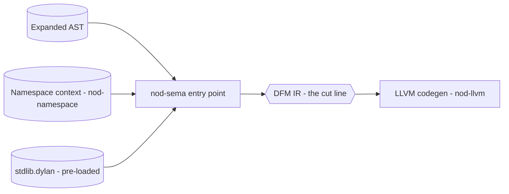
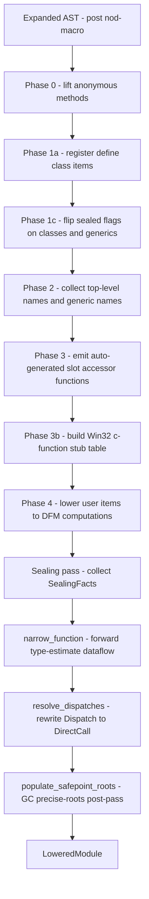
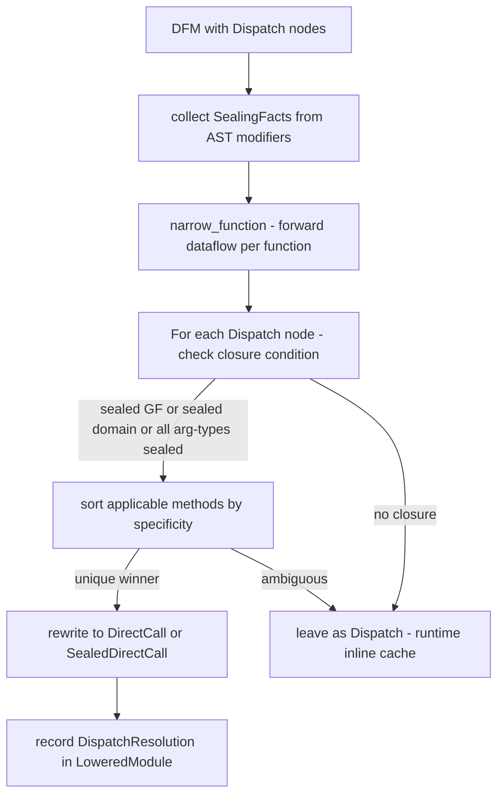
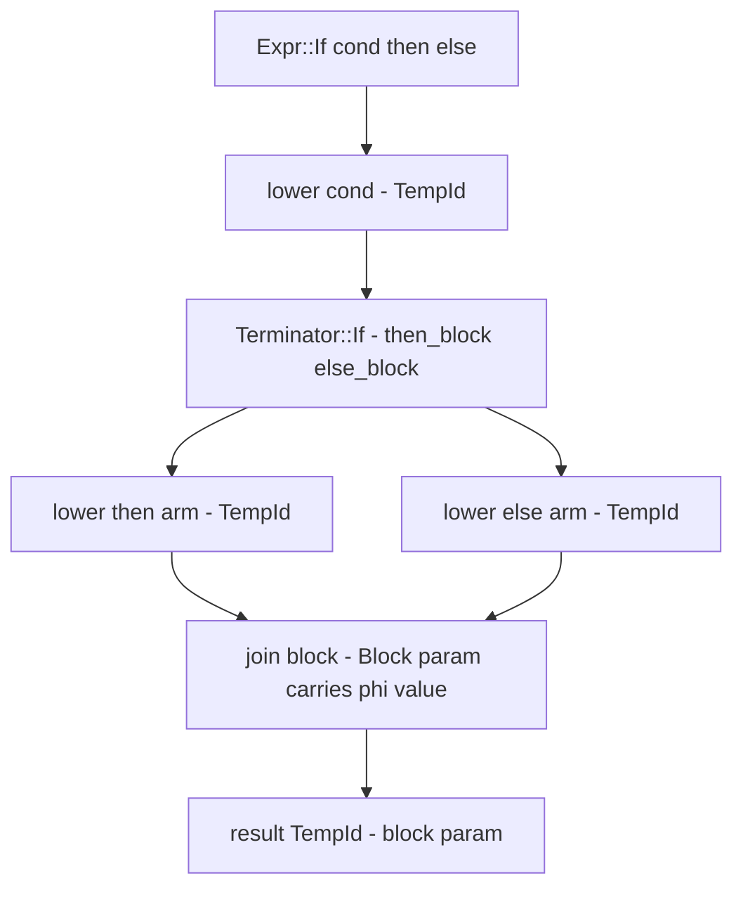

# Semantic Analysis

Semantic analysis is the largest front-end phase. It receives a macro-expanded
AST and a namespace context, resolves names, registers classes and slots under
multiple inheritance, plans and seals dispatch, and lowers everything to DFM IR
— the last front-end phase before the back-end takes over. It is written in
Dylan (`compiler/dylan-sema.dylan`, `compiler/dylan-c3.dylan`,
`compiler/dylan-lower.dylan`).

> Part of the Dylan front-end. The `src/nod-sema` crate is the back-end-side
> reference implementation cited throughout this page.

## Role in the pipeline



The public entry point is `expand_and_lower_module` (`lib.rs:53`), called by
the driver for eval/REPL/AOT. It calls `stdlib::ensure_loaded` first, then
macro-expands the module with the stdlib's macro names pre-seeded, and finally
calls `lower_module_full` on the expanded AST. Multi-file AOT builds merge all
files' ASTs into one combined `Module` and call `lower_module_full` exactly once
so counters, stub-table indices, and class registrations are all assigned in a
single coherent pass (`lib.rs:961-1112`).

DFM — the Dylan Flow Machine, a typed-SSA control-flow-graph IR — is the
permanent contract between the Dylan front-end and the Rust/LLVM back-end.
Everything in this page is front-end work that produces DFM; everything that
consumes DFM is the back-end. See [DFM](dfm.md).

## Internal phases



All phases run inside `lower_module_full` (`lower.rs:1373`). Phase 1a's
deferred sealed-flag flip (Phase 1c) is deliberate: in-library subclassing of a
`sealed` class is legal, so the parent's seal bit must not be set until after
all subclasses in the same lowering call are registered (`lower.rs:1458`).

## Key types

| Type | Where | Purpose |
|------|-------|---------|
| `LoweredModule` | `lower.rs:561` | Aggregated output: `Vec~Function~`, methods, sealing facts, blocks, closures, c-function bindings, user-class registrations, variable registrations |
| `MethodRegistration` | `lower.rs:209` | `(generic_name, specialisers, body_fn_name, param_count)` — handed to `nod_runtime::add_method_named` after JIT |
| `UserClassRegistration` | `lower.rs` | Full class snapshot for AOT: name, ClassId, CPL, slots with offsets and type tags, slot origins |
| `BlockRegistration` | `lower.rs:1307` | One per `block` form: block-id, body/cleanup/afterwards thunk names, handler vec |
| `ClosureRegistry` | `lower.rs` | Maps lifted-closure body names to source arities and cell-local metadata |
| `SealingFacts` | `optimise/facts.rs:21` | Per-compilation-unit table: sealed generic names, sealed class names, sealed domain specialiser lists |
| `NarrowedEstimates` | `optimise/narrowing.rs:31` | `HashMap~TempId~ TypeEstimate` — per-function, produced by forward dataflow |
| `LowerCtx` | `lower.rs:3449` | Read-only context threaded through every `lower_expr` call: top-level names, generics, user classes, closure registry, c-function call map |
| `FunctionBuilder` | `lower.rs:4322` | Mutable per-function SSA builder: current block index, temp counter, block counter, cell-promotion context |

## How it works

### Classes and slots

`define class` items are processed in Phase 1a by `register_class`
(`lower.rs:2582`). The function:

1. Refuses redefinition (`LoweringError::ClassRedefinitionNotSupported`).
2. Resolves each superclass name to a registered `ClassId`. If the parent is
   already sealed from a prior lowering call, subclassing it raises
   `SealingViolation::SealedClassExtendedAcrossBoundary`.
3. For single inheritance it calls `register_simple_user_class`, which assigns
   slot offsets and returns the new `ClassId`.
4. For multiple inheritance it first runs **C3 linearisation** to compute the
   class precedence list (CPL), then calls `register_mi_user_class`.

**C3 linearisation** lives in `c3.rs:57`. The function signature is:

```
c3_linearise(class_name, parents, parent_cpls) -> Result~Vec~String~~, C3Error~
```

It is the standard MRO formulation: repeatedly pick the first list-head that
appears in no other list's tail, remove it from all lists, repeat. A diamond
`<e>(<b>, <c>)` where both share ancestor `<a>` correctly produces
`[<e>, <b>, <c>, <a>]`. If two parents impose conflicting orders on a shared
ancestor the function returns `C3Error::InconsistentMerge` (`c3.rs:17`), which
the lowerer surfaces as `LoweringError::InconsistentInheritance`.

Slot layout is computed by the runtime's `register_mi_user_class` from the
merged CPL. Each slot carries a `slot_origin: ClassId` recording which class
introduced it. Phase 3 uses `slot_origin` to decide whether to emit canonical
accessors (own slots) or offset-override accessors (inherited slots whose offset
shifts under MI). The test for an offset shift is at `lower.rs:1589`.

The `sealed` modifier is applied to the class metadata in Phase 1c
(`lower.rs:1463`) and to generics via `mark_sealed()` (`lower.rs:1477`). Both
are deferred to after all in-library classes are registered.

Only `instance:` slot allocation is supported. `class:`, `each-subclass:`, and
`virtual:` slots raise `LoweringError::UnsupportedSlotAllocation`
(`lower.rs:100`).

### Generic functions and methods

`define generic` items are informational at the lowering level: the name is
collected into the `generics` set in Phase 2 and no DFM is emitted. At runtime
the generic exists as a `GenericFunction` in `nod-runtime`'s process-global
table, populated lazily by `get_or_create_generic`.

`define method` items are lowered in Phase 4 by `lower_method_item`
(`lower.rs:3045`). The function:

1. Resolves each parameter's type annotation to a `ClassId` specialiser.
2. Lowers the body identically to a `define function` body, producing a
   `Function` in DFM.
3. Returns a `MethodRegistration` naming the body symbol and the full
   specialiser vector.

After JIT compilation the driver calls `register_methods` (`lib.rs:1665`), which
calls `nod_runtime::add_method_named` for each registration, binding the JIT'd
function pointer to the generic's method table.

Auto-generated slot accessor functions are emitted in Phase 3. A getter for slot
`x` on class `<C>` becomes the function `<C>-getter-x`, registered as a method
on the generic `x` specialised to `<C>`. The setter becomes `<C>-setter-x` on
generic `x-setter` with specialisers `[<C>, <object>]`. This makes slot access
participate in the same dispatch machinery as user-defined methods.

### Dispatch planning and sealing



After Phase 4 builds all DFM, `lower_module_full` runs two passes
(`lower.rs:2203-2209`):

**Pass 1 — narrowing** (`optimise/narrowing.rs:34`). A single forward sweep
over each function's blocks refines every temp's `TypeEstimate`. Key rules:

- `make(<C>, ...)` → the result temp gets `TypeEstimate::Class(C)`.
- A `TypeCheck` temp that feeds a `Terminator::If` narrows the checked value
  to `meet(prev, Class(<C>))` on the then-branch only.
- Block parameters retain whatever estimate the lowering pass assigned them
  (driven by method specialisers and type annotations).

**Pass 2 — dispatch resolution** (`optimise/dispatch.rs:76`). For each
`Computation::Dispatch` node, `resolve_one` (`dispatch.rs:196`):

1. Looks up the generic in `nod_runtime`'s global registry.
2. Reads narrowed type estimates for the call arguments.
3. Checks the *closure condition*: the generic is sealed, OR the argument types
   fall under a `define sealed domain`, OR every argument's class is itself
   sealed. No closure means leave as `Dispatch`.
4. Enumerates applicable methods: a method `M` is applicable if each argument
   estimate `est[i]` is a subtype of `M.specialisers[i]`.
5. Sorts by CPL-driven specificity. A unique most-specific winner rewrites the
   node to `Computation::DirectCall` (no fallback chain) or
   `Computation::SealedDirectCall` (fallback chain for `next-method` support).
6. Records a `DispatchResolution` entry in `LoweredModule::resolutions` for
   `dump-dispatch` annotations.

The sealing and dispatch optimizer deliberately leaves ambiguous or open calls as
`Dispatch` — the runtime's inline cache handles them at runtime. The rewrite is
opt-in; when in doubt the code falls through safely. The full algorithm,
including the type-estimate lattice and worked examples, is documented in
[Dispatch and sealing](dispatch-and-sealing.md).

For the language-programmer's view of sealing semantics, see
[Sealing](../language/sealing.md) and
[Generic functions](../language/generic-functions.md).

### Lowering to DFM

`lower_module_full` drives Phase 4 (`lower.rs:1882`), calling
`lower_function_inner` for each `define function`, `lower_method_item` for each
`define method`, and inline builders for `define constant` and `define variable`.
All of these operate through `FunctionBuilder` (`lower.rs:4322`), which holds:

- `func: Function` — the DFM function being built (blocks, temps, terminators).
- `next_temp`, `next_block` — monotone counters for fresh SSA names.
- `cell_ctx: CellCtx` — which locals are heap-allocated cells (captured by
  closures) and how to access the current environment's cells.

The central method is `lower_expr` (`lower.rs:4442`). A match on the `Expr`
variant dispatches to:

- **Literals** (`Integer`, `Float`, `Bool`, `String`, `Char`, `Symbol`) —
  emit `Computation::Const`.
- **Ident** — look up in local env, fall through to top-level names, generics,
  or builtins. Cell-promoted locals go through `%cell-get`.
- **BinOp / UnOp** — lower operands recursively, emit a `Computation::PrimOp`.
- **Call** — the most complex case, handled by `lower_call` (`lower.rs:5223`).
  Routes to: primitive table (`%error`, `%funcall1`, etc.), list builtins
  (`pair`, `head`, `tail`), `make`, `instance?`, slot accessor, known generic
  (`Computation::Dispatch`), known top-level function (`Computation::DirectCall`),
  Win32 c-function (`Computation::DirectCall` with stub-entry ref), or
  first-class function call (`%funcallN`).
- **If** — `lower_if` (`lower.rs:6254`) allocates then/else blocks, lowers each
  arm, creates a join block. Block parameters (DFM's phi-node equivalent) carry
  the arm values and any env-rebindings at the join; the `merge_names` pre-scan
  ensures SSA dominance across nested ifs and loops.
- **Begin** — lower each sub-expression in sequence; the result is the last.
- **Method** (anonymous) — lifted in Phase 0; by the time `lower_expr` sees an
  `Ident` pointing at the lifted name it becomes a `%make-closure` call.

Control flow lowering overview:



`block` forms (`Statement::Block`) are lifted into separate top-level thunk
functions by the block-lifting machinery in Phase 4, producing a
`BlockRegistration` per block form. After JIT, `register_blocks` (`lib.rs:1701`)
binds the thunk pointers to the runtime's block-ID table so `nod_block_enter`
can locate them.

Closure creation: anonymous methods collected in Phase 0 become lifted thunks
with a hidden env parameter. At the creation site `lower_expr` emits
`%make-environment` + `%make-closure` (`lower.rs:4520`). Inside the closure body
captured variables are read through `%env-cell` + `%cell-get`; writes go through
`%cell-set!`.

The stdlib is pre-lowered once by `stdlib::ensure_loaded` (`stdlib.rs:58`) and
stashed in a `OnceLock`. For AOT builds `merge_stdlib_into_user_module`
(`lib.rs:1378`) concatenates stdlib functions/methods/blocks into the user's
`LoweredModule` before codegen so one `.obj` carries everything.

## Invariants and gotchas

- **Parse each file, concatenate ASTs, lower once.** Never lower files
  individually and merge `LoweredModule`s: Win32 stub-table indices are assigned
  from 0 per `lower_module_full` call, so a post-lowering merge produces stale
  indices. See `lib.rs:969-994` for the comment and the fix.
- **Sealed flags flip after all in-library classes register.** Phase 1a registers
  classes; Phase 1c flips the sealed bits. A subclass can therefore extend a
  sealed class within the same lowering call, but a subsequent call (simulating a
  different library) will see the sealed bit and refuse.
- **`nod-sema` is authoritative for the whole AST.** It walks the AST
  exhaustively in multiple phases and records everything in `LoweredModule`. Later
  phases rely on this output and must not re-read the raw AST.
- **Variable init order.** `register_variables` must run after
  `register_top_level_functions` and winffi init because init expressions may
  call any user or stdlib function (`lib.rs:329`).
- **Anonymous method counter is process-global.** `ANON_METHOD_COUNTER`
  (`lower.rs:33`) is an `AtomicU32` — not reset between lowering calls — so
  multi-file builds get monotonically increasing `__anon-method-N` names. Tests
  that snapshot names call `_reset_anon_method_counter_for_tests`.
- **Only `instance:` slot allocation is supported.** `class:`,
  `each-subclass:`, and `virtual:` slots raise
  `LoweringError::UnsupportedSlotAllocation` (`lower.rs:100`).
- **Dispatch resolver is sound-by-default.** When in doubt — ambiguous methods,
  open generic, unknown generic — the node stays as `Computation::Dispatch` and
  the runtime inline cache handles it. The rewrite is strictly opt-in.
- **Safepoint roots post-pass runs last.** `populate_safepoint_roots`
  (`lower.rs:2225`) must see lifted block thunks already in `out`, so
  `lift_sink.functions` are drained into `out` before the post-pass runs.

## Where in the code

| File | Lines | Responsibility |
|------|-------|---------------|
| `src/nod-sema/src/lib.rs` | 2088 | Public entry points, JIT/AOT pipeline helpers, eval cache, registration glue, multi-file AOT merge |
| `src/nod-sema/src/lower.rs` | 7769 | `lower_module_full`, class/slot registration, `FunctionBuilder`, `lower_expr`, all AST-to-DFM lowering |
| `src/nod-sema/src/c3.rs` | 317 | C3 linearisation algorithm and tests |
| `src/nod-sema/src/optimise/facts.rs` | 271 | `SealingFacts` struct and `dump_sealed` |
| `src/nod-sema/src/optimise/narrowing.rs` | 188 | Forward type-estimate dataflow (`narrow_function`) |
| `src/nod-sema/src/optimise/dispatch.rs` | 430 | Dispatch-resolution pass (`resolve_dispatches`, `resolve_one`) |
| `src/nod-sema/src/optimise/mod.rs` | 34 | Re-exports and pass-sequencing notes |
| `src/nod-sema/src/stdlib.rs` | 431 | `stdlib::ensure_loaded`, stdlib JIT/AOT artefact caching |
| `src/nod-sema/src/sidecar.rs` | 904 | On-disk registration sidecar for cross-process JIT replay |

## See also

- [Compiler overview](overview.md) — the full pipeline and crate map
- [Macro expander](macro-expander.md) — the phase that feeds the expanded AST to sema
- [Dispatch and sealing](dispatch-and-sealing.md) — the full dispatch-resolution algorithm
- [DFM: the IR](dfm.md) — the data types `lower_module_full` produces
- [Types and classes](../language/types-and-classes.md) — Dylan's object model
- [Generic functions](../language/generic-functions.md) — methods and dispatch
- [Sealing](../language/sealing.md) — the programmer-facing sealing contract

---
[Reader](reader.md) · [Macro expander](macro-expander.md) · [Sema](sema.md) · [DFM](dfm.md) · [Architecture](../architecture.md) · [Glossary](../glossary.md)
