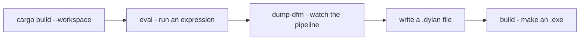

# Getting started

How to build NewOpenDylan, evaluate an expression, watch the pipeline,
and compile a Dylan program to a standalone Win64 `.exe`. Everything here
runs from the workspace root.

> **Status:** NewOpenDylan is a work-in-progress. `cargo build --workspace`
> is green and the commands below work. JIT (`eval`) is the primary path;
> AOT (`build`) works in **debug mode** today.

## Prerequisites

- **Windows 10/11, 64-bit.** The runtime and FFI are Windows-first.
- **Rust** (stable) — install from [rustup.rs](https://rustup.rs).
- **LLVM 22.1** — the back-end links against it (configured in
  `.cargo/config.toml`).
- **`link.exe`** (the MSVC linker, from the Visual Studio Build Tools) —
  only needed for AOT `build`.

## A first session



## Build the compiler

```
cargo build --workspace
```

This builds the back-end and driver: the IR (`nod-dfm`), the optimizer
(`nod-opt`), LLVM codegen (`nod-llvm`), the runtime and GC
(`nod-runtime`, `newgc-core`), and the driver (`nod-driver`). See the
[compiler overview](compiler/overview.md) for the crate map. The Dylan
front-end lives under [`compiler/`](../compiler/) and is built into a
static-library "shim" linked into the driver — see
[self-hosting](compiler/self-hosting.md).

## Run an expression

The fastest way to see the compiler work end-to-end is to JIT one
expression:

```
cargo run -p nod-driver -- eval "1 + 1"
```

`eval` parses, expands macros, runs sema, lowers to DFM, generates LLVM
IR, JIT-compiles it with [MCJIT](compiler/jit-and-aot.md), and prints the
result.

## Watch the pipeline

The driver exposes every stage as a dump command — run them on a fixture
to watch one program flow through the compiler:

```
cargo run -p nod-driver -- dump-tokens tests/nod-tests/fixtures/factorial.dylan
cargo run -p nod-driver -- dump-ast    tests/nod-tests/fixtures/factorial.dylan
cargo run -p nod-driver -- dump-dfm    tests/nod-tests/fixtures/factorial.dylan
cargo run -p nod-driver -- dump-llvm   tests/nod-tests/fixtures/factorial.dylan
```

Each stops one step deeper: tokens → AST → DFM IR → LLVM IR. The full
list is on the [driver page](compiler/driver.md).

## Your first program

A minimal Dylan program (`tests/nod-tests/fixtures/hello.dylan`):

```dylan
Module: hello

define function main () => ()
  format-out("hello\n");
end function main;
```

Every source file opens with a `Module:` header (see
[modules & libraries](language/modules-and-libraries.md)). The
`area-shapes.dylan` fixture is a richer starting point — classes, a
[generic function](language/generic-functions.md), and methods in a few
dozen lines.

## Compile to a standalone `.exe`

```
cargo run --bin nod-driver -- build tests/nod-tests/fixtures/area-shapes.dylan -o area-shapes.exe
```

This emits an object file and links it against `nod_runtime.lib` into a
standalone Win64 binary that needs no runtime installed. Multi-file
builds merge every file's AST before lowering; a `.prj` project file can
hold the file list. See [JIT & AOT](compiler/jit-and-aot.md) and the
[driver page](compiler/driver.md).

> **Caveat:** release-mode AOT currently hits a linker collision
> (`LNK2005 nod_user_main`); debug-mode AOT works. The IDE
> (`nod-ide.exe`) is itself a Dylan program AOT-built this way.

## The Dylan front-end

NewOpenDylan's front-end — lexer, parser, macro expander, sema, and
AST → DFM lowering — is written *in Dylan* and compiled into the driver.
The `dump-*` commands above already run it. See
[self-hosting](compiler/self-hosting.md) for how the Dylan front-end is
built, linked, and bridged to the back-end.

## Browse the docs

The docs render with DocCrate, the native Markdown viewer bundled in
`tools/doccrate/`:

```
pwsh tools/doccrate/Browse-Docs.ps1
```

To re-render a single page (useful when editing):
`pwsh tools/doccrate/Test-Render.ps1 -File <page>.md`.

## Where to go next

- [Language overview](language/overview.md) — what Dylan is and the feel
  of the code.
- [Architecture](architecture.md) — the front-end/back-end split at DFM.
- [Compiler overview](compiler/overview.md) — the pipeline and the crate
  map.
- [Glossary](glossary.md) — the vocabulary.

---
*[Docs home](README.md) · [Language overview](language/overview.md) · [Compiler overview](compiler/overview.md)*
