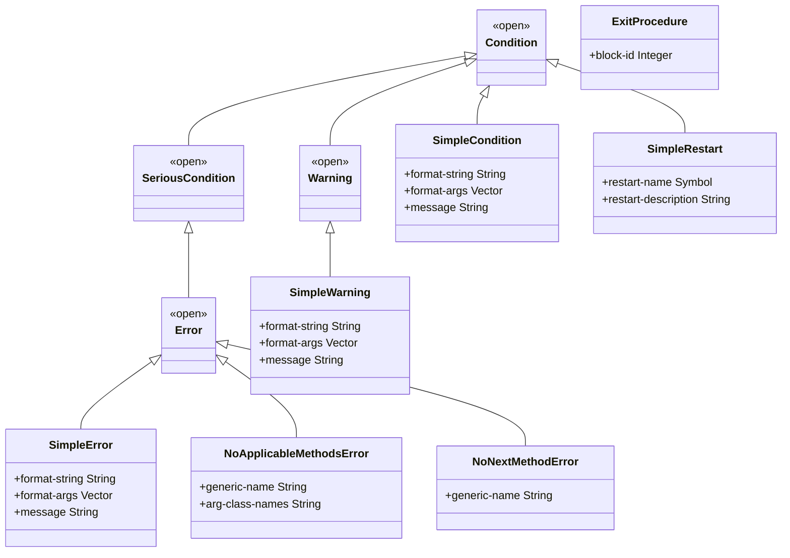
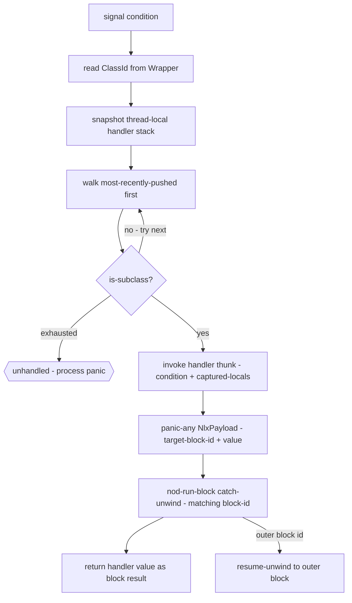
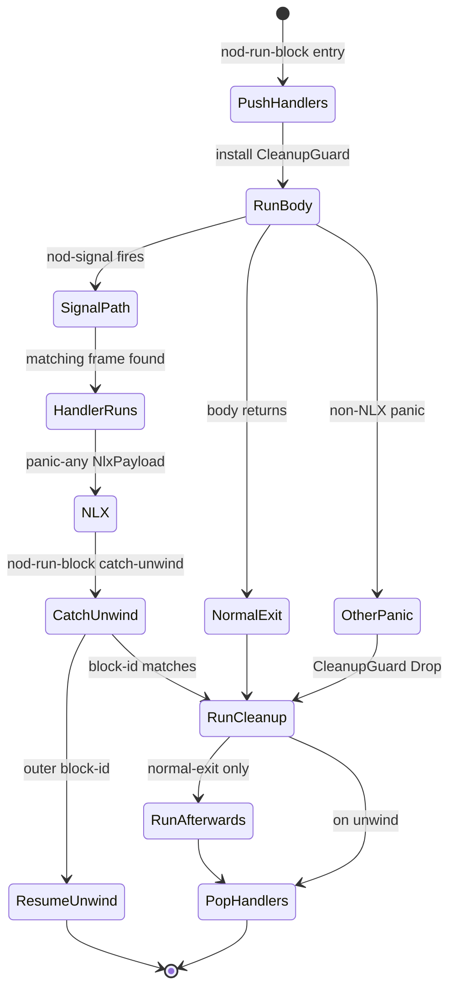

# Conditions

Dylan's condition system is a CLOS-style structured error mechanism: a condition is an
ordinary class instance, handlers are established dynamically on a thread-local chain, and
a handler may resume computation through a restart rather than simply unwinding. This page
documents what NewOpenDylan implements today — the runtime machinery is real and tested;
the high-level Dylan surface macros are thinner than the full DRM picture.

> Status: the runtime mechanism is live. Primitive-level `signal`, `block`, `exception`,
> and `cleanup` are fully wired. Restart invocation and the `let handler` macro form are
> not yet implemented.

## Conditions are instances

In Dylan a condition is not a special tag or an integer code — it is a heap-allocated
instance of a class that inherits from `<condition>`. This means:

- The condition object carries typed slots (message text, generic name, argument classes).
- The handler chain is searched by `is-subclass?`, so a handler on `<error>` catches any
  subclass of `<error>`.
- The same dispatch and slot-access machinery used for ordinary objects serves conditions.
  A condition class is registered, instantiated with `make`, and its slots are read through
  normal slot accessors.

## The condition class hierarchy

The classes below are registered at process boot. They are the **seed** classes; a later
stdlib port will add more in Dylan source.



*Class names use CamelCase in the diagram to avoid `<>` parser ambiguity; Dylan names are
`<condition>`, `<warning>`, `<serious-condition>`, `<error>`, `<simple-condition>`,
`<simple-warning>`, `<simple-error>`, `<no-applicable-methods-error>`,
`<no-next-method-error>`, `<simple-restart>`, `<exit-procedure>`.*

**Deviation from the DRM:** `<simple-error>` and `<simple-warning>` are
single-inheritance subclasses (of `<error>` and `<warning>` respectively) carrying
their own `message` slot. The DRM defines them as multiple-inheritance subclasses of
`<simple-condition>` and `<error>` / `<warning>`. The consequence:
`is-subclass?(<simple-warning>, <simple-condition>)` is false today. `is-subclass?`
through `<error>`, `<warning>`, and `<condition>` works correctly for the signal walker.

`<exit-procedure>` is not a condition class — it is the heap object representing the `k`
in `block (k) ... end`. It has no superclass. It is included here because it is seeded
alongside the condition classes at the same registration site.

## Signalling

`signal(condition)` is the primitive operation. For serious conditions, `error(message)`
is the shorthand that constructs a `<simple-error>` and signals it in one call.

### How signalling works

When the runtime signals, it:

1. Reads the class id from the condition's `Wrapper` header.
2. Snapshots the thread-local handler stack.
3. Walks the snapshot most-recently-pushed first, calling
   `is_subclass(condition_class, handler_class)` for each frame.
4. On the first match: invokes that frame's handler thunk, passes the condition Word as
   the first argument, then fires a non-local exit carrying the handler's return value to
   the matching block.
5. If no frame matches: panics with `"unhandled signalled condition: <ClassName>: detail"`.
   In test builds, this panic is catchable; in production it terminates the process.



### Dylan surface

At the primitive level, the expression form is:

```dylan
block ()
  signal(make(<simple-error>, message: "file not found"))
exception (c :: <error>)
  condition-message(c)
end
```

The `signal` built-in is lowered directly by the sema layer to a runtime signal call.
`error(message-string)` lowers to a runtime call that constructs a `<simple-error>` and
signals it without returning.

## Non-local exit: block and cleanup

Non-local exit (NLX) is the working core of the condition system. Every `block` form
lowers to a runtime block call that orchestrates the full lifecycle.

### block (k) — exit procedures

`block (k) ... k(v) ... end` binds `k` to an `<exit-procedure>` heap object carrying
the block's numeric id. Calling `k(v)` fires a non-local exit payload carrying
`{ target_block_id, value }`. The enclosing block catches that, recognises its block id
as the target, and returns `value` as the block's result.

### block ... cleanup ... end

`block () body cleanup cleanup-body end` (unwind-protect) wraps the body in a
catch-unwind and installs an RAII cleanup guard. The guard runs the cleanup thunk
unconditionally — on normal exit, on NLX, and on non-NLX panics. After the cleanup, an
`afterwards` thunk (if present) runs on the normal-exit path only.

The `with-cleanup` macro in the stdlib expands to
`block () body cleanup cleanup-body end`.

### block ... exception ... end

`exception` clauses are the handler-installation surface. Each clause pushes one
handler frame onto the thread-local stack before the body runs, with:

- the `ClassId` of the declared condition class,
- the id of the enclosing `block`,
- which of the block's handler thunks to invoke on match.

The handler stack is restored to its pre-entry baseline by the cleanup guard even if
the body panics through without matching any handler.

### The block lifecycle



Key implementation facts:

- NLX transport uses Rust panic + catch-unwind. All JIT-emitted functions use
  `extern "C-unwind"` so Rust panics may transit them.
- Handler thunks have signature `extern "C-unwind" fn(condition, c0..c7) -> u64`; the
  nine-argument ABI passes the condition Word first, then the eight captured-local slots.
- Body, cleanup, and afterwards thunks have signature
  `extern "C-unwind" fn(c0..c7) -> u64`.
- Up to eight surrounding locals may be captured through the block thunk boundary. A
  block that captures more than eight emits a lowering error.

### Code examples

A block that catches a dispatch error:

```dylan
block ()
  do-something-that-may-fail()
exception (c :: <error>)
  format-out("caught: %s\n", condition-message(c))
  #f
end
```

A block with cleanup (unwind-protect):

```dylan
block ()
  open-resource()
  use-resource()
cleanup
  close-resource()
end
```

An exit procedure:

```dylan
block (return)
  for-each-item(collection,
    method (item)
      when (item = target) return(item) end
    end)
  #f
end
```

## Handlers and restarts

### Handler establishment — current surface

At the primitive level, handlers are established by `block ... exception ...`. There is no
`let handler` macro form wired end-to-end yet. The `let handler` surface is parsed but the
exception-clause installation path is not lowered.

### Restarts — concept and current status

A **restart** is a named condition of class `<restart>` (a subclass of `<condition>`)
that, when signalled, offers to resume the computation that raised the original condition.
The canonical DRM protocol is:

1. Code about to do something risky establishes a restart before it signals an error.
2. A handler that catches the error may call `invoke-restart` to transfer control to the
   restart's body, which carries out the recovery action.
3. The restart unwinds back to the point where the restart was established.

This protocol allows a debugger or an outer handler to select a recovery strategy
(retry, use a default value, skip, abort) without unwinding any further than necessary.

**What is implemented today:**

- `<simple-restart>` is a registered class with `restart-name` (symbol) and
  `restart-description` (string) slots.
- `make-simple-restart(name, description)` allocates an instance.
- `invoke-restart` is a stub: calling it terminates the process.

**What is not yet implemented:**

- The active-restart chain (parallel to the handler chain).
- `with-restart` / `restart-query`.
- Restart inheritance through nested signals.
- The full DRM restart protocol with `invoke-restart` actually transferring control.

## How it is implemented — pointer to the compiler view

The mechanism described above — the handler frame, the NLX payload, the runtime block
entry point, the runtime signal call, and the RAII cleanup guard — is frozen in Rust and
documented in detail in [Runtime & object model](../compiler/runtime.md) under
"Conditions, handlers, and non-local exit". That page covers:

- The handler-frame struct (one entry on the thread-local handler chain).
- The NLX payload struct (block-id + return value).
- The RAII cleanup-guard pattern that runs cleanup even on unwind.
- The handler stack as a GC root (the in-flight condition Word is conservatively scanned).
- The AOT-mode NLX transport decision.

The condition class hierarchy, accessor generics, and printers are intended to live in
Dylan in the stdlib once the stdlib loader supports them. Today they live as Rust-side
seed registrations.

## Invariants and gotchas

- **Handler stack is thread-local.** Handler frames cannot cross thread boundaries.
- **NLX uses Rust panics, not SEH.** AOT builds that drop the Rust std panic runtime will
  need a different NLX transport.
- **Handler clause ordering is last-in-first-checked.** The signal walker walks the
  snapshot most-recently-pushed first. Within a single `block`, the last `exception`
  clause is checked before the first. Source-order precedence for more-specific classes is
  achieved by placing the more specific clause later in source.
- **A `block` form that closes over more than eight surrounding locals is a lowering
  error.** Pack captures into a heap environment object when this limit is hit.
- **`invoke-restart` is a stub.** Do not call it in production code until the full restart
  protocol is implemented.
- **`<simple-error>` is not `is-subclass?` of `<simple-condition>`.** Code checking
  `instance?(c, <simple-condition>)` will not match a `<simple-error>` today.

---
Next: [Sealing](sealing.md) · See also [Runtime & object model](../compiler/runtime.md)
