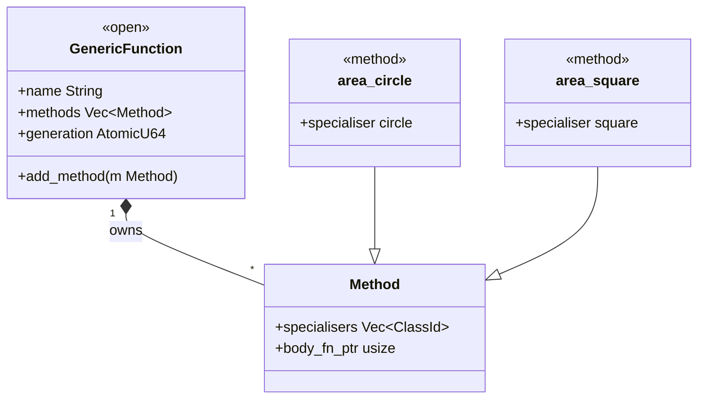
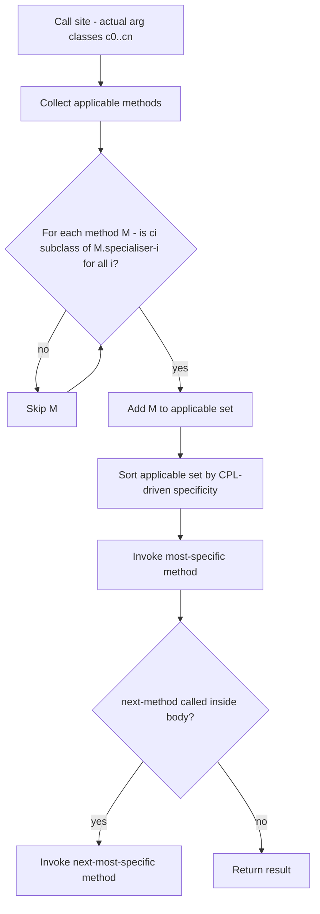
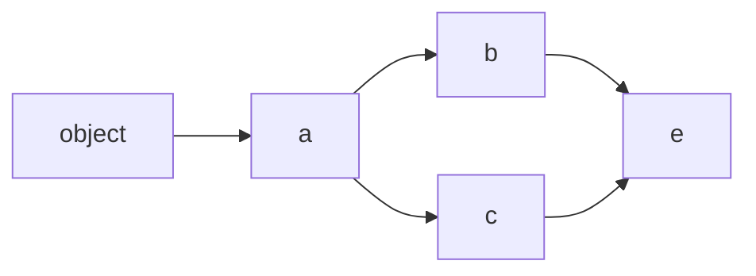

# Generic Functions & Multiple Dispatch

A *generic function* (GF) is an open, extensible operation. You define the name and
signature once; you add *methods* that specialise its behaviour for particular argument
classes. At each call site the runtime (or the compiler, if dispatch is sealed) selects
the single most-specific applicable method and invokes it. Every function in Dylan that
may ever have more than one implementation should be a generic.

## Generics and methods

A generic declaration names the function and states its signature:

```dylan
define generic area (s :: <shape>) => (<integer>);
```

The declaration does not provide a body. Bodies come from methods:

```dylan
define method area (c :: <circle>) => (<integer>)
  radius(c) * radius(c) * 3
end method area;

define method area (s :: <square>) => (<integer>)
  side(s) * side(s)
end method area;
```

Each method *specialises* one or more parameters with a class annotation
(`c :: <circle>`, `s :: <square>`). An unspecialised parameter implicitly specialises
on `<object>`, the root of the class hierarchy, and matches any argument.

Slot accessor generics follow the same pattern: `define class <circle>` with
`slot radius` causes sema to auto-generate a method on the generic `radius`
specialised to `<circle>`. The stdlib adds further GF examples: `size`, `element`,
`element-setter`, `remove-key!`, `keys`, `values`, and `object-hash` all have methods
specialised to concrete classes such as `<table>`.

### Generics are a set of methods, not a class

In single-dispatch OO, methods live inside a class. In Dylan, methods live in the
*generic function*. A generic is a process-global object that owns a list of methods
behind a lock. Any library that has access to the generic can add a method to it —
unless the GF is sealed (see "Sealing makes dispatch static" below).



## Multiple dispatch

Dylan dispatches on the classes of **all** specialised arguments simultaneously, not
just the first. This is *multiple dispatch* (multimethod dispatch). A method is
applicable only when each of its specialisers matches the corresponding actual argument.

Consider a generic `disp-intersect` with three methods registered with two-argument
specialiser vectors:

| Specialisers | Result |
|---|---|
| `[<disp-rect>, <disp-circ2>]` | 99 |
| `[<disp-rect>, <disp-rect>]` | 88 |
| `[<disp-circ2>, <disp-circ2>]` | 77 |

Calling `disp-intersect(rect-instance, circ-instance)` picks the first row; calling
it with two rect instances picks the second. The method selected depends on both
argument classes together.

This is a structural difference from single-dispatch languages, where the method is
determined by exactly one receiver. Dylan's two-argument dispatch on a generic like
`=` lets the standard library specialise equality for each pair of concrete types
without a visitor or type-switch.

## How a method is selected



**Step 1 — collect applicable methods.** A method `M` is *applicable* for actual
argument classes `c0..cn` when `is_subclass(ci, M.specialisers[i])` holds for every
position `i`.

**Step 2 — sort by specificity.** Applicable methods are sorted argument-major,
CPL-driven: at the first argument position where two methods differ, the method whose
specialiser appears **earlier** in that argument's class precedence list (CPL) wins.
Earlier in the CPL means closer to the actual argument class, which means more specific.

**Step 3 — invoke the most specific.** The method at the head of the sorted chain is
called with the original arguments.

**`next-method()`.** If the method body calls `next-method()`, execution transfers to
the next-most-specific method in the sorted chain. The runtime pushes a method-chain
frame onto a thread-local stack before calling the head method; the Dylan form
`next-method()` lowers to a runtime call that pops and invokes the next body.
`next-method?()` tests whether a next method exists without invoking it. For the
sealed direct-call path the fallback chain is pre-computed at compile time (see
[Runtime & object model](../compiler/runtime.md)).

If no applicable method exists the runtime signals `<no-applicable-methods-error>`.

## C3 linearization

The class precedence list for a class is computed by the **C3 linearization**
algorithm — the same algorithm Python's MRO uses. It guarantees a deterministic,
monotonic ordering of a class's ancestors.

For a diamond hierarchy — two classes `<b>` and `<c>` both inherit from `<a>`, and
`<e>` inherits from both — the merge produces:



**C3 result for `<e>`:** `[<e>, <b>, <c>, <a>, <object>]`

The algorithm works as follows:

1. Start with `[class_name]`.
2. Build one queue per parent's CPL, plus a final queue of the direct parents in
   declaration order.
3. Repeatedly pick a *good head*: the first queue front that does not appear in
   the tail of any other queue. Append it to the result and remove it from every
   queue that leads with it.
4. If no good head can be found, the inheritance graph has conflicting orderings
   and an inconsistent-merge error is returned (surfaced as an
   inconsistent-inheritance lowering error).

For the diamond above, both `<b>` and `<c>` declare `<a>` as their direct super;
`<e>` declares `(<b>, <c>)`. The C3 algorithm correctly places `<b>` before `<c>`
before `<a>` because `<b>` appears first in `<e>`'s declaration and C3 preserves
declaration order when both options are valid.

The CPL computed by linearisation is stored in the class metadata and used both for
slot layout (inherited slots are laid out in CPL order) and for the specificity sort
during dispatch. See [Semantic analysis](../compiler/sema.md) for the full slot-offset
computation.

**Inconsistent merge.** If two parents impose conflicting orders on a shared ancestor —
one parent CPL is `[<p1>, <x>, <y>]` and the other is `[<p2>, <y>, <x>]` — C3 cannot
pick a consistent head and returns an error. The compiler rejects the `define class`
form.

## Sealing makes dispatch static

By default a generic function is *open*: new methods can be added at any time and
dispatch is resolved at runtime via an inline cache.

A *sealed* generic or a *sealed domain* declaration tells the compiler that no new
methods will be added for the relevant specialiser shape within this library. When the
sealing facts plus the type estimates from the narrowing pass allow the compiler to
identify a unique most-specific method at the call site, it rewrites the DFM
`Dispatch` node to a `DirectCall` (no fallback chain; no runtime lookup) or a
`SealedDirectCall` (pre-computed fallback chain for `next-method` support). The
three closure conditions that trigger this rewrite are:

- **Sealed generic.** `define sealed generic` marks the whole GF closed.
- **Sealed domain.** `define sealed domain g (<A>, <B>)` closes just the
  specialiser tuple `(<A>, <B>)`.
- **All-sealed argument classes.** If every argument class is itself sealed the
  compiler knows the method set can't grow.

When sealing succeeds, the compiler records a dispatch resolution in the lowered
module (visible via `--dump-dispatch`). When in doubt — ambiguous methods, open
generic, unknown generic — the node stays as `Dispatch` and the runtime inline cache
handles it safely (the soundness rule: "when in doubt, leave as Dispatch").

See [Sealing](sealing.md) for the language-programmer's contract and
[Dispatch & sealing](../compiler/dispatch-and-sealing.md) for the dispatch planning
passes.

## How it is implemented

This page covers the language surface. The implementation splits across the
Dylan front end and the Rust back end:

**Front end (`nod-sema`):** registers generic names, lowers `define method`
bodies to DFM, and produces method-registration records (specialiser vector +
body symbol). After JIT compilation, each JIT'd function pointer is bound into
the runtime's GF table. The sealing and dispatch optimisation passes then rewrite
`Dispatch` nodes where the closure condition holds.
See [Semantic analysis](../compiler/sema.md).

**Back end (`nod-runtime`):** the dispatch entry point handles unresolved
`Dispatch` nodes. It checks the per-call-site cache slot, falls through to an
applicable-method lookup on a cache miss, pushes a method-chain frame for
`next-method`, writes the result back to the cache slot, and calls the method body.
The generation counter on the generic function is the only stale-cache signal.
See [Runtime & object model](../compiler/runtime.md).

---
Next: [Macros](macros.md) · See also [Sealing](sealing.md)
