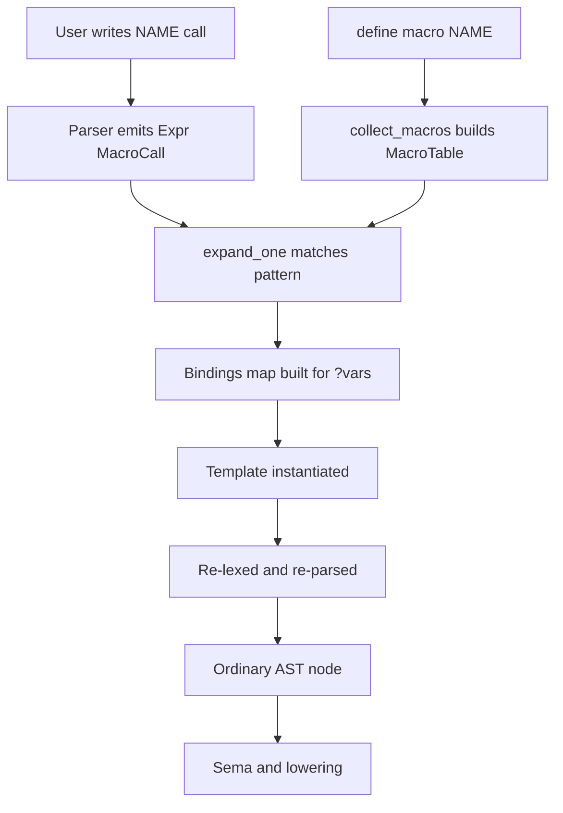
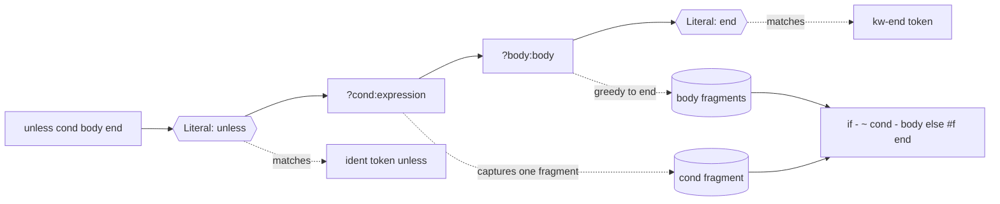

# Macros — extending the language

A `define macro` adds new syntax that is rewritten to ordinary Dylan
**before** the compiler sees it. This is how `unless`, `when`, `cond`,
and `with-cleanup` are defined in NewOpenDylan — not as hardcoded AST
variants, but as a handful of lines in the stdlib source. Every form you
write with `define macro` is expanded by the macro expander (`nod-macro`)
between the parser and sema, so downstream phases (type inference, codegen,
GC) see only the kernel forms they already know.

Dylan macros are **hygienic pattern-rule macros**. They are essential: much
of the `dylan` kernel library is macro-driven, so the stdlib relies on the
macro engine.

## Why macros

Dylan's design separates a small **kernel** of hardcoded forms — `if`,
`begin`, `let`, `method`, definitional items, `block` — from an open
**surface layer** expressed in Dylan itself. Everything that can be
defined in terms of the kernel *should* be: that keeps the compiler
small, makes the language extensible without touching a single Rust
file, and lets the stdlib grow as the macro engine matures.

The policy: any new control-flow keyword, iteration form, binding-shape, or
sugar goes in as a `define macro` in the stdlib. New AST expression or
statement variants are the exception, not the default. Control-flow forms
that can be expressed as macros live in the stdlib rather than as hardcoded
AST nodes.

## Writing a macro

A `define macro` has one or more **rules**. Each rule is a **pattern**
(written inside `{ … }`) and a **template** (after `=>`). The pattern
names match-capture sites with `?`-prefixed **pattern variables**,
optionally constrained by a kind annotation after `:`. The template
substitutes the captured fragments back in.

Here is the complete `unless` macro:

```dylan
define macro unless
  { unless ?cond:expression ?body:body end }
    => { if (~ ?cond) ?body else #f end }
end macro;
```

When the expander sees `unless (x > 0) do-something() end`, it:

1. Matches the call site against the pattern.
   `?cond:expression` captures `(x > 0)` as one fragment (a grouped
   paren counts as one expression-fragment).
   `?body:body` greedily captures `do-something()` — everything between
   the condition and the `end` keyword.
2. Instantiates the template, substituting the captured fragments:
   `if (~ (x > 0)) do-something() else #f end`.
3. Re-parses that text as ordinary Dylan. Sema sees an `if` expression;
   it never sees `unless` at all.

Here is the `when` macro:

```dylan
define macro when
  { when ?cond:expression ?body:body end }
    => { if (?cond) ?body else #f end }
end macro;
```

Both expand to `if` with an `else #f` arm so the return type is
always well-defined even when the body is not taken.

## Diagram: from definition to expanded AST



The expansion engine is documented in detail in
[Macro expander](../compiler/macro-expander.md). This page covers only
the user-facing syntax.

## Diagram: the `unless` rule walked



The `?cond:expression` variable binds a single fragment (a paren group
such as `(x > 0)` counts as one fragment because the grouper wraps it).
The `?body:body` variable is greedy: it consumes all remaining fragments
up to the next pattern literal — here, the `end` keyword.

## Pattern variables and constraints

Pattern variables are written `?name:kind` (or `?name` with a default
kind of `expression`). The supported constraint kinds are:

| Constraint | What it matches | Bound as |
|---|---|---|
| `:expression` | One fragment: a single token, or a grouped paren/bracket/brace | Fragment sequence |
| `:name` | Exactly one identifier token | Single token |
| `:body` | Greedy: all remaining fragments up to the next pattern literal; depth-aware for `end`-terminated forms | Fragment sequence |
| `:variable` | A let-binder shape: bare `Ident`, or `Ident :: <type>` triple | Fragment sequence |
| `:macro-arg` | Like `:expression`, intended to stop at comma (comma handling not yet distinct; currently aliases `:expression`) | Fragment sequence |
| `:parameter-list` | A paren-wrapped parameter list `(x, y :: <integer>)` | Fragment sequence |
| `:constraint` | Explicit constraint form `?x:{ <expr> }` (currently aliases `:expression`; the constraint check is not yet distinct) | Fragment sequence |

Names outside this set that the engine recognises as forward-compatible
taxonomy (`case-body`, `type`, `case-expression`, `definition`) are
aliased to `expression` today.

In a multi-rule definition, rules are tried left to right; the first
match wins. There is no within-rule backtracking. Write the
most-specific rule first.

## Hygiene

Template-introduced identifiers that appear in **binding position**
(after `let`, in method parameter names) are renamed to
`name__nod_hyg_{nonce}`, where `nonce` is a per-expansion monotonic
counter. This prevents a macro's internal temporaries from accidentally
capturing names the caller already uses.

Identifiers in **reference position** are emitted unchanged so they
resolve against the call site's scope, not the macro's definition scope.

Dylan keywords and core type names in the no-rename set are never renamed
even in binding position. The no-rename set includes `if`, `else`,
`elseif`, `begin`, `let`, `method`, `block`, `cleanup`, `values`, and the
built-in type names such as `<integer>`, `<boolean>`, and `<object>`.

The `for-each` macro in the stdlib demonstrates hygiene in practice: the
internal variable `%fip-state` begins with `%`, which is a Dylan
convention for private names. Hygiene renaming adds an extra layer of
protection so even an identically-named caller variable does not collide
with the macro's iteration state.

## Stdlib macros

These are the macros NewOpenDylan ships, all defined in the stdlib source:

| Macro | Surface | Expands to |
|---|---|---|
| `for-each` | `for-each (?var:name in ?coll:expression) body end` | FIP loop over a collection using `%fip-init` / `%fip-finished?` / `%fip-current-element` / `%fip-advance!` |
| `unless` | `unless cond body end` | `if (~ cond) body else #f end` |
| `when` | `when cond body end` | `if (cond) body else #f end` |
| `cond` | `cond (t1) (b1) … otherwise (d) end` | Nested `if/elseif/else` chain (1–4 arms, see below) |
| `with-cleanup` | `with-cleanup body cleanup cleanup-body end` | `block () body cleanup cleanup-body end` |

The `for-each` macro is a call-shaped form: the variable and collection
appear before the body. The body-shaped forms (`unless`, `when`, `cond`,
`with-cleanup`) use the `NAME … end` surface and are recognised by the
parser via a seed set of known-macro names.

## Current limits

**No `*` repetition.** The pattern language has no repetition operator
yet. A pattern cannot say "one or more `(test) (body)` pairs." This
means every multi-arm form must be written as a fixed set of rules
covering each supported arity.

`cond` is the most visible consequence. Its definition contains four
explicit rules covering 1, 2, 3, and 4 test/body pairs plus an `otherwise`
default. A `cond` with five or more arms requires nesting a second `cond`
inside the `otherwise` clause:

```dylan
cond
  (x < 0) ("negative")
  (x = 0) ("zero")
  (x = 1) ("one")
  (x = 2) ("two")
  otherwise
    (cond
       (x = 3) ("three")
       otherwise ("many")
     end)
end
```

The cap is purely the number of fixed rules written — adding more rules
extends it. The same limit would apply to any other multi-arm form
(`case`, `select`, `for`) until repetition lands.

Until `*` repetition is added, the `cond` body of each clause must also be a
single `:expression` fragment (i.e. a paren-wrapped group for any
multi-token expression). The paren tax is the price of admission until the
macro engine grows `*` repetition.

**Same-file restriction.** A macro and its call sites must currently live
in the same parsed module. Cross-file macro use is not yet implemented. The
stdlib macros work because the stdlib is compiled together with the user
file as a single merged module.

**No auxiliary `rule` clauses.** The `for` statement's many clause
shapes (from-to, from-below, in-collection, etc.) would each need a
separate sub-rule. That engine extension is not yet implemented.

**Definition macros not expanded.** `define table`, `define test`, and
similar `define`-headed user macro calls are parsed but not expanded.
Expression-position and statement-position macro calls work fully.

## How it is implemented

The expansion engine lives in `nod-macro` and is documented in
[Macro expander](../compiler/macro-expander.md). Key points for the
curious reader:

- The expander works on **fragments** (a token-group representation),
  not on parsed AST nodes. It re-lexes the call-site span to get a flat
  token/group sequence, then pattern-matches against that.
- Pattern matching is greedy and left-to-right with no within-rule
  backtracking.
- Expansion is bottom-up: inner macro calls are expanded before the
  outer call is attempted. Recursive macros are bounded by a depth limit
  of 64.
- After template substitution, the result text is re-lexed and
  re-parsed as an expression. Spans are rewritten to point back to the
  original call site so error messages and the IDE show the user's
  source, not the expansion.

See also [Reader: lexer and parser](../compiler/reader.md) for how the
parser seeds its known-macro set (enabling the body-shaped `NAME … end`
recognition) and [Semantic analysis](../compiler/sema.md) for what
happens to the expanded AST.

---
Next: [Modules & libraries](modules-and-libraries.md) · See also [Macro expander](../compiler/macro-expander.md)
