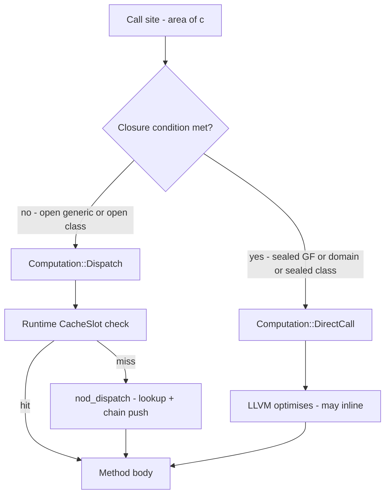
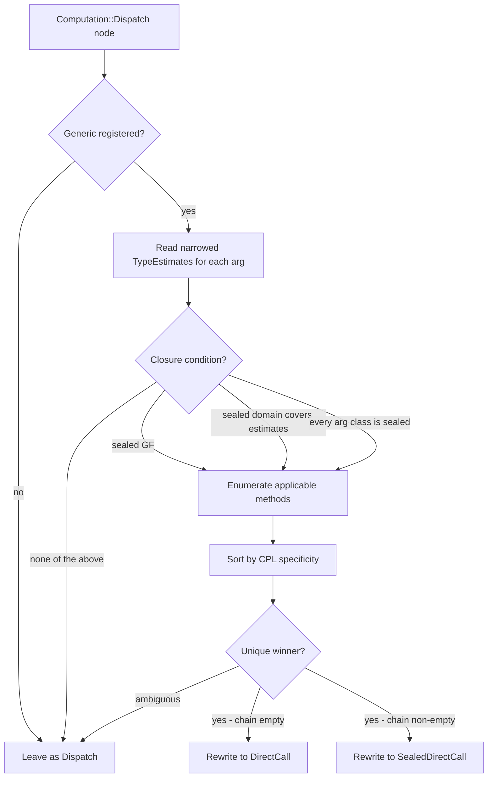

# Sealing — Controlled Dynamism Made Concrete

Sealing is Dylan's promise that a class or generic function will not be extended
beyond its home library. That promise lets the compiler replace runtime dispatch
with a direct function call — no cache, no runtime dispatch, no indirection. This
is the payoff of "controlled dynamism": a language that reads dynamic but compiles
to code as fast as if you had written static method calls.

Sealing is *opt-in*. Everything is open by default; sealing is the production-tuning
step. See [Language overview](overview.md) for the broader philosophy.

This page is the language-programmer's view of sealing. For the compiler algorithm —
the type-narrowing and dispatch-resolution passes — see
[Dispatch & sealing](../compiler/dispatch-and-sealing.md).

## The promise — three kinds of sealing

### Sealed class

```dylan
define sealed class <circle> (<shape>)
  slot radius :: <integer>, init-keyword: radius:;
end class;
```

The `sealed` modifier on `define class` records the class's `sealed` flag. From that
point on, any attempt to subclass `<circle>` from a different library fails at compile
time with a sealing-violation error.

The sealed bit is set *after* every class in the current lowering call is registered.
This timing is deliberate: an in-library subclass of a sealed class is legal, so the
seal must not fire until all same-library subclasses are already in place.

`define open class` is the explicit spelling of the default. Seed classes such as
`<integer>`, `<boolean>`, and `<character>` are sealed by construction: the fixnum-tag
encoding makes them physically non-subclassable, so the resolver treats them as sealed
without consulting a flag.

### Sealed generic function

```dylan
define sealed generic area (s :: <shape>) => (<integer>);
```

The `sealed` modifier on `define generic` marks the generic function sealed. No method
may be added to `area` from outside this library. The runtime refuses any such attempt
with a sealed-generic error.

### Sealed domain

```dylan
define sealed domain area (<shape>);
```

A sealed domain is more fine-grained: the generic itself remains open to
extension with methods on other argument types (say, `<polygon>`), but the
dispatch shape `area(<shape>)` — meaning any call where the argument is
`<: <shape>` — is promised complete within this library.

Sealed domains are recorded in the sealing facts and on the generic function at the
runtime level. Each entry is a specialiser tuple of class ids.

**Source-syntax gap:** `define sealed domain` is parsed via a catch-all path. The
parser currently drops the specialiser-tuple fragments before reaching the lowerer, so
sealed domains cannot be installed from source syntax alone in the current build.
In-process tests and the REPL install them programmatically. Full source-syntax support
is not yet implemented.

### Default openness

Without any `sealed` modifier, classes and generics are **open**. Any library that
can see the generic can add a method; any library that can see the class can
subclass it. The compiler cannot prove the method set closed and leaves dispatch
as a runtime dispatch node handled by the inline cache.

## Why seal: static dispatch

When the compiler can prove the complete method set at a call site, it rewrites the
DFM dispatch node — the node that would otherwise call the runtime dispatcher and check
the inline cache — to a `DirectCall` (single applicable method, no fallback chain) or a
`SealedDirectCall` (pre-computed fallback chain for `next-method` support). Neither
variant emits a cache check; neither calls the runtime dispatcher. LLVM sees a direct
call to the method body and can inline or optimise it like any other function call.



The rewrite is strictly opt-in and sound-by-default: when in doubt the node stays
as a runtime dispatch and the inline cache handles it safely.

## When the compiler closes dispatch

The resolution pass runs after the type-narrowing pass. For each dispatch node it runs
the following algorithm:

1. Look up the generic in the runtime registry. If unknown, leave as a dispatch.
2. Read the narrowed type estimate for each call argument.
3. Check the **closure condition**:
   - the generic's `sealed` flag is set, **OR**
   - every argument estimate `est[i]` is `<: Si` for some sealed domain
     `(S0, …, Sn)` on that generic, **OR**
   - every argument's class is itself sealed (including seed immediates such
     as `<integer>`, `<boolean>`, `<character>`, `<single-float>`,
     `<double-float>`, and `<byte-string>`).
4. Enumerate **applicable methods**: method `M` is applicable iff every
   `est[i]` is a subtype of `M.specialisers[i]`.
5. Sort by CPL-driven specificity. A unique most-specific winner rewrites the
   node. Ambiguous → leave as a dispatch.
6. Emit `DirectCall` (no fallback chain) or `SealedDirectCall` (chain non-empty,
   for `next-method` support). Preserve safepoint roots verbatim for GC
   correctness.
7. Record a resolution entry in the runtime's back-reference index for future
   invalidation.



The narrowing pass that feeds estimates into step 2 applies these rules:

- A method parameter `p :: <circle>` gives the estimate `Class(<circle>)`.
- `make(<circle>, …)` gives `Class(<circle>)` for the result.
- An `instance?` guard on the `then`-branch narrows the checked temp to
  `meet(prev, Class(<C>))`.
- A slot typed `slot c :: <circle>` yields `Class(<circle>)` when read.

### Worked example

```dylan
define sealed class <shape> (<object>) end class;
define sealed class <circle> (<shape>)
  slot radius :: <integer>, init-keyword: radius:;
end class;
define sealed class <square> (<shape>)
  slot side :: <integer>, init-keyword: side:;
end class;

define sealed generic area (s :: <shape>) => (<integer>);
define method area (c :: <circle>) => (<integer>)
  c.radius * c.radius * 3
end method area;
define method area (s :: <square>) => (<integer>)
  s.side * s.side
end method area;

define function total (c :: <circle>, s :: <square>) => (<integer>)
  area(c) + area(s)
end function;
```

Inside `total`, the narrowing pass gives `c :: Class(<circle>)` and
`s :: Class(<square>)` from the method specialisers. The resolver checks `area`:
the generic is sealed, so closure holds. Only `area(<circle>)` is applicable for
`c`; only `area(<square>)` for `s`. Both sites rewrite to `DirectCall`. The
`dump-dispatch` annotation shows:

```
t0: <integer> = DirectCall area$<circle-id>(c)    ; sealed-direct
t1: <integer> = DirectCall area$<square-id>(s)    ; sealed-direct
t2: <integer> = PrimOp AddInt t0 t1
```

No cache loads; no runtime dispatch calls; no cache slots written.

## Enforcement — cross-library subclass refusal

The compiler enforces sealed-class promises at the library boundary. During class
registration, if the parent's `sealed` bit is set and this lowering call is a different
"library", the subclass is refused with a sealing-violation error.

The check fires because the sealed bit is flipped *after* all in-library classes are
registered. A second lowering call — simulating a different library — sees the sealed
bit already set and refuses. In-library subclassing of a sealed class always succeeds.

The analogous guard for generics — refusing to add a method to a sealed GF — lives at
the runtime level and returns a sealed-generic error.

## Open by default

The default for both classes and generics is *open*. Sealing is the step you
take when a library's design is stable and you want the compiler to exploit the
static knowledge. Seal too eagerly and you break downstream extension; seal
deliberately and you get free static dispatch wherever the type estimates are
specific enough.

## Performance note

The win from sealing is "emit a `DirectCall` that LLVM can see, so LLVM can inline and
optimise it" — not magic front-end work. In release mode, a fully-sealed task-class
hierarchy dispatches measurably faster than the equivalent open hierarchy; the ratio
widens as LLVM's cross-function inlining makes sealed-direct call bodies inline
candidates. The bulk of optimisation is done by LLVM; the front end's job is to expose a
direct call where it is provably correct.

## How it is implemented

The sealing and dispatch optimisation pipeline runs after all DFM is built:

| Pass | What it does |
|------|--------------|
| Collect sealing facts | Reads the `sealed` modifier on `define class` / `define generic`; records sealed domains |
| Narrow type estimates | Forward dataflow per function; produces narrowed estimates |
| Resolve dispatches | Rewrites `Dispatch` to `DirectCall` / `SealedDirectCall` where closure holds |

The full pipeline diagram, including where this fits in the multi-phase lowerer, is in
[Dispatch & sealing](../compiler/dispatch-and-sealing.md). The DFM IR types
(`Computation::Dispatch`, `Computation::DirectCall`, `Computation::SealedDirectCall`,
type estimates) are documented in [DFM: the IR](../compiler/dfm.md).

## See also

- [Generic functions & dispatch](generic-functions.md) — how dispatch works before sealing intervenes
- [Dispatch & sealing](../compiler/dispatch-and-sealing.md) — the full compiler pipeline
- [Runtime & object model](../compiler/runtime.md) — the cache slot, runtime dispatcher, sealed-direct chain frame
- [DFM: the IR](../compiler/dfm.md) — `Computation::Dispatch`, `DirectCall`, `SealedDirectCall`

---
Next: [Generic functions & dispatch](generic-functions.md) · See also [Overview](overview.md)
