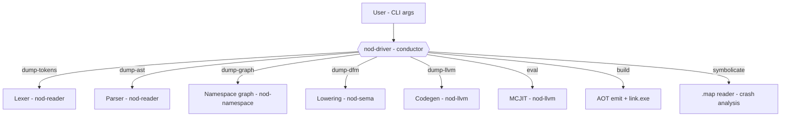
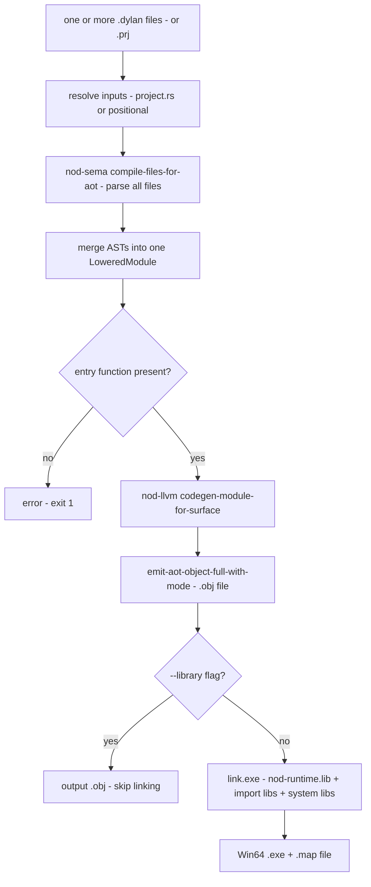

# Driver: CLI, REPL, Build Orchestration

The `nod-driver` binary is the entry point for everything: it parses command-line arguments, selects a pipeline depth, runs the chosen stages, and either prints intermediate output (the dump commands) or produces a final artifact (object file, linked EXE, or JIT-evaluated result).

> Crate: `src/nod-driver`  ·  Status: live — the CLI / build conductor

## Role in the pipeline

The driver sits above every crate. It never implements a compiler stage itself; instead it sequences calls into `nod-reader`, `nod-sema`, `nod-llvm`, and `nod-namespace` to produce whichever output the subcommand requests.



The three `--*-with-dylan` global flags modify the pipeline by replacing or shadowing Rust stages with Dylan-compiled equivalents. All Dylan front-end plumbing routes through the self-hosting shim modules (`dylan_lex_jit`, `dylan_parse_wire`, `dylan_parse_check`, `dylan_to_ast`) whose detail lives on [self-hosting](self-hosting.md).

## Subcommands

Every subcommand and where it stops in the pipeline (`src/nod-driver/src/main.rs:101`):

| Subcommand | Stops after | What it shows / produces | Notes |
|------------|-------------|--------------------------|-------|
| `dump-tokens <file>` | lexer | line-oriented token stream (spec format) | stable, diffable |
| `dump-ast <file>` | parser + macros | AST as indented S-expression | respects `--parse-with-dylan` |
| `dump-graph <lid>` | namespace | library/module graph as Graphviz | takes a `.lid` file |
| `dump-dfm <file>` | AST-to-DFM lowering | textual DFM IR | the cut-line dump |
| `dump-llvm <file>` | LLVM codegen | textual LLVM IR | |
| `eval <expr>` | MCJIT | evaluated result, printed | expression string, not a file |
| `build <files...>` | link.exe | standalone Win64 `.exe` (or `.obj` in `--library` mode) | the full AOT pipeline |
| `compile <file>` | — | — | not yet implemented (exit 2) |
| `repl` | — | — | not yet implemented (exit 2) |
| `dump-dylan-tokens <file>` | Dylan lexer EXE | canonical token dump from Dylan-compiled lexer | `--gc-stats` flag |
| `dump-dylan-ast <file>` | Dylan AST wire reader | indented tree from `dylan-parse-emit` | implies `--lex-with-dylan` |
| `parse-dylan <file>` | Dylan parser EXE | AST dump from Dylan-compiled parser | `--time` flag |
| `symbolicate` | .map reader | raw hex IPs rewritten to `name+0xNN` | stdin/stdout or `--in`/`--out` |

## The dump pipeline as a depth dial

Each dump command is the previous one plus one more stage. Running them in order on the same file shows one expression flowing all the way through the compiler:


`dump-graph` takes a `.lid` file rather than a `.dylan` file; it runs in a separate branch that loads the `nod-namespace` library/module graph rather than the per-file front-end. All other dump commands take a single `.dylan` source file.

## The `build` pipeline in detail

`build` orchestrates the full AOT pipeline end-to-end. The driver is the only place that touches the linker; every other phase stays in its own crate.



Key implementation points verified in the source:

- **Multi-file merge** (`main.rs:547`): `nod_sema::compile_files_for_aot` receives all input paths as a slice and returns one merged `LoweredModule`. The AST merge happens before any lowering, not after — consistent with the architecture rule that DFM modules must not be stitched post-lowering.
- **Entry check** (`main.rs:565`): before codegen, the driver asserts that `lm.functions` contains a function whose name matches `entry_function` (default `"main"`, overridable via `.prj`). This surfaces a clear error before the linker would fail obscurely.
- **Object path** (`main.rs:604`): the `.obj` is co-located next to the output EXE, with the `.exe` extension replaced by `.obj`. It is always emitted even in library mode.
- **Map file** (`main.rs:722`): the linker is always called with `/MAP:<output>.map`. The `.map` feeds the `symbolicate` subcommand for crash analysis.
- **Runtime lib location** (`main.rs:477`): the driver walks up from `current_exe()` looking for `nod_runtime.lib`, or reads the `NOD_RUNTIME_LIB` env var override. Compile `nod-runtime` first with `cargo build -p nod-runtime`.
- **Library mode** (`main.rs:533`, `main.rs:159`): `--library` emits `AotShape::StaticLibrary` instead of `AotShape::Executable` — skips the synthetic `i32 @main()` injection and the `nod_user_main` rename, then stops before invoking the linker.
- **Optimization level** (`main.rs:638`): AOT always uses `OptimizationLevel::Default`. There is no `--release` flag yet.
- **Import libraries** (`main.rs:614`, `main.rs:729`): `collect_user_dlls` scans the `ModuleManifest` for `RelocKind::StubEntry` rows and passes the matching `.lib` files to the linker. A hard-coded set of system libs covers everything the Rust runtime and COM types need.

### Project files

Sprint 49 added `.prj` support so multi-file builds can be described once. A project file is TOML (`src/nod-driver/src/project.rs`):

```
name    = "nod-ide"
sources = ["nod-ide.dylan", "ide-render.dylan"]
output  = "nod-ide.exe"
```

The optional `start_function` field overrides the entry-point name (default `"main"`) — useful when bundling files that each define `main` under different names.

`ResolvedProject` fields (`project.rs:83`): `name`, `sources` (absolute paths in declaration order), `output` (absolute path, defaults to `<project-dir>/<name>.exe`), `project_path` (the `.prj` itself), `start_function` (defaults to `"main"`).

**Path anchor rule** (`project.rs:39`): every relative path in a `.prj` is resolved against the project file's own directory, not the caller's working directory. `build --project src/foo.prj` from the repo root finds `foo.dylan` in `src/`, not in `.`.

Pass `--project foo.prj` to `build`. Positional file arguments and `--project` are mutually exclusive (`clap` enforces this at parse time via `conflicts_with`).

## Global front-end flags

Three global flags redirect the lexer or parser through Dylan-compiled code. All are also settable via environment variables (`NOD_LEX_WITH_DYLAN=1`, `NOD_VERIFY_PARSE=1`, `NOD_PARSE_WITH_DYLAN=1`) so they work from `cargo test`.

| Flag | Sprint | Effect | Env var |
|------|--------|--------|---------|
| `--lex-with-dylan` | 51b | JIT-straps (or static-links) the Dylan-side lexer; installs it as `nod_reader`'s lex override for the whole process | `NOD_LEX_WITH_DYLAN` |
| `--verify-parse` | 51c | For every `parse_module` call, also runs the Dylan-side parser and asserts both verdicts agree; disagreement is exit 3; implies `--lex-with-dylan` | `NOD_VERIFY_PARSE` |
| `--parse-with-dylan` | 51e | Authoritative mode — runs the Dylan parser, translates its AST wire output into a canonical `ast::Module`, and uses it as the parse result; falls back per-file to the Rust parser for unsupported constructs | `NOD_PARSE_WITH_DYLAN` |

These flags are `global` in clap (`main.rs:63`, `main.rs:78`, `main.rs:97`) and therefore accepted before or after any subcommand. They touch only the dump and build subcommands; `symbolicate` and `dump-graph` never run the front-end.

The four shim modules that implement these features are:

| Module | Responsibility |
|--------|----------------|
| `dylan_lex_jit.rs` | Static-link shim init; installs Dylan lex as `nod_reader` override |
| `dylan_parse_wire.rs` | Calls `dylan-parse-emit`; decodes the AST wire format into `DylanAst` |
| `dylan_to_ast.rs` | Translates `DylanAst` into the canonical `ast::Module` |
| `dylan_parse_check.rs` | Calls `dylan-parse-collect`; compares accept/reject verdict vs Rust parser |

Full detail: [Self-hosting](self-hosting.md).

## Dylan front-end subcommands

Three subcommands exercise the Dylan-compiled front-end as standalone tools:

**`dump-dylan-tokens <file> [--gc-stats]`** (`main.rs:208`): builds `dylan-lexer.dylan` + `dylan-lexer-main.dylan` into a cached EXE (keyed by a hash of the source + driver version + driver binary mtime), spawns it with the input file as `argv[1]`, and forwards its stdout byte-for-byte. `--gc-stats` is passed through to the EXE so the Dylan-side GC prints allocation stats to stderr.

**`dump-dylan-ast <file>`** (`main.rs:224`): uses the statically-linked shim path — calls `dylan-parse-emit` directly in-process, decodes the 4N-fixnum wire records into a `DylanAst` tree, and prints it as an indented S-expression. Always implies `--lex-with-dylan`.

**`parse-dylan <file> [--time]`** (`main.rs:231`): similar caching strategy to `dump-dylan-tokens` but builds `dylan-lexer.dylan` + `dylan-parser.dylan` into a separate `dylan-parser.exe`. The `--time` flag measures wall-clock for the spawned EXE's run only (not the one-off build step).

The cached EXEs live in `%TEMP%\nod-dylan-lexer-<hash>\` and `%TEMP%\nod-dylan-parser-<hash>\`. The hash covers source content, driver version string, and driver binary size + mtime, so a driver rebuild or source change invalidates and rebuilds automatically.

## `symbolicate` — crash dump post-mortem

`symbolicate` reads a linker `.map` file and rewrites every `0x<16hexdigits>` token in a crash log to `name+0xNN (0x...)`. It is designed for the `[GAP-011] push caller backtrace` style output the runtime emits during a crash, but works on any text containing 18-character hex addresses.

```
nod-driver symbolicate --map foo.map --in crash.log --out resolved.txt
```

Without `--in`/`--out`, reads stdin and writes stdout. `--runtime-base <hex>` overrides the preferred load address from the `.map` for EXEs that ASLR-slid to a different base (rare on Windows where `.exe` files commonly load at their preferred address).

The `.map` is always emitted alongside every `build` run (`main.rs:722`). `symbolicate` lives in `nod-driver` rather than `nod-runtime` deliberately: adding code to `nod-runtime` shifts its CGU layout and breaks the archive extraction rule that `aot_user_main_stub.rs` depends on (`main.rs:1254`).

## Invariants and gotchas

- **`compile` and `repl` are not implemented** (`main.rs:342`, `main.rs:397`). Both print an error and exit with code 2. `compile` is a placeholder for a future LID-rooted full-library compilation mode. `repl` is mentioned as "Sprint 08" in the error message.
- **AOT optimization is always `Default`** (`main.rs:638`). There is no `--release` flag. The optimization level is hardcoded; LLVM -O2/-O3 is not yet offered as a CLI option.
- **Library mode skips the linker entirely.** When `--library` is passed, the driver stops after `emit_aot_object_full_with_mode` and copies the `.obj` to the output path. The caller is responsible for linking. The `nod_aot_resolve_relocs` function is still emitted in the object; the host binary must call it once before invoking any Dylan-side functions.
- **Multi-file builds require all files to declare the same `Module:` header.** This is checked inside `nod_sema::compile_files_for_aot` — the driver does not re-check it.
- **Positional inputs and `--project` are mutually exclusive.** `clap` rejects both being set at the same time. `--project` alone sets both the file list and the default output path.
- **`NOD_RUNTIME_LIB` env var.** Set this in CI to point directly at the staticlib rather than relying on the walk-up heuristic.
- **link.exe must be on `PATH` or found via MSVC registry.** The driver calls `cc::windows_registry::find("x86_64-pc-windows-msvc", "link.exe")`. Build from a Developer Command Prompt or install VS Build Tools.
- **The Dylan lexer shim requires a pre-built `.obj`.** Without `tests/nod-tests/fixtures/dylan-lex-shim.lib.obj` (built separately), `--lex-with-dylan` falls back to the Rust lexer with a warning rather than erroring.
- **`NOD_VERIFY_PARSE=1` implies `NOD_LEX_WITH_DYLAN=1`** (`main.rs:281`). The verify-parse path shares the shim's resolver.

## Where in the code

| File | Lines | Responsibility |
|------|-------|----------------|
| `src/nod-driver/src/main.rs` | ~1501 | `Cli` struct, `Command` enum, `main`, all `run_*` functions, `run_build_full`, `run_symbolicate`, shim init |
| `src/nod-driver/src/project.rs` | ~373 | `RawProject`, `ResolvedProject`, `LoadError`, TOML parsing, path resolution |
| `src/nod-driver/src/dylan_lex_jit.rs` | — | Static-link shim init; `nod_reader` lex override installation |
| `src/nod-driver/src/dylan_parse_wire.rs` | — | `dylan-parse-emit` call; `DylanAst` wire decode |
| `src/nod-driver/src/dylan_to_ast.rs` | — | `DylanAst` → `ast::Module` translation; `Unsupported` fallback |
| `src/nod-driver/src/dylan_parse_check.rs` | — | `dylan-parse-collect` call; verify-mode verdict comparison |

## See also

- [Compiler overview](overview.md) — the full pipeline and the crate map
- [JIT and AOT](jit-and-aot.md) — what happens inside `nod-llvm` after the driver hands off: MCJIT engine, `emit_aot_object_full_with_mode`, the AOT entry-stub injection
- [Self-hosting](self-hosting.md) — the wire formats, the shim build process, and how Dylan-compiled phases replace Rust ones
- [Namespaces](namespace.md) — what `dump-graph` loads: the LID format and the library/module dependency graph

---
[Manual home](../index.md) · [Compiler overview](overview.md)
