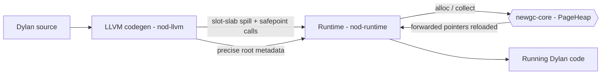
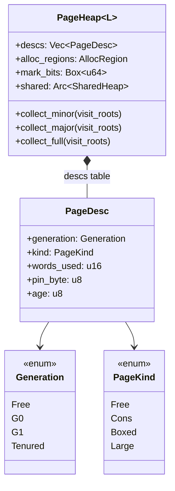
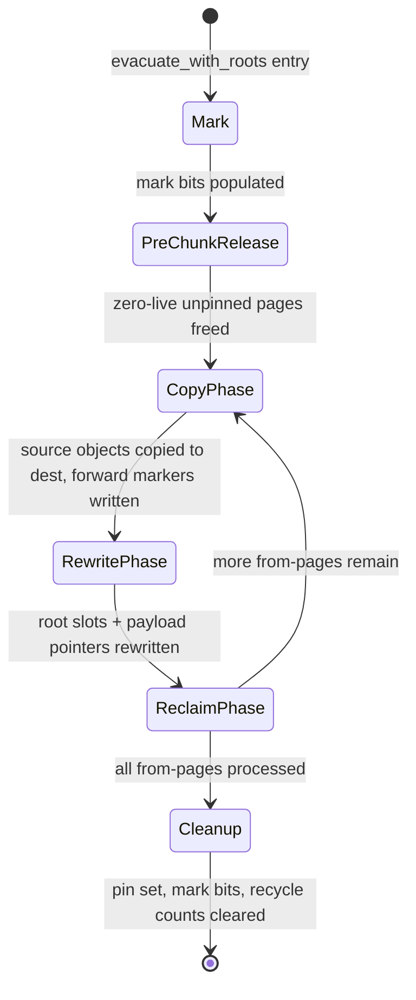
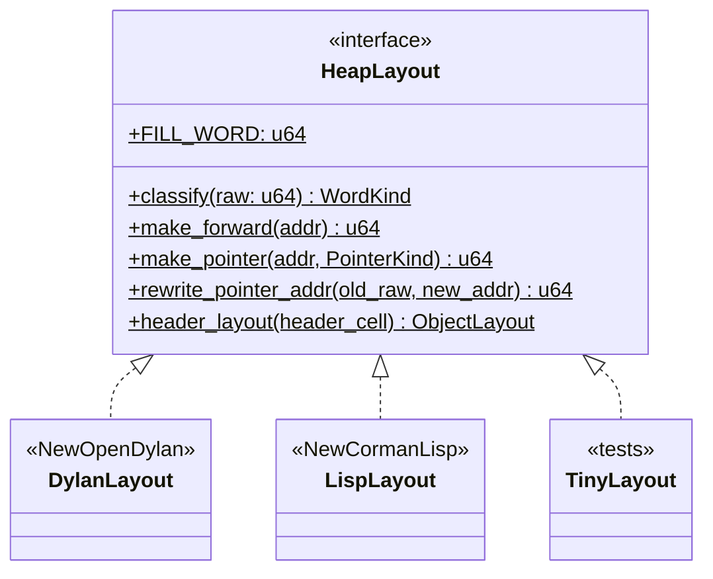

# Garbage Collector

NewOpenDylan's runtime uses a **precise, page-based, mark-evacuate generational
collector** implemented in the `newgc-core` crate. The same crate is the
portfolio's shared GC — it is language-agnostic, parameterised by a `HeapLayout`
trait, and has also served NewCormanLisp.

> Crate: `src/newgc-core`  ·  Status: live — precise roots by construction; compile-time root verifier not yet built

## Role in the pipeline

Every object allocation made by JIT or AOT code flows through the runtime into
`newgc-core`. The codegen layer (`nod-llvm`) is responsible for feeding the
collector precise roots at each allocating call site; the collector never sees
the raw Dylan stack.



The `nod-llvm` codegen page ([codegen.md](codegen.md)) covers how the compiler
emits safepoint brackets; this page explains what the collector does when it is
invoked through those brackets.

## Key types

| Type | Defined in | Purpose |
|------|-----------|---------|
| `PageHeap<L>` | `space.rs:86` | The heap: a virtual reservation split into 64 KB pages |
| `PageDesc` | `page_desc.rs:−` | 12-byte per-page metadata (generation, kind, words_used, pin_byte) |
| `Generation` | `page_desc.rs:39` | `Free / G0 / G1 / Tenured` — the four page states |
| `PageKind` | `page_desc.rs:102` | `Free / Cons / Boxed / Large` — what shape of objects a page holds |
| `AllocRegion` | `alloc.rs:64` | Currently-open page + bump offset for one `(Generation, PageKind)` pair |
| `PageEvacuator` | `evac.rs:268` | Drives one evacuation pass; presented to root-walking closures |
| `GcCoordinator<L>` | `mutator.rs:245` | Owns the heap, hands out `Mutator` handles; the runtime's entry point |
| `Mutator<L>` | `mutator.rs:421` | Per-thread handle: lock-free TLAB bump + safepoint/root protocol |
| `HeapLayout` | `traits.rs:117` | Language-binding trait: `classify`, `make_forward`, `header_layout`, ... |
| `CardTable` | `heap_common.rs:40` | Soft write-barrier card table — one byte per 512-byte card |
| `PinHandle` | `pin.rs:83` | Explicit (FFI) pin; released with `unpin()` |
| `CollectResult` | `cycle.rs:72` | What one minor/major cycle did (objects/pages moved, promoted flags) |
| `FullCollectResult` | `cycle.rs:93` | Three-pass result from `collect_full` |

## How it works

### Heap shape

`PageHeap` reserves a contiguous virtual address range (default 2 GB,
`space.rs:79`), divided into 64 KB pages (`PAGE_SIZE_BYTES = 64 * 1024`,
`space.rs:70`). Each page is 8192 cells (64-bit words). On Windows, pages are
individually committed with `VirtualAlloc(MEM_COMMIT)` and decommitted when
freed (`space.rs:241-310`). A parallel `Vec<PageDesc>` (`space.rs:125`) is the
page table: 12 bytes per page, indexed by page number.

Every page carries a `Generation` tag (`page_desc.rs:39`): `Free` (unassigned),
`G0` (nursery), `G1` (intermediate), or `Tenured` (old generation). The lifecycle
is always `Free → G0 → G1 → Tenured`, driven by the promotion thresholds in
`cycle.rs`. A page also carries a `PageKind` (`page_desc.rs:102`) that controls
how the GC walks it: `Cons` pages hold headerless 16-byte pairs (stride = 2
cells); `Boxed` pages hold objects with a `HeapHeader` at cell 0 and require a
start-bit bitmap to find boundaries; `Large` pages hold one object spanning one
or more contiguous whole pages.



### Allocation

Each `(Generation, PageKind)` pair has an open `AllocRegion` (`alloc.rs:64`) —
a current page and a bump offset. The six active regions are G0-Cons,
G0-Boxed, G1-Cons, G1-Boxed, Tenured-Cons, and Tenured-Boxed.

The `Mutator` handle goes faster still: it holds a per-`(gen, kind)` **TLAB**
(`mutator.rs:73-88`) — a slab carved from the heap under the heap lock once,
then bumped **lock-free** until exhausted. The fast path (`mutator.rs:483-517`):

1. Check the current TLAB has room for `n_cells`.
2. Advance the cursor; set the start bit atomically (`fetch_or` into the
   global `SharedHeap::start_bits` bitmap).
3. Bump the `bytes_alloc_since_gc` counter (atomic, relaxed).
4. Return the pointer — **no heap lock taken**.

On TLAB exhaustion, `refill()` (`mutator.rs:519`) takes the heap lock once to
carve a new slab from the `AllocRegion` (which may in turn call
`acquire_free_page`, `alloc.rs:161`). The TLAB request doubles from 4 KB to
64 KB across successive refills (`mutator.rs:531`). Large objects bypass TLABs
entirely and go directly through the heap lock (`mutator.rs:469`).

When the G0 page count hits `young_page_cap` (`space.rs:216`), `reserve_tlab`
returns `None`, and the mutator is expected to trigger a minor collection before
retrying.

### The collection cycle

`cycle.rs` orchestrates three entry points. The real phases from the source:

**`collect_minor` (`cycle.rs:127`)** — collects G0. Increments
`minors_since_g0_promote`; when that reaches `G0_PROMOTION_THRESHOLD` (= 3,
`cycle.rs:59`), the destination is G1 and the counter resets, otherwise the
destination is G0 (within-generation copy). If the G0 promotion also fires the
G1 threshold (`G1_PROMOTION_THRESHOLD` = 5 G0 promotions, `cycle.rs:66`), a
cascade G1 → Tenured pass runs immediately. Card-dirty cross-generation pointers
are injected as extra roots via `scan_dirty_cards_as_roots`.

**`collect_major` (`cycle.rs:233`)** — promotes all of G1 to Tenured, then
collects G0 into G0. Card scan is applied to both passes. Resets both promotion
counters.

**`collect_full` (`cycle.rs:354`)** — three passes in order:
1. G0 → G1 (forced, ignoring counter).
2. G1 → Tenured (forced).
3. Tenured → Tenured (compact using explicit roots only; no card scan because
   G0 and G1 are empty after passes 1 and 2).

After every cycle, `rebuild_cards_for_old_gens` refreshes the card table from
the new heap layout, since evacuation moves objects between pages and dirty bits
don't transfer automatically.

Each cycle delegates to `evacuate_with_roots` (`evac.rs:684`), the
block-incremental Cheney-style BFS evacuator. Its internal phases, per
`evac.rs:635-683`:



Specifically, each chunk iterates:

- **Phase 1 (Copy)**: walk marked starts on the chunk's source pages; copy each
  live, unpinned object to `dest_gen`; write `Word::forward` at the source cell.
- **Phase 2 (Rewrite)**: invoke the root-walking closure in `Rewrite` mode so
  mutator-root slots and card-dirty cells are updated; then walk all live pages
  to fix up in-heap pointer Words that now carry a forwarding marker.
- **Phase 3 (Reclaim)**: pages with no pins are returned to Free (growing the
  budget for the next chunk); pages with pins are generation-flipped in place —
  pinned objects "promote for free."

### Precise roots and the safepoint protocol

The collector is **precise by construction**: it never scans the raw call stack.
Instead, `nod-llvm` codegen emits a **slot slab** — a stack-allocated `[Word;
max_safepoint_slots]` alloca — at the entry of every compiled Dylan function.
Before each allocating call, the compiler spills every live GC-managed pointer
into the slab; after the call, it reloads from the slab, because the GC may have
forwarded those objects during the collection triggered inside the allocator.

The LLVM IR pattern (from `docs/gc_implementation_single_thread.md`):

```
store t0, slot_base+0
store t1, slot_base+1
call nod_jit_begin_safepoint(namespace, site_id, slot_base)
call nod_make(...)               ; GC may run here
call nod_jit_end_safepoint(slot_base)
t0' = load slot_base+0           ; forwarded address
t1' = load slot_base+1
```

During collection, `snapshot_active_jit_roots()` reads the per-thread
`ACTIVE_JIT_SAFEPOINTS` stack — one frame per active Dylan call level — and
looks up the live slot indices from the JIT safepoint registry (keyed by
`(namespace, site_id)`). AOT code uses `nod_aot_begin_safepoint(site_id,
root_count, slot_base)` where `root_count` is a compile-time constant, requiring
no registry lookup. Both paths yield pointers into each frame's slot slab; the
evacuator updates those in place, and the function reloads on return. Nested
calls each push their own frame, so multi-level call stacks are handled
naturally.

Safepoint polls are also emitted at function entry and loop-header blocks
(`docs/gc_implementation_single_thread.md:247`), checking
`SAFEPOINT_PARK_REQUESTED` for future multi-threaded stop-the-world support.

**What is not yet done:** a compile-time verifier ("alloca tracker") that
statically proves every live GC pointer is spilled before every allocating call.
The current approach is precise-by-construction from the liveness analysis in
`nod-dfm/src/liveness.rs` and has been validated by end-to-end Dylan workloads,
but no static checker enforces the invariant at compile time. That verifier is
queued for a future sprint.

```mermaid
sequenceDiagram
    Dylan->>Runtime: spill roots to slot_slab; begin_safepoint(ns, site_id, slot_base)
    Runtime->>GcCoordinator: alloc triggers collect_minor
    GcCoordinator->>PageHeap: evacuate_with_roots(G0, dest, visit_roots)
    PageHeap->>PageEvacuator: visit slot_slab[0], slot_slab[1]
    PageEvacuator-->>PageHeap: copy objects, write forwarding markers
    PageHeap-->>Runtime: slot_slab updated with forwarded addresses
    Runtime-->>Dylan: end_safepoint; reload t0 from slot_slab[0]
```

### Write barriers and card marking

The `CardTable` (`heap_common.rs:40`) covers the full reservation at 512-byte
granularity (one byte per card, `CARD_SIZE_BYTES = 512`). When Dylan code writes
a pointer from a long-lived object (G1 or Tenured) into a younger object, the
write barrier marks the card containing the storing object's address. During
`collect_minor`, `scan_dirty_cards_as_roots` adds the live pointers in dirty
cards to the evacuation root set so cross-generation references keep their G0
targets alive. After each cycle, `rebuild_cards_for_old_gens` resets the table
to the current heap layout.

The `PageDesc.pin_byte` field is a secondary fast path for the card system: 8
bits per page (one per 8 KB sub-region) let the evacuator answer "might anything
on this page be pinned?" with a single byte-load and bit test, consulting
`PageHeap::pinned_cells` only on a hit.

### Pinning

`pin.rs` implements two kinds of pinning:

- **Conservative pins** (`pin_pointers_in_ranges`): built each minor cycle from
  stack-range scans passed by the mutator. Uses a two-level check: the
  per-page `pin_byte` as a fast filter, then the `pinned_cells` `HashSet` for
  precision. Conservative pins are cleared at the end of every cycle.
- **Explicit (FFI) pins** (`PageHeap::pin`, `space.rs:176`): the
  `explicit_pins` refcount map. An object stays at a fixed address from `pin()`
  until its matching `unpin()`, surviving any number of collections. This is the
  contract FFI code and Win32 callbacks need. Explicit pins are re-applied into
  `pinned_cells` at the start of every evacuation via `apply_pins_and_extend_mark`.

### The `HeapLayout` trait

`HeapLayout` (`traits.rs:117`) is the language boundary. It is a
**zero-sized marker type** implemented as a trait with all-fn methods (no
`&self`), never `dyn`, always monomorphised. NewOpenDylan's implementation is
**`DylanLayout`** (`nod-runtime/src/dylan_layout.rs:34`) — it teaches the
collector the tagged-`Word` and wrapper-header conventions from
[the runtime](runtime.md). Because the trait is the only thing `newgc-core`
knows about a language, the same collector serves the whole sibling portfolio:
`LispLayout` (NewCormanLisp) and `TinyLayout` (the GC's own tests) implement the
identical interface, which is the proof that the collector is language-agnostic.



`classify` is called on every cell during mark and evacuation; it returns
`Immediate`, `PointerCons(addr)`, `PointerHeader(addr)`, or `Forwarded(addr)`.
`header_layout` returns the `ObjectLayout` — total cells, and the
`[pointer_cells_start, pointer_cells_end)` range of pointer-typed payload cells
— which lets the GC scan exactly the right cells without language-specific
knowledge of Dylan's class layout (`traits.rs:70`). The inlining contract
(`traits.rs:116`) requires implementations to be 5–20 instructions; the GC
depends on `classify` inlining into its hot mark/evac scanners.

### STW model

The collector is **single-thread stop-the-world**: collection stops the world
and runs to completion before the mutator resumes. The `GcCoordinator`
(`mutator.rs:245`) owns the heap behind `Arc<Mutex<PageHeap>>` and serialises
collection with allocation via a heap mutex. The `Mutator` safepoint protocol
(MM-4: `epoch` / `world_running` / `is_acting_coordinator`, `mutator.rs:1-26`)
provides the infrastructure for multi-threaded stop-the-world collection — peers
park at their next `safepoint_poll` — but the full multi-mutator park/unpark
protocol is not yet exercised in production. Threads blocked in foreign code
publish `IN_NATIVE` (`mutator.rs:129`) so the driver can skip them rather than
waiting on a 10-second timeout.

## Invariants and gotchas

- **Precise roots are caller responsibility.** The collector never scans the
  raw stack. If a live GC pointer is not in a slot slab when `nod_make` runs,
  the object is invisible to the GC and will be collected. The compile-time
  verifier that checks this statically is **not yet built**; the current
  guarantee is "liveness analysis is correct by construction and validated by
  Dylan workloads," not a static proof.

- **Safepoint reload must happen after every allocating call.** Any SSA temp
  holding a heap pointer that was live across an allocating call must be
  reloaded from the slot slab after `end_safepoint`. Using the pre-call temp
  after relocation is a use-after-move bug. Codegen in `nod-llvm` rebuilds the
  `temps` map from the reloaded values automatically; hand-written IR must do
  this manually.

- **Card bits do not transfer on evacuation.** After a cycle, `rebuild_cards_for_old_gens`
  must run to reset the card table, because old dirty bits refer to object
  addresses that may no longer exist at those locations.

- **Pinned pages are generation-flipped, not reclaimed.** A page containing
  even one pinned object is kept alive and its generation tag is advanced to
  `dest_gen`. Its non-pinned start bits are cleared; subsequent scanners will
  not see abandoned forwarding markers or dead-but-allocated cells.

- **Mid-evacuation OOM poisons the heap.** `try_collect_*` (`evac.rs:181`)
  catches a mid-evacuation out-of-memory as a `GcError::MidEvacOom`. Once
  poisoned, the heap refuses all allocations and subsequent `try_collect_*`
  calls return `GcError::HeapPoisoned` immediately. The correct response is to
  drop the heap.

- **`collect_full` clears all conservative pins.** Each pass ends with
  `clear_all_pins`, so pins installed before `collect_full` do not survive
  into pass 3. Callers relying on conservative pinning must supply all live
  Tenured objects through the explicit root closure (`cycle.rs:335-347`).

- **Object-aware card scanning, not cell-by-cell.** Naive cell-by-cell card
  scanning is unsound for objects with opaque byte payloads (e.g. `<byte-string>`):
  arbitrary bytes can alias a heap-pointer bit pattern and cause the GC to
  resurrect dead objects or overwrite opaque payload. The evacuator's
  `visit_card_pointer_cells` (`evac.rs:533`) walks live objects via start bits
  and `header_layout`, scanning only the pointer-typed cells of each object
  (`evac.rs:517`).

## Where in the code

| File | Lines | Responsibility |
|------|-------|----------------|
| `src/newgc-core/src/traits.rs` | 164 | `HeapLayout`, `ObjectLayout`, `WordKind`, `PointerKind` |
| `src/newgc-core/src/page_heap/space.rs` | 1645 | `PageHeap`: reservation, page table, commit/decommit, stats |
| `src/newgc-core/src/page_heap/page_desc.rs` | ~200 | `PageDesc`, `Generation`, `PageKind` |
| `src/newgc-core/src/page_heap/alloc.rs` | 834 | `AllocRegion`, bump alloc, TLAB slab carving, start-bit helpers |
| `src/newgc-core/src/page_heap/mark.rs` | 745 | `PageMarker` BFS mark pass |
| `src/newgc-core/src/page_heap/evac.rs` | 2508 | `PageEvacuator`, `evacuate_with_roots`, copy/rewrite/reclaim phases |
| `src/newgc-core/src/page_heap/cycle.rs` | 942 | `collect_minor`, `collect_major`, `collect_full`, promotion thresholds |
| `src/newgc-core/src/page_heap/mutator.rs` | 992 | `GcCoordinator`, `Mutator`, `Tlab`, safepoint protocol |
| `src/newgc-core/src/page_heap/coordinator_api.rs` | 927 | Runtime-facing adapter methods (`young_*`, `old_*`, card façade) |
| `src/newgc-core/src/page_heap/pin.rs` | 604 | Conservative and explicit pinning, two-level pin index |
| `src/newgc-core/src/heap_common.rs` | ~150 | `CardTable`, `HeapHeader`, `HeapType`, `StartBits`, card geometry |
| `src/newgc-core/src/lib.rs` | ~36 | Crate public surface, re-exports |

## See also

- [LLVM codegen](codegen.md) — how `nod-llvm` emits slot slabs, safepoint
  brackets, and liveness metadata that the collector depends on
- [Runtime and object model](runtime.md) — `nod-runtime` wraps the GC through
  the `GcCoordinator` API; dispatch caches and the Dylan object model sit here
- [`docs/gc_implementation_single_thread.md`](../../gc_implementation_single_thread.md) — detailed safepoint and root-reporting design, including the liveness analysis algorithm
- [`docs/GC.md`](../../GC.md) — original design stub with headline guarantees

---
[Manual home](../index.md) · [Compiler overview](overview.md) · [Runtime](runtime.md)
