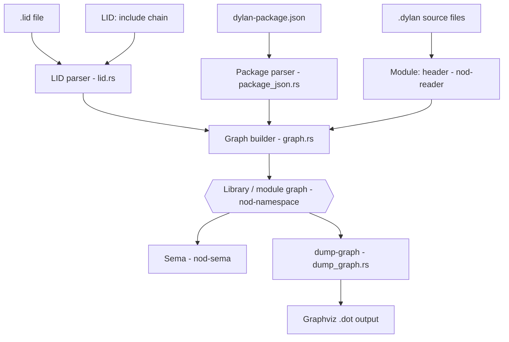
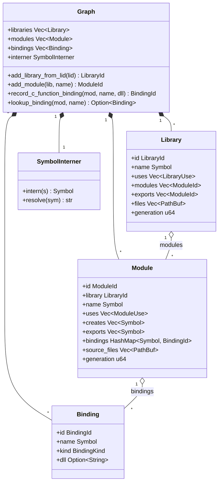
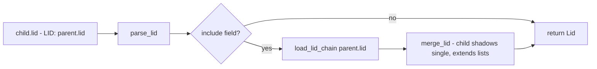

# Namespaces: the library/module graph

Dylan has a **two-level namespace**: every name lives inside a *module*, and every module belongs to exactly one *library*. The `nod-namespace` crate models that structure as an in-memory DAG, feeds it to sema so every identifier lookup has a home, and exposes it to the driver's `dump-graph` command as Graphviz output.

> Crate: `src/nod-namespace`  ·  Status: live (Rust)

---

## Role in the pipeline

The graph is a *side-input* to the front-end, not a sequential stage. It is built from LID files and source headers before sema begins, then queried by sema for every name resolution.

The graph is also the foundation for future incremental recompilation: every `Library` and `Module` node carries a `generation: u64` field that is bumped on any structural change (`graph.rs:140`, `graph.rs:154`), so cache entries keyed on generation can be invalidated precisely.

---

## The Dylan two-level model

Dylan's namespace design is more structured than a flat package system:

- A **library** is the *compilation unit* — the boundary of code generation, cache invalidation, and sealing. A module belongs to exactly one library; two libraries cannot share a module.
- A **module** is a *namespace* inside a library. It owns a set of bindings, explicitly controls what it imports from other modules via `use` clauses, and explicitly controls what it exports.
- A **binding** names a definition (`define class`, `define generic`, `define constant`, `define c-function`, …). Every identifier in a `.dylan` source file is resolved against exactly one module — the one named in that file's `Module:` header.

Visibility composes in two levels. For an identifier `foo` in a `.dylan` file with header `Module: m` in library `L`:

| Where is `foo` defined? | What is required? |
|-------------------------|-------------------|
| In module `m` itself | Direct lookup in `m.bindings` |
| In module `m2`, same library `L` | `m` must `use m2`; `m2` must export `foo` |
| In module `m2` of library `L2` | `L` must `use L2` (and `L2` must export `m2`); then `m` must `use m2` |

Note: `use` clauses support `import:`, `exclude:`, `rename:`, `prefix:`, and `reexport:` modifiers — all are recorded in `ModuleUse` (`graph.rs:121-129`). Cross-module `use`/`export` resolution is **structurally present in the graph types** but is noted as pending full resolution in `graph.rs:3-4`.

---

## Key types

| Type | File | Purpose |
|------|------|---------|
| `Graph` | `graph.rs:158` | Root container: flat `Vec<Library>` + `Vec<Module>` + `Vec<Binding>` + `SymbolInterner` |
| `Library` | `graph.rs:131` | One compilation unit — name, modules, exports, source files, `generation` |
| `Module` | `graph.rs:145` | One namespace — bindings, `uses`, `creates`, `exports`, `source_files`, `generation` |
| `Binding` | `graph.rs:34` | One named definition — today populated only by `define c-function` (Sprint 27) |
| `BindingKind` | `graph.rs:51` | `CFunction` today; `Function`, `Class`, … deferred to a future consolidation sprint |
| `Symbol` | `graph.rs:21` | Interned `u32` handle for any identifier string |
| `SymbolInterner` | `graph.rs:61` | `Vec<String>` + reverse `HashMap` — `intern` / `resolve` pair |
| `LibraryId` / `ModuleId` / `BindingId` | `graph.rs:12-18` | Newtype `u32` handles — typed so library and module IDs never alias |
| `LibraryRef` / `ModuleRef` | `graph.rs:87-99` | `Resolved(Id)` or `Unresolved(Symbol)` — graph edges may remain unresolved before full resolution |
| `Lid` | `lid.rs:20` | Parsed LID file — all recognised fields plus `diagnostics: Vec<Diagnostic>` for unknown/invalid lines |
| `Package` | `package_json.rs:13` | Parsed `dylan-package.json` — name, version, `dependencies: Vec<PackageDep>` |

---

## How it works

### LID file parsing

A LID file is a line-oriented `Key: value` format. The parser (`lid.rs:41`) does a two-pass scan:

1. **Continuation collapse** — any line that starts with whitespace is appended to the previous record's value. This is how a 91-file `Files:` block spanning 90 continuation lines is parsed (`lid.rs:56-67`).
2. **Field dispatch** — each `(key, value)` pair is routed by `apply_field` (`lid.rs:89`). Keys are lowercased before matching, so `Library:` and `library:` are equivalent.

Recognised fields and what they populate in `Lid`:

| LID key | `Lid` field | Notes |
|---------|------------|-------|
| `Library:` | `library: Option<String>` | Required. Global flat namespace. |
| `Files:` | `files: Vec<String>` | Whitespace-separated, `.dylan` implied, order is load-bearing |
| `Target-Type:` | `target_type: Option<TargetType>` | `Dll` or `Executable` |
| `Executable:` | `executable` | Output binary name |
| `Start-Function:` | `start_function` | AOT entry point |
| `Major-Version:` / `Minor-Version:` | `major_version` / `minor_version` | Recorded; not yet used for resolution |
| `LID:` | `include: Option<String>` | **Include directive** — triggers `load_lid_chain` |
| `Platforms:` | `platforms: Vec<String>` | Parsed; platform selection is a follow-up sprint |
| `Base-Address:` | `base_address` | Recorded for AOT |
| Any unknown key | `other: Vec<(String, String)>` | Not an error — `lib.rs:15` exports `Diagnostic` for warnings |

**LID inheritance (`LID:` include chains).** A platform-overlay LID (e.g. `dylan-win32.lid` → `LID: dylan.lid`) uses `load_lid_chain` (`lid.rs:137`), which recursively loads the parent and merges via `merge_lid` (`lid.rs:150`):

- Single-valued fields (`library`, `target_type`, `executable`, …): child wins (`child.field.or(parent.field)`).
- List-valued fields (`files`, `platforms`, `other`): parent list extended by child.

### Graph construction

`Graph::add_library_from_lid` (`graph.rs:173`) builds a `Library` node from a parsed `Lid`:

1. Interns the library name via `SymbolInterner`.
2. Allocates a `LibraryId` as the next index into `self.libraries`.
3. Resolves every bare filename in `lid.files` to an absolute path, appending `.dylan` if the entry has no extension (`graph.rs:183-191`).
4. Stores the `Library` with empty `uses`, `modules`, and `exports` — these are populated in later passes once `define module` / `define library` forms are parsed.

`Graph::add_module` (`graph.rs:208`) appends a `Module` to `self.modules` and wires its `ModuleId` into `library.modules`.

`Graph::record_c_function_binding` (`graph.rs:254`) — the only fully-wired binding path today — allocates a `BindingId`, normalises the DLL name to lowercase, and inserts it into `module.bindings`. Later-definition-wins semantics are noted inline (`graph.rs:269-272`).

### Feeding sema

Sema (`nod-sema`) receives the `Graph` as a shared context before it begins resolving any expression. For each `.dylan` file, the driver reads the `Module:` header (parsed by `nod-reader`) and uses `Graph::lookup_binding` (`graph.rs:288`) and the module's `bindings` map to answer "which module does this file belong to?" and "is this name exported by any `use`d module?".

Full cross-module `use`/`export` resolution — walking `ModuleUse.import`, `ModuleUse.exclude`, `ModuleUse.rename`, `ModuleUse.prefix` — is structurally represented but remains partially stubbed, as noted in `graph.rs:3` ("Resolution of `use`/`import`/`export` clauses is stubbed pending Sprint 04 `define module` / `define library` parsing").

### `dump-graph` — Graphviz output

`nod-driver dump-graph <lid>` calls `dump_graph::dump_graph` (`dump_graph.rs:7`), which emits a `digraph G` with:

- One Graphviz `cluster_lib_N` per library (box node + per-module ellipse nodes).
- One directed edge per resolved `ModuleUse` (`mod_X -> mod_Y`) — unresolved refs are silently skipped.

The output is valid DOT piped to `dot -Tpng` or any Graphviz renderer.

---

## Invariants and gotchas

- **File order is load-bearing.** `Files:` entries are stored and walked in LID declaration order. The kernel `dylan` library compiles only in the order its 91 files are listed; `nod-sema` relies on this. Do not sort or deduplicate (`lid.rs:93-97`, `graph.rs:178-191`).
- **All Ids are indices into flat Vecs.** `LibraryId(n)` means `self.libraries[n]`. This is fast but means `Graph` must never remove or reorder entries; incremental invalidation uses `generation` numbers, not removal.
- **SymbolInterner is append-only.** `intern` returns a stable `Symbol` for the lifetime of the `Graph`; resolving the same string twice returns the same handle (`graph.rs:71-78`).
- **DLL names are lowercased at insertion.** `record_c_function_binding` calls `.to_ascii_lowercase()` on the DLL name (`graph.rs:265`). Lookups must not re-apply lowercasing.
- **`Binding` table is currently c-function only.** Dylan-to-Dylan bindings still live in sema's flat tables and are not yet migrated here (`graph.rs:27-33`). Sprint 28+ will consolidate.
- **`ModuleRef::Unresolved` is a legal graph state.** Until a full resolution pass runs, `use` edges may be unresolved. Code that traverses the graph must handle both variants of `LibraryRef` and `ModuleRef`.
- **`dylan-package.json` is per-package, not per-library.** One package contains many libraries, each with its own LID. `dylan-package.json` records package-level dependencies (`spec §4`); LID is the per-library source of truth. `nod-namespace` requires both for a multi-package build.
- **The kernel `dylan` library has no `define library` form.** The Library node for `dylan` is built from the LID alone; the module structure comes from per-file `Module:` headers and scattered `define module` forms. This is intentional; `graph.rs:173` handles it via the LID-only construction path.

---

## Where in the code

| File | Lines | Responsibility |
|------|-------|----------------|
| `src/nod-namespace/src/graph.rs` | 327 | `Graph`, `Library`, `Module`, `Binding`, `SymbolInterner`, all accessors and the two construction functions |
| `src/nod-namespace/src/lid.rs` | 212 | `Lid`, `TargetType`, `parse_lid_str`, `load_lid_chain`, `merge_lid` |
| `src/nod-namespace/src/package_json.rs` | 128 | `Package`, `PackageDep`, `parse_package_json_str` |
| `src/nod-namespace/src/dump_graph.rs` | 89 | `dump_graph` — Graphviz DOT emitter |
| `src/nod-namespace/src/lib.rs` | 16 | Public re-exports of all four modules |
| `docs/specs/05-library-module-graph.md` | 457 | Full spec: LID grammar, two-tier design, generation numbers, test plan |

---

## See also

- [Compiler overview](overview.md) — where the namespace graph fits in the full pipeline
- [Semantic analysis](sema.md) — the phase that consumes the graph for name resolution
- [Modules and libraries](../language/modules-and-libraries.md) — the Dylan language view of the two-tier namespace
- [Driver](driver.md) — `dump-graph` subcommand and the build orchestration that constructs the graph

---
[Manual home](../index.md) · [Compiler overview](overview.md)
