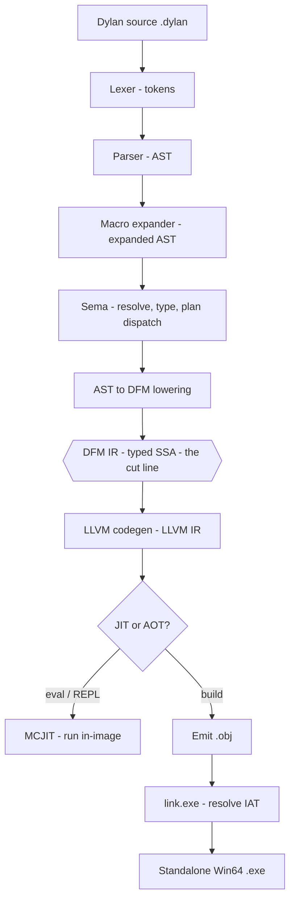

# Compiler Overview

NewOpenDylan turns Dylan source into running machine code two ways — **JIT** (compile
and execute in-image, for `eval` and the REPL) and **AOT** (emit an object file and link
a standalone Win64 `.exe`). Both share one pipeline and diverge only at the very end.

> Status: the pipeline JITs and AOT-builds non-trivial programs. The front-end's lexer
> and parser already run *in Dylan*; the rest of the front-end is Rust today and migrating.

## The pipeline

Source flows top-to-bottom through the front-end, crosses the **DFM** boundary, and is
turned into code by the back-end:

The library/module graph ([`nod-namespace`](namespace.md)) feeds the front-end the
namespace context — which library a file belongs to and what each module imports — but is
not itself a stage in the per-expression flow above.

## The crate map

Each box above is owned by a crate. The split between "front-end" and "back-end" is the
DFM line: above it migrates to Dylan, below stays Rust + LLVM permanently.

| Stage | Crate | Side | Manual page |
|-------|-------|------|-------------|
| Lexer + Parser | `nod-reader` | front-end | [Reader](reader.md) |
| Macro expander | `nod-macro` | front-end | [Macros](macro-expander.md) |
| Sema + lowering | `nod-sema` | front-end | [Sema](sema.md) |
| Library/module graph | `nod-namespace` | front-end | [Namespaces](namespace.md) |
| DFM IR | `nod-dfm` | the boundary | [DFM](dfm.md) |
| LLVM codegen | `nod-llvm` | back-end | [Codegen](codegen.md) |
| JIT + AOT object/link | `nod-llvm`, `nod-driver` | back-end | [JIT & AOT](jit-and-aot.md) |
| Runtime, dispatch, conditions | `nod-runtime` | back-end | [Runtime](runtime.md) |
| Garbage collector | `newgc-core` | back-end | [GC](gc.md) |
| Win32 FFI, callbacks, COM | `nod-winapi`, `nod-runtime` | back-end | [FFI](ffi.md) |
| CLI / REPL / build orchestration | `nod-driver` | driver | [Driver](driver.md) |

## Two execution modes

The single fork in the pipeline is whether codegen's output is executed in-process or
written to disk and linked:

- **JIT** (`eval`, REPL) — codegen hands LLVM IR to the MCJIT, which compiles it,
  registers Win64 SEH unwind info, and calls it inside the compiler process. The stdlib
  is pre-compiled into a long-lived JIT engine on first eval. See [JIT & AOT](jit-and-aot.md).
- **AOT** (`build`) — codegen injects a synthetic `main`, emits a `.obj` via LLVM's
  `TargetMachine`, and links it against `nod_runtime.lib` with `link.exe`, resolving Win32
  imports through the IAT. Multi-file builds merge every file's AST into one module *before*
  lowering, so definitions are visible across files. See [Driver](driver.md).

## Inspecting the pipeline

The driver (`nod-driver`) exposes every stage as a dump command — the best way to learn
the compiler is to watch one expression flow through them:

| Command | Stops after | Shows |
|---------|-------------|-------|
| `nod-driver dump-tokens f.dylan` | lexer | the token stream |
| `nod-driver dump-ast f.dylan` | parser | the AST |
| `nod-driver dump-graph f.lid` | namespace | library/module graph (Graphviz) |
| `nod-driver dump-dfm f.dylan` | lowering | the DFM IR |
| `nod-driver dump-llvm f.dylan` | codegen | textual LLVM IR |
| `nod-driver eval '1 + 1'` | JIT | the evaluated result |
| `nod-driver build f.dylan -o f.exe` | link | a standalone `.exe` |

The Dylan-hosted front-end has its own dumps — `dump-dylan-tokens`, `dump-dylan-ast`,
`parse-dylan` — and verify-mode flags (`--lex-with-dylan`, `--verify-parse`,
`--parse-with-dylan`) that run the Dylan and Rust phases side by side and assert they
agree. Those belong to [self-hosting](self-hosting.md).

## The DFM boundary, in one paragraph

DFM (the Dylan Flow Machine IR) is reviewable text at `dump-dfm`. Because a Rust-emitted
DFM module and a Dylan-emitted DFM module are the *same data structure with the same
semantics*, the back-end cannot tell which front-end produced it — and does not care.
That property is what lets each front-end phase migrate to Dylan and be validated against
the Rust phase by comparing output, with the back-end held constant. The IR contract is
[DFM](dfm.md); the migration mechanism is [self-hosting](self-hosting.md).

## Where in the code

| Path | Lines | Responsibility |
|------|-------|----------------|
| `src/nod-driver/src/main.rs` | ~1500 | CLI, subcommand dispatch, every dump path, the build pipeline |
| `src/nod-reader/src/` | ~6900 | lexer, parser, AST, Dylan pretty-printer |
| `src/nod-sema/src/lower.rs` | ~7800 | the AST → DFM lowering core |
| `src/nod-dfm/src/ir.rs` | ~730 | the DFM data types |
| `src/nod-llvm/src/codegen.rs` | ~5000 | DFM → LLVM IR |
| `src/nod-runtime/src/` | ~25000 | object model, dispatch, conditions, FFI, GC glue |
| `src/newgc-core/src/page_heap/` | ~9000 | the collector |

## See also

- [DFM: the IR](dfm.md) — the contract the whole architecture hinges on
- [Self-hosting](self-hosting.md) — how the front-end migrates to Dylan
- [`docs/ARCHITECTURE.md`](../../ARCHITECTURE.md) — the canonical architecture statement
- [Language overview](../language/overview.md) — what the compiler is compiling

---
[Manual home](../index.md) · [Reader](reader.md) · [DFM](dfm.md)
