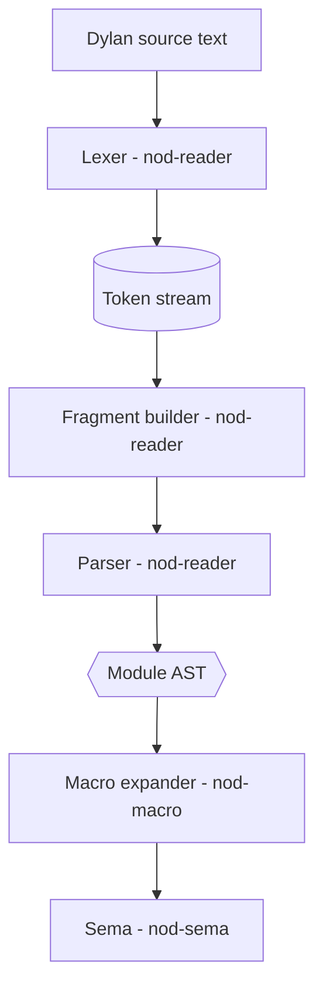
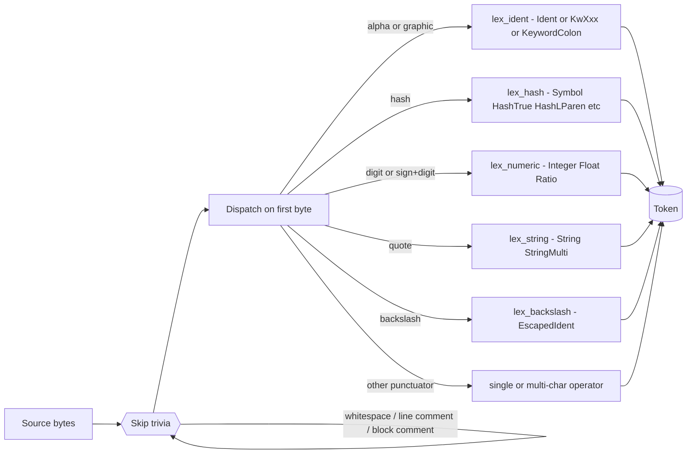
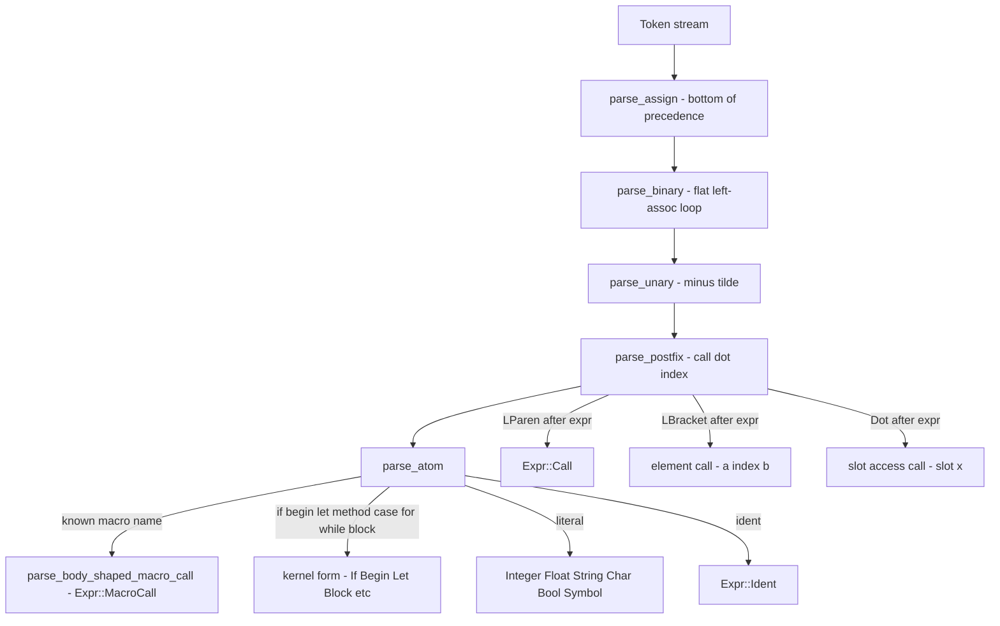
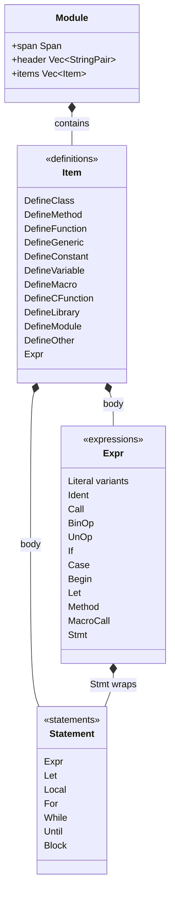

# Reader: Lexer and Parser

The `nod-reader` crate turns Dylan source text into an AST. It owns the
lexer, the fragment layer, the expression and top-level parser, and a
canonical Dylan pretty-printer that round-trips through the parser.

> Crate: `src/nod-reader`  ·  Status: live (Rust) — Dylan twin runs in the driver

## Role in the pipeline

The reader is the first stage. Its output — a `Module` carrying `Item`s and
`Expr`s — feeds the macro expander and then sema.

`nod-driver` can stop at any boundary: `dump-tokens` stops after the
lexer, `dump-ast` stops after the parser. The Dylan-hosted equivalents
are `dump-dylan-tokens` and `dump-dylan-ast`. See [Driver](driver.md).

## Key types

| Type | File | Purpose |
|------|------|---------|
| `Token` | `token.rs:11` | Kind + span; text is derivable from `SourceMap::slice` |
| `TokenKind` | `token.rs:23` | `#[repr(u8)]` enum; 59 variants covering all Dylan lexical classes |
| `Span` | `span.rs:20` | `(file_id, lo, hi)` byte range; 32-bit offsets; line/col computed lazily |
| `FileId` | `span.rs:13` | 32-bit interned source-file identifier |
| `SourceMap` | `span.rs:43` | Owns source text; caches line-start tables for fast `(line, col)` |
| `Fragment` | `fragments.rs:10` | `Token` or nested `Group`; produced by `build_fragments` |
| `GroupKind` | `fragments.rs:21` | `Paren` / `Bracket` / `Brace` / `HashParen` / `HashBracket` / `HashBrace` |
| `Module` | `ast.rs:412` | Top-level AST: header entries + `Vec~Item~` |
| `Item` | `ast.rs:542` | One top-level definition: `DefineClass`, `DefineMethod`, `DefineMacro`, etc. |
| `Expr` | `ast.rs:29` | Expression tree: `Call`, `BinOp`, `If`, `MacroCall`, `Let`, `Method`, … |
| `Statement` | `ast.rs:741` | Statement forms: `Let`, `Local`, `For`, `While`, `Until`, `Block` |
| `Diagnostic` | `parser.rs:34` | A span + message; parser recovers and continues collecting these |

## How it works

### Step 1 — Lexer

`lex(src, file_id)` calls `lex_rust` unless a Dylan-side override has been
installed via `set_lex_override` (`lexer.rs:57`). The Rust lexer:

1. Calls `skip_preamble` to skip the optional `Module: foo` / `Author:` header
   block that `.dylan` files may carry (`lexer.rs:241`).
2. Loops: skip trivia (`skip_trivia` handles whitespace, `// line comments`,
   and `/* nested block comments */` — `lexer.rs:261`), then call `next_token`.
3. Terminates the vector with exactly one `Eof` token (`lexer.rs:38`).

The lexer is predictive (peek-driven), maximal-munch. It never panics: on bad
input it emits `TokenKind::Invalid` spanning the offending bytes and
resynchronises (`token.rs:108`).

**The three hard-reserved words** are `define`, `end`, and `otherwise`
(`token.rs:27`). Every other keyword — `if`, `let`, `class`, `method`,
`for`, `while`, `sealed`, `library`, `module`, and so on — is a plain
`Ident`. The parser classifies them by text match (`parser.rs:283`).

**Token categories** (`token.rs:23`):

- *Identifiers*: `Ident`, `KwDefine`, `KwEnd`, `KwOtherwise`, `EscapedIdent`
  (backslash-quoted operator-as-name, e.g. `\+`).
- *Hash-prefixed literals*: `HashTrue` / `HashFalse`, `HashLParen` / `HashLBracket` /
  `HashLBrace` (literal openers), `HashHash` (macro concat `##`), `HashRest` /
  `HashKey` / `HashAllKeys` / `HashNext` (parameter keywords), `Symbol` (`#"foo"`),
  `HashKeyword` (`#:foo`). All case-insensitive at the lexer level.
- *Trailing-colon keyword*: `KeywordColon` — any ident followed immediately by `:`
  that is not `::` or `:=` (`lexer.rs:1046`). Example: `size:`.
- *Numerics*: `Integer`, `IntegerBin` (`#b...`), `IntegerOct` (`#o...`),
  `IntegerHex` (`#x...`), `Float`, `Ratio` (`n/d` with no space).
- *Strings and characters*: `String` (double-quoted), `StringMulti` (triple-quoted
  `"""`), `StringRaw` (`#r"..."`), `Char` (single-quoted).
- *Operators and punctuators*: all standard Dylan operators plus `:=` (assign),
  `::` (type annotation), `=>` (arrow), `~=` / `~==` (not-equal), `?` / `??` /
  `?=` / `?@` (macro pattern variables).
- *Sentinel*: `Eof` (always last), `Invalid` (error recovery).

One structural quirk: `<foo>` lexes as a single `Ident` because `<` followed
by an identifier-continue character triggers `lex_ident` rather than the
less-than operator (`lexer.rs:466`). The same applies to `>`: `>=foo>` would
be absorbed into an identifier.

### Step 2 — Fragment builder

`build_fragments(tokens)` (`fragments.rs:85`) converts the flat token stream
into a tree of `Fragment` values. A `Fragment::Group` contains its opening
token, closing token, `GroupKind`, and a `body: Vec~Fragment~`. The six group
kinds are: `Paren` `()`, `Bracket` `[]`, `Brace` `{}`, `HashParen` `#()`,
`HashBracket` `#[]`, `HashBrace` `#{}` (`fragments.rs:21`).

The fragment tree is the boundary between the lexer and the parser: the parser
works over raw tokens but the macro expander receives call-site fragments so it
can do pattern matching against nested structure without re-scanning.

### Step 3 — Parser

The parser struct (`parser.rs:181`) holds the token slice, a cursor `pos`, a
`known_macros: HashSet~String~` seeded by the caller, and a `precedence_c`
flag.

**Operator precedence.** The Dylan Reference Manual specifies one flat,
left-associative level for all binary operators except `:=`. The parser
implements this literally in `parse_binary` (`parser.rs:342`): a single loop
that accepts any binary operator token or the keywords `mod` / `rem`, always
grouping left. So `3 + 4 * 5` parses as `(3 + 4) * 5`, not `3 + (4 * 5)`.
Assignment `:=` is right-associative and handled one level above in
`parse_assign` (`parser.rs:306`). Unary `-` and `~` bind tighter in
`parse_unary` (`parser.rs:514`).

A legacy opt-in is available: a `Precedence: c` header pragma sets
`precedence_c = true` (`parser.rs:196`), which switches to a conventional
C-style precedence ladder (`parse_or` → `parse_and` → `parse_cmp` →
`parse_add` → `parse_mul` → `parse_pow`) rather than the DRM flat rule. This
is a migration bridge for old files, not a long-term feature.

**Macro recognition.** Dylan has user-definable body-shaped macros:
`for-each (x in c) ... end`. The parser cannot in general parse the head
`(x in c)` as an expression because `x in c` is not valid Dylan syntax — that
is macro-pattern grammar. The solution: when the parser encounters an `Ident`
whose name is in `known_macros`, and the token stream after it looks like
`(head…) body… end`, it calls `parse_body_shaped_macro_call` (`parser.rs:979`).
This captures just the source span and the macro name into `Expr::MacroCall`
(`ast.rs:84`). The macro engine re-lexes the span later to do fragment-level
pattern matching. The lookahead function `peek_after_ident_is_macro_call_shape`
(`parser.rs:864`) is the guard: it scans for a reachable `end` at depth 0 and
requires at least one non-trivial body token.

`known_macros` is seeded by the caller (typically `nod-sema` with the stdlib's
macros) and extended in-place as `define macro` items are parsed in the same
module (`parser.rs:186`).

**Postfix lowering.** The parser lowers three surface forms to `Expr::Call`
immediately:

- `f(a, b)` becomes `Call { callee: f, args: [a, b] }`.
- `a[i]` becomes `Call { callee: element, args: [a, i] }` (`parser.rs:570`).
- `x.slot` becomes `Call { callee: slot, args: [x] }` (`parser.rs:594`).

Keyword arguments `foo: val` inside a call list are represented as
`Call { callee: %kw-arg, args: [#"foo", val] }` (`parser.rs:622`).

**Top-level parsing.** `parse_module` / `parse_module_with_macros`
(`parser.rs:100`) loop calling `parse_top_item`. On error the parser calls
`recover_to_top_level` and continues, accumulating `Diagnostic` values. A
successful parse returns `Module { header, items }` with zero diagnostics;
any diagnostic count makes the result an `Err(Vec~Diagnostic~)`.

### AST node families

`Item::DefineMacro` carries `body_fragments: Vec~Fragment~` rather than a
parsed sub-AST — the macro body is pattern grammar that the macro expander
(`nod-macro`) processes (`ast.rs:627`).

`Item::DefineOther` is the catch-all for `define` forms whose body shape is
not yet modelled; it captures the raw fragments so downstream sprints can lift
them when ready (`ast.rs:633`).

### Pretty-printer

`format_dylan(module)` (`format_dylan.rs:12`) produces canonical Dylan source
from a `Module`. The output is not byte-for-byte faithful to the input — it is
a normalised form. The acceptance criterion is: AST → pretty-print → re-parse
→ identical AST shape. This is used by the `--verify-parse` gate and for
human-readable regression snapshots.

## Invariants and gotchas

- **Tokens are text-free.** A `Token` carries only `kind` and `span`. The
  text is always retrieved on demand via `SourceMap::slice(span)` (`span.rs:90`).
  This keeps `Token` `Copy` and 12 bytes.
- **Only three hard reserveds.** Keywords like `if`, `for`, and `sealed` lex
  as `Ident`. Code that pattern-matches `TokenKind` directly and omits
  `Ident`-text checks will misclassify them.
- **Flat precedence is the DRM rule.** `3 + 4 * 5 = 35` in Dylan. Every
  consumer of the AST must assume this. The `Precedence: c` pragma exists
  only as a migration aid.
- **`<Foo>` is one token.** The lexer recognises `<` followed by an
  identifier-continue char as the start of an identifier, not as a less-than
  operator. `<integer>` and `<my-class>` are single `Ident` tokens.
- **Signed numeric literals.** `+3` and `-3` lex as signed `Integer` tokens
  when a digit follows the sign directly (`lexer.rs:533`). A space separating
  sign and digits makes them an operator followed by an unsigned literal.
- **Block comments nest.** `/* outer /* inner */ still-outer */` is one
  comment per spec §3.7, implemented in `skip_trivia` (`lexer.rs:283`).
- **`MacroCall` span is opaque.** The parser captures only `name` and `span`;
  the head's internal structure is not an AST. The macro engine re-lexes the
  span to pattern-match against fragments.
- **`a[i]` desugars immediately.** The parser emits `element(a, i)`, not a
  separate `Index` variant. Code searching for indexing must look for
  `Expr::Call` with callee `element`.

## Where in the code

| File | Lines | Responsibility |
|------|-------|----------------|
| `src/nod-reader/src/lexer.rs` | 1151 | The Rust lexer, preamble scanner, `set_lex_override` / `LexFn` hook |
| `src/nod-reader/src/token.rs` | 185 | `Token`, `TokenKind` (59 variants), `name()` dump method |
| `src/nod-reader/src/fragments.rs` | 152 | `Fragment`, `GroupKind`, `build_fragments` |
| `src/nod-reader/src/parser.rs` | 3178 | Parser, `parse_expr`, `parse_module`, `Diagnostic`, recovery |
| `src/nod-reader/src/ast.rs` | 1201 | All AST node types, `format_ast` / `format_ast_module` |
| `src/nod-reader/src/span.rs` | 160 | `Span`, `FileId`, `SourceMap`, lazy line-start tables |
| `src/nod-reader/src/format_dylan.rs` | 792 | AST → Dylan source pretty-printer |
| `src/nod-reader/src/lib.rs` | 34 | Crate entry, public re-exports |

## See also

- [Compiler overview](overview.md) — the full pipeline and where the reader fits
- [Macro expander](macro-expander.md) — consumes `Module` AST and `Fragment` bodies
- [Sema](sema.md) — name resolution, type checking, and AST-to-DFM lowering
- [Self-hosting](self-hosting.md) — the Dylan-side lexer and parser twins, the `--lex-with-dylan` / `--parse-with-dylan` override hooks

---
[Manual home](../index.md) · [Compiler overview](overview.md)
