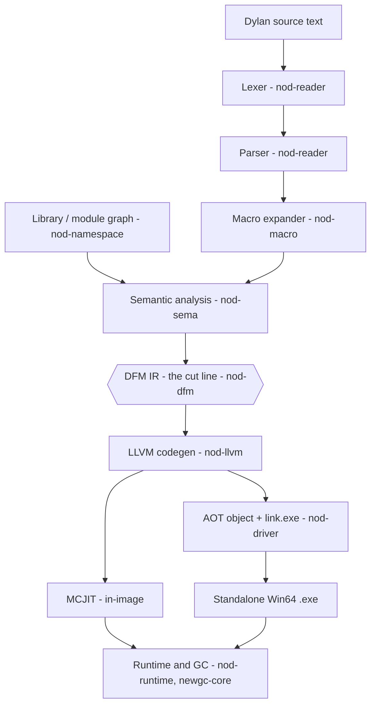

# NewOpenDylan Manual

A guided, diagram-rich tour of the **Dylan language** as NewOpenDylan implements it,
and of the **compiler** that runs it — from source text to a JIT-executed or
AOT-linked Win64 binary.

This manual is the *explanatory* companion to the design notes in `docs/`. Where
[`ARCHITECTURE.md`](../ARCHITECTURE.md), [`MANIFESTO.md`](../MANIFESTO.md), and
[`SPRINTS.md`](../SPRINTS.md) record decisions and history, the manual explains how
each piece works and how they fit together. Browse it with DocCrate:

```
pwsh tools/doccrate/Browse-Docs.ps1
```

> **Status:** NewOpenDylan is a work-in-progress revival of Dylan on a fresh
> Rust + LLVM substrate. It JITs and AOT-compiles non-trivial programs, ships a
> precise GC, and hosts an IDE written in Dylan — but it is a design diary with
> running code, not a release. Pages note where a subsystem is live, partial, or
> still Rust-only.

**New here?** Start with **[Getting Started](getting-started.md)** — build the compiler,
evaluate an expression, watch the pipeline, and compile your first `.exe`.

## The whole pipeline at a glance



Everything **above** the `DFM IR` hexagon is the **front-end** — it migrates to Dylan
and self-hosts. Everything **below** is the **back-end** — permanent Rust + LLVM. DFM,
the Dylan Flow Machine IR, is the contract between them, and that single cut line shapes
the whole project. See [the compiler overview](compiler/overview.md) and
[self-hosting](compiler/self-hosting.md).

## The Language

| Page | What it covers |
|------|----------------|
| [Language overview](language/overview.md) | What Dylan is, the feel of the code, a worked example |
| [Syntax & lexical structure](language/syntax.md) | Tokens, definitions, expressions, the infix grammar |
| [Types & classes](language/types-and-classes.md) | The object model: classes, slots, instances, `<angle>` names |
| [Generic functions & dispatch](language/generic-functions.md) | Methods, multiple dispatch, C3 method resolution |
| [Macros](language/macros.md) | Pattern/template macros and how the surface grows from stdlib |
| [Modules & libraries](language/modules-and-libraries.md) | Namespaces, exports, the library/module graph |
| [Conditions](language/conditions.md) | Signals, handlers, restarts, non-local exit |
| [Sealing](language/sealing.md) | Controlled dynamism: sealing and compile-time dispatch |

## The Compiler

| Page | Crate | What it covers |
|------|-------|----------------|
| [Compiler overview](compiler/overview.md) | — | The pipeline, the crate map, DFM as the contract |
| [Reader: lexer & parser](compiler/reader.md) | `nod-reader` | Source text → tokens → AST |
| [Macro expander](compiler/macro-expander.md) | `nod-macro` | Pattern-rule expansion of macro forms |
| [Semantic analysis](compiler/sema.md) | `nod-sema` | Name resolution, classes, dispatch, AST → DFM lowering |
| [Namespaces](compiler/namespace.md) | `nod-namespace` | LID files, the library/module dependency graph |
| [DFM: the IR](compiler/dfm.md) | `nod-dfm` | The typed-SSA intermediate representation |
| [LLVM codegen](compiler/codegen.md) | `nod-llvm` | DFM → LLVM IR → machine code |
| [JIT & AOT](compiler/jit-and-aot.md) | `nod-llvm` · `nod-driver` | The MCJIT, object emission, the AOT linker |
| [Runtime & object model](compiler/runtime.md) | `nod-runtime` | Tagged Words, dispatch caches, conditions, collections |
| [Garbage collector](compiler/gc.md) | `newgc-core` | The precise page-heap generational collector |
| [FFI: calling Windows](compiler/ffi.md) | `nod-winapi` · `nod-runtime` | The Win64 c-ffi, callbacks, COM |
| [Driver](compiler/driver.md) | `nod-driver` | The CLI, the REPL, build modes, dump commands |
| [Self-hosting](compiler/self-hosting.md) | `nod-driver` · Dylan | Migrating the front-end to Dylan, wire formats |

## Conventions used throughout

- **DFM** — *Dylan Flow Machine*, the typed-SSA IR that splits front-end from back-end.
- **Word** — the tagged 64-bit runtime value representation.
- **GF** — *generic function*; **FIP** — *forward-iteration protocol*.
- **Sealing** — a promise that a class/GF won't be extended, enabling static dispatch.
- A `crate/src/file.rs:NN` reference points into the source tree; it is clickable in
  your editor (DocCrate shows it as code).

See the [glossary](glossary.md) for the full vocabulary.

---
*Authoring this manual: see `tools/doccrate/AUTHORING.md`. Render a page with
`tools/doccrate/Test-Render.ps1`.*
