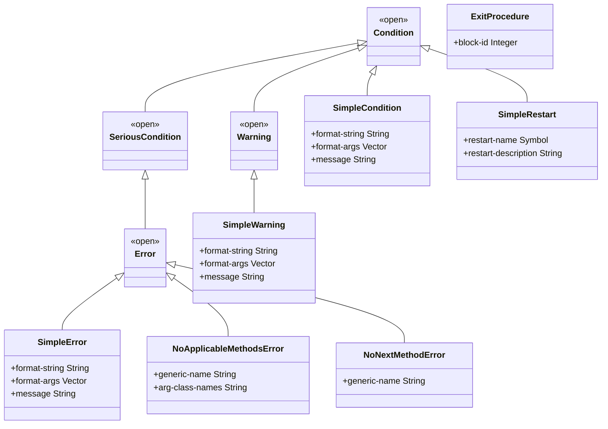
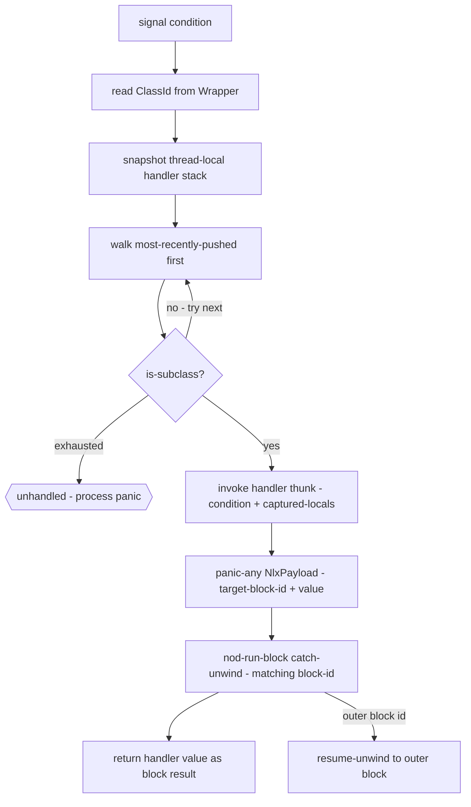
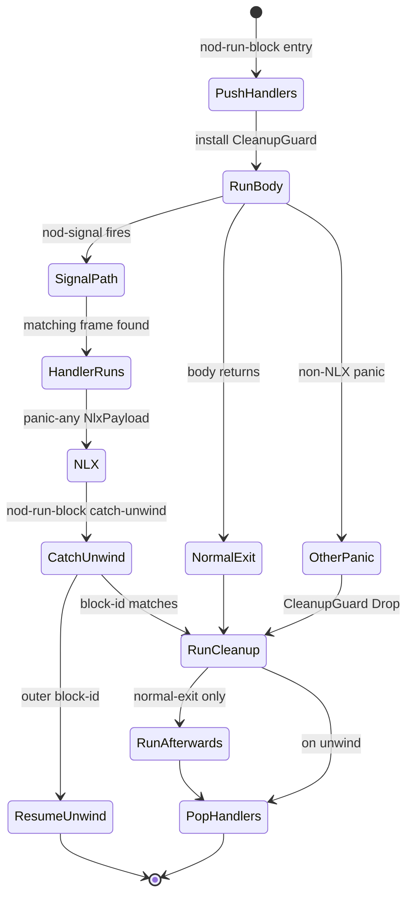

# Conditions

Dylan's condition system is a CLOS-style structured error mechanism: a condition is an
ordinary class instance, handlers are established dynamically on a thread-local chain, and
a handler may resume computation through a restart rather than simply unwinding. This page
documents what NewOpenDylan actually implements today — the runtime machinery is real and
tested; the high-level Dylan surface macros are thinner than the full DRM picture.

> Status: **runtime mechanism live** (Sprint 19). Primitive-level `signal`, `block`,
> `exception`, `cleanup` are fully wired. Restart invocation and `let handler` macro forms
> are deferred to Sprint 22.

## Conditions are instances

In Dylan a condition is not a special tag or an integer code — it is a heap-allocated
instance of a class that inherits from `<condition>`. This means:

- The condition object carries typed slots (message text, generic name, argument classes).
- The handler chain is searched by `is-subclass?`, so a handler on `<error>` catches any
  subclass of `<error>`.
- The same dispatch and slot-access machinery used for ordinary objects serves conditions.
  A condition class is registered, instantiated with `make`, and its slots are read through
  normal slot accessors.

## The condition class hierarchy

The classes below are registered at process boot from
`src/nod-runtime/src/conditions.rs:104-246`. They are the **seed** classes; Sprint 25's
stdlib port will add more in Dylan source.



*Class names use CamelCase here to avoid `<>` parser ambiguity; Dylan names are
`<condition>`, `<warning>`, `<serious-condition>`, `<error>`, `<simple-condition>`,
`<simple-warning>`, `<simple-error>`, `<no-applicable-methods-error>`,
`<no-next-method-error>`, `<simple-restart>`, `<exit-procedure>`.*

**Sprint 19 deviation from the DRM:** `<simple-error>` and `<simple-warning>` are
single-inheritance subclasses (of `<error>` and `<warning>` respectively) carrying
their own `message` slot. DRM defines them as MI subclasses of `<simple-condition>` and
`<error>` / `<warning>`. The consequence: `is-subclass?(<simple-warning>, <simple-condition>)`
is false today. Sprint 22 rationalises the hierarchy. `is-subclass?` through `<error>`,
`<warning>`, and `<condition>` works correctly for the signal walker
(`conditions.rs:119-169`).

`<exit-procedure>` is not a condition class — it is the heap object representing the `k`
in `block (k) ... end`. It has no superclass. It is included here because it is seeded
alongside the condition classes at the same registration site.

## Signalling

`signal(condition)` is the primitive operation. For serious conditions, `error(message)`
is the shorthand that constructs a `<simple-error>` and signals it in one call.

### How signalling works

When `nod_signal` is called (`conditions.rs:866`), the runtime:

1. Reads the class id from the condition's `Wrapper` header.
2. Snapshots the thread-local handler stack (`HANDLER_STACK`, a `RefCell<Vec<HandlerFrame>>`
   at `conditions.rs:455-456`).
3. Walks the snapshot most-recently-pushed first, calling `is_subclass(condition_class, handler_class)`
   for each frame (`conditions.rs:887-891`).
4. On the first match: invokes that frame's handler thunk, passes the condition Word as the
   first argument, then fires a non-local exit carrying the handler's return value to the
   matching block.
5. If no frame matches: panics with `"unhandled signalled condition: <ClassName>: detail"`.
   In test builds, this panic is catchable with `std::panic::catch_unwind`; in production
   it terminates the process.



### Dylan surface

At the primitive level, the expression form is:

```dylan
block ()
  signal(make(<simple-error>, message: "file not found"))
exception (c :: <error>)
  condition-message(c)
end
```

The `signal` built-in is lowered directly by the sema layer to a `nod_signal` call.
`error(message-string)` lowers to `nod_error`, which constructs a `<simple-error>`
and calls `nod_signal_inner` without returning (`conditions.rs:1116-1131`).

The Sprint 19 acceptance test in `tests/nod-tests/tests/conditions.rs:589-598`
exercises this full Dylan-source → DFM → LLVM → JIT → runtime path and asserts the
handler return value is the message string `"x"`.

## Non-local exit: block and cleanup

Non-local exit (NLX) is the working core of the condition system. Every `block` form
lowers to a call to `nod_run_block` (`conditions.rs:728`), which orchestrates the
full lifecycle.

### block (k) — exit procedures

`block (k) ... k(v) ... end` binds `k` to an `<exit-procedure>` heap object carrying
the block's numeric id. Calling `k(v)` invokes `nod_invoke_exit` (`conditions.rs:1069`),
which fires a `panic_any(NlxPayload { target_block_id, value })`. The enclosing
`nod_run_block` catches that panic, recognises its block id as the target, and returns
`value` as the block's result.

### block ... cleanup ... end

`block () body cleanup cleanup-body end` (unwind-protect) wraps the body in
`catch_unwind` and installs a `CleanupGuard` RAII value. The guard's `Drop` impl runs
the cleanup thunk unconditionally — on normal exit, on NLX, and on non-NLX panics
(`conditions.rs:683-710`). After the cleanup, an `afterwards` thunk (if present) runs
on the normal-exit path only.

The `with-cleanup` macro in `src/nod-dylan/dylan-sources/stdlib.dylan` expands to
`block () body cleanup cleanup-body end` (`stdlib.dylan:576-585`).

### block ... exception ... end

`exception` clauses are the handler-installation surface. Each clause pushes one
`HandlerFrame` onto the thread-local stack before the body runs, with:

- `handler_class`: the `ClassId` of the declared condition class.
- `target_block_id`: the id of the enclosing `block`.
- `handler_index`: which of the block's handler thunks to invoke on match.

The handler stack is restored to its pre-entry baseline by `CleanupGuard::drop` even if
the body panics through without matching any handler (`conditions.rs:691`).

### The nod_run_block lifecycle



Key implementation facts:

- NLX transport is `std::panic::panic_any(NlxPayload)` + `catch_unwind`
  (`conditions.rs:953`, `conditions.rs:793-816`). All JIT-emitted functions use
  `extern "C-unwind"` so Rust panics may transit them.
- Handler thunks have signature `extern "C-unwind" fn(condition, c0..c7) -> u64`; the
  nine-argument ABI passes the condition Word first, then the eight captured-local slots
  (`conditions.rs:664-665`).
- Body, cleanup, and afterwards thunks have signature `extern "C-unwind" fn(c0..c7) -> u64`
  (`conditions.rs:663`).
- Up to eight surrounding locals may be captured through the block thunk boundary. Blocks
  that capture more than eight emit a `Sprint 19 limitation` lowering error
  (`conditions.rs:661`).

### Code examples

A block that catches a dispatch error:

```dylan
block ()
  do-something-that-may-fail()
exception (c :: <error>)
  format-out("caught: %s\n", condition-message(c))
  #f
end
```

A block with cleanup (unwind-protect):

```dylan
block ()
  open-resource()
  use-resource()
cleanup
  close-resource()
end
```

An exit procedure:

```dylan
block (return)
  for-each-item(collection,
    method (item)
      when (item = target) return(item) end
    end)
  #f
end
```

## Handlers and restarts

### Handler establishment — current surface

At the primitive level, handlers are established by `block ... exception ...`. There is no
`let handler` macro form wired end-to-end yet. The `let handler` surface is parsed but the
exception-clause installation path is not lowered (`DEFERRED.md`: "`:open: let handler /
handler bindings` — Sprint 04 → Sprint 17 or whenever exception semantics land").

### Restarts — concept and current status

A **restart** is a named condition of class `<restart>` (a subclass of `<condition>`)
that, when signalled, offers to resume the computation that raised the original condition.
The canonical DRM protocol is:

1. Code about to do something risky establishes a restart before it signals an error.
2. A handler that catches the error may call `invoke-restart` to transfer control to the
   restart's body, which carries out the recovery action.
3. The restart unwinds back to the point where the restart was established.

This protocol allows a debugger or an outer handler to select a recovery strategy
(retry, use a default value, skip, abort) without unwinding any further than necessary.

**What is implemented today:**

- `<simple-restart>` is a registered class with `restart-name` (symbol) and
  `restart-description` (string) slots (`conditions.rs:191-198`).
- `make-simple-restart(name, description)` allocates an instance
  (`conditions.rs:390-401`).
- `invoke-restart` is a panic stub (`conditions.rs:407-411`): calling it terminates the
  process with `"Sprint 19: invoke-restart not implemented"`.

**What is deferred (Sprint 22):**

- The active-restart chain (parallel to the handler chain).
- `with-restart` / `restart-query`.
- Restart inheritance through nested signals.
- The full DRM restart protocol with `invoke-restart` actually transferring control.

(`DEFERRED.md`: "`:open: Full restart semantics` — Sprint 19 → Sprint 22.")

## How it is implemented — pointer to the compiler view

The mechanism described above — `HandlerFrame`, `NlxPayload`, `nod_run_block`,
`nod_signal`, `CleanupGuard` — is frozen in Rust and documented in detail in
[Runtime and object model](../compiler/runtime.md) under "Conditions, handlers, and
non-local exit". That page covers:

- The `HandlerFrame` struct (`conditions.rs:445`).
- The `NlxPayload` struct (`conditions.rs:571`).
- The `CleanupGuard` RAII pattern (`conditions.rs:667-710`).
- The handler-stack as GC root (deferred to Sprint 11d — the in-flight condition Word
  is conservatively scanned until then).
- The AOT-mode NLX transport decision (deferred to Sprint 28).

The condition class hierarchy, accessor generics, and printers are intended to live in
Dylan in `src/nod-dylan/dylan-sources/stdlib.dylan` once the stdlib loader exists
(Sprint 22). Today they live as Rust-side seed registrations in
`src/nod-runtime/src/conditions.rs:104-246`.

## Key types

| Type | File | Purpose |
|------|------|---------|
| `HandlerFrame` | `conditions.rs:445` | One entry on the thread-local handler chain |
| `NlxPayload` | `conditions.rs:571` | `panic_any` payload: block-id + return value |
| `BlockFns` | `conditions.rs:586` | JIT-resolved body / cleanup / afterwards / handler fn-ptrs |
| `CleanupGuard` | `conditions.rs:667` | RAII: runs cleanup thunk even on unwind |
| `ConditionClassIds` | `conditions.rs:70` | Process-global seed class id cache |

## Where in the code

| File | Lines | Responsibility |
|------|-------|----------------|
| `src/nod-runtime/src/conditions.rs` | 1403 | Everything: seed classes, handler stack, signal, NLX, exit procedures |
| `src/nod-dylan/dylan-sources/stdlib.dylan` | (with-cleanup macro) | `with-cleanup` macro expands to `block/cleanup/end` |
| `tests/nod-tests/tests/conditions.rs` | 598 | Nine integration tests: signal, cleanup, nested blocks, dispatch errors |

## Invariants and gotchas

- **Handler stack is thread-local.** `HANDLER_STACK` is a `thread_local! RefCell<Vec<HandlerFrame>>` at `conditions.rs:455`. Handler frames cannot cross thread boundaries.
- **NLX uses Rust panics, not SEH.** AOT builds that drop the Rust std panic runtime will need a different NLX transport (Sprint 28 decision).
- **Handler clause ordering is last-in-first-checked.** `nod_signal` walks the snapshot most-recently-pushed first. Within a single `block`, the last `exception` clause is checked before the first. Source-order precedence for more-specific classes is achieved by placing the more specific clause later in source (`conditions.rs:887`; verified by test `handler_class_specificity`).
- **MAX_BLOCK_CAPTURED = 8.** A `block` form that closes over more than eight surrounding locals is a lowering error. Pack captures into a heap environment object when this limit is hit (Sprint 24 direction).
- **`invoke-restart` is a panic stub.** Do not call it in production code until Sprint 22 lands the full restart protocol.
- **`<simple-error>` is not `is-subclass?` of `<simple-condition>`.** Sprint 19 deviation. Code checking `instance?(c, <simple-condition>)` will not match a `<simple-error>` today.

---
[Manual home](../index.md) · [Sealing](sealing.md)
