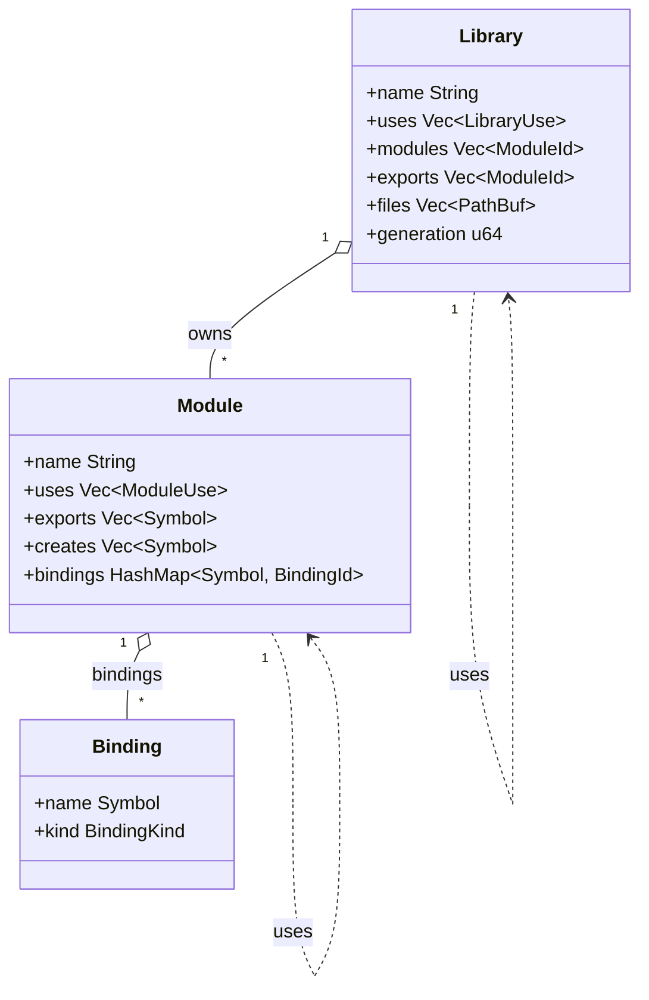
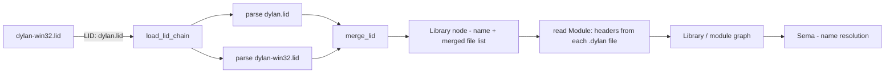

# Modules & libraries

Dylan's namespace system has two levels: a **library** owns the compilation boundary,
and **modules** inside it control name visibility. This page is the Dylan-user view —
what you write, what it means, and what actually works today. For the compiler data
structures that implement the graph, see [Namespaces](../compiler/namespace.md).

---

## The two-level model

Most languages collapse package and namespace into one concept. Dylan separates them:

- A **library** is the *compilation unit* — the boundary of code generation, sealing
  decisions, and (eventually) incremental cache invalidation. Every module belongs to
  exactly one library; two libraries cannot share a module.
- A **module** is a *namespace* inside a library. It holds a set of *bindings*,
  explicitly controls what names it imports from other modules via `use` clauses, and
  explicitly declares what it exports.
- A **binding** is a single named definition (`define class`, `define generic`,
  `define function`, `define constant`, `define c-function`, …). Every identifier in a
  `.dylan` source file is resolved against exactly one module — the one named in that
  file's `Module:` header.

Visibility composes across both levels:

| Where `foo` is defined | What is required to see it in module `m` of library `L` |
|------------------------|----------------------------------------------------------|
| In `m` itself | Direct lookup — no clause needed |
| In module `m2`, same library `L` | `m` must `use m2`; `m2` must export `foo` |
| In module `m2` of library `L2` | `L` must `use L2`; `L2` must export `m2`; then `m` must `use m2` |

The two-level diagram below shows the relationships as the compiler models them. The
compiler page has the full type-level detail; this diagram shows the conceptual shape.



A `Library` owns modules; a `Module` owns bindings; both have `uses` edges that
cross to other libraries and modules respectively.

---

## What you write today

Today's supported path is LID-file-driven. Name resolution is anchored by two things:

1. A **LID file** that describes the library: its name, source files, and (recorded but
   not yet resolved) library-level `use` dependencies.
2. A **`Module:` header** at the top of every `.dylan` source file, declaring which
   module the file's definitions belong to.

### The `Module:` header

Every `.dylan` source file starts with one or more `Key: value` header lines.
`Module:` is the only header with semantic weight today. All fixtures in the test
suite use exactly this pattern. For example, `tests/nod-od-suite/fixtures/area-shapes.dylan:1`:

```dylan
Module: area-shapes

define class <shape> (<object>)
end class;
```

And `src/nod-dylan/dylan-sources/stdlib.dylan:1–2`:

```dylan
Module: dylan
Precedence: c
```

Every identifier reference and every `define` form in the rest of the file is resolved
against the named module. Other header lines (`Author:`, `Synopsis:`, `Copyright:`) are
recorded but have no semantic effect today.

### The LID file

A LID file is a line-oriented `Key: value` format that describes one library. The parser
(`src/nod-namespace/src/lid.rs:41`) does a two-pass scan: continuation lines (any line
starting with whitespace) are appended to the previous record; then each `(key, value)`
pair is dispatched case-insensitively.

A minimal LID for a single-file executable:

```lid
Library:       my-app
Target-Type:   executable
Start-Function: main
Files:         my-app
```

A LID for a multi-file library:

```lid
Library:       geometry
Major-Version: 1
Minor-Version: 0
Target-Type:   dll
Files:         library
               shapes
               area
```

`Files:` entries are bare names — `.dylan` is appended automatically if missing
(`lid.rs:93–97`, `graph.rs:182–190`). File order in `Files:` is **load-bearing**:
the graph builder preserves declaration order and sema walks files in that order
(`docs/specs/05-library-module-graph.md §3`).

**Recognised LID fields** (all are parsed; status notes which are acted on today):

| Field | Status | Meaning |
|-------|--------|---------|
| `Library:` | **Live** — required | The library name |
| `Files:` | **Live** — required | Source files in load order |
| `Target-Type:` | Live (recorded; JIT ignores it) | `dll` or `executable` |
| `Start-Function:` | Live (recorded; AOT uses it) | Entry-point name for executables |
| `Executable:` | Recorded | Output binary name |
| `Major-Version:` / `Minor-Version:` | Recorded | Version pair, not used for resolution |
| `LID:` | **Live** — include chain | Triggers `load_lid_chain`; child shadows single-valued parent fields, extends list fields |
| `Platforms:` | Parsed, not selected | Whitespace-separated triples; selection algorithm deferred |
| `Base-Address:` | Recorded | Win32 preferred load address (AOT only) |
| Unknown keys | Recorded in `other: Vec` | Not an error; surfaced as a diagnostic warning |

**LID inheritance.** A platform-overlay LID uses `LID: parent.lid`. The child's
single-valued fields shadow the parent's; list-valued fields (`Files:`, `Platforms:`)
extend the parent's. This is how `dylan-win32.lid` adds `Executable:` and a few extra
files to `dylan.lid` without duplicating the full 91-file `Files:` block
(`lid.rs:150–176`).



### How LID drives the build today

The key insight is that today the library and module graph is constructed
**without** running `define library` or `define module` resolution. The working path:

1. **Parse the LID** — `parse_lid_str` / `load_lid_chain` builds a `Lid` struct.
2. **Build a Library node** — `Graph::add_library_from_lid` allocates a `LibraryId`,
   interns the library name, and resolves `Files:` entries to absolute paths
   (`graph.rs:173–206`).
3. **Read `Module:` headers** — for each source file, `nod-reader` reads the `Module:`
   header and the driver wires the file to the named module via `Graph::add_module`
   (`graph.rs:208–223`).
4. **Sema queries the graph** — `Graph::lookup_binding` answers "is this name in
   this module?" (`graph.rs:288`). Today this covers `define c-function` bindings
   (the only fully-wired binding kind); Dylan-to-Dylan bindings still live in sema's
   flat tables.

Cross-module `use`/`export` resolution — the full clause-walking that populates
`Module::uses` and `Module::exports` — is explicitly **stubbed**, as noted in the
comment at `graph.rs:3–4`:

> *"Resolution of `use`/`import`/`export` clauses is stubbed pending Sprint 04
> `define module` / `define library` parsing."*

And confirmed in `docs/DEFERRED.md`, carry-over from Sprint 05:

> *"`use` / `import:` / `exclude:` / `rename:` / `prefix:` / `export:` resolution
> — Sprint 05 → Sprint 06. … Graph cannot answer cross-module name lookups until the
> AST forms are walked."*

In practice this means that today all files loaded together share a flat name space
within sema — definitions from all files in a `Files:` list are visible to each other
without any `use` clause. This is the same approach the multi-file AOT build uses
(`nod-driver build a.dylan b.dylan … -o foo.exe` merges ASTs and lowers once; see
the README).

---

## `define library` and `define module`

The Dylan language has explicit in-source forms for declaring library and module
structure.

### `define module`

```dylan
define module geometry
  use dylan;
  use common-dylan,
    import: { format-out, as };
  export <shape>, area, perimeter;
  create <geometry-error>;
end module geometry;
```

`use MODULE` imports all of the named module's exported bindings. Modifiers:

- `import: { name, … }` — import only the listed names
- `exclude: { name, … }` — import everything except the listed names
- `rename: { old => new, … }` — bring in under a different local name
- `prefix: "p_"` — prepend a string to all imported names
- `export: { name, … }` / `export: all` — re-export some or all imports

`export NAME, …` (top-level) declares which names this module makes available to
importers. `create NAME, …` declares names this module introduces as protocol
vocabulary, to be defined by another module.

### `define library`

```dylan
define library geometry-lib
  use dylan;
  use common-dylan,
    export: { common-dylan };
  export geometry, geometry-internals;
end library geometry-lib;
```

`use LIBRARY` declares a dependency on another library. `export MODULE, …` lists
which of this library's modules are visible to consumer libraries.

### What is parsed vs. what is resolved

The parser in `nod-reader` **fully parses** both forms. `ast.rs:610–623` shows both
`Item::DefineLibrary` and `Item::DefineModule` as first-class AST variants with their
`uses`, `exports`, and `creates` fields populated by the parser. The pretty-printer
can round-trip them; `dump-ast` shows them.

However, **resolution of these forms into the graph is still stubbed**. The data
structures that would hold the results — `ModuleUse` with its `import`, `exclude`,
`rename`, `prefix`, and `reexport` fields — exist in `graph.rs:121–129`, but
`add_library_from_lid` and `add_module` populate `uses: Vec::new()` and `exports:
Vec::new()`. Until a resolution pass walks the parsed AST nodes and fills those
vectors, `define module` and `define library` forms are parsed and discarded.

**Summary: what works today vs. what is stubbed:**

| Feature | Status |
|---------|--------|
| `Module:` header in source files | **Works** — wires file to module |
| LID parsing — all fields | **Works** |
| LID include chains (`LID:`) | **Works** |
| Library node construction from LID | **Works** |
| Module node construction from `Module:` headers | **Works** |
| `define library` / `define module` — parsing | **Works** (AST nodes produced) |
| `define library` / `define module` — resolution into graph | **Stubbed** |
| `use`/`import`/`export`/`exclude`/`rename`/`prefix` clause resolution | **Stubbed** |
| Cross-module name visibility enforcement | **Stubbed** — all files share a flat namespace within a compilation |
| Platform-conditional LID selection (`Platforms:`) | **Parsed, not selected** |

---

## The kernel `dylan` library

Every Dylan program implicitly depends on the kernel `dylan` library. This library is
unusual: it has **no `define library dylan` form** anywhere in its source tree. The
kernel library is bootstrapped from the LID alone — the `dylan` library node is
constructed by `add_library_from_lid` from `dylan.lid` (or `dylan-win32.lid` +
`LID: dylan.lid`), and the module structure is recovered from the `Module:` headers
in the library's 91 source files (`docs/specs/05-library-module-graph.md §6.3`).

In NewOpenDylan, the kernel is represented by
`src/nod-dylan/dylan-sources/stdlib.dylan`, which declares `Module: dylan` and
provides the standard library surface (collections, `size`, `concatenate`, FIP
wrappers, macros). It is pre-compiled into a long-lived JIT engine and merged into
AOT modules at build time.

The kernel module `dylan-user` is the default starting namespace for code that carries
no `Module:` header. In practice every file in the test suite carries an explicit
`Module:` header, so this default is rarely exercised.

---

## Inspecting the graph

`nod-driver dump-graph <lid>` builds the library/module graph from a LID file and
emits it as a Graphviz DOT document. Pipe it to `dot -Tpng` to see the library
clusters and module edges:

```
nod-driver dump-graph mylib.lid | dot -Tpng -o graph.png
```

The driver page documents all subcommands. The namespace compiler page explains
exactly what `dump-graph` emits — which edges are resolved vs. unresolved today.

---

## How it is implemented

The graph data structures, LID parser, `add_library_from_lid`, and
`Graph::lookup_binding` all live in `src/nod-namespace`. See
[Namespaces](../compiler/namespace.md) for:

- The full `Graph`, `Library`, `Module`, `Binding`, and `SymbolInterner` type
  reference.
- The LID include chain algorithm and merge rules.
- The `dump-graph` DOT output format and invariants (file order, append-only
  interner, DLL name normalisation).
- Where `ModuleRef::Unresolved` is a legal graph state and how the code handles it.

---

## See also

- [Namespaces](../compiler/namespace.md) — compiler view of the library/module graph
- [Driver](../compiler/driver.md) — `dump-graph` subcommand and build orchestration
- [Semantic analysis](../compiler/sema.md) — how sema consumes the graph for name resolution

---
[Manual home](../index.md) · [Conditions](conditions.md)
