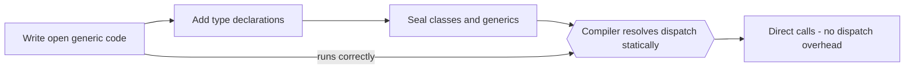
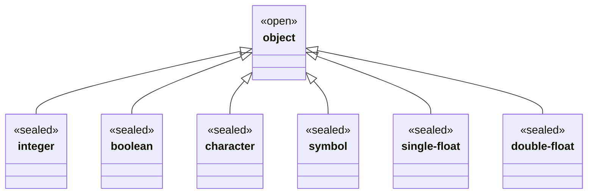
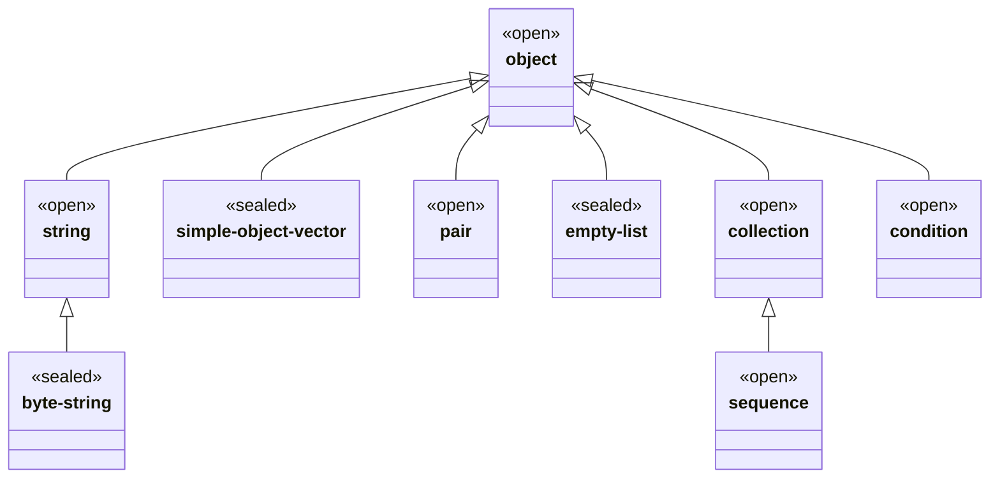

# Language Overview

Dylan is a Lisp-family language with an ALGOL-style infix syntax: multiple
dispatch, a real condition system, hygienic pattern macros, and first-class
functions — written in code that looks like ordinary structured programming
and compiles to native machine code.

## What Dylan is

Dylan's genetic line is CLOS without parentheses. The object system, generic
functions, condition system, and multiple values all descend directly from
Common Lisp. What changed is the surface: `define class` / `define method` /
`define generic` replace `defclass` / `defmethod` / `defgeneric`; keyword
arguments use `key:` instead of `:key`; class names are conventionally
written `<angle-brackets>` and symbols as `#"symbol"`, making types visually
distinct from ordinary identifiers. Control flow uses familiar words — `if`,
`else`, `end`, `let` — not parenthesised S-expressions.

The short version: a Lisp-inspired language that reads like ordinary code and
compiles to fast native binaries.

Key properties that set Dylan apart:

- **Multiple dispatch** — a generic function selects the most-specific method
  based on the runtime types of *all* arguments, not just the first. There is
  no privileged receiver.
- **Controlled dynamism** — write open, generic code first; add type
  declarations and sealing constraints later to let the compiler specialise.
  Prototype and production live in one language on one codebase.
- **Hygienic macros** — `define macro` pattern rules rewrite syntax before
  semantic analysis, with automatic freshening of introduced bindings. Large
  parts of the control-flow surface (`unless`, `when`, `for-each`, `cond`,
  `with-cleanup`) are stdlib macros, not built-in AST nodes.
- **Condition system** — conditions are class instances, handlers are bound
  dynamically, restarts are first-class, and `signal` can return if a handler
  invokes a restart. This is the CLOS condition model.
- **Conventional syntax** — no parenthesis tax. Code that looks like this is
  real Dylan.

```dylan
define method area (c :: <circle>) => (<integer>)
  radius(c) * radius(c) * 3
end method area;
```

## Controlled dynamism

The central idea of Dylan is that *you control how much the compiler knows*.
By default everything is open: classes can be subclassed, generics can have
methods added, and dispatch is fully dynamic. That is the right default for
a prototype.

As a codebase matures you annotate it: add type declarations on slots and
parameters, then add `sealed` declarations to promise the compiler that a
class or generic will not be extended by other libraries. The compiler
exploits those promises — sealed dispatch can be resolved entirely at compile
time and lowered to a direct call or a small inline cache. No rewrite
required; the same source file moves along a spectrum.



At the left end of the arrow you have a working prototype with full runtime
dispatch. At the right end you have production code with performance
comparable to C++ virtual dispatch — and it is the same source file, with
annotations added, not a port.

## A worked example

The `area-shapes` fixture (`tests/nod-od-suite/fixtures/area-shapes.dylan`)
is the canonical single-dispatch demo. It defines two shape classes, declares
a generic function, and gives each shape its own method:

```dylan
Module: area-shapes

define class <shape> (<object>)
end class;

define class <circle> (<shape>)
  slot radius :: <integer>, init-keyword: radius:;
end class;

define class <square> (<shape>)
  slot side :: <integer>, init-keyword: side:;
end class;

define generic area (s :: <shape>) => (<integer>);

define method area (c :: <circle>) => (<integer>)
  radius(c) * radius(c) * 3
end method area;

define method area (s :: <square>) => (<integer>)
  side(s) * side(s)
end method area;

define function main () => (<integer>)
  let c = make(<circle>, radius: 2);
  let s = make(<square>, side: 5);
  area(c) + area(s)
end function main;
```

Walking through the pieces:

**`define class <circle> (<shape>)`** declares `<circle>` as a subclass of
`<shape>`. The `<angle-bracket>` naming convention marks it as a class;
ordinary identifiers are values. The superclass list `(<shape>)` drives C3
linearisation. See [Types & classes](types-and-classes.md).

**`slot radius :: <integer>, init-keyword: radius:`** adds one instance slot
with a type constraint and an init keyword. The compiler auto-generates getter
(`radius(c)`) and setter (`radius(c) := v`) generics. The `init-keyword:`
means `make(<circle>, radius: 2)` sets the slot at construction time.

**`define generic area (s :: <shape>) => (<integer>)`** declares the generic
function contract: one argument that is a `<shape>`, one integer result. This
is optional — the first `define method` would create the generic implicitly —
but explicit declarations are good style. See [Generic functions](generic-functions.md).

**`define method area (c :: <circle>) => (<integer>)`** adds one method
specialised on `<circle>`. When `area(c)` is called with a `<circle>`,
dispatch picks this method over any method specialised on the parent `<shape>`,
because `<circle>` is more specific. This is the dispatch rule: most-specific
method wins. See [Generic functions](generic-functions.md).

**`define function main`** is a non-generic top-level function — shorthand
for a method with no specialisation. `make(<circle>, radius: 2)` allocates a
`<circle>` on the GC heap, sets the `radius` slot, and returns the new
instance. `area(c) + area(s)` dispatches twice: once to the circle method
(result: 12) and once to the square method (result: 25). Return value: 37.

**`let c = ...`** binds `c` as a local variable. `let` is the only form that
introduces bindings in expression position. See [Syntax](syntax.md).

**Binary operators like `*` and `+`** are generic functions. Dylan has
**no operator precedence** — all binary operators are left-associative and
flat. `xx * xx + yy * yy` parses as `((xx * xx) + yy) * yy`. Explicit
grouping with parentheses is required for the sum-of-squares shape; see the
`point` fixture (`tests/nod-tests/fixtures/point.dylan`) for this in context.

## The built-in class tower

Every Dylan value is an instance of `<object>`. The seed classes registered
by this implementation at startup (`src/nod-runtime/src/classes.rs`,
`ClassId` constants) form two groups: scalar immediates and structured heap
objects. The condition and collection hierarchies extend this at runtime.

**Scalar and basic types:**



**Structured types and collections:**



The `<<sealed>>` / `<<open>>` stereotypes show which classes are sealing-safe
today. Concrete scalar types (`<integer>`, `<boolean>`, `<symbol>`, etc.) are
tagged immediates or pinned singletons — they have no heap header in the
usual sense. `<byte-string>` is a byte-payload heap object with a length
prefix. `<simple-object-vector>` is a fixed-length Word array scanned by the
GC. `<pair>` is a cons cell. `<empty-list>` is the singleton `#()`.

The collection hierarchy (`<collection>`, `<mutable-collection>`,
`<sequence>`, `<mutable-sequence>`, `<explicit-key-collection>`,
`<stretchy-collection>`) and the condition hierarchy (`<condition>`,
`<serious-condition>`, `<error>`, `<warning>`, `<simple-error>`) are
registered as user classes at startup by the runtime
(`src/nod-runtime/src/collections.rs` and `src/nod-runtime/src/conditions.rs`
respectively). They are not shown above to keep the diagram readable. See
[Conditions](conditions.md).

User-defined classes (`define class <foo> (<bar>)`) extend the hierarchy from
any of these roots. The compiler assigns each a unique `ClassId`; the GC
knows their slot layouts; and dispatch walks the class precedence list (C3
order) to find the most-specific applicable method.

## The pieces

| Page | What it covers |
|------|----------------|
| [Syntax & lexical structure](syntax.md) | Tokens, definitions, expressions, left-associative infix grammar, `Module:` header |
| [Types & classes](types-and-classes.md) | `define class`, slots, `make`, `<angle>` names, C3 linearisation, `instance?` |
| [Generic functions & dispatch](generic-functions.md) | `define generic`, `define method`, multiple dispatch, C3 method order |
| [Macros](macros.md) | `define macro` pattern rules, hygiene, the stdlib macro surface (`unless`, `cond`, `for-each`, ...) |
| [Modules & libraries](modules-and-libraries.md) | `define library`, `define module`, LID files, `use`, `export`, the namespace graph |
| [Conditions](conditions.md) | `signal`, `block`/`exception`, handlers, restarts, `<error>` hierarchy |
| [Sealing](sealing.md) | `sealed class`, `sealed generic`, `define sealed domain`, static dispatch |

## Status

NewOpenDylan is a work-in-progress revival, not a production release.

**What runs today:**

- The compiler JITs non-trivial Dylan programs via `nod-driver eval` and the
  REPL, and AOT-compiles standalone Win64 EXEs via `nod-driver build`.
- Multi-file AOT builds (via `.prj` project files) merge ASTs before lowering
  so definitions are visible across files.
- `nod-ide.exe` — a graphical source editor with DirectWrite rendering, a rope
  buffer, and syntax colouring — is itself written entirely in Dylan (~2000
  lines across five source files) and AOT-built by the compiler.
- The Dylan-in-Dylan lexer and parser (Sprints 45–46) run inside the driver
  and parse the whole test corpus. The front-end is actively migrating to
  Dylan.
- The stdlib macro surface is growing: `unless`, `when`, `for-each`,
  `with-cleanup`, and `cond` are all `define macro` forms in
  `src/nod-dylan/dylan-sources/stdlib.dylan`, not hardcoded AST nodes.
- Collections (`<stretchy-vector>`, `<table>`, `<byte-string>`), the
  condition system, and the Win32 FFI are live.

**Known gaps and caveats:**

- The GC's alloca-tracker verifier is queued but not built. The
  precise-root invariant holds by construction; a future codegen change
  could regress it silently.
- AOT release mode hits an LNK2005 `nod_user_main` collision; debug mode
  works.
- `select` (the dispatching switch form) is partially implemented.
- Cross-module symbol linkage for separately compiled libraries is deferred.
- The DRM condition hierarchy uses multiple inheritance; the seed classes
  today use single inheritance as a pragmatic shortcut.

See `docs/DEFERRED.md` for the full list of consciously deferred features,
and `docs/SPRINTS.md` for the sprint-by-sprint implementation log.

---
[Manual home](../index.md) · [Syntax](syntax.md)
