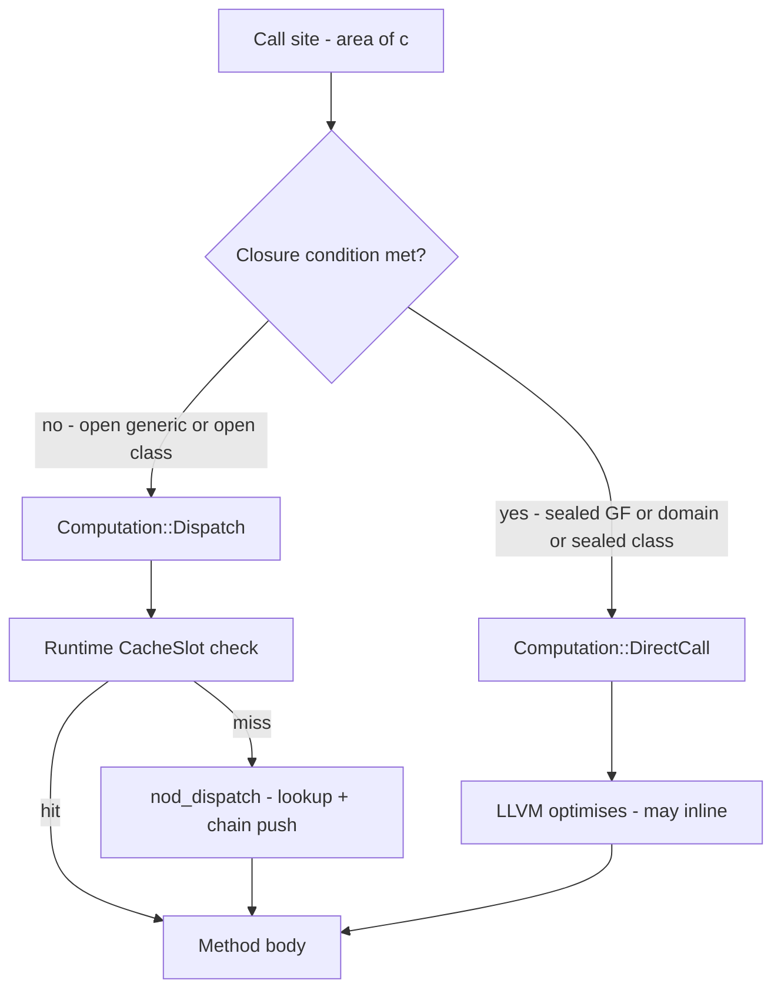
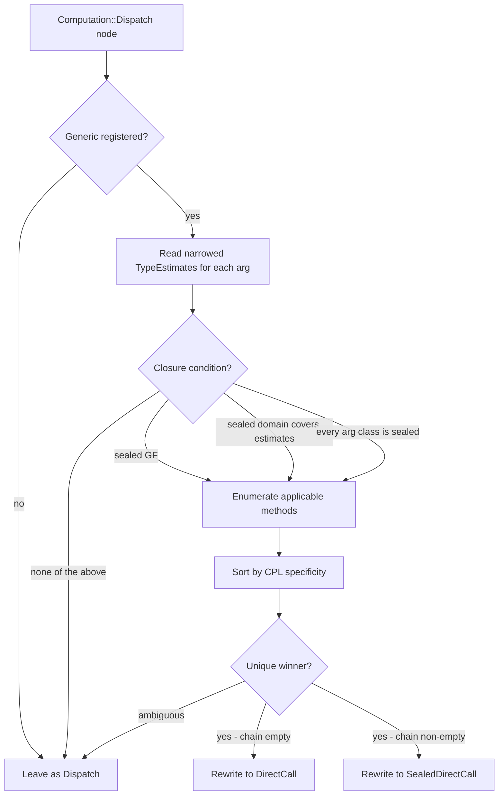

# Sealing — Controlled Dynamism Made Concrete

Sealing is Dylan's promise that a class or generic function will not be extended
beyond its home library. That promise lets the compiler replace runtime dispatch
with a direct function call — no cache, no `nod_dispatch`, no indirection. This
is the payoff of "controlled dynamism": a language that reads dynamic but compiles
to code as fast as if you had written static method calls.

Sealing is *opt-in*. Everything is open by default; sealing is the production-tuning
step. See [Language overview](overview.md) for the broader philosophy.

## The promise — three kinds of sealing

### Sealed class

```dylan
define sealed class <circle> (<shape>)
  slot radius :: <integer>, init-keyword: radius:;
end class;
```

The `sealed` modifier on `define class` records `ClassMetadata::sealed = true`
(`src/nod-sema/src/lower.rs:1464-1472`). From that point on, any attempt to
subclass `<circle>` from a different library fails at compile time with
`LoweringError::SealingViolation { SealedClassExtendedAcrossBoundary }`.

The sealed bit is set in Phase 1c of `lower_module_full` — *after* every class
in the current lowering call is registered. This timing is deliberate: an
in-library subclass of a sealed class is legal, so the seal must not fire
until all same-library subclasses are already in place
(`src/nod-sema/src/lower.rs:1458-1480`, `src/nod-sema/src/compiler/sema.md`
"sealed flags flip after all in-library classes register").

`define open class` is the explicit spelling of the default. Seed classes such
as `<integer>`, `<boolean>`, and `<character>` are sealed by construction
(`src/nod-sema/src/optimise/dispatch.rs:336-339`): the fixnum-tag encoding
makes them physically non-subclassable, so the resolver treats them as sealed
without consulting a flag.

### Sealed generic function

```dylan
define sealed generic area (s :: <shape>) => (<integer>);
```

The `sealed` modifier on `define generic` marks `GenericFunction::sealed`
(an `AtomicBool`) via `mark_sealed()`. No method may be added to `area` from
outside this library. The runtime returns `MethodTableError::SealedGenericClosed`
on any such attempt.

### Sealed domain

```dylan
define sealed domain area (<shape>);
```

A sealed domain is more fine-grained: the generic itself remains open to
extension with methods on other argument types (say, `<polygon>`), but the
dispatch shape `area(<shape>)` — meaning any call where the argument is
`<: <shape>` — is promised complete within this library.

Sealed domains are recorded in `SealingFacts::domains`
(`src/nod-sema/src/optimise/facts.rs:27`) and on `GenericFunction::sealed_domains`
at the runtime level. Each entry is a `Vec<ClassId>` specialiser tuple.

**Implementation note — source-syntax gap:** `define sealed domain` is parsed via
a catch-all path (`Item::DefineOther { keyword: "domain", ... }`). The parser
currently drops the specialiser-tuple fragments before reaching the lowerer, so
sealed domains cannot be installed from source syntax alone in the current build.
In-process tests and the REPL install them programmatically via
`GenericFunction::register_sealed_domain`. Full source-syntax support is tracked
in `docs/DEFERRED.md` as an open Sprint 04 follow-up item.

### Default openness

Without any `sealed` modifier, classes and generics are **open**. Any library that
can see the generic can add a method; any library that can see the class can
subclass it. The compiler cannot prove the method set closed and leaves dispatch
as a runtime `Computation::Dispatch` handled by the inline cache.

## Why seal: static dispatch

When the compiler can prove the complete method set at a call site, it rewrites the
DFM `Computation::Dispatch` node — the node that would otherwise call `nod_dispatch`
and check the inline cache — to a `Computation::DirectCall` (single applicable method,
no fallback chain) or `Computation::SealedDirectCall` (pre-computed fallback chain
for `next-method` support). Neither variant emits a cache check; neither calls
`nod_dispatch`. LLVM sees a direct `call @method_body` and can inline or optimise
it like any other function call.



The rewrite is strictly opt-in and sound-by-default: when in doubt the node stays
as `Dispatch` and the inline cache handles it safely
(`src/nod-sema/src/optimise/dispatch.rs:24`).

## When the compiler closes dispatch

The resolution pass (`resolve_dispatches` in
`src/nod-sema/src/optimise/dispatch.rs:76`) runs after the type-narrowing pass
(`narrow_function` in `src/nod-sema/src/optimise/narrowing.rs:34`). For each
`Computation::Dispatch` node it calls `resolve_one` (`dispatch.rs:196`), which
runs the following algorithm:

1. Look up the generic in the runtime registry. If unknown, leave as `Dispatch`.
2. Read the narrowed `TypeEstimate` for each call argument.
3. Check the **closure condition** (`check_closure`, `dispatch.rs:295`):
   - the generic's `sealed` flag is set, **OR**
   - every argument estimate `est[i]` is `<: Si` for some sealed domain
     `(S0, …, Sn)` on that generic, **OR**
   - every argument's class is itself sealed (including seed immediates such
     as `<integer>`, `<boolean>`, `<character>`, `<single-float>`,
     `<double-float>`, and `<byte-string>`).
4. Enumerate **applicable methods**: method `M` is applicable iff every
   `est[i]` is a subtype of `M.specialisers[i]`.
5. Sort by CPL-driven specificity. A unique most-specific winner rewrites the
   node. Ambiguous → leave as `Dispatch`.
6. Emit `DirectCall` (no fallback chain) or `SealedDirectCall` (chain non-empty,
   for `next-method` support). Preserve `safepoint_roots` verbatim for GC
   correctness (`dispatch.rs:113`).
7. Record a `ResolvedDispatchEntry` in the runtime's back-reference index for
   future invalidation (Sprint 29 cross-library work; currently populated but
   not read).



The narrowing pass that feeds estimates into step 2 applies these rules
(`src/nod-sema/src/optimise/narrowing.rs`):

- A method parameter `p :: <circle>` gives `TypeEstimate::Class(<circle>)`.
- `make(<circle>, …)` gives `TypeEstimate::Class(<circle>)` for the result.
- An `instance?` guard on the `then`-branch narrows the checked temp to
  `meet(prev, Class(<C>))`.
- A slot typed `slot c :: <circle>` yields `Class(<circle>)` when read.

### Worked example

```dylan
define sealed class <shape> (<object>) end class;
define sealed class <circle> (<shape>)
  slot radius :: <integer>, init-keyword: radius:;
end class;
define sealed class <square> (<shape>)
  slot side :: <integer>, init-keyword: side:;
end class;

define sealed generic area (s :: <shape>) => (<integer>);
define method area (c :: <circle>) => (<integer>)
  c.radius * c.radius * 3
end method area;
define method area (s :: <square>) => (<integer>)
  s.side * s.side
end method area;

define function total (c :: <circle>, s :: <square>) => (<integer>)
  area(c) + area(s)
end function;
```

Inside `total`, the narrowing pass gives `c :: Class(<circle>)` and
`s :: Class(<square>)` from the method specialisers. The resolver checks `area`:
the generic is sealed, so closure holds. Only `area(<circle>)` is applicable for
`c`; only `area(<square>)` for `s`. Both sites rewrite to `DirectCall`. The
`dump-dispatch` annotation shows:

```
t0: <integer> = DirectCall area$<circle-id>(c)    ; sealed-direct
t1: <integer> = DirectCall area$<square-id>(s)    ; sealed-direct
t2: <integer> = PrimOp AddInt t0 t1
```

No cache loads; no `nod_dispatch` calls; no cache slots written.

## Enforcement — cross-library subclass refusal

The compiler enforces sealed-class promises at the library boundary. The check
lives in `register_class` at `src/nod-sema/src/lower.rs:2622-2634`:

```
// Sprint 15 cross-library refusal.
// If the parent's `sealed` bit is set, this lowering call is a
// different "library" — refuse.
if sealed {
    return Err(LoweringError::SealingViolation {
        violation: SealedClassExtendedAcrossBoundary {
            sealed_parent, child
        }
    });
}
```

The check fires because the sealed bit is flipped in Phase 1c *after* all
in-library classes are registered. A second `lower_module_full` call — simulating
a different library — sees the sealed bit already set and refuses. In-library
subclassing of a sealed class always succeeds.

The analogous guard for generics — refusing `add_method` on a sealed GF — lives
at the runtime level and returns `MethodTableError::SealedGenericClosed`.

## Open by default

The default for both classes and generics is *open*. Sealing is the step you
take when a library's design is stable and you want the compiler to exploit the
static knowledge. Seal too eagerly and you break downstream extension; seal
deliberately and you get free static dispatch wherever the type estimates are
specific enough.

See [Language overview](overview.md) for Dylan's philosophy of controlled dynamism.

## Performance note

The Richards-shape benchmark (`bench/richards.md`) measures the dispatch
differential between a fully-sealed task-class hierarchy and an open one. Current
measurements:

| Sprint | Build   | Sealed | Open   | Ratio |
|--------|---------|--------|--------|-------|
| 16 (Sprint 11b mutex baseline) | release | 14 446 ms | 15 369 ms | 1.06x |
| 11c (lock-free roots) | release | 660 ms | 915 ms | 1.39x |
| 11c | debug | 7 100 ms | 7 700 ms | 1.09x |

The Sprint 16 baseline was dominated by per-call `Mutex` acquisition in the root
registry; that cost dwarfed the dispatch differential. Sprint 11c's lock-free
thread-local root registry removed it, making both variants ~17–22x faster
end-to-end and revealing a ~1.4x sealed-vs-open ratio in release mode.

Two observations from this trajectory, consistent with the project memory note
"LLVM does most optimisation":

- The win from sealing is "emit a `DirectCall` that LLVM can see, so LLVM can
  inline and optimise it" — not magic frontend work. Sprint 18's LLVM
  optimisation passes (cross-function inlining) are expected to widen the ratio
  further when sealed-direct call bodies become inline candidates.
- The regression guard in the bench test is `ratio >= 0.95`, not a target ratio.
  Hard performance gates wait until Sprint 25-ish, when correctness is stable.

The bench is in `tests/nod-tests/tests/bench_richards.rs` (`#[ignore]` by default;
run with `--ignored bench_richards_speedup --nocapture`).

## How it is implemented

The sealing and dispatch optimisation pipeline runs inside `lower_module_full`
after Phase 4 builds all DFM:

| Pass | Source | What it does |
|------|--------|--------------|
| Collect sealing facts | `src/nod-sema/src/optimise/facts.rs:181` | Reads `Modifier::Sealed` on `define class` / `define generic`; records sealed domains |
| Narrow type estimates | `src/nod-sema/src/optimise/narrowing.rs:34` | Forward dataflow per function; produces `NarrowedEstimates` |
| Resolve dispatches | `src/nod-sema/src/optimise/dispatch.rs:76` | Rewrites `Dispatch` to `DirectCall` / `SealedDirectCall` where closure holds |

The full pipeline diagram, including where this fits in the multi-phase lowerer,
is in [Semantic Analysis](../compiler/sema.md). The DFM IR types
(`Computation::Dispatch`, `Computation::DirectCall`, `Computation::SealedDirectCall`,
`TypeEstimate`) are documented in [DFM: the IR](../compiler/dfm.md).

## See also

- [Generic functions and dispatch](generic-functions.md) — how dispatch works before sealing intervenes
- [Semantic analysis](../compiler/sema.md) — the full pipeline with phase diagram
- [Runtime and object model](../compiler/runtime.md) — the `CacheSlot`, `nod_dispatch`, `SealedDirectCall` chain frame
- [DFM: the IR](../compiler/dfm.md) — `Computation::Dispatch`, `DirectCall`, `SealedDirectCall`

---
[Manual home](../index.md) · [Compiler overview](../compiler/overview.md)
