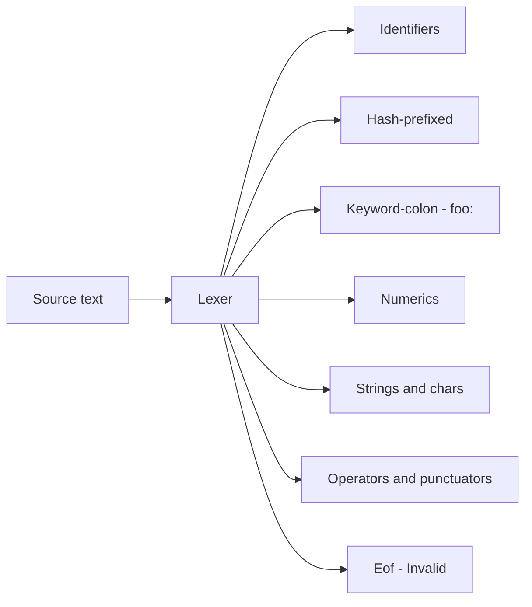
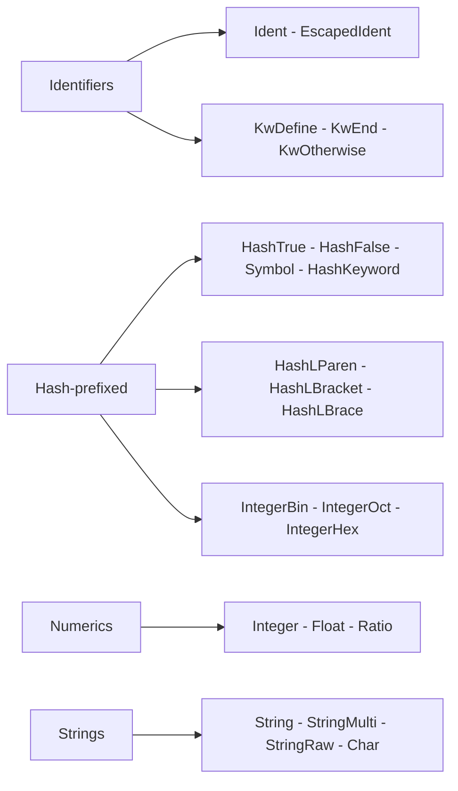
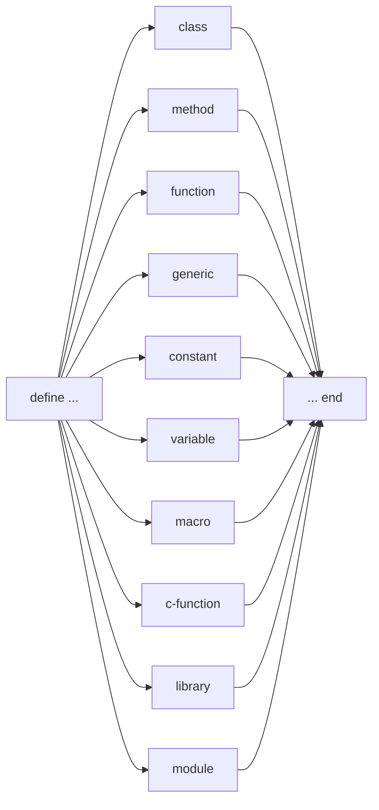

# Syntax & Lexical Structure

Dylan is an ALGOL-family language with a distinctively broad identifier alphabet,
three hard-reserved words, and a uniform `define WORD … end` framing for all
top-level definitions. This page describes the syntax as NewOpenDylan actually
parses it. For the internals — how the lexer, fragment builder, and parser are
implemented — see [Reader: lexer & parser](../compiler/reader.md).

## The feel of the syntax

Dylan code looks like this:

```dylan
define function factorial (n :: <integer>) => (<integer>)
  if (n = 0) 1 else n * factorial(n - 1) end
end function factorial;
```

A few things stand out immediately:

- **Type names carry angle brackets.** `<integer>`, `<object>`, `<user-point>`
  are *single identifiers* — the `<` and `>` are ordinary name characters.
  The convention signals "this is a class" but carries no syntactic weight.
- **Only three words are hard-reserved.** `define`, `end`, and `otherwise`.
  Every other word — `function`, `class`, `if`, `let`, `for`, `while`,
  `sealed`, `open`, `method`, `library`, `module`, and so on — is a plain
  identifier classified by the parser at the point of use.
- **Everything composes with `define … end`.** A function, class, generic, or
  constant is always introduced with `define WORD name … end`. This lets the
  language be extended with new definition forms without touching the lexer.
- **Infix operators have flat precedence.** All binary operators associate left
  at the same level. `a + b * c` parses as `(a + b) * c`, not `a + (b * c)`.
  Parentheses are the only grouping mechanism.

## Tokens

The lexer (`src/nod-reader/src/token.rs`, `src/nod-reader/src/lexer.rs`) emits
59 token kinds. The taxonomy below follows `specs/01-lexer.md` §2.

### Token categories





| Category | Token kinds | Example surface forms |
|----------|-------------|----------------------|
| Identifiers | `Ident`, `KwDefine`, `KwEnd`, `KwOtherwise`, `EscapedIdent` | `foo`, `<integer>`, `empty?`, `sort!`, `define`, `end`, `\+` |
| Hash-prefixed literals | `HashTrue`, `HashFalse`, `Symbol`, `HashKeyword`, `HashLParen`, `HashLBracket`, `HashLBrace`, `HashHash`, `HashRest`, `HashKey`, `HashAllKeys`, `HashNext`, `IntegerBin`, `IntegerOct`, `IntegerHex` | `#t`, `#f`, `#"foo"`, `#:bar`, `#(1 2 3)`, `#[1 2]`, `#b1010`, `#o755`, `#xFF` |
| Keyword-colon | `KeywordColon` | `size:`, `init-keyword:`, `radius:` |
| Numerics | `Integer`, `Float`, `Ratio` | `42`, `+3`, `-7`, `3.14`, `3.0e-2`, `3/4` |
| Strings and chars | `String`, `StringMulti`, `StringRaw`, `Char` | `"hello"`, `"""multi"""`, `#r"raw\path"`, `'a'` |
| Operators and punctuators | `Plus`, `Minus`, `Star`, `Slash`, `Equal`, `EqualEqual`, `TildeEqual`, `TildeEqualEqual`, `ColonEqual`, `ColonColon`, `Arrow`, `Less`, `Greater`, `LessEqual`, `GreaterEqual`, `Ellipsis`, `Dot`, `Comma`, `Semicolon`, `Query`, `QueryQuery`, `QueryEqual`, `QueryAt`, delimiters | `+`, `-`, `*`, `/`, `=`, `==`, `~=`, `~==`, `:=`, `::`, `=>`, `<`, `>`, `<=`, `>=`, `...`, `.`, `,`, `;`, `?`, `??`, `?=`, `?@`, `( ) [ ] { }` |
| Sentinels | `Eof`, `Invalid` | — |

### Identifiers and the three hard-reserved words

Only `define`, `end`, and `otherwise` are reserved at the lexer level
(`token.rs:27`). The parser classifies all other contextual words — `if`, `let`,
`class`, `method`, `for`, `while`, `sealed`, `open`, `abstract`, `library`,
`module`, `begin`, `block`, `case`, `select`, `when`, `unless`, `signal`,
`local`, `cleanup`, `exception` — by matching the text of an `Ident` token at
the appropriate parse site.

Dylan's identifier alphabet includes letters, digits, and the graphic characters
`! & * < = > | ^ $ % @ _ + ~ ? /` as well as the hyphen `-`. This is what makes
`empty?`, `sort!`, `<my-class>`, `*global*`, and `$pi` all single tokens.

Crucially, `<foo>` is **one token** (`Ident`), not three. The lexer enters
identifier mode when it sees `<` followed by an identifier-continuation character
(`lexer.rs:466`). A standalone `<` after whitespace enters operator mode.

Operators used as value names are written with a leading backslash: `\+`, `\<=`,
`\~==`. These lex as `EscapedIdent` (`token.rs:32`). The backslash is consumed;
the token's text is the part after it.

### Hash-prefixed tokens

The `#` character introduces a family of eighteen distinct token kinds. The
dispatch is on the byte immediately following `#` — the lexer is deterministic
with no backtracking (`specs/01-lexer.md §3.4`):

- `#t` / `#f` — boolean literals (`HashTrue`, `HashFalse`). Case-insensitive.
- `#"foo"` — symbol literal (`Symbol`). Same body grammar as string literals.
- `#:foo` — hash-keyword literal (`HashKeyword`). A keyword object, not a
  keyword argument marker. Distinct from the `foo:` (`KeywordColon`) form.
- `#(...)`, `#[...]`, `#{}` — literal-group openers (`HashLParen`, `HashLBracket`,
  `HashLBrace`).
- `#b`, `#o`, `#x` — binary, octal, hex integer prefixes (`IntegerBin`,
  `IntegerOct`, `IntegerHex`). `#xFF`, `#b1010`, `#o755`.
- `##`, `#rest`, `#key`, `#all-keys`, `#next` — macro and parameter keywords.

### Keyword-colon tokens

`foo:` (`KeywordColon`) is a distinct token, not an identifier followed by a
colon. It is used as the argument label in a keyword argument call:

```dylan
make(<user-point>, x: 3, y: 4)
```

Here `x:` and `y:` are `KeywordColon` tokens; `make` is a plain `Ident`
(`lexer.rs:1046`).

### Numeric literals

Integers may be decimal (`42`, `+3`, `-7`), binary (`#b1010`), octal (`#o755`),
or hex (`#xDEAD_BEEF`). Underscores are allowed between digits (`1_000_000`).
Signs `+` / `-` fold into the token only when immediately followed by a digit
(`lexer.rs:533`); `a + 3` yields three tokens.

Floats accept several exponent markers: `e`/`E` (double), `s`/`S`
(single-precision), `d`/`D` (double-precision). `3.0`, `3.0e-2`, `3.0s0` are
all `Float` tokens.

Ratio literals (`3/4`) lex as `Ratio` tokens. Runtime support is deferred
(`DEFERRED.md` — Sprint 04 carry-over).

### Strings and characters

- `"hello\n"` — ordinary `String`, escape sequences processed.
- `"""multi\nline"""` — `StringMulti`, triple-quoted, leading whitespace stripped.
- `#r"C:\path\no\escapes"` — `StringRaw`, no escape processing.
- `'a'`, `'\n'`, `'\<41>'` — single character or one escape, `Char` token.

Block comments nest: `/* outer /* inner */ still outer */` is one comment
(`lexer.rs:283`). Line comments use `//`.

## Definitions

Every top-level definition begins with `define`, ends with `end`, and names a
specific form in between. The parser recognises eleven definition forms
(`ast.rs:542`):



Most forms accept optional *modifiers* before the keyword: `sealed`, `open`,
`abstract`, `concrete`, `primary`, `free`, `inline`, `not-inline`, `sideways`,
`domain` (`ast.rs:440`).

### define function

```dylan
define function factorial (n :: <integer>) => (<integer>)
  if (n = 0) 1 else n * factorial(n - 1) end
end function factorial;
```

The `=> (<integer>)` part is the return signature. The body is a sequence of
statements or expressions. Source: `tests/nod-tests/fixtures/factorial.dylan`.

### define method

A method is a specialised implementation for a generic function. Parameters may
carry type constraints (`::` followed by a type expression):

```dylan
define method area (c :: <circle>) => (<integer>)
  radius(c) * radius(c) * 3
end method area;
```

Source: `tests/nod-od-suite/fixtures/area-shapes.dylan`. `Item::DefineMethod`
at `ast.rs:565`.

### define generic

Declares a generic function — a named dispatch table — without a body:

```dylan
define generic area (s :: <shape>) => (<integer>);
```

Source: `tests/nod-od-suite/fixtures/area-shapes.dylan`. `Item::DefineGeneric`
at `ast.rs:573`.

### define class

```dylan
define class <user-point> (<object>)
  slot x :: <integer>, init-keyword: x:;
  slot y :: <integer>, init-keyword: y:;
end class;
```

The superclass list follows the class name in parentheses. Each slot may carry a
type annotation (`::`) and keyword-argument options (`init-keyword:`,
`init-value:`, `setter:`, `allocation:`). Source:
`tests/nod-tests/fixtures/point.dylan`. `Item::DefineClass` at `ast.rs:580`.

### define constant and define variable

```dylan
define constant $pi = 3;
define variable *count* = 0;
```

`DefineConstant` and `DefineVariable` share the same surface shape — a name,
an optional type annotation, and an initialiser. `ast.rs:543` and `ast.rs:551`.

### define macro

```dylan
define macro unless
  { unless ?cond:expression ?body:expression end }
    => { if (~ ?cond) ?body else 0 end }
end macro;
```

The macro body is pattern-rule grammar, not expression grammar. The parser
captures it as raw fragments (`ast.rs:627`, `Item::DefineMacro`). The macro
expander (`nod-macro`) processes it later. See [Macros](macros.md).

### define library and define module

These form the namespace graph; they hold `use` / `export` / `create` clauses.
See [Modules & libraries](modules-and-libraries.md). `ast.rs:610` and `ast.rs:617`.

### define c-function

```dylan
define c-function GetTickCount () => (<integer>)
  c-name: "GetTickCount";
  library: "Kernel32.dll";
end;
```

Declares a Win64 C-ABI binding. The body contains attribute clauses only; no
Dylan code. `Item::DefineCFunction` at `ast.rs:597`. See [FFI](../compiler/ffi.md).

## Expressions and statements

The body of a function or method is a sequence of *statements*, each optionally
terminated by `;`. The final expression is the return value.

### Kernel expression forms

These are hardcoded in the parser (`ast.rs:29`) and produce structured AST nodes:

| Form | AST variant | Notes |
|------|-------------|-------|
| `if (cond) then else end` | `Expr::If` | `else` and `elseif` clauses optional |
| `case (cond1 => body1; ...) end` | `Expr::Case` | value-returning dispatch |
| `begin body end` | `Expr::Begin` | explicit sequencing block |
| `let x = expr` | `Expr::Let` / `Statement::Let` | local binding |
| `method (params) body end` | `Expr::Method` | anonymous method value |

### Kernel statement forms

These are also hardcoded and appear at statement position (`ast.rs:741`):

| Form | AST variant | Notes |
|------|-------------|-------|
| `while (cond) body end` | `Statement::While` | pre-test loop |
| `until (cond) body end` | `Statement::Until` | pre-test loop, negated condition |
| `for (clauses) body end` | `Statement::For` | FIP-driven; `in`, `from`/`to`/`by` clauses |
| `block (exit-var) body cleanup ... end` | `Statement::Block` | non-local exit + cleanup |
| `local method name (params) body end; ...` | `Statement::Local` | locally-scoped method |

A `Statement::For` accepts several clause shapes: `var in collection`,
`var from start to limit`, `var from start by step`, `until cond`, `while cond`
(`ast.rs:695`).

A `Statement::Block` carries an optional exit variable, exception handlers
(`exception (e :: <error>) body`), a `cleanup` clause, and an `afterwards`
clause (`ast.rs:769`).

### Macro-defined forms

Forms like `when`, `unless`, `cond`, and `for-range` are **not** hardcoded in
the parser. They are defined as `define macro` in the stdlib
(`src/nod-dylan/dylan-sources/stdlib.dylan`) and expand to kernel forms at
macro-expansion time. See [Macros](macros.md) for the expansion model.

**`when` example** (from `tests/nod-tests/fixtures/stdlib-min.dylan`):

```dylan
define macro when
  { when (?cond:expression) ?body:body end }
    => { if (?cond) ?body else 0 end }
end macro;
```

**`unless` example** (from `tests/nod-tests/fixtures/macros-unless.dylan`):

```dylan
define macro unless
  { unless ?cond:expression ?body:expression end }
    => { if (~ ?cond) ?body else 0 end }
end macro;
```

**`cond` example** (exercised at `tests/nod-tests/fixtures/cond_smoke.dylan`):

```dylan
cond
  (x < 0) (40)
  (x = 0) (41)
  otherwise (42)
end
```

### `select` — status

`select` is **not yet implemented** in the parser. The DEFERRED list records:
"Sprint 03 → Sprint 04 or 18. Parser emits a structured diagnostic instead of
an AST node. `case` is fully implemented; `select` was the optional drop per
Sprint 03 brief." (`DEFERRED.md`, Sprint 03 carry-over). Use `case` for
now, or define a `select`-shaped macro.

### `if` with `elseif`

```dylan
if (n < 0)
  -1
elseif (n = 0)
  0
else
  1
end
```

The `elseif` chain is handled inside `Expr::If` by chaining `else_` to another
`If` node. The `end` keyword closes the outermost `if`.

### Multi-value let

```dylan
let (a, b, c) = some-call();
```

The multi-binder `let` was added in Sprint 47 (`ast.rs:20`). The RHS is
evaluated once and the binders receive distinct return values. This is a kernel
form (`Statement::Let` with `binders: Vec<Binder>`), not a macro.

### Postfix desugaring

Three surface forms are lowered to `Expr::Call` immediately by the parser:

- `f(a, b)` — function call.
- `a[i]` — becomes `element(a, i)`. There is no separate `Index` AST node.
- `x.slot` — becomes `slot(x)`.

Keyword arguments inside a call list (`make(<circle>, radius: 2)`) are
represented as `%kw-arg("radius:", 2)` in the AST, and the pretty-printer
maps them back to `radius: 2` for round-trip stability.

## Operators and precedence

Dylan defines **one flat, left-associative precedence level** for all binary
operators. This is the Dylan Reference Manual rule and the parser implements it
literally (`parser.rs:342`, `parse_binary`). The consequence:

```dylan
// This is ((xx * xx) + yy) * yy — WRONG for sum of squares!
xx * xx + yy * yy

// Correct: use explicit grouping
(xx * xx) + (yy * yy)
```

The `point.dylan` fixture (`tests/nod-tests/fixtures/point.dylan`) has an inline
comment explaining exactly this.

The precedence layers in the parser are:

| Layer | Function | Rule |
|-------|----------|------|
| Assign | `parse_assign` | `:=` — right-associative |
| Binary | `parse_binary` | all other infix ops — flat left |
| Unary | `parse_unary` | `-` (negate), `~` (logical not) — tighter than binary |
| Postfix | `parse_postfix` | calls, `.slot`, `[i]` |

**The binary operators recognised** (from `ast.rs:130`, `BinOp` enum):
`+`, `-`, `*`, `/`, `^` (power), `mod`, `rem`, `=`, `==`, `~=`, `~==`, `<`,
`>`, `<=`, `>=`, `&`, `|`, `:=`.

**`Precedence: c` header pragma.** A file may opt into conventional C-style
precedence by placing `Precedence: c` in its preamble (`parser.rs:196`). The
stdlib uses this pragma (`stdlib.dylan:3`). It is a migration bridge, not a
language feature; the DRM flat rule is the canonical Dylan behaviour.

For the full parser design — fragments, macro recognition, postfix lowering, and
operator parsing — see [Reader: lexer & parser](../compiler/reader.md).

## Where it is parsed

| File | Lines | Covers |
|------|-------|--------|
| `src/nod-reader/src/lexer.rs` | 1151 | Rust lexer, all token kinds, preamble scanner |
| `src/nod-reader/src/token.rs` | 185 | `TokenKind` (59 variants), `Token` struct |
| `src/nod-reader/src/parser.rs` | 3178 | Expression, statement, and top-level parsers |
| `src/nod-reader/src/ast.rs` | 1201 | All AST node types |
| `src/nod-reader/src/fragments.rs` | 152 | Fragment tree builder, group kinds |
| `docs/specs/01-lexer.md` | — | Lexer specification and edge-case rules |

---
[Manual home](../index.md) · [Types & classes](types-and-classes.md)
