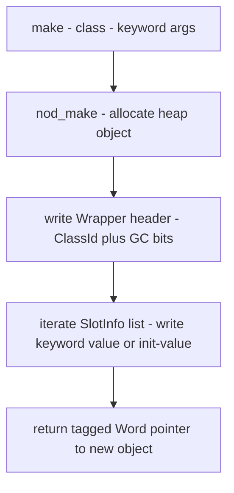
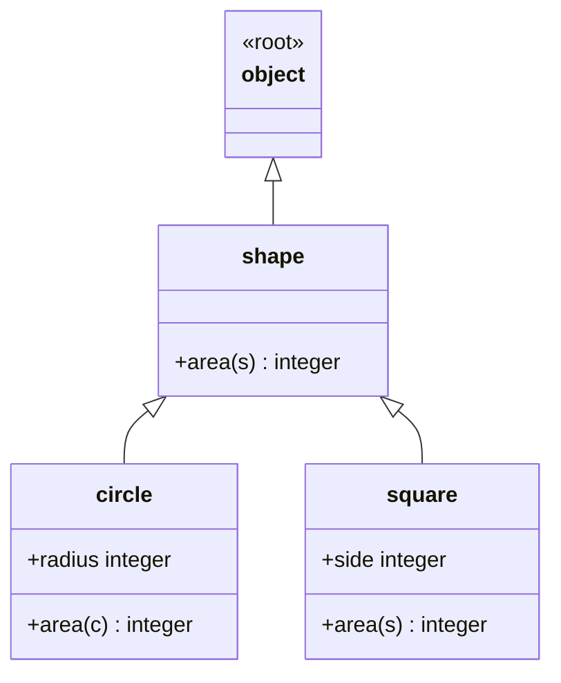
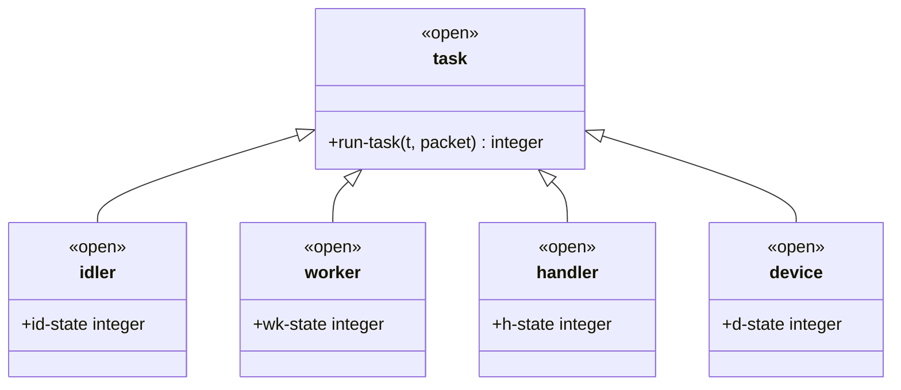
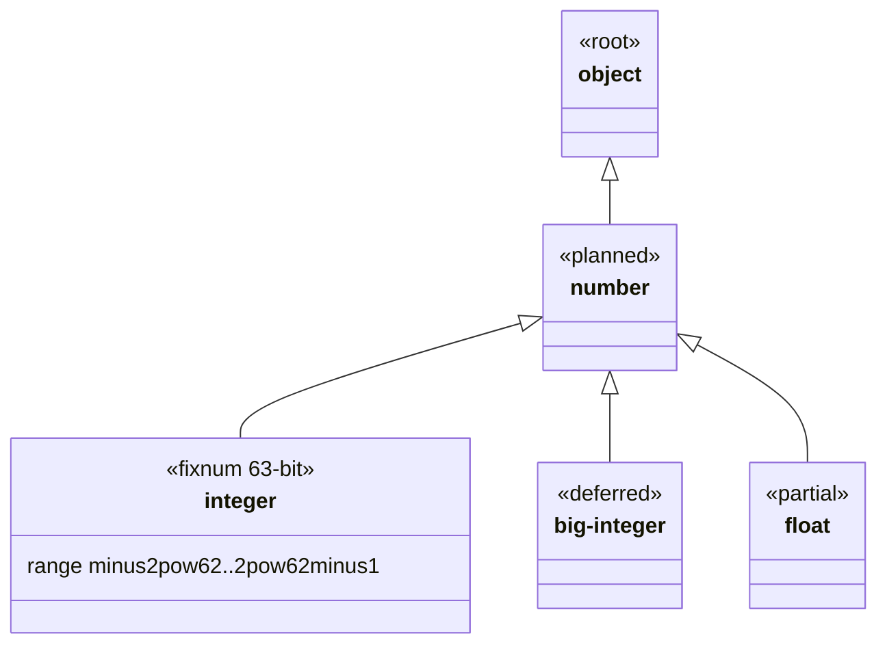

# Types & Classes

Every value in Dylan belongs to a class. Classes are types: they describe
what operations a value supports, and dispatch selects methods based on
which classes an argument's runtime type belongs to.

## Defining a class

```dylan
define class <shape> (<object>)
end class;

define class <circle> (<shape>)
  slot radius :: <integer>, init-keyword: radius:;
end class;
```

The full form is:

```
define [modifiers] class <name> (<super>, …)
  [slot …;]
  …
end class;
```

**Angle-bracket naming.** The `<name>` convention is a discipline, not
syntax: any identifier may be a class name, but the angle-bracket pair
signals "this is a class" at a glance. The convention is universal across
the Dylan standard library and all NewOpenDylan fixtures.

**Superclass list.** Every class lists its direct superclasses in
parentheses. Omitting a superclass list implicitly means `(<object>)` —
the sema phase inserts `ClassId::OBJECT` when the list is empty
(`lower.rs:2596`). Multiple entries give multiple inheritance:

```dylan
define class <my-class> (<base-a>, <base-b>)
  …
end class;
```

Sema runs **C3 linearisation** over the parent CPLs to produce a
consistent class precedence list (CPL). If two parents impose conflicting
orders on a shared ancestor, the lowerer signals
`LoweringError::InconsistentInheritance`. See [Semantic analysis](../compiler/sema.md)
for the algorithm.

**Class adjectives.** The parser accepts `open`, `sealed`, `abstract`,
`concrete`, and `primary` as modifier keywords before `class`
(`parser.rs:1821`). Their effect in this implementation:

| Adjective | Parser | Sema / runtime effect |
|-----------|--------|-----------------------|
| `sealed` | recorded as `Modifier::Sealed` | Phase 1c sets `ClassMetadata::sealed`; cross-library subclassing is refused at compile time (`lower.rs:1465`) |
| `open` | recorded as `Modifier::Open` | parsed, not enforced beyond being the absence of `sealed` |
| `abstract` | recorded as `Modifier::Abstract` | parsed; no enforcement today — `make(<abstract-class>)` is not blocked at compile time |
| `concrete` | recorded | parsed only |
| `primary` | recorded | parsed only |

See [Sealing](sealing.md) for the full sealing contract.

## Slots and accessors

A slot is a per-instance field. The parser and sema recognise these
slot options (from `ast.rs:494–504` and `lower.rs:2654–2691`):

| Option | Example | Effect |
|--------|---------|--------|
| `:: <type>` | `slot x :: <integer>` | Type annotation; influences slot's `SlotType` used by the GC scanner |
| `init-keyword: k:` | `init-keyword: radius:` | The keyword argument `make(<C>, k: v)` writes `v` into this slot on construction |
| `required-init-keyword: k:` | `required-init-keyword: x:` | Like `init-keyword:` but the field is marked required (`required_init_keyword: bool` in `SlotInfo`); no runtime enforcement yet — the flag is recorded |
| `init-value: expr` | `init-value: 0` | Literal default (integer, `#t`, or `#f`) written when the keyword is absent (`lower.rs:2667–2683`) |
| `setter: #f` | `slot n, setter: #f` | Suppresses getter/setter generation when false |

**Slot allocation.** Only `instance:` (the default) is supported.
`class:`, `each-subclass:`, and `virtual:` raise
`LoweringError::UnsupportedSlotAllocation` (`lower.rs:2654`).

**`init-function:`** is parsed by the AST but not yet wired into sema's
`SlotDefault` logic — any non-literal, non-boolean `init-value` falls
through to `SlotDefault::Unbound` (`lower.rs:2683`). This is a known
open item in `DEFERRED.md` (Sprint 12 residue).

**Auto-generated accessors.** Sema Phase 3 emits a getter and a setter
for every slot. For a slot named `radius` on `<circle>`:

- **Getter:** `radius(obj)` — calls the generated function
  `<circle>-getter-radius`, registered as a method on the generic `radius`
  specialised to `<circle>`.
- **Setter:** `radius(obj) := v` — lowers to `radius-setter(obj, v)`,
  registered as a method on `radius-setter` with specialisers
  `[<circle>, <object>]` (`sema.md` — "Auto-generated slot accessor functions").

Both participate in normal generic dispatch, so a subclass can override
either by defining its own method on the same generic.

**Inherited slots.** In single inheritance the inherited slot offset is
unchanged; in multiple inheritance the offset may shift. When it does,
sema Phase 3 emits an **override accessor** for the subclass so the right
offset is used per receiver (`lower.rs:1589`). Callers write the same
`x(obj)` call regardless.

The point-3d fixture demonstrates inherited slot access:

```dylan
define class <point-2d> (<object>)
  slot x :: <integer>, init-keyword: x:;
  slot y :: <integer>, init-keyword: y:;
end class;

define class <point-3d> (<point-2d>)
  slot z :: <integer>, init-keyword: z:;
end class;

define function sum-coords (p :: <point-3d>) => (<integer>)
  x(p) + y(p) + z(p)        // inherited + own accessors, same syntax
end function sum-coords;
```

Source: `tests/nod-od-suite/fixtures/point-3d-sum.dylan`.

## Making instances

`make` allocates a new instance and initialises its slots:

```dylan
let c = make(<circle>, radius: 2);
let s = make(<square>, side: 5);
```

The runtime path (`nod_make`) allocates a heap object with an 8-byte
`Wrapper` header followed by one 8-byte slot per entry in the C3-merged
CPL, then walks each slot's `SlotInfo`: if the matching keyword argument
was supplied, that value is written; otherwise `init-value:` is used; if
neither, the slot is left unbound. See [Runtime & object model](../compiler/runtime.md)
for the heap layout.



The lowerer routes `make(<C>, k: v, …)` to `Computation::Make` in DFM,
which generates a `nod_make` call in the LLVM IR. The narrowing pass
then records the result temp as `TypeEstimate::Class(C)`, enabling
sealed-dispatch rewrites on subsequent operations. See
[Semantic analysis](../compiler/sema.md).

After all slots are written, `nod_make` returns the object. The Dylan
DRM specifies that `initialize` is then called; in this implementation
user-defined `initialize` methods can be added as ordinary methods on the
`initialize` generic and will be reached via dispatch after allocation.

## Class hierarchy — a real example

The `area-shapes` fixture (`tests/nod-od-suite/fixtures/area-shapes.dylan`)
defines a two-level hierarchy with a generic function dispatched on the
concrete leaves:

```dylan
define class <shape> (<object>)
end class;

define class <circle> (<shape>)
  slot radius :: <integer>, init-keyword: radius:;
end class;

define class <square> (<shape>)
  slot side :: <integer>, init-keyword: side:;
end class;

define generic area (s :: <shape>) => (<integer>);

define method area (c :: <circle>) => (<integer>)
  radius(c) * radius(c) * 3
end method area;

define method area (s :: <square>) => (<integer>)
  side(s) * side(s)
end method area;
```



The open class / task hierarchy from
`tests/nod-tests/fixtures/richards-shape-open.dylan` shows the `open`
adjective and four sibling subclasses:



## Classes are types

**`instance?`** tests class membership at runtime:

```dylan
instance?(make(<circle>, radius: 2), <circle>)   // #t
instance?(make(<circle>, radius: 2), <shape>)    // #t — subclass relation
instance?(42, <integer>)                         // #t
instance?(42, <boolean>)                         // #f
```

`instance?(x, <C>)` lowers to a `Computation::TypeCheck` in DFM; sema
compiles it to a call to `nod_is_instance_of`, which walks `x`'s class
CPL via `is_subclass(actual, target)` (`classes.rs`). The narrowing pass
uses the result to refine type estimates on the then-branch of an
enclosing `if` (`sema.md` — "Pass 1 — narrowing").

**`<object>` is the root.** Every class has `<object>` in its CPL. A
method specialised on `<object>` is the most general possible; one
specialised on a leaf class is the most specific. The dispatch ordering
is CPL-driven: earlier in the CPL means more specific.

**Sealed vs open.** A `sealed` class refuses cross-library subclassing
(`lower.rs:1465`). A class without the `sealed` modifier can be
subclassed in any library. The `open` adjective makes the intent
explicit. See [Sealing](sealing.md) for dispatch implications.

## Built-in types

NewOpenDylan registers these classes at process boot. They are available
in any Dylan program without an import declaration.

| Class | Kind | Notes |
|-------|------|-------|
| `<object>` | root | every class inherits from it |
| `<integer>` | immediate | 63-bit signed fixnum; encoded as `(n << 1)` in a 64-bit Word |
| `<boolean>` | immediate | `#t` and `#f` are pinned singleton heap objects |
| `<byte-string>` | heap | byte-array string; UTF-8 by convention; `<string>` is an alias |
| `<symbol>` | heap | interned, identity-comparable byte-string |
| `<pair>` | heap | cons cell — `head` and `tail` accessors |
| `<empty-list>` | heap | `nil()` — the end-of-list singleton |
| `<simple-object-vector>` | heap | fixed-length vector of Words |
| `<stretchy-vector>` | heap | growable vector (Sprint 20) |
| `<range>` | heap | integer range with `from`, `to`, `by` slots |
| `<table>` | heap | open-addressing hash table (Sprint 22) |
| `<function>` | heap | first-class function/closure |
| `<condition>` | heap | base of the condition hierarchy |

**The fixnum range.** `<integer>` encodes integers as fixnums in the
range `-(2^62) .. 2^62 - 1` (`word.rs:33–34`). Integers outside this
range are rejected at compile time with `LoweringError::IntegerOverflow`;
runtime overflow wraps silently (no overflow trap). See
[Runtime & object model](../compiler/runtime.md) for the Word encoding.

**`<big-integer>` is deferred.** A Dylan `<big-integer>` class covering
the full arbitrary-precision integer tower is not yet implemented. It
appears in `DEFERRED.md` as a follow-up to the number-tower work. Code
that needs values above `2^62 - 1` cannot use `<integer>` today.

**Floats are partially implemented.** `<single-float>` and
`<double-float>` literals can appear in expressions but return as
unboxed values from the JIT; float-typed slots are stored as pointer-
shaped Words (`DEFERRED.md` Sprint 12 residue). Float arithmetic works
in practice; the full boxed-float ABI is deferred.

**`singleton` and `limited` types are not implemented.** Dylan's
`singleton(<T>, value)` and `limited(<integer>, min: …, max: …)` type
constructors do not exist in this implementation. They are not mentioned
in `DEFERRED.md` as tracked items; assume them absent until a sprint
explicitly lands them.

**Numeric tower summary.**



## How it is implemented

This section is a pointer, not a repeat. For the compiler view:

- **Class registration, C3, slot layout:** [Semantic analysis](../compiler/sema.md) —
  Phase 1a (`register_class`, `lower.rs:2582`), Phase 1c (sealed flip,
  `lower.rs:1458`), Phase 3 (accessor emission, `lower.rs:1589`).
- **Heap layout, the Wrapper header, slot offsets:** [Runtime & object model](../compiler/runtime.md) —
  "Heap object layout" and "The tagged Word".
- **Dispatch on class:** [Generic functions](generic-functions.md) —
  how accessors and user methods are resolved per receiver class.
- **GC scanning of slots:** [Garbage collector](../compiler/gc.md).

Key source locations for the curious:

| File | Lines | What |
|------|-------|------|
| `src/nod-reader/src/ast.rs` | 494–504 | `SlotDef` — all slot options the parser records |
| `src/nod-sema/src/lower.rs` | 2582–2705 | `register_class` — class + slot lowering |
| `src/nod-sema/src/lower.rs` | 1458–1480 | Phase 1c — sealed flag flip |
| `src/nod-sema/src/c3.rs` | 57 | `c3_linearise` |
| `src/nod-runtime/src/classes.rs` | 29 | `ClassId`, `ClassMetadata`, `SlotInfo` |
| `src/nod-runtime/src/word.rs` | 33–34 | fixnum range bounds |

---
[Manual home](../index.md) · [Generic functions](generic-functions.md)
