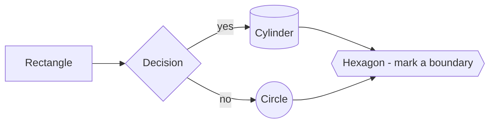
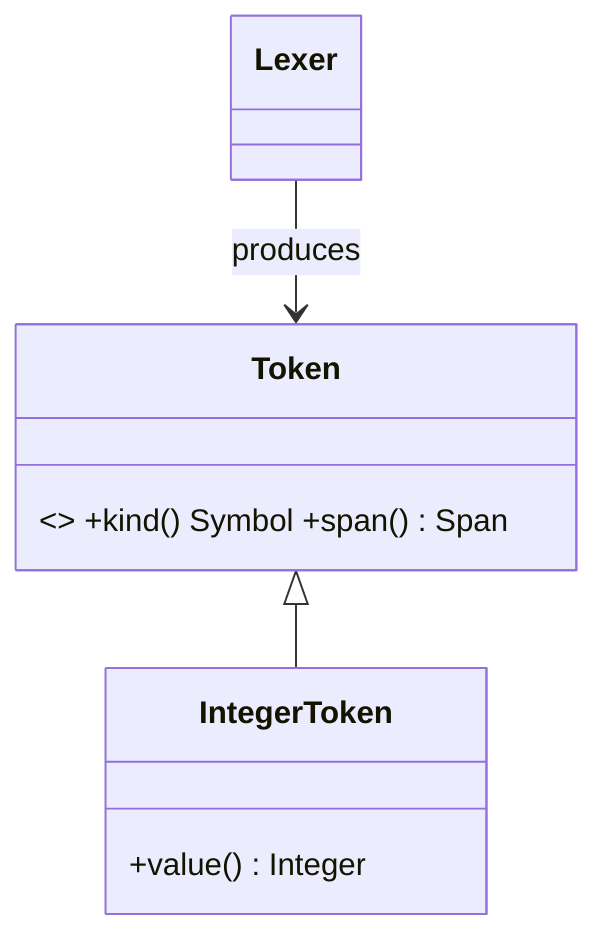
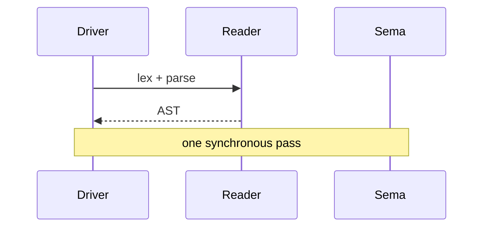
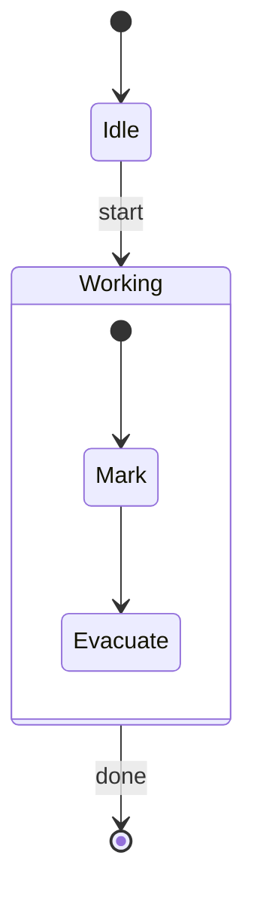

# Manual Authoring Contract

Every page under `docs/manual/` is rendered by **DocCrate** (`tools/doccrate/doc-crate.exe`),
a native Direct2D Markdown browser that renders a **subset** of Mermaid via the Selkie
engine. This file is the contract: follow it exactly so every diagram renders and every
page looks consistent. Verify with `tools/doccrate/Test-Render.ps1 -File <page.md>`.

## Golden rule

**If you write diagram syntax DocCrate can't parse, it renders a visible
`mermaid error: …` line instead of the diagram.** Stay inside the supported subset
below. When in doubt, prefer a `flowchart` — it is the best-tested type.

## Markdown rules

- **Supported:** headings (H1–H6, colour-coded), paragraphs, **bold**, *italic*,
  ***bold-italic***, `inline code`, fenced code blocks (no syntax highlighting — don't
  rely on colour), blockquotes (incl. nested), bullet/ordered lists, GFM **tables**,
  horizontal rules, links.
- **FORBIDDEN: images.** `` renders as *raw text*. Never use images.
  Express everything visual as a Mermaid diagram.
- **Links:** only `.md` links navigate inside DocCrate — `[Sema](sema.md)`,
  `[GC](../compiler/gc.md)`. `http(s)://` links open the system browser. Anchor
  fragments (`#section`) are stripped — link to the file, not a heading.
- **Source references** (`src/nod-llvm/src/codegen.rs:1280`) are NOT links — write them
  as **inline code**. They are clickable in the user's editor, not in DocCrate.
- Keep lists shallow (one level). Deeply nested lists may not indent as expected.

## Supported Mermaid subset (USE ONLY THESE)

### flowchart — the workhorse

Directions `TD`/`TB`/`LR`/`RL`. Node shapes: `[x]` rect, `(x)` round, `([x])` stadium,
`[(x)]` cylinder/db, `((x))` circle, `{x}` diamond, `{{x}}` hexagon. Edges: `-->`,
`---`, `-.->`, `==>`, labels via `-->|text|`.

**TWO HARD PROHIBITIONS (verified broken in this Selkie build):**
- **No `subgraph … end`.** It does not draw an enclosing box; the label renders as a
  column of single characters. To show grouping, either split into two diagrams, mark a
  boundary with a distinct `{{hexagon}}` node, or list the grouping in prose/a table.
- **No `<br/>` in labels.** It renders as the literal text `<br/>`. Keep every node label
  to one short line. Put the crate after a hyphen: `[Lexer - nod-reader]`.

### classDiagram — type hierarchies & relationships

Members: `+public` / `-private`, methods `name(args) ReturnType`, fields `name Type`.
Stereotypes `<<abstract>>` / `<<interface>>` / `<<open>>` / `<<sealed>>` (free-text — use
them to mark Dylan sealing). **Generics use tildes, not angle brackets:** `Vec~Token~`,
`Option~Word~`. Relations: `<|--` inherits, `*--` composition, `o--` aggregation,
`-->` association, `..>` dependency, `<|..` realizes. Cardinality: `"1" o-- "*"`.
Optional `direction TB|LR`, `namespace Name { … }`, `note for X "…"`.

### sequenceDiagram — interaction over time

Arrows (EXACT set — anything else errors): `->` line, `-->` dotted, `->>` solid head,
`-->>` dotted head (returns), `-x` lost, `-)` async, `<<->>` bidirectional. Suffix `+`/`-`
activates/deactivates. Notes: `Note right of X: …`, `Note over X,Y: …`. Self-message:
`X->>X: …`. **NOT supported yet — DO NOT USE:** `loop`, `alt`, `opt`, `par` fragments.

### stateDiagram-v2 — lifecycles & phase machines

`[*]` start/end. `state X <<choice>>` / `<<fork>>` / `<<join>>`. Composite:
`state Name { … }`. Transition labels via `: label`.

### Others available (use sparingly, when they fit)
`erDiagram`, `gitGraph`, `gantt`, `journey`, `timeline`, `architecture-beta`, `C4Context`.
Prefer the four above for compiler/language docs.

## Manual styling overrides — AVOID

DocCrate supports `%% @node …` / `%% @edge …` manual-layout comments. **Do not use them.**
They require hand-computed pixel coordinates and break easily. Rely on auto-layout. Keep
diagrams small (≈4–12 nodes) so auto-layout stays readable; split a big diagram into two.

## Page template (every manual page follows this)

```markdown
# <Title>

One or two sentences: what this subsystem is and its job in one breath.

> Crate: `src/nod-xxx`  ·  Status: <live / partial / Rust-today>  (omit for language pages)

## Role in the pipeline      ← a small flowchart locating this piece
## Key types                 ← a table: Type | Where | Purpose
## How it works              ← prose + one or two diagrams, walking the main path
## Invariants & gotchas      ← bullet list of the non-obvious rules
## Where in the code         ← table: File | Lines | Responsibility (use real line counts)
## See also                  ← links to sibling pages

---
[Manual home](../index.md) · [Compiler overview](overview.md)
```

Not every section is mandatory, but order them this way when present.

## Accuracy rules

- **Every claim must be checkable in the source.** Cite `file:line`. Do not invent API
  names, flags, or types — if you can't find it, don't state it.
- Match the project's vocabulary: *DFM* (Dylan Flow Machine IR), *Word* (tagged value),
  *GF* (generic function), *FIP* (forward-iteration protocol), *sealing*, *C3*
  linearization, *safepoint*/*statepoint*, *TLAB*, *stub table*, *wire format*.
- Prefer one accurate diagram over three speculative ones. A diagram is a claim too.
- Present tense, active voice, concise. Assume a reader who knows compilers and GCs but
  has never seen this codebase.

## Verify before done

Render your page and read the PNG:
```
pwsh tools/doccrate/Test-Render.ps1 -File docs/manual/<section>/<page>.md
```
A correct page shows your diagrams as shapes — never an italic `mermaid error:` line and
never raw ```` ```mermaid ```` source. If you see either, fix the diagram and re-render.
